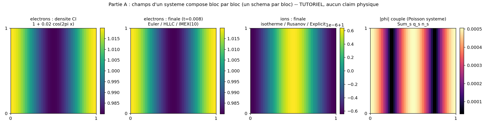
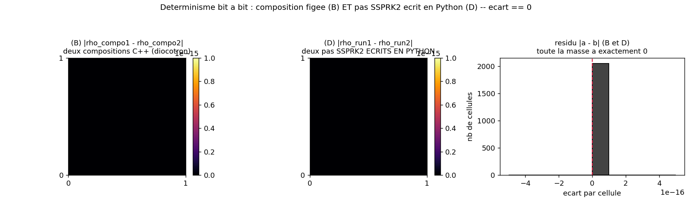

# composition: build a heterogeneous multi-block system, one equation block at a time

A tutorial for the `adc` composition API: from Python you assemble a multi-species system one block
at a time, choosing for each block, independently, its physical model, its spatial reconstruction,
its Riemann flux, its time treatment, and its number of substeps. The script demonstrates four
capabilities: (A) heterogeneous composition of two fluids with different schemes; (B) bit-for-bit
determinism of brick composition; (C) rejection of invalid combinations; (D) an SSPRK2 time
integrator written in Python on top of the library's primitives. This case demonstrates an API
capability; it validates no published physical result.

## Contract

| Field | Content |
|---|---|
| Category (manifest) | `tutoriel` (`cases_manifest.toml`, `composition/run.py`, `ci = true`, `needs = []`) |
| Inputs | A: grid $48^2$, $L=1$, periodic; electrons $\rho=1+0.02\cos(2\pi x/L)$ (Euler $\gamma=1.4$, $q=-1$), ions $\rho=1$ (isothermal $c_s^2=0.5$, $q=+1$); $dt=0.001$, 8 steps. B/D: grid $32^2$ periodic, diocotron ($B_0=1$, $\alpha=1$, background $n_{i0}=\overline{\rho}$); B: $dt=0.002$, 12 steps; D: $dt=0.001$, 20 Python steps |
| Outputs | printed diagnostics (no file produced by `run.py`); the figures are generated separately by `make_figures.py` in `figures/` + `figures/provenance.json` |
| Guaranteed invariants | the `assert` statements in `run.py`: A electron/ion mass $<$ `MASS_TOL=1e-10` and $\|\phi\|_\infty>10^{-8}$ and electron evolution $>10^{-9}$ (`partie_A` in run.py); B difference between two compositions $==0$ exactly (`partie_B` in run.py); C the 3 invalid combinations raise and `n_species()==0` (`partie_C` in run.py); D mass $<10^{-9}$ and finite state (`partie_D` in run.py) |
| Proves | (A) two fluids with different schemes coexist in the same `adc.System`, each conserves its mass ($2.7\times10^{-12}$ electrons, $1.8\times10^{-12}$ ions), the coupled Poisson is active ($\|\phi\|_\infty=5.06\times10^{-4}$), the electrons evolve ($3.5\times10^{-5}$); (B) the same model composed twice gives a bit-identical state (difference $=0$, `np.array_equal` true); (C) HLLC on scalar transport, fluid source on a scalar, and an inconsistent model are rejected at composition / at add time, with no block added; (D) an SSPRK2 integrator written in Python conserves mass ($2.3\times10^{-13}$) and stays finite |
| Does not prove | demonstrates an API capability, validates no published physical result. No number is checked against a paper; the initial conditions are simple cosines, the horizons are short (8/12/20 steps), no physical dynamics is interpreted. Bit determinism (B, D) is an implementation property (same frozen C++ bricks, same floating-point operations in the same order), not a cross-platform guarantee: it can break across BLAS, summation order, or architecture. The measured mass conservation is not a scheme validation: it is the minimum expected of a conservative finite-volume method |
| Provenance | adc_cpp `01873299`, adc_cases (deeptut) `a9541ba4`, native serial backend, $48^2$ (A) / $32^2$ (B,D), ~1 s 1 CPU core; `figures/provenance.json` |

By the end you will know: how `adc.System` composes a system block by block, what "each block freezes
its scheme at add time" means (the 3-layer table), why composition is bit-deterministic, what the
guards catch, and how to write your own time integrator in Python without moving the per-cell
computation out of C++.

---

## 1. The abstraction level demonstrated (justifies Proves: heterogeneous composition)

The watchword is: Python composes, C++ computes. The system config carries only the mesh; all of the
physics is carried by the blocks:

```python
sim = adc.System(n=48, L=1.0, periodic=True)            # config = MAILLAGE seul
sim.add_block("electrons", model=models.electron_euler(),
              spatial=adc.Spatial(vanleer=True, flux="hllc"),
              time=adc.IMEX(substeps=10))
sim.add_block("ions", model=models.ion_isothermal(),
              spatial=adc.Spatial(minmod=True, flux="rusanov"),
              time=adc.Explicit())
```
- `adc.System(n, L, periodic)` (`partie_A` in run.py) carries no physical parameter ($\gamma$, $c_s^2$,
  $B_0$, charge): only the mesh. The physics moves into the blocks.
- `models.electron_euler()` and `models.ion_isothermal()` (`electron_euler`, `ion_isothermal` in models.py) are compositions of
  generic bricks (section 3), not magic strings. The word "electron" lives in `adc_cases`, never on
  the core side.
- each `add_block` independently chooses the reconstruction (`adc.Spatial`), the flux
  (`"hllc"` vs `"rusanov"`) and the time treatment (`adc.IMEX(substeps=10)` vs `adc.Explicit()`).
  The two blocks share only the mesh and the system Poisson.

The "one scheme per block" choice is physically motivated here: the electrons (light, stiff) are
substepped 10 times per macro-step and their electrostatic force is treated implicitly (IMEX); the
ions (slow) advance with plain explicit time stepping. This is a capability (multirate + per-block
IMEX), not a claim of physical validity.

---

## 2. The models = compositions of bricks (justifies: the physics is frozen in C++)

Each species model is an `adc.Model(state, transport, source, elliptic)`. The three models used, and
the exact brick for each slot:

| Model (`models.py`) | state | transport | source | elliptic |
|---|---|---|---|---|
| `electron_euler()` (in models.py) | `FluidState(compressible, gamma=1.4)` | `CompressibleFlux` | `PotentialForce(charge=-1)` | `ChargeDensity(charge=-1)` |
| `ion_isothermal()` (in models.py) | `FluidState(isothermal, cs2=0.5)` | `IsothermalFlux` | `PotentialForce(charge=+1)` | `ChargeDensity(charge=+1)` |
| `diocotron()` (in models.py) | `Scalar` | `ExB(B0=1)` | `NoSource` | `BackgroundDensity(alpha=1, n0=n_i0)` |

Each brick is a pointwise, device-callable physics, defined once on the core side:

- `CompressibleFlux` = `Euler` (in hyperbolic.hpp): Euler flux, 4 variables $(\rho,\rho u,\rho v,E)$.
- `IsothermalFlux` (in hyperbolic.hpp): 3 variables, closure $p=c_s^2\rho$, wave $\sqrt{c_s^2}$.
- `ExBVelocity` (in hyperbolic.hpp): 1 variable, drift $v=(-\partial_y\phi,\partial_x\phi)/B_0$.
- `PotentialForce` (in source.hpp): $s[1]=q\rho E_x$, $s[2]=q\rho E_y$, work $s[3]$ only
  if `State::size()==4` (Euler). On a 3-variable transport (isothermal) there is no energy
  component; on a scalar (1 variable) the force is meaningless (rejected, section 5).
- `ChargeDensity` (in elliptic.hpp): right-hand side $f=q\,n$, sign of $q$ included.
- `BackgroundDensity` (in elliptic.hpp): $f=\alpha(n-n_0)$, neutralizing background for the periodic Poisson.

The right-hand side of the system Poisson is $\sum_s f_s = \sum_s q_s n_s$ (generic sum of the
elliptic bricks of each block). With perturbed electrons $q=-1$ and uniform ions $q=+1$
($\overline{q n}\approx 0$), the periodic Poisson is solvable and $\phi\neq 0$.

### The 3-layer table: who computes what, and where the scheme is frozen

| `run.py` line | Layer | What happens |
|---|---|---|
| `sim.add_block("electrons", model=..., spatial=adc.Spatial(vanleer=True, flux="hllc"), time=adc.IMEX(substeps=10))` (`partie_A` in run.py) | Python composes | choice of the model (bricks), the spatial scheme (reconstruction + flux), the time treatment (IMEX + 10 substeps); reads the state via `density`/`potential`/`get_state` |
| `models.electron_euler()` -> bricks `CompressibleFlux` / `PotentialForce` / `ChargeDensity` (`CompressibleFlux` in hyperbolic.hpp, `PotentialForce` in source.hpp, `ChargeDensity` in elliptic.hpp) | C++ brick freezes the physics | the exact convention of the Euler flux, of the $q\rho E$ force, of the $q n$ right-hand side |
| `System::add_block(... spatial.limiter, spatial.flux, spatial.recon, time.kind, time.substeps, time.stride ...)` (facade `System.add_block` in __init__.py) then `assemble_rhs<Limiter,Flux>` + local IMEX Newton + system Poisson | per-cell kernel (device) | the real computation, with no Python callback in the hot path |

The key point is the third row: the `add_block` facade (`System.add_block` in __init__.py) passes
`spatial.limiter`, `spatial.flux`, `spatial.recon`, `time.kind`, `time.substeps`, `time.stride` to
the C++ `System::add_block` at add time. The scheme (VanLeer+HLLC+IMEX+10) is then frozen into the
block as a compiled advance closure; it is no longer reconfigurable without re-adding the block, and
it is type-erased only at the level of the block list. This is what makes (B) deterministic: same
bricks + same frozen scheme -> same C++ computation.

---

## 3. The falsifiable prediction: bit-for-bit determinism (B and D)

For a tutorial, the testable "prediction" is not a physical number but a falsifiable implementation
property: recomposing the same model with the same initial condition, or replaying the same Python
step, gives a bit-identical state. `partie_B` (in run.py) asserts it with `assert ecart == 0.0` (B); the
`determinism.png` figure (section 6) checks it on both paths (B C++ composition, D Python step). A
single nonzero cell in the difference would betray nondeterminism: a hidden global state between two
compositions, a cell traversal dependent on allocation, or a non-reproducible reduction order in the
Poisson. Strict equality ($==0$, not $<\varepsilon$) is the observable: it tolerates no noise, unlike
the conservation tolerances (section 4).

---

## 4. The tolerances, justified by an order of magnitude (justifies item 8 of the checklist)

| Tolerance | Value | Why this value |
|---|---|---|
| `MASS_TOL` | $10^{-10}$ | The fluxes (CompressibleFlux, IsothermalFlux, divergence-free ExB) are conservative: mass is an exact invariant, the only drift is floating-point arithmetic over 8/12 steps. Measured A: $2.7\times10^{-12}$ (electrons) / $1.8\times10^{-12}$ (ions), ~2 orders below the tolerance (`MASS_TOL` and `partie_A` in run.py) |
| difference B | $==0$ exactly | not a tolerance: a strict equality. Two compositions of the same model with the same frozen bricks run the same floating-point operations in the same order, so the result is bit-identical. Any value $>0$ would be a determinism bug, not acceptable noise (`partie_B` in run.py) |
| mass D | $10^{-9}$ | The Python SSPRK2 integrator combines states as $\frac12 U_0+\frac12(U_1+dt\,R)$: an affine combination of conservative states, hence conservative up to floating-point error over 20 steps. Measured: $2.3\times10^{-13}$, ~4 orders below the tolerance (`partie_D` in run.py) |
| $\|\phi\|_\infty>10^{-8}$ (A) | lower bound | Guarantees that the coupled Poisson is active (the block really contributes to the right-hand side). Measured: $5.06\times10^{-4}$, ~4 orders above: the coupling is clear, not a numerical residual (`partie_A` in run.py) |
| electron evolution $>10^{-9}$ (A) | lower bound | Guarantees that the electron block moves (the force and the transport act). Measured: $3.5\times10^{-5}$, ~4 orders above the threshold: the dynamics is nontrivial (`partie_A` in run.py) |

---

## 5. The guards: invalid combinations rejected (justifies Proves: C)

`partie_C` (in run.py) checks that three invalid compositions raise a clear error instead of
producing a wrong computation. `doit_lever(fn, why)` (in run.py) runs `fn`, expects an
exception (pybind translates `std::runtime_error` into `RuntimeError`), and fails if nothing raises.

1. HLLC on scalar transport (`partie_C` in run.py). HLLC requires a compressible transport (4
   variables + pressure); the diocotron transports a scalar via ExB. Rejected at block add time.
   Actual message: `System : flux 'hllc' exige un transport compressible (4 variables + pr...`.

2. Fluid source on scalar transport (`partie_C` in run.py). An `adc.Model(Scalar, ExB,
   PotentialForce, BackgroundDensity)` composes (state Scalar and transport ExB are consistent),
   but `PotentialForce` acts on a fluid momentum ($s[1], s[2]$) absent from a scalar (1 variable).
   Rejected at block add time. Actual message: `source 'potential' invalide ici (exige un transport
   fluide >= 3 variab...`.

3. Inconsistent model at composition time (`partie_C` in run.py). An `adc.Model(Scalar,
   CompressibleFlux, ...)` mixes a scalar state (1 var) and an Euler flux (4 var):
   `adc.Model(...)` raises directly, before any add. Actual message: `Scalar exige
   transport=ExB(...)`.

The final assert `sim.n_species() == 0` (`partie_C` in run.py) guarantees that no invalid block was added:
the rejections are clean (no partially mutated state). The difference between 1/2 (rejected at add)
and 3 (rejected at composition) is when the inconsistency is detected: a transport incompatible with
the state is caught by `adc.Model`, a source/flux incompatible with the transport chosen by
`add_block`.

---

## 6. Part D: a time integrator written in Python (justifies Proves: D)

Instead of calling `sim.advance(...)` (compiled time loop), `partie_D` (in run.py) writes its
own loop with `adc.integrate.ssprk2_step` (`ssprk2_step` in integrate.py), an SSPRK2 (strong-stable Heun)
assembled in Python on top of four primitives exposed by `System`:

```python
sim.solve_fields()                                    # Poisson + aux = grad(phi)   (C++)
U0 = {n: sim.get_state(n) for n in names}             # etat par bloc (ncomp,n,n)    (lecture)
for n in names:                                       # etage 1 : U1 = U0 + dt R(U0)
    sim.set_state(n, U0[n] + dt * sim.eval_rhs(n))    # eval_rhs = -div F + S         (C++ par cellule)
sim.solve_fields()                                    # Poisson RE-RESOLU per-stage   (C++)
for n in names:                                       # etage 2 : 1/2 U0 + 1/2 (U1 + dt R(U1))
    U1 = sim.get_state(n)
    sim.set_state(n, 0.5 * U0[n] + 0.5 * (U1 + dt * sim.eval_rhs(n)))
```
- `eval_rhs(n)` computes the residual $-\nabla\cdot F + S$ of the block per cell in C++: no Python
  callback in the hot path. Only the assembly of the RK stages (the affine combinations $U_0+dt\,R$
  and $\frac12 U_0+\frac12(\dots)$) is in Python, per step.
- `solve_fields()` re-solves Poisson between the two stages: per-stage hyperbolic/elliptic
  coupling, more accurate than the per-step frozen coupling of `advance`.
- the loop (`partie_D` in run.py) calls `ssprk2_step(sim, 0.001)` 20 times. Measured:
  mass drift $2.3\times10^{-13}$, finite state: the Python integrator conserves and stays stable.

This is the strongest capability of the tutorial: the time scheme itself can be written in Python
(per step), with the residual computation and the Poisson staying in C++ (per cell). And it stays
bit-deterministic: two runs of this same Python loop give a bit-identical state (section 6, figure
D), because the C++ primitives and the numpy combinations are themselves deterministic at constant
operations and order.

---

## 7. Figures (generated by `make_figures.py`, in `figures/`)

Generated by `python make_figures.py` (same parameters as `run.py`), versioned with
`figures/provenance.json`. Exact command in section 9. `run.py` itself produces no file (printed
diagnostics); the figures are a separate API diagnostic.

### `density_maps.png`: the composed fields of the heterogeneous system (Part A)



- **Proves** (asserted `partie_A` in run.py): the coupled Poisson is active ($\|\phi\|_\infty=5.06\times
  10^{-4}$, panel 4) and the electrons evolve (the final density, $[0.980, 1.020]$, differs from the
  initial condition; max difference $3.5\times10^{-5}$). The two blocks with different schemes
  coexist: the electron panel carries the Euler/HLLC/IMEX perturbation, the ion panel carries the
  isothermal response.
- **Suggested** (not asserted): the final ion density departs from uniform by $\sim6\times10^{-7}$
  (scale `1e-6+1`): the Poisson coupling pushes the ions, but the effect is tiny over 8 steps and
  no assert quantifies it (the assert only tests ion mass conservation). The structure stays 1D
  along $x$ (the initial condition does not depend on $y$).
- **Not shown**: no physical result. The profiles are short-horizon cosines (8 steps); nothing here
  reproduces or validates a published regime. This is a tutorial: the maps show that composition
  produces coupled fields, not that they are physically meaningful.

### `determinism.png`: bit equality, composition (B) and Python step (D)



- **Proves** (asserted `partie_B` in run.py for B; measured for D): both $|a-b|$ heatmaps are identically
  black (scale $[0,10^{-15}]$). Panel B: two independent compositions of the same diocotron, max
  difference $0.0$, `np.array_equal` true. Panel D: two runs of the SSPRK2 integrator written in
  Python, max difference $0.0$, `np.array_equal` true. The histogram concentrates all cells
  ($32^2$ per path) exactly at $0$.
- **Suggested**: that the equality holds for other schemes/initial conditions is plausible (same
  frozen bricks, same operations), but the case only tests these two configurations.
- **Not shown**: this determinism is a property of the implementation on this platform, not a
  cross-platform guarantee. It can break across different BLAS, summation orders, or architectures
  (cf. platform caveat, section 9). A single non-black cell would signal a hidden global state
  between compositions, a traversal dependent on allocation, or a non-reproducible Poisson
  reduction.

---

## 8. What the tutorial does not capture (honest analysis of the limits)

- No validated physical result. Category `tutoriel`: it demonstrates an API capability
  (block-by-block composition, multirate, per-block IMEX, guards, Python integrator), not a paper
  curve nor a nontrivial physical invariant. Mass conservation ($10^{-12}$) is the minimum expected
  of a conservative finite-volume method, not a validation.
- Bit determinism is implementation, not physics. It proves that the composed path (B) and the
  Python step (D) are reproducible at constant operations and order. It is not guaranteed across
  platforms (BLAS, summation, architecture).
- Short horizons, trivial initial conditions. A: 8 steps, 1D cosine. B: 12 steps. D: 20 steps.
  Nothing is integrated long enough for nonlinear dynamics to emerge; that is not the goal.
- The ion coupling is tiny ($\sim6\times10^{-7}$ over 8 steps): visible on the map but not asserted.
  The only invariant tested on the ions is mass conservation.
- The diocotron here is not the physical study: it is the reference study
  [`../diocotron/`](../diocotron/) (growth rate, figures, gif) that carries the physics; here the
  diocotron just serves as a simple scalar model for the determinism tests (B, D).

---

## 9. Reproduce (justifies item 14 of the checklist: command + measured cost)

```bash
cd /private/tmp/adc_cases-deeptut/composition
PYTHONPATH=/Users/romaindespoulain/Documents/Stage_Romain/adc_cpp/build-master/python:/private/tmp/adc_cases-deeptut \
  /opt/homebrew/anaconda3/bin/python3.12 run.py            # le cas : asserts, ~1 s
PYTHONPATH=/Users/romaindespoulain/Documents/Stage_Romain/adc_cpp/build-master/python:/private/tmp/adc_cases-deeptut \
  /opt/homebrew/anaconda3/bin/python3.12 make_figures.py   # 2 figures + provenance.json
```

Prerequisites: `numpy` (and `matplotlib` for the figures, outside the case's own `needs`), the `adc`
module compiled and imported with the same interpreter that compiled it (ABI suffix
`cpython-312`). The first path in `PYTHONPATH` provides the C++ module; the second makes `adc_cases`
importable without installation (the case also has a `sys.path` fallback, in run.py).

Expected output of `run.py` (captured, macOS arm64 dev machine):

```
== Partie (A) : un schema (modele/spatial/temps/sous-pas) par bloc ==
  n_species              = 2
  |phi|_max (initial)    = 5.062437e-04
  derive masse electrons = 2.728e-12  (Euler/HLLC/IMEX, 10 sous-pas)
  derive masse ions      = 1.819e-12  (isotherme/Rusanov/explicite)
  evolution electrons    = 3.506e-05  (dynamique non triviale)
== Partie (B) : determinisme de la composition de briques (bit pour bit) ==
  ecart max (deux compositions independantes) = 0.000e+00
== Partie (C) : garde-fous des combinaisons invalides ==
  rejete (hllc sur diocotron (transport scalaire)) : System : flux 'hllc' exige un transport compressible ...
  rejete (source PotentialForce sur transport scalaire) : source 'potential' invalide ici (exige un transport fluide >= 3 ...
  rejete (modele incoherent (Scalar + CompressibleFlux)) : Scalar exige transport=ExB(...)
== Partie (D) : integrateur temporel custom en Python (SSPRK2) ==
  pas Python (SSPRK2)    = 20  (Poisson re-resolu per-stage)
  derive masse           = 2.274e-13  (integrateur ecrit en Python)
  etat fini              = True
OK composition_api
```

Cost: ~1 s wall time (numpy import included), 4 parts (A 8 steps $48^2$ + per-stage Poisson;
B 2$\times$12 steps $32^2$; C 3 rejections; D 20 Python steps $32^2$). Platform caveat: the
verdicts (mass conserved, difference $=0$, rejections, `OK`) and the orders of magnitude are stable;
the last digits of the drifts ($2.7\times10^{-12}$, etc.) vary with the BLAS and the summation
order, and the bit equality (B, D) itself is guaranteed only on the same platform / the same
build (cf. `figures/provenance.json`).

## File map

| File | Role |
|---|---|
| `run.py` | the case: 4 parts (A heterogeneous composition, B composed determinism, C guards, D Python integrator) |
| `make_figures.py` | replays A/B/D; writes `density_maps.png`, `determinism.png` + `provenance.json` |
| `figures/density_maps.png` | composed fields of the heterogeneous system (electrons, ions, $\|\phi\|$) |
| `figures/determinism.png` | bit equality (B C++ composition, D Python step) + histogram of the residual at 0 |
| `figures/provenance.json` | adc_cpp/adc_cases SHA, backend, resolution, per-block schemes, measured numbers |
| `../adc_cases/models.py` | `electron_euler`, `ion_isothermal`, `diocotron` = compositions of bricks (in models.py) |
| `../adc_cases/common/grid.py` | `meshgrid_xy` (cell-centered grid, facade convention) |
| `<adc>/integrate.py` | `ssprk2_step` = SSPRK2 written in Python on the primitives `solve_fields`/`eval_rhs`/`get_state`/`set_state` |
