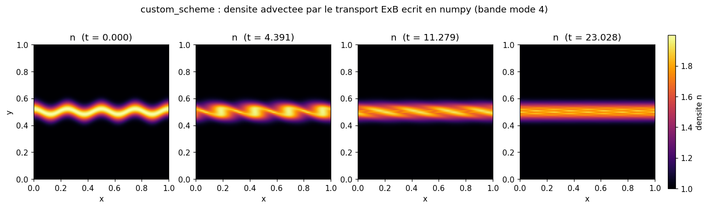
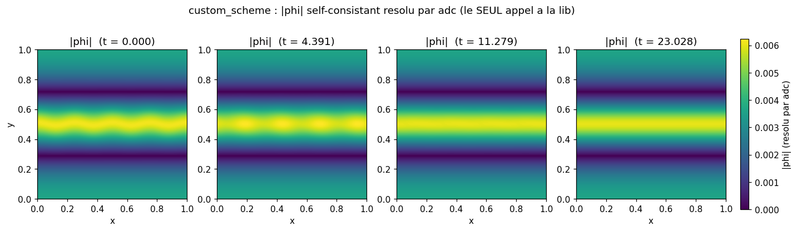
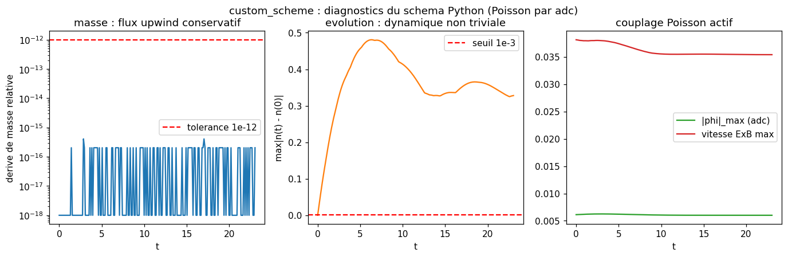

# custom_scheme: write your own scheme around adc's elliptic solver

A tutorial: you write the diocotron transport (reconstruction, upwind flux, SSPRK2 integrator)
entirely in numpy, on the Python side. The density lives in a numpy array; `adc` serves only
as a Poisson oracle: at each substep you hand it the current density and ask it for the
self-consistent potential `phi`. No transport brick from the library is used in the loop.
Pedagogical goal: show how to graft a homemade numerical method onto the expensive elliptic
solver, without reimplementing it.

## Contract

| Field | Content |
|---|---|
| Category (manifest) | `tutoriel` (`cases_manifest.toml`, `custom_scheme/run.py`, `ci = true`, `needs = []`) |
| Inputs | grid $96^2$, $L=1$, periodic; IC gaussian band mode 4 `band_density(96, L, amp=1, width=0.05, mode=4, disp=0.02)` ($n=1+e^{-(y-y_0)^2/w^2}$, $y_0=0.5L+0.02\cos(8\pi x/L)$); $B_0=1$, $\alpha=1$, neutralizing background $n_{i0}=\langle n\rangle$; CFL $=0.4$, 200 SSPRK2 steps |
| Outputs | numpy density $n$ (read/written in numpy), potential $\phi$ returned by `sim.potential()`; figures `figures/density_evolution.png`, `figures/phi_evolution.png`, `figures/diagnostics.png` + `figures/provenance.json` |
| Guaranteed invariants | the `assert` statements in `main` (in run.py): `assert_finite(n, ...)` at every step; `assert drel < 1e-12` (mass); `assert moved > 1e-3` (the band evolved); `assert |phi|_max > 1e-8` (Poisson active) |
| Proves | (1) the numpy scheme conserves mass to $2.040\times10^{-16}$ relative over 200 steps (flux-form upwind, periodic domain); (2) the Poisson coupling is active: `adc` returns $\|phi\|_\infty=6.12\times10^{-3}\neq0$; (3) the dynamics is nontrivial: $\max|n-n_0|=3.28\times10^{-1}$ |
| Does not prove | demonstrates an API capability, validates no published physical result. The homemade scheme (first-order upwind + centered differences for $\nabla\phi$) is not the validated scheme of the [`diocotron`](../diocotron/) case (MUSCL minmod + Rusanov): it is more diffusive and no growth rate is measured or compared. No assert tests the physics (no $\gamma_l$, no analytic oracle). Conservation and finiteness are properties of the scheme, not a reproduction. The IC is a band (mode 4), not the benchmark's ring: it shears but does not develop the paper's annular instability |
| Provenance | adc_cpp `01873299`, adc_cases `a9541ba4`, native serial backend (Poisson `geometric_mg`), $96^2$, ~1.2 s on 1 CPU core; `figures/provenance.json` |

By the end you will know: where to draw the Python / library boundary when you write your own
scheme (Python does all the transport, `adc` does Poisson), how to write a conservative upwind and
an SSPRK2 in numpy, why mass is conserved to machine precision, and what this tutorial does not
validate.

---

## 1. What this case demonstrates (justifies Proves: API capability)

The diocotron physics (ExB drift, differential rotation, shear instability) is derived once and for
all in [`../diocotron/`](../diocotron/); this tutorial does not replay it. Its subject is the
architecture: who computes what when you want your own integrator.

The diocotron solves
$$\partial_t n + \nabla\cdot(n\mathbf{v}) = 0,\qquad \mathbf{v} = \frac{1}{B_0}(-\partial_y\phi,\ \partial_x\phi),\qquad \nabla^2\phi = \alpha\,(n - n_{i0}).$$
The transport (first and second equations) is explicit and cheap: once $\phi$ is known, it is
advection at a given velocity. The elliptic part (Poisson, third equation) is global and expensive:
a multigrid over the whole domain, redone at each substage because $\mathbf{v}$ depends on $\phi(n)$,
which depends on the current state $n$. This case puts the transport in numpy and keeps Poisson in
`adc`. It is the spatial counterpart of the Python time integrator in `adc.integrate`.

---

## 2. The equations and who computes them (3-layer table adapted: Python does all the transport)

In the other brick cases, the middle layer is a frozen C++ transport brick
(`ExBVelocity`, `CompressibleFlux`). Here the transport layer moves up to the Python side: `adc`
now occupies only the elliptic layer. The table reflects this shift.

| `run.py` symbol | Layer | What happens |
|---|---|---|
| `drift(...)` + `divergence_upwind(...)` + SSPRK2 loop (in `main`, in run.py) | Python computes the transport | $\nabla\phi$ reconstruction (centered differences), ExB velocity, conservative upwind flux, SSPRK2 integrator. The whole advection hot path is in numpy |
| `poisson_oracle` -> `set_density` + `solve_fields` + `potential` (in run.py) | adc = Poisson oracle (the only call to the library) | the library solves $\nabla^2\phi=\alpha(n-n_{i0})$ and returns $\phi$. A `models.diocotron` block is added solely to provide the elliptic right-hand side `BackgroundDensity` |
| `assemble`... not used; only the system Poisson (`GeometricMG`) runs (`solver="geometric_mg"` in run.py) | per-cell kernel (device) | the Poisson multigrid. The core ExB flux (`ExBVelocity::flux`) is never called: the transport does not go through the library |

The `models.diocotron` brick is added (in `main`, in run.py) so that `adc.System` has an elliptic
right-hand side to assemble; its transport part (`adc.ExB`, i.e. `ExBVelocity` in
hyperbolic.hpp) stays inert because `run.py` never calls
`advance`/`step`: it asks only for `solve_fields`. The rest of the composition (`adc.Scalar`,
`adc.NoSource`) is present but not exercised in the loop.

---

## 3. The scheme, function by function (justifies: real anchoring)

`run.py` reads top to bottom. We gloss the load-bearing functions; the plumbing (import,
`sys.path` fallback, in run.py) is linked, not paraphrased.

### 3.1 The boundary: `poisson_oracle` (in run.py), the only call to the library

```python
def poisson_oracle(sim, n):
    sim.set_density("ne", n)        # ecrit la densite numpy dans le bloc adc
    sim.solve_fields()              # adc resout lap phi = alpha (n - n_i0)
    return sim.potential()          # rend phi (n, n) au format numpy
```
- `set_density("ne", n)` copies the numpy array $n$ into the single block of the `System`.
  `solve_fields` triggers the system Poisson multigrid (right-hand side = sum of the elliptic
  bricks, here the single `BackgroundDensity(alpha=1, n0=n_i0)` frozen in `BackgroundDensity` (in elliptic.hpp):
  `alpha*(u[0]-n0)`). `potential()` reads $\phi$ and returns it in numpy. These three lines are
  the entire contact with `adc`: everything that follows is pure numpy. (`set_density`,
  `solve_fields`, `potential` are methods of the compiled facade, exposed via
  `System.__getattr__` in `adc/__init__.py`.)

### 3.2 The ExB velocity: `drift` (in run.py)

```python
def drift(phi, dx, B0):
    dphidx = (np.roll(phi, -1, axis=1) - np.roll(phi, 1, axis=1)) / (2 * dx)   # d phi/dx centre
    dphidy = (np.roll(phi, -1, axis=0) - np.roll(phi, 1, axis=0)) / (2 * dx)   # d phi/dy centre
    return -dphidy / B0, dphidx / B0   # (vx, vy) = (-d_y phi, d_x phi)/B0
```
- Reconstruction of $\nabla\phi$ by periodic centered differences (`np.roll` closes the domain).
  The grid convention is `phi[j, i]` (see `adc_cases/common/grid.py`): `axis=1` = column = $x$,
  `axis=0` = row = $y$. The ExB velocity $\mathbf{v}=(-\partial_y\phi,\partial_x\phi)/B_0$
  reproduces in numpy exactly the formula frozen by `ExBVelocity::velocity`
  (in hyperbolic.hpp: `(dir==0) ? -grad_y/B0 : grad_x/B0`). This velocity is
  divergence-free (it is the curl of $\phi$), which makes the transport conservative.

### 3.3 The conservative upwind flux: `divergence_upwind` (in run.py)

```python
vxr = 0.5 * (vx + np.roll(vx, -1, axis=1))                    # vitesse a l'interface i+1/2
fxr = np.where(vxr > 0, n, np.roll(n, -1, axis=1)) * vxr      # flux upwind en i+1/2
fxl = np.roll(fxr, 1, axis=1)                                 # flux en i-1/2 = decalage de fxr
...
return -((fxr - fxl) + (fyr - fyl)) / dx                      # -div(n v)
```
- Flux form: you compute the flux $f_{i+1/2}=n^{\text{upwind}}\,v_{i+1/2}$ at each interface, and
  the divergence is the difference of incoming/outgoing flux. `np.where(vxr>0, n, roll(n,-1))`
  picks the upwind state (first-order upwind) according to the sign of the velocity at the
  interface. Key point for conservation: the flux at $i-1/2$ is exactly the flux at $i+1/2$ of the
  left cell (`fxl = np.roll(fxr, 1)`). The flux leaving a cell is therefore, up to sign, the flux
  entering its neighbor: the sum of all divergences telescopes to zero on a periodic domain. This
  is what yields conservation to machine precision (section 4).

### 3.4 The residual and the integrator: `rhs` + SSPRK2 loop (`rhs` in run.py, loop in `main`)

```python
def rhs(sim, n, dx, B0):
    phi = poisson_oracle(sim, n)       # Poisson par adc
    vx, vy = drift(phi, dx, B0)        # vitesse ExB en numpy
    speed = float(np.hypot(vx, vy).max())
    return divergence_upwind(n, vx, vy, dx), speed   # -div(n v) + speed pour le pas adaptatif
```
```python
for step in range(nsteps):
    r1, speed = rhs(sim, n, dx, B0)
    dt = cfl * dx / max(speed, 1e-12)        # CFL : dt = 0.4 dx / max|v|
    n1 = n + dt * r1                          # etage 1 d'Euler explicite
    r2, _ = rhs(sim, n1, dx, B0)              # 2e evaluation : Poisson refait sur n1
    n = 0.5 * n + 0.5 * (n1 + dt * r2)        # SSPRK2 (Heun fort-stable)
    assert_finite(n, "densite au pas %d" % step)
```
- SSPRK2 (Heun) written by hand: predictor stage $n_1=n+\Delta t\,R(n)$, then corrector
  $n^{+}=\tfrac12 n+\tfrac12(n_1+\Delta t\,R(n_1))$. The convex form $\tfrac12 n+\tfrac12(\dots)$
  is the strong-stability-preserving property: each stage is a convex combination of explicit
  Euler updates, so the integrator adds no oscillation that the upwind does not already control.
  Poisson is redone at each stage (`rhs` calls `poisson_oracle` twice per step): the velocity of
  the corrector stage uses the $\phi$ of the predicted state $n_1$, not that of $n$. The step
  $\Delta t$ is adaptive via the CFL on the current max ExB velocity.

`assert_finite` (in checks.py) raises `AssertionError` if a NaN/Inf appears:
a guard against a divergence of the homemade scheme.

---

## 4. Why mass is conserved to machine precision (justifies Proves 1 and the tolerances)

Conservation is not an accident: it follows from two properties of the scheme, independent of one
another.

1. Flux form + periodicity -> exact telescoping. The total mass is
   $M=\sum_{j,i} n_{j,i}\,dx^2$. Its increment per Euler step is
   $\Delta M = dx^2\sum_{j,i}(-\mathrm{div}\,f)_{j,i}\,\Delta t = -dx\,\Delta t\sum_{j,i}\big[(f^x_{i+1/2}-f^x_{i-1/2})+(\dots)\big]$.
   Since `fxl = np.roll(fxr, 1)` (section 3.3), the sum of the flux differences telescopes on a
   periodic domain: it is exactly zero (each interface flux is counted once $+$ and once $-$). In
   exact arithmetic $\Delta M=0$.
2. SSPRK2 preserves conservation. $n^{+}=\tfrac12 n+\tfrac12(n_1+\Delta t R(n_1))$ is an affine
   combination of states each of which has the same mass (both stages are conservative); a convex
   average of states of mass $M$ has mass $M$.

The only observed drift comes from the floating-point summation order of `n.sum()` and from the
Poisson multigrid, not from a defect of the scheme. Hence the tolerances:

| Tolerance | Value | Why this value |
|---|---|---|
| `drel < 1e-12` (in run.py) | $10^{-12}$ | Lower bound: the scheme is exactly conservative, only floating-point arithmetic drifts ($\sim10^{-16}$ relative from accumulation over $96^2$ cells and 200 steps). Upper bound: anything $>10^{-12}$ would betray a real leak (mismatched fluxes, non-periodic boundary condition). Measured: $2.040\times10^{-16}$, ~4 orders below the tolerance |
| `moved > 1e-3` (in run.py) | $10^{-3}$ | Nontriviality threshold: if the scheme were inert (zero velocity, or Poisson returning $\phi=0$), $\max|n-n_0|$ would stay at machine noise. $10^{-3}$ is well above the noise and well below the actual amplitude ($3.28\times10^{-1}$ measured): it guarantees that the transport really moves the band |
| `|phi|_max > 1e-8` (in run.py) | $10^{-8}$ | Poisson is active iff $\phi\neq0$. Measured: $6.12\times10^{-3}$, ~6 orders above: the elliptic coupling is not a no-op |

---

## 5. Figures (generated by `make_figures.py`, in `figures/`)

Generated by `python make_figures.py` (same parameters and same numpy functions as `run.py`),
versioned with `figures/provenance.json`. Exact command in section 6. The Python / library boundary
is exactly that of the tutorial: the density (fig. 1) is computed in numpy, $|phi|$ (fig. 2) is
returned by `adc.potential()`. The 4 snapshots are taken at steps $\{0, 40, 100, 200\}$, i.e.
$t\in\{0,\ 4.39,\ 11.28,\ 23.03\}$ with the adaptive CFL step.

### `density_evolution.png`: the density advected by the numpy transport



- Proved / measured (asserted in run.py): the band evolves ($\max|n-n_0|=3.28\times10^{-1}$,
  $\gg 10^{-3}$). The initial undulation (mode 4 of `disp=0.02`) is carried by the differential
  ExB rotation: the 4 bumps of the $t=0$ panel shear and stretch into thin filaments, then the
  band flattens around $y=0.5$ ($t=23$).
- Proved (asserted in run.py): despite this deformation, the total mass is conserved to
  $2.04\times10^{-16}$ relative: the numpy transport is strictly conservative (section 4).
- Suggested (not asserted): the formation of thin filaments evokes a Kelvin-Helmholtz-type shear,
  but no rate is measured and the IC is a band, not the diocotron benchmark's ring.
- Not shown: this first-order upwind scheme is more diffusive than the MUSCL minmod of the
  [`diocotron`](../diocotron/) case; the fidelity comparison is not done here.

### `phi_evolution.png`: the potential solved by adc (the library's only role)



- Proved (asserted in run.py): $\phi\neq0$, $\|phi\|_\infty=6.12\times10^{-3}$ at $t=0$,
  $6.01\times10^{-3}$ at $t=23$: the `adc` Poisson is active at every substep. The potential is
  concentrated on the charge band (yellow) and changes structure on either side (dark bands at
  $y\approx0.27$ and $y\approx0.73$, the neutralizing background $n_{i0}$ making the right-hand
  side mean-zero, the compatibility condition of the periodic Laplacian).
- Suggested: $\phi$ smooths over time (the azimuthal bumps visible at $t=0$ fade by $t=23$),
  following the flattening of the density: the coupling is self-consistent. Not asserted (no test
  on the shape of $\phi$).
- Not shown: the absolute magnitude of $\phi$ is compared to nothing (no calibrated physical
  units, $\alpha=1$ dimensionless); only its non-nullity is tested.

### `diagnostics.png`: conservation, evolution, coupling versus time



- Proved: (left) the relative mass drift stays glued to machine noise
  ($\sim10^{-16}$, several orders below the red tolerance line at $10^{-12}$) over the 200 steps;
  (middle) $\max|n-n_0|$ crosses the $10^{-3}$ threshold within the first few steps, peaks
  $\approx0.48$ then oscillates around $0.33$; (right) $\|phi\|_\infty$ ($\sim6\times10^{-3}$) and
  the max ExB velocity ($\sim3.5\times10^{-2}$) stay nearly constant: the Poisson coupling is
  active and stable from start to finish.
- Suggested: the slow decrease of the max ExB velocity (from $3.81\times10^{-2}$ to
  $3.54\times10^{-2}$) accompanies the diffusive smoothing of the band; not tested.
- Not shown: no comparison to a reference solution or to an analytic rate; these series diagnose
  the mechanics of the scheme (conservative, active, nontrivial), not the physical fidelity.

---

## 6. Reproduce (justifies: command + measured cost)

```bash
cd /private/tmp/adc_cases-deeptut/custom_scheme
PYTHONPATH=/Users/romaindespoulain/Documents/Stage_Romain/adc_cpp/build-master/python:/private/tmp/adc_cases-deeptut \
  /opt/homebrew/anaconda3/bin/python3.12 run.py            # le cas : asserts, ~1.2 s
PYTHONPATH=/Users/romaindespoulain/Documents/Stage_Romain/adc_cpp/build-master/python:/private/tmp/adc_cases-deeptut \
  /opt/homebrew/anaconda3/bin/python3.12 make_figures.py   # 3 figures + provenance.json
```

Prerequisites: `numpy` (and `matplotlib` for the figures), the `adc` module compiled and imported
with the same interpreter that compiled it (ABI suffix `cpython-312`). The first `PYTHONPATH`
entry provides the C++ module; the second makes `adc_cases` importable without installation (the
case also has a `sys.path` fallback, in run.py).

Expected output of `run.py` (captured, macOS arm64 dev machine):

```
== custom_scheme : transport diocotron 100 % Python, Poisson par adc ==
  |phi|_max initial = 6.124932e-03  (Poisson de adc actif)
  derive de masse relative = 2.040e-16  (flux upwind conservatif)
  evolution max|dn|        = 3.280e-01  (dynamique non triviale)
Schema spatial + temporel ecrit en Python ; adc ne fait que Poisson.
OK custom_scheme
```

Cost: ~1.2 s wall time (numpy import included), 200 SSPRK2 steps at $96^2$ with 2 Poisson
multigrid solves per step (one per stage), i.e. 400 calls to `solve_fields`. Platform caveat: the
orders of magnitude (mass $\sim10^{-16}$, $\|phi\|_\infty\sim6\times10^{-3}$,
$\max|dn|\sim0.33$) and the `OK` verdict are stable across platforms; the last digits vary with
the BLAS, the multigrid and the summation order (see `figures/provenance.json`).

## File map

| File | Role |
|---|---|
| `run.py` | the case: ExB transport in numpy (`drift`, `divergence_upwind`, SSPRK2), Poisson by `adc` (`poisson_oracle`), asserts (mass, evolution, coupling) |
| `make_figures.py` | replays the physics while instrumenting the evolution; writes the 3 figures + `provenance.json` |
| `figures/*.png` | `density_evolution.png`, `phi_evolution.png`, `diagnostics.png` (versioned, regenerated in place) |
| `figures/provenance.json` | adc_cpp/adc_cases SHA, backend, resolution, measured numbers (mass, $\|phi\|$, velocity, $\max|dn|$) |
| `../diocotron/` | the full diocotron physics (mechanism, analytic oracle, rate $\gamma_l$) that this tutorial does not replay |
| `../adc_cases/models.py` | `diocotron(B0, alpha, n_i0)` = composition of native bricks (transport `ExB` inert here, elliptic `BackgroundDensity` the only one used) |
| `../adc_cases/common/initial_conditions.py` | `band_density` (the gaussian band mode 4 IC) |
