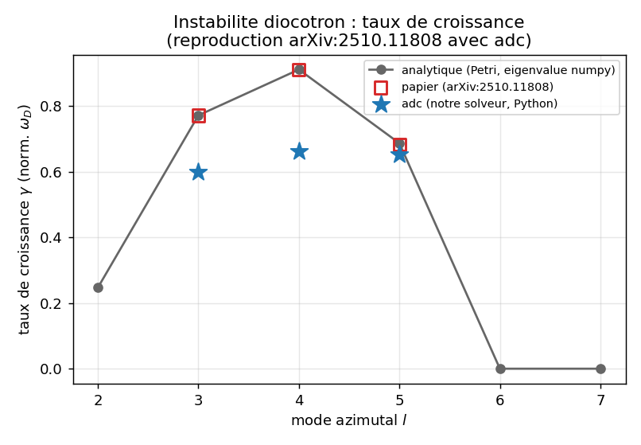
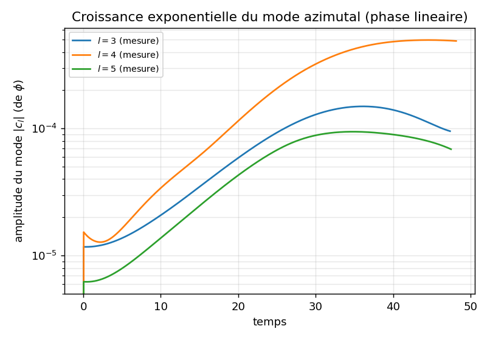
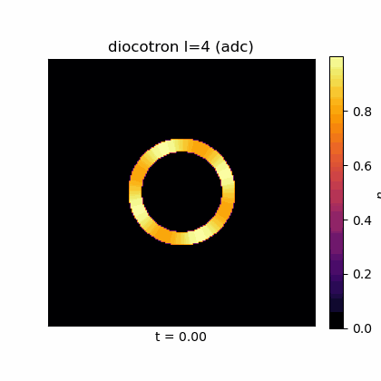
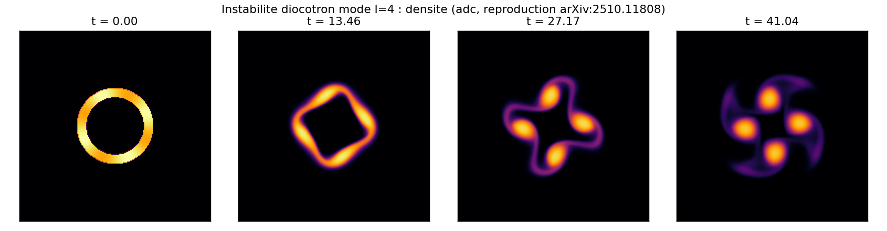

# diocotron : instabilite d'une colonne de charge en derive E x B

Reproduction du benchmark diocotron de Hoffart, Maier, Shadid & Tomas
([arXiv:2510.11808](https://arxiv.org/abs/2510.11808), Section 5.3) avec le solveur `adc`, en
100 % Python. On compare le taux de croissance $\gamma_l$ de l'instabilite, mesure par notre
simulation, a la fois a un oracle analytique (probleme aux valeurs propres radial, resolu en
numpy) et aux cibles du papier.

## Contrat

| Champ | Contenu |
|---|---|
| Categorie (manifeste) | `run.py` : `reproduction` (hors CI, figures+gif) ; `band_instability.py` : `validation` (CI, sans figure) |
| Entrees | grille $192^2$, $L=1$, non periodique, paroi conductrice cercle $R_w=0.40$ ; anneau $R_0{:}R_1=0.15{:}0.20$, perturbation $\delta\sin(l\theta)$ ($\delta=0.01$ mesure, $0.1$ gif) ; $B_0=1$, $\alpha=1$ ; modes $l\in\{3,4,5\}$ |
| Sorties | $\gamma_l$ mesure (3 modes) ; 4 figures dans `figures/` ; `figures/provenance.json` |
| Invariants garantis | l'oracle analytique colle au papier a 3 chiffres ; l'amplitude $|c_l|$ croit (pente log positive sur la fenetre lineaire) |
| PROUVE | (1) notre relation de dispersion numpy reproduit le papier ($\gamma_3{=}0.772$, $\gamma_4{=}0.912$, $\gamma_5{=}0.687$) ; (2) la simulation `adc` est instable aux 3 modes, dans le bon ordre |
| NE PROUVE PAS | la simulation ne reproduit pas le taux quantitatif : elle sous-estime de $-22$ a $-27\%$ (modes 3-4). Ceci reproduit la limite de derive E x B, pas le systeme Euler-Poisson magnetise complet (voir [`hoffart_euler_poisson_dsl`](../hoffart_euler_poisson_dsl/)). Aucun assert ne teste la valeur de $\gamma$ ; `run.py` la mesure et l'affiche |
| Provenance | adc_cpp `7598316a`, adc_cases `5112be06`, backend natif serie, $192^2$, ~60 s 1 coeur CPU ; `figures/provenance.json` |

A la fin tu sauras : pourquoi un anneau de charge devient instable (mecanisme), comment se calcule
le taux analytique (problemes aux valeurs propres), comment on le mesure dans la simulation, et
pourquoi notre schema volumes-finis sous-estime le taux.

---

## 1. Le mecanisme physique

Un anneau d'electrons (densite $n_e(r)$, nulle au centre et au bord) dans un champ axial
$\mathbf{B}=B_0\hat z$. Trois ingredients enchaines :

1. **Champ propre.** La charge cree $\phi$ par Poisson, avec paroi conductrice ($\phi=0$ a $r=R_w$) :
   $-\nabla^2\phi=\alpha\,(n_e-n_{i0})$, ici $n_{i0}=0$.
2. **Derive E x B.** Les electrons ne suivent pas $\mathbf{E}$ ; ils derivent a
   $\mathbf{v}=\dfrac{\mathbf{E}\times\mathbf{B}}{B_0^2}=\dfrac{1}{B_0}(-\partial_y\phi,\ \partial_x\phi)$.
   Cette vitesse est a divergence nulle, donc $n_e$ est advectee :
   $\partial_t n_e+\nabla\cdot(n_e\mathbf{v})=0$.
3. **Rotation differentielle.** A l'equilibre axisymetrique, la derive est azimutale : l'anneau
   tourne a $\Omega(r)=-\dfrac{1}{r^2}\displaystyle\int_0^r n_e(r')\,r'\,dr'$, fonction de $r$.
   Bord interne et bord externe ne tournent pas a la meme vitesse : cisaillement.

Ce modele est mathematiquement identique a l'Euler 2D en formulation tourbillon : $n_e$ joue la
vorticite, $\phi$ la fonction de courant, $\mathbf{v}=\hat z\times\nabla\phi/B_0$. L'instabilite
diocotron est donc l'instabilite de Kelvin-Helmholtz d'un anneau de vorticite : une ondulation
azimutale du bord (mode $l$) est entrainee differemment par les deux bords cisailles, s'enroule et
croit exponentiellement. L'anneau developpe $l$ lobes (visible section 6). Le taux $\gamma_l$ est
la consequence quantifiee de ce cisaillement, pas le point de depart.

---

## 2. Les equations et qui les calcule

| Bloc | Equation | Brique |
|---|---|---|
| Transport | $\partial_t n_e+\nabla\cdot(n_e\mathbf{v})=0,\ \mathbf{v}=\frac{1}{B_0}(-\partial_y\phi,\partial_x\phi)$ | `ExBVelocity` |
| Source | aucune | `NoSource` |
| Elliptique | $-\nabla^2\phi=\alpha(n_e-n_{i0})$, Dirichlet $\phi=0$ a $r=R_w$ | `BackgroundDensity` |
| Etat | densite scalaire $n_e$ | `Scalar` |

C'est `adc_cases.models.diocotron(B0, alpha, n_i0)`. Qui calcule quoi :

| Ligne `run.py` | Couche | Ce qui se passe |
|---|---|---|
| `add_block("ne", model=..., spatial=Spatial(minmod), time=Explicit)` (`run.py:161`) | Python compose | choix du modele, du schema (MUSCL minmod + Rusanov), de l'integrateur (SSPRK2) |
| `models.diocotron(...)` -> `ExBVelocity` / `BackgroundDensity` (`include/adc/physics/{hyperbolic,elliptic}.hpp`) | la brique C++ fige la physique | la convention exacte du flux $n v(dir)$, de la valeur propre $v(dir)$, du RHS $\alpha(n-n_{i0})$ |
| `assemble_rhs<Limiter,Flux>` + Poisson de systeme (`GeometricMG`) | noyau par cellule | le calcul reel, sans callback Python dans le hot path |

`models.diocotron` ne nomme aucun scenario cote coeur : le mot "diocotron" vit dans `adc_cases`,
la physique est une composition de briques generiques.

---

## 3. La prediction falsifiable : le taux $\gamma_l$, calcule deux fois

`run.py` calcule $\gamma_l$ par deux chemins independants et les confronte :
(A) un oracle analytique numpy (section 4) ; (B) la simulation `adc` (section 5). La figure
`dispersion.png` superpose les deux + les points du papier. L'ecart (A)-(B) est l'analyse centrale
(section 7). Justifie la clause PROUVE (l'oracle == papier) et la clause NE PROUVE PAS (la simu
sous-estime).

---

## 4. Maths : la relation de dispersion analytique (`diocotron_eigenvalue`, `run.py:72-95`)

### 4.0 D'ou vient la rotation $\Omega(r)$, et d'ou vient l'instabilite

L'equilibre est axisymetrique, $n_0(r)$. Poisson radial,
$\frac1r\frac{d}{dr}\!\big(r\,\partial_r\phi_0\big)=-n_0$, s'integre une fois :
$r\,\partial_r\phi_0(r)=-\int_0^r n_0(r')\,r'\,dr'\equiv-C(r)$, donc $\partial_r\phi_0=-C/r$. La derive
E x B d'un potentiel radial est purement azimutale, $v_\theta=\frac{1}{B_0}\partial_r\phi_0$, et la
vitesse angulaire est $\Omega(r)=v_\theta/r=-C(r)/r^2$ (avec $B_0=1$) : c'est exactement la ligne
`Om[1:] = -C[1:]/r**2`. La charge enfermee $C(r)$ croit dans l'anneau puis sature : $\Omega(r)$
n'est pas constante, l'anneau est en rotation differentielle.

Pourquoi cela cree-t-il une instabilite ? En formulation tourbillon ($n_e$ = vorticite, $\phi$ =
fonction de courant), le critere de Rayleigh dit qu'un profil de vorticite est instable s'il
possede un extremum (point d'inflection du profil de vitesse). Un anneau creux a deux bords
de vorticite (montant en $R_0$, descendant en $R_1$) : deux couches de cisaillement contrarotatives
qui se couplent. Chacune porte des ondes de bord (ondes de diocotron) ; quand les deux ondes de
bord sont en resonance de phase (a un mode azimutal $l$ donne), elles se renforcent mutuellement et
l'amplitude croit exponentiellement. Le mode le plus instable est celui ou ce couplage est maximal
(ici $l\approx 4$).

### 4.1 Le probleme aux valeurs propres

On linearise autour de $n_0(r)$ : une perturbation
$\phi'(r,\theta,t)=\hat\phi(r)\,e^{i(m\theta-\omega t)}$ obeit a un probleme aux valeurs propres
pour $\omega$ ($\mathrm{Im}\,\omega=\gamma$) :
$$\omega\,\mathcal{L}_m\hat\phi=m\,\Omega(r)\,\mathcal{L}_m\hat\phi+\frac{m}{r}\frac{dn_0}{dr}\,\hat\phi,\qquad \hat\phi(0)=\hat\phi(R_w)=0,$$
ou $\mathcal{L}_m=\dfrac{d^2}{dr^2}+\dfrac1r\dfrac{d}{dr}-\dfrac{m^2}{r^2}$ est le Laplacien radial du
mode $m$. Les deux termes ont un sens physique direct : $m\,\Omega(r)\,\mathcal{L}_m\hat\phi$ est
l'advection de la vorticite perturbee par la rotation d'equilibre (l'onde est portee par le
fluide qui tourne a $\Omega(r)$), et $\frac{m}{r}\frac{dn_0}{dr}\hat\phi$ est le forcage par le
gradient de densite : c'est lui qui peut injecter de l'energie dans la perturbation, et il est
concentre aux bords de l'anneau. On met sous forme standard
$\omega\hat\phi=\mathcal{L}_m^{-1}(m\Omega\,\mathcal{L}_m+Q)\hat\phi=M\hat\phi$, et
$\gamma=\max_k\mathrm{Im}(\omega_k)$ (le mode le plus instable). Le spectre se lit ainsi : les
$\omega$ reels sont des rotations stables (ondes neutres) ; une paire conjuguee $\omega,\bar\omega$
signale une instabilite, et $\gamma=\mathrm{Im}(\omega)>0$ est son taux. Le code discretise tout en
differences finies ; chaque symbole pointe la ligne qui le calcule :

```python
rho = 0.5 * rhobar * (np.tanh((r - a) / w) - np.tanh((r - b) / w))   # n0(r) : anneau lisse (run.py:75)
C[1:] = np.cumsum(0.5 * (integrand[1:] + integrand[:-1]) * h)        # C(r)=int_0^r n0 r' dr' (run.py:78)
Om[1:] = -C[1:] / (r[1:] ** 2)                                       # Omega(r)=-C/r^2 (run.py:80)
np.fill_diagonal(Lmat, -2.0/h**2 - (m*m)/(ri*ri))                    # diagonale de L_m (run.py:84)
Lmat[k, k-1] = 1/h**2 - 1/(2*h*r[k+1]); Lmat[k, k+1] = 1/h**2 + 1/(2*h*r[k+1])  # +/- = (1/r)d/dr
Q = (m / ri) * ((rho[2:N+1] - rho[0:N-1]) / (2*h))                   # Q=(m/r) dn0/dr (run.py:89)
M = np.linalg.solve(Lmat, (m*Om[1:N])[:,None]*Lmat + diag(Q))       # M=L^{-1}(mOmega L + Q) (run.py:90-92)
dom = np.linalg.eigvals(M)[argmax(.imag)]                           # mode le plus instable (run.py:93-94)
return (2*pi/rhobar) * dom                                          # normalisation papier (run.py:95)
```
- `Om` ($\Omega(r)$) est la rotation d'equilibre : son cisaillement $d\Omega/dr$ est le moteur.
- `Lmat` est la matrice tridiagonale de $\mathcal{L}_m$ : la diagonale $-2/h^2-m^2/r^2$ vient de
  $d^2/dr^2$ et du terme $-m^2/r^2$ ; les hors-diagonales $1/h^2\pm 1/(2hr)$ encodent $d^2/dr^2$
  et le terme de derive premiere $\frac1r\frac{d}{dr}$. Les conditions $\hat\phi(0)=\hat\phi(R_w)=0$
  sont imposees en ne gardant que les points interieurs (`r[1:N]`).
- `Q` $=\frac{m}{r}\frac{dn_0}{dr}$ est le terme source, non nul uniquement aux bords de
  l'anneau. C'est l'observation cle de la section 7.

La normalisation $\times 2\pi/\bar\rho$ est la convention du papier (taux en unites de la frequence
de rotation moyenne) ; elle est admise, pas re-derivee.

---

## 5. Mesure dans la simulation (`measure_growth` + `mode_l_amplitude`, `run.py:101-187`)

A chaque pas, on lit $\phi$ et on extrait l'amplitude du mode $l$ sur un cercle au milieu de
l'anneau ($r_m=(R_0+R_1)/2$) :

```python
_, val = bilinear_on_circle(field, n, radius, 256)   # phi(theta) : 256 points, interpolation bilineaire
ck = np.fft.rfft(val) / len(val)                     # FFT azimutale (run.py:126)
return 2.0 * abs(ck[l])                              # 2|c_l| = amplitude du mode l (run.py:127)
```
- `bilinear_on_circle` interpole $\phi$ (defini aux centres de cellules) sur 256 points du cercle.
  La FFT puis $2|c_l|$ donne le coefficient de Fourier du mode $l$ : en phase lineaire,
  $|c_l|(t)\propto e^{\gamma t}$.
- `fit_linear_phase` (`run.py:130`) ajuste la pente de $\log|c_l|$ sur la fenetre purement
  exponentielle : apres le transitoire ($1.3\,a_0$), avant la saturation ($0.85$ du pic). La pente
  est $\gamma_{\text{raw}}$, normalisee $\times 2\pi/\bar\rho$.

Le systeme (`make_ring_system`, `run.py:157-166`) est non periodique avec paroi cercle Dirichlet
(`set_poisson(..., wall="circle", wall_radius=RWALL)`) : la paroi du papier, imposee sur la grille
cartesienne. `Spatial(minmod=True)` = MUSCL ordre 2 limite par minmod (diffusif aux forts gradients,
voir section 7) + flux de Rusanov.

Conditions initiales : `ring_density(n, l, delta)` pose un anneau $\approx 1$ entre $R_0$ et
$R_1$, $\approx 10^{-3}$ ailleurs, avec une perturbation azimutale
$n_e\approx\mathbb{1}_{[R_0,R_1]}(1-\delta+\delta\sin(l\theta))$. $\delta=0.01$ pour la mesure
(regime lineaire), $\delta=0.1$ pour le gif (visible).

---

## 6. Figures (generees par `run.py`, dans `figures/`)

### `dispersion.png` : taux vs mode



- **PROUVE** : la courbe analytique (gris) passe sur les carres rouges du papier
  ($\gamma_3{=}0.772$, $\gamma_4{=}0.912$, $\gamma_5{=}0.687$) : notre oracle reproduit le papier a 3
  chiffres. Les etoiles bleues (mesure `adc`) sont toutes sous la courbe, dans le bon ordre de
  modes.
- **SUGGERE (non assere)** : le maximum vers $l=4$ (mode le plus instable de cette geometrie) est
  visible mais aucun assert ne classe les modes.
- **NON MONTRE** : aucun point ne teste la valeur de $\gamma$ par assert ; `run.py` la mesure et
  l'affiche, il ne la valide pas contre une tolerance.

### `amplitude.png` : croissance exponentielle



- **PROUVE** : sur l'echelle semilog, chaque mode trace une droite sur la fenetre d'ajustement :
  croissance $|c_l|\propto e^{\gamma t}$ confirmee (pente positive = instable). La pente est le
  $\gamma$ reporte en etoile sur `dispersion.png`.
- **NON MONTRE** : la saturation (aplatissement en haut) est non lineaire et hors fenetre de mesure.

### `diocotron.gif` + `snapshots.png` : enroulement non lineaire (l=4)





- **PROUVE / visible** : l'anneau developpe exactement 4 lobes ($l=4$) qui s'enroulent en
  spirale (roll-up de Kelvin-Helmholtz) : la signature de l'instabilite.
- **SUGGERE** : la phase non lineaire (au-dela de la fenetre lineaire) ; sa dynamique exacte n'est
  pas comparee au papier.

---

## 7. Pourquoi la simulation sous-estime le taux

L'oracle reproduit le papier, la simulation sous-estime de $-22$ a $-27\%$ (modes 3-4). Ce n'est pas
un bug ; la cause est dans le terme source. Le moteur de l'instabilite est
$Q=\frac{m}{r}\frac{dn_0}{dr}$, non nul seulement aux deux bords de l'anneau (section 4). Or :

1. **Diffusion du schema aux bords.** MUSCL+minmod + Rusanov est diffusif aux forts gradients : il
   etale les bords de l'anneau, donc reduit $dn_0/dr$ la ou l'instabilite est pilotee. Un
   $dn_0/dr$ plus faible donne un $\gamma$ plus faible : exactement l'observation.
2. **Cercle sur grille cartesienne.** La paroi conductrice est un cercle en marches d'escalier sur
   la grille carree, et l'anneau n'est pas aligne avec la grille. L'erreur geometrique est
   dependante du mode de facon non monotone (d'ou $-5\%$ a $l=5$ vs $-27\%$ a $l=4$).

Le modele et l'oracle sont corrects (ils reproduisent le papier) ; c'est la
discretisation (diffusion de bord + cercle cartesien) qui abaisse le taux mesure. Limite connue
et structurelle du chemin cartesien, motivant le chantier de geometrie polaire cote `adc_cpp`.

---

## 8. Reproduire

```bash
cd ../adc_cpp && cmake -B build-py -DADC_BUILD_PYTHON=ON && cmake --build build-py --target _adc -j
cd ../adc_cases
PYTHONPATH=$PWD/../adc_cpp/build-py/python python3 diocotron/run.py        # ~60 s, ecrit figures/ + provenance.json
```
Prerequis : `numpy`, `matplotlib`, module `adc` compile et importe avec le meme interpreteur que
celui qui l'a compile (suffixe ABI `cpython-3XY`). Sortie attendue : `l=3: gamma_num = 0.599 |
analytique 0.772 | papier 0.772 | ecart -22%`, idem $l=4$ ($-27\%$) et $l=5$ ($-5\%$), puis `OK
repro_paper_2510_11808`. Les signes et l'ordre de grandeur sont stables ; les derniers chiffres
varient avec la BLAS et l'ordre de sommation (cf. `figures/provenance.json`).

`band_instability.py` (categorie `validation`, en CI) ne mesure pas un taux : elle verifie par
assert que l'instabilite croit sur une bande periodique, sans figure.

## Carte des fichiers

| Fichier | Role |
|---|---|
| `run.py` | analytique (sec. 4) + simulation (sec. 5) + figures + provenance |
| `figures/*.png`, `diocotron.gif` | assets versionnes, regeneres en place |
| `figures/provenance.json` | SHA adc_cpp/adc_cases, backend, resolution, $\gamma$ mesures |
| `band_instability.py` | variante CI legere | 
| `NORMALIZATION.md` | detail de la normalisation $\times 2\pi/\bar\rho$ |
