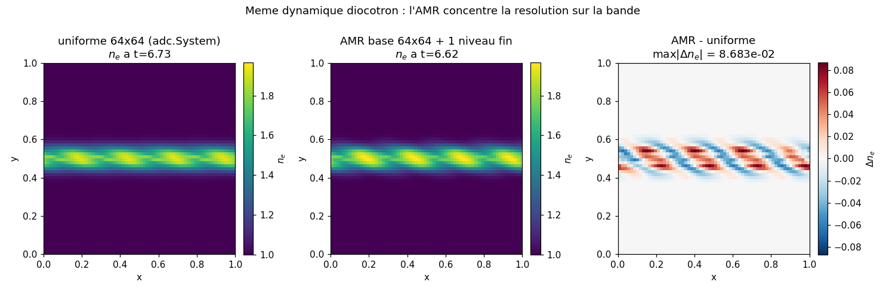
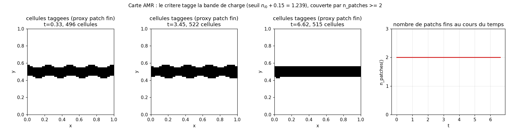
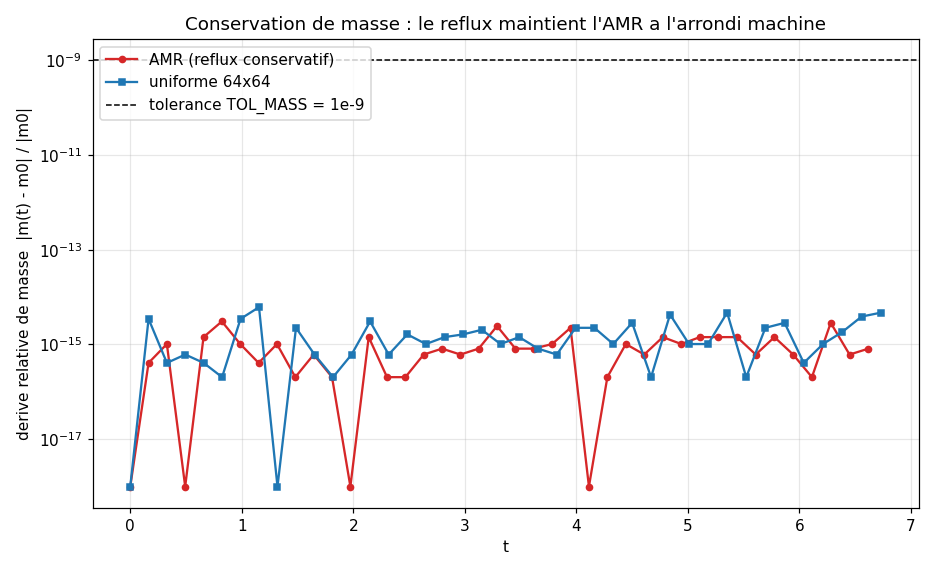
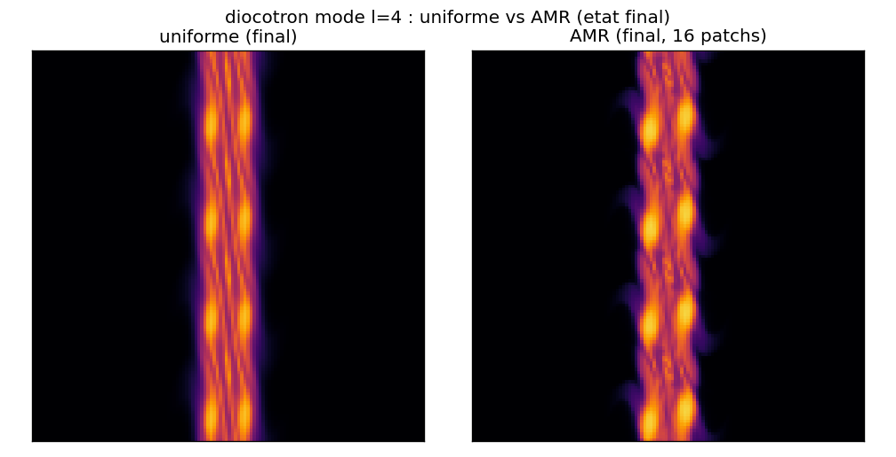
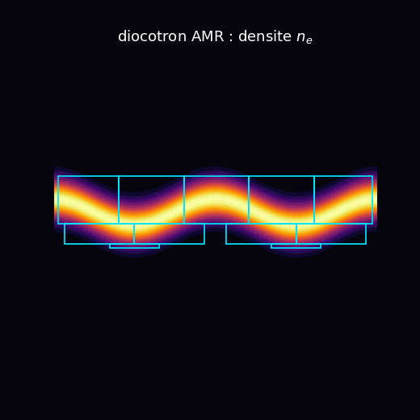

# diocotron_amr : instabilite diocotron sur grille AMR multi-patch

La meme dynamique diocotron que [`../diocotron/`](../diocotron/) (une charge advectee par sa propre
derive E x B), portee non plus sur une grille uniforme mais sur une hierarchie de raffinement
adaptatif `adc.AmrSystem` : un niveau de base grossier plus un niveau fin re-decoupe dynamiquement
(regrid Berger-Rigoutsos) pour suivre la bande de charge, avec reflux conservatif aux interfaces
grossier/fin. Ce cas ne mesure pas un taux de croissance : il valide que le raffinement vient du
critere de tagging (et non du seul build de la hierarchie), qu'il modifie la solution la ou il agit,
et que le reflux conserve la masse a l'arrondi machine.

## Contrat

| Champ | Contenu |
|---|---|
| Categorie (manifeste) | `validation` (`cases_manifest.toml`, `ci = true`, `needs = []`). Pas une reproduction publiee : on verifie des invariants de l'API AMR, pas une courbe d'article. |
| Entrees | grille de base $64\times 64$, $L=1$, periodique ; AMR `regrid_every=10`, 1 niveau fin, seuil de tag `threshold = n_{i0} + 0.15` ; CI `band_density` (bande gaussienne, `mode=4`, `width=0.05`, `disp=0.02`, `amp=1`, `floor=1`) ; modele `diocotron(B0=1, alpha=1, n_i0=<n_e>)` ; fond neutralisant $n_{i0}=\langle n_e\rangle$ ; 40 pas a `CFL=0.4`, schema NoSlope + Rusanov |
| Sorties | trace stdout (patches, masse, drel par pas) ; 3 figures de diagnostic dans `figures/` + `figures/provenance.json` |
| Invariants garantis | les `assert` de `run.py` : `n_patches() >= 2` a chaque pas (`run.py:88`) ; `drel < 1e-9` (`run.py:89`) ; densite finie (`run.py:90`) ; `min(patches_seen) > npatch_ctrl` (`run.py:112`) ; `gap > 1e-3` (`run.py:115`) |
| PROUVE | (1) la bande est couverte par 2 patchs fins a tous les pas, vs 1 pour un run de controle a seuil inatteignable : le raffinement vient du tagging ; (2) la solution raffinee differe de la non-raffinee de `max|delta| = 6.40e-2` (`run.py`, ecart sup > 1e-3) ; (3) la masse AMR est conservee a `drel <= 3.06e-15` (reflux) ; (4) densite finie partout |
| NE PROUVE PAS | ce n'est pas une reproduction d'un taux $\gamma_l$ ni d'une figure du papier (la reproduction etablie vit dans [`../diocotron/`](../diocotron/), grille uniforme ; la candidate Euler-Poisson magnetisee complete dans [`../hoffart_euler_poisson_dsl/`](../hoffart_euler_poisson_dsl/), statut PENDING). La CI plafonne a 2 patchs et 1 niveau fin : pas de hierarchie profonde ni de grand nombre de patchs testes. Le seuil est cale empiriquement, pas issu d'un estimateur d'erreur. Aucun assert ne teste la convergence ni le taux de croissance. |
| Provenance | adc_cpp `01873299`, adc_cases `7c7a3403`, backend natif (`adc.AmrSystem` + `adc.System`), base $64^2$, Python 3.12.2, macOS arm64 ; `figures/provenance.json` |

A la fin tu sauras : pourquoi cet AMR ne touche pas la masse (la math du reflux + Poisson periodique),
ou il concentre la resolution (les bords de bande, ou vit le gradient), et ce que la validation ne
couvre pas (un seul niveau, 2 patchs, pas de taux).

---

## 1. Physique : la meme instabilite, sur un maillage adaptatif

Le mecanisme est celui du cas parent : une densite de charge $n_e$ cree son potentiel $\phi$ par
Poisson, derive a $\mathbf{v}=(\mathbf{E}\times\mathbf{B})/B_0^2$ (vitesse a divergence nulle, donc
$n_e$ est purement advectee), et le cisaillement de la rotation differentielle enroule la
perturbation. La derivation complete (rotation $\Omega(r)$, critere de Rayleigh, probleme aux valeurs
propres, taux $\gamma_l$) est dans [`../diocotron/README.md` section 4](../diocotron/README.md) ; on
ne la recopie pas.

Deux differences avec le parent, toutes deux au service de la validation AMR :

- **Geometrie de la CI.** Ici la charge est une bande horizontale gaussienne ondulee `mode=4`
  (`band_density`, section 8), pas l'anneau du benchmark. Une bande offre un gradient transverse
  net et localise (les deux bords de la bande), qui est exactement ce que le critere de tag doit
  attraper. Le domaine est periodique (et non a paroi conductrice), ce qui simplifie le couplage
  Poisson sur la hierarchie.
- **Maillage.** La grille uniforme du parent devient une hierarchie : grossier $64^2$ + un niveau
  fin, re-decoupe tous les 10 pas pour suivre la bande. C'est l'objet teste.

L'enjeu physique du cas n'est donc pas "quel taux" mais : un maillage adaptatif change-t-il la
physique conservee ? La reponse attendue (et asseree) est non pour la masse (le reflux la protege)
et oui pour le detail local (le niveau fin resout mieux le bord). C'est une validation
d'invariant, au sens du guide : la masse est l'invariant, le reflux est la raison.

---

## 2. Equations et qui les calcule

Le bloc evolue une densite scalaire $n_e(x,y,t)$ advectee par la derive E x B, couplee a un
Poisson periodique a fond neutralisant :

$$\partial_t n_e + \nabla\cdot(n_e\,\mathbf{v}) = 0,\qquad
\mathbf{v}=\frac{1}{B_0}(-\partial_y\phi,\ \partial_x\phi),\qquad
-\nabla^2\phi = \alpha\,(n_e - n_{i0}).$$

| Bloc | Equation | Brique `adc` |
|---|---|---|
| Etat | densite scalaire $n_e$ | `adc.Scalar()` |
| Transport | $\partial_t n_e+\nabla\cdot(n_e\mathbf v)=0$, derive E x B | `adc.ExB(B0=1)` |
| Source | aucune | `adc.NoSource()` |
| Elliptique | $-\nabla^2\phi=\alpha(n_e-n_{i0})$, periodique | `adc.BackgroundDensity(alpha=1, n0=n_{i0})` |

C'est exactement `models.diocotron(B0=1.0, alpha=1.0, n_i0=n_i0)` (`adc_cases/models.py:18-25`), le
meme modele que le parent : seuls le maillage (AMR), la CI (bande) et les BC (periodique)
changent. Qui calcule quoi, les trois couches pinnees aux lignes de `run.py` :

| Ligne `run.py` | Couche | Ce qui se passe |
|---|---|---|
| `sim.add_block("ne", model=models.diocotron(...), spatial=adc.Spatial(none=True))` (`run.py:57-58`) | Python compose | choix du modele, du schema spatial (NoSlope + Rusanov), porte sur la hierarchie ; l'integrateur explicite est le defaut de `step_cfl` |
| `models.diocotron(...)` -> `ExB` / `BackgroundDensity` (`include/adc/physics/{hyperbolic,elliptic}.hpp`) | brique C++ fige la physique | la convention exacte du flux $n\,v(\mathrm{dir})$, de la valeur propre $v(\mathrm{dir})$, du RHS $\alpha(n-n_{i0})$ |
| `assemble_rhs<NoSlope,Rusanov>` + regrid Berger-Rigoutsos + reflux + Poisson `geometric_mg` (`run.py:81` `step_cfl`) | noyau par cellule / par patch | le calcul effectif : transport sur chaque patch, re-decoupe de la hierarchie, correction de flux aux interfaces, sans callback Python dans le hot path |

`models.diocotron` ne nomme aucun scenario cote coeur : le mot "diocotron" vit dans `adc_cases`, la
physique est une composition de briques generiques. `adc.AmrSystem` est le pendant raffine de
`adc.System` ; il porte le meme bloc, plus la machinerie regrid/reflux.

---

## 3. La prediction falsifiable : reflux => masse invariante, AMR => solution locale modifiee

Le cas confronte deux runs qui ne different que par le seuil de tag (`build_sim`, `run.py:54-62`,
reutilisee pour les deux) :

- **nominal** : `threshold = n_i0 + 0.15` (`run.py:70`), les cellules de la bande sont taggees ;
- **controle** : `threshold = 1e30` (`NO_REFINE`, `run.py:48`), aucune cellule ne le depasse, le
  critere ne tagge jamais.

Trois predictions tombent de ce contraste, chacune justifiant une clause PROUVE du contrat :

1. **Le raffinement vient du tagging** : `n_patches()` nominal $\ge 2$ a chaque pas (`run.py:88`),
   mais le controle reste a $1$ (`run.py:112`). Si la hierarchie produisait des patchs sans tagging,
   le controle en aurait autant : il n'en a pas.
2. **L'AMR change la solution** : la densite nominale projetee differe de la densite de controle de
   `gap > 1e-3` (`run.py:115`). Une egalite signalerait un niveau fin inerte.
3. **Le reflux conserve la masse** : `drel < 1e-9` a chaque pas (`run.py:89`). Sans reflux, chaque
   regrid laisserait fuir de la masse aux interfaces grossier/fin.

Les figures de la section 6 confrontent ces trois predictions a l'oeil et au nombre.

---

## 4. Maths : pourquoi la masse est invariante (et pourquoi $n_{i0}=\langle n_e\rangle$)

C'est le coeur d'une validation d'invariant : pas une derivation de taux, mais la raison
structurelle pour laquelle la masse ne bouge pas, et pourquoi le fond neutralisant est obligatoire.

### 4.1 Conservation = forme divergence + reflux

Le transport est sous forme conservative $\partial_t n_e+\nabla\cdot(\mathbf F)=0$ avec
$\mathbf F=n_e\mathbf v$. Sur une grille uniforme, un schema volumes-finis conserve exactement la
somme $\sum_{ij} n_e\,h^2$ : le flux sortant d'une cellule est le flux entrant de sa voisine
(telescopage). C'est ce qu'on lit sur le run uniforme : `drel <= 6.12e-15` (section 6, fig. 3).

Sur une hierarchie AMR ce telescopage casse aux interfaces grossier/fin : la cellule grossiere
voit un flux calcule a son pas, la cellule fine voisine un flux calcule au sien ; les deux ne
coincident pas, et la masse derive a chaque regrid. Le reflux (refluxing) corrige : il remplace
le flux grossier de l'interface par la somme des flux fins coincidents, retablissant le telescopage.
Resultat asseré : `drel <= 3.06e-15` sur l'AMR (section 6, fig. 3), du meme ordre que l'uniforme.
C'est l'observable qui prouve que le reflux agit : sans lui, la trace montrerait une derive
croissante a chaque pas multiple de `regrid_every=10`, pas un plancher d'arrondi.

### 4.2 Pourquoi $n_{i0}=\langle n_e\rangle$ : solubilite du Poisson periodique

Sur un domaine periodique, $-\nabla^2\phi=f$ n'a de solution que si $\langle f\rangle=0$
(l'integrale du Laplacien sur un tore est nulle ; c'est la condition de compatibilite). Ici
$f=\alpha(n_e-n_{i0})$, donc il faut $\langle n_e\rangle=n_{i0}$. Le cas le garantit en mesurant
le fond : `n_i0 = float(ne.mean())` (`run.py:68`), valeur $n_{i0}=1.088623$. Un $n_{i0}$
arbitraire (ex. $0$) violerait la compatibilite et le multigrille ne convergerait pas vers un champ a
moyenne definie. Ce $n_{i0}$ sert aussi de point de reference au seuil de tag : `threshold = n_i0 +
0.15 = 1.238623`, soit "la densite depasse le fond de $0.15$", ce qui ne tagge que la bande (pas le
plancher a $1.0$).

### 4.3 La tolerance `TOL_MASS = 1e-9`, justifiee par un ordre de grandeur

`TOL_MASS = 1e-9` (`run.py:45`) se situe entre le bruit machine mesure ($\mathrm{drel}\sim
3\times 10^{-15}$, soit l'arrondi flottant accumule sur $40$ pas + regrids) et le seuil d'alerte
qu'on voudrait : une fuite de reflux serait au moins $O(h)\sim 10^{-2}$ par regrid. La marge
entre $10^{-15}$ mesure et $10^{-9}$ assere est de six ordres : assez large pour ne pas claquer
sur la variabilite BLAS, assez serre pour attraper une fuite de reflux des le premier regrid. De
meme, `MIN_SOLUTION_GAP = 1e-3` (`run.py:51`) est cale bien sous l'ecart mesure $\sim 6\times
10^{-2}$ (section 6) et bien au-dessus du bruit : il atteste un effet reel, pas un flottement de
schema.

---

## 5. Le code, fonction par fonction (`run.py`)

Le fichier se lit en deux temps : une usine `build_sim` et un `main`.

**`build_sim(ne, n_i0, threshold)` (`run.py:54-62`)** construit un `AmrSystem` identique au nominal
au seuil pres (c'est elle qui sert aussi au controle, garantissant que seul le seuil change) :

```python
sim = adc.AmrSystem(n=N, L=L, regrid_every=10, periodic=True)          # run.py:56
sim.add_block("ne", model=models.diocotron(B0=1.0, alpha=1.0, n_i0=n_i0),
              spatial=adc.Spatial(none=True))                           # run.py:57-58
sim.set_refinement(threshold=threshold)                                # run.py:59
sim.set_poisson(rhs="charge_density", solver="geometric_mg")           # run.py:60
sim.set_density("ne", ne)                                              # run.py:61
```
- `adc.AmrSystem(n=64, regrid_every=10, periodic=True)` : hierarchie a niveau de base $64^2$, regrid
  tous les 10 pas, BC periodiques (heritees par le Poisson).
- `adc.Spatial(none=True)` : limiteur NoSlope (reconstruction ordre 1, "none") + flux Rusanov
  (defaut de `Spatial`, cf. signature `Spatial(limiter, flux, recon, *, none, ...)`). Ordre 1 dissipatif,
  choisi pour une bande qui s'enroule sur grille AMR grossiere sans oscillations.
- `set_refinement(threshold)` : le parametre discriminant. Les cellules avec $n_e>\text{threshold}$
  sont taggees, et le niveau fin est re-decoupe en patchs rectangulaires (Berger-Rigoutsos) pour les
  couvrir.
- `set_poisson(rhs="charge_density", solver="geometric_mg")` : multigrille geometrique, RHS porte par
  la brique `BackgroundDensity` du modele.

**`main()` (`run.py:65-119`)** :

```python
ne = band_density(N, L, amp=1.0, width=0.05, mode=MODE, disp=0.02)  # CI bande (run.py:67)
n_i0 = float(ne.mean())                                            # fond neutralisant (run.py:68)
sim = build_sim(ne, n_i0, threshold=n_i0 + REFINE_FRAC)            # run nominal (run.py:70)
for k in range(NSTEPS):
    sim.step_cfl(0.4)                                              # 1 macro-pas CFL=0.4 (run.py:81)
    npatch = sim.n_patches()                                       # patchs fins courants (run.py:83)
    drel = relative_drift(mass, mass0)                             # derive masse (run.py:84)
    assert npatch >= 2                                             # >= 2 patchs (run.py:88)
    assert drel < TOL_MASS                                         # masse conservee (run.py:89)
    assert_finite(sim.density(), ...)                              # pas de NaN/Inf (run.py:90)
```
- `step_cfl(0.4)` (`run.py:81`) : un macro-pas explicite a CFL=0.4 ($dt=\text{CFL}\cdot h/w_{\max}$),
  qui declenche le regrid tous les `regrid_every` pas et applique le reflux.
- `n_patches()` (`run.py:83`) renvoie le nombre de patchs fins courants ; l'assert $\ge 2$
  (`run.py:88`) exige une couverture multi-patch de la bande, pas le simple "un niveau fin existe".
- `relative_drift(mass, mass0)` (`common/checks.py:11`) = $|m-m_0|/\max(|m_0|,10^{-30})$.
- `assert_finite` (`common/checks.py:29`) : ni NaN ni Inf.

Le run de controle (`run.py:104-117`) reconstruit la meme CI avec `threshold = NO_REFINE = 1e30`,
avance 40 pas, puis :
```python
gap = float(np.abs(dens - dens_ctrl).max())            # ecart sup nominal vs controle (run.py:109)
assert min(patches_seen) > npatch_ctrl                 # le seuil discrimine (run.py:112)
assert gap > MIN_SOLUTION_GAP                          # le raffinement change la solution (run.py:115)
```
Ces deux asserts ferment la boucle logique : les patchs viennent du tag (sinon le controle en
aurait autant), et ils agissent sur la solution (sinon `gap` serait nul).

Note d'API : sur `AmrSystem`, `mass()` / `density()` / `n_patches()` se lisent sans nom de bloc
(la hierarchie agrege le bloc unique) ; sur `adc.System` uniforme c'est `mass("ne")` / `density("ne")`
avec le nom. Les figures (section 6) exploitent cette difference pour comparer les deux chemins.

---

## 6. Figures (generees par `make_figures.py`, dans `figures/`)

`make_figures.py` re-joue la meme physique sur deux chemins, AMR (`adc.AmrSystem`) et uniforme
(`adc.System` $64^2$), avec la meme CI / le meme modele / le meme schema, et ne change que le maillage.
Tous les nombres ci-dessous sont ceux du run (cf. `figures/provenance.json`).

### `density_compare.png` : meme dynamique, uniforme vs AMR



- **PROUVE** (par les asserts de `run.py` et la mesure ici) : les deux runs portent la meme
  dynamique (bande modulee 4 fois, $n_e^{\max}$ AMR $=1.967$ vs uniforme $=1.920$) ; le panneau de
  difference est non nul, `max|delta n_e| = 8.68e-2` (du meme ordre que le `gap=6.40e-2` asseré dans
  `run.py:115`, fenetres de mesure differentes) : l'AMR modifie la solution.
- **SUGGERE (non assere)** : la difference est structuree aux bords de la bande (lobes rouges/bleus
  alternes le long de $y\approx 0.45$ et $0.57$), pas un bruit diffus : c'est exactement ou le niveau
  fin resout mieux le gradient transverse. Visible, non teste par un assert spatial.
- **NON MONTRE** : aucune des deux cartes n'est comparee a une solution de reference convergee ; on ne
  prouve pas laquelle est "la bonne", seulement qu'elles different la ou l'AMR agit.

### `patch_map.png` : ou l'AMR concentre la resolution



- **PROUVE** : `n_patches()` vaut 2 a tous les pas (panneau de droite, ligne plate ; `patches
  observed = [2]` dans la provenance), ce qui satisfait l'assert $\ge 2$ (`run.py:88`). La bande est
  bien couverte par plusieurs patchs fins, pas un seul niveau degenere.
- **SUGGERE** : le footprint des cellules taggees (proxy de la couverture du patch fin, $\approx 500$
  cellules, soit ~12 % du domaine) suit la bande : les 4 lobes de la modulation sont visibles a
  $t=0.33$ et s'etalent en une bande lisse a $t=6.62$ a mesure que le schema d'ordre 1 diffuse les
  bords. Le tag se concentre la ou $n_e>1.239$, jamais sur le plancher a $1.0$.
- **NON MONTRE** : ce footprint est la zone taggee (densite > seuil), pas la geometrie exacte des
  rectangles Berger-Rigoutsos : le binding n'expose pas les boites de patch, seulement leur nombre
  (`n_patches()`). Le footprint approche la couverture, il ne la dessine pas au pixel pres. Le compte
  reste fige a 2 : on ne teste ni la fusion/scission de patchs ni un grand nombre de patchs.

### `mass_conservation.png` : le reflux maintient la masse a l'arrondi machine



- **PROUVE** : les deux courbes restent collees au plancher d'arrondi machine ($\sim 10^{-15}$),
  six ordres de grandeur sous la tolerance `TOL_MASS = 1e-9` (ligne tiretee). Mesure : AMR
  `drel_max = 3.06e-15`, uniforme `drel_max = 6.12e-15`. L'assert `drel < 1e-9` (`run.py:89`) passe a
  chaque pas.
- **SUGGERE** : l'AMR n'est pas moins conservatif que l'uniforme malgre ses interfaces grossier/fin
  re-decoupees tous les 10 pas : sa courbe est meme legerement plus basse par endroits. C'est la
  signature attendue d'un reflux correct ; aucun assert ne compare les deux planchers.
- **NON MONTRE** : on ne montre pas le scenario sans reflux (qui sortirait du graphe par une derive
  en marches a chaque regrid). La figure prouve que le reflux *present* conserve, pas le contrefactuel.

### `diocotron_amr_hero.gif` : la figure hero du README adc_cpp, en version locale

Le README d'adc_cpp affiche en tete une animation, `docs/anim_romeo_diocotron_amr3.gif` : un panneau
unique ou une bande de charge horizontale (mode $l=2$) s'enroule en oeil-de-chat, suivie par des
cadres de raffinement AMR. `make_hero_gif.py` en produit une version du meme type, reproductible
localement (meme cadrage : un seul panneau, fond sombre, colormap inferno, titre
`diocotron AMR : densite n_e`, bande mode $l=2$ qui s'enroule), mais ou les cadres sont les patchs
fins du solveur, pas un proxy.





- **PROUVE / visible (physique du solveur)** : la bande est advectee par le solveur (derive
  $E \times B$ de `models.diocotron`, Poisson de charge resolu par multigrille geometrique sur
  `adc.AmrSystem`). L'enroulement en deux vortex (oeil-de-chat, instabilite de Kelvin-Helmholtz du
  diocotron au mode $l=2$) est la sortie du code, pas une animation scriptee.
- **PROUVE / visible (cadres du solveur)** : chaque rectangle cyan est la geometrie exacte d'un patch
  fin, lue par `AmrSystem.patch_rectangles()` (binding `patch_boxes()`). Aucun proxy de
  densite, aucun `scipy` : ce sont les patchs que le moteur a effectivement raffines. On le
  voit suivre la physique : au depart les patchs tuilent la bande sinusoidale, puis se concentrent
  sur les coeurs de vortex et le filament quand l'instabilite s'enroule (criteres de tag au-dessus du
  plancher, `set_refinement(threshold)` ; le regrid les replace a chaque fenetre). Le nombre de
  patchs varie (consigne dans `provenance.json`, champ `n_patches_*`).
- **PORTEE (1 niveau, pas 3)** : la facade Python `adc.AmrSystem` raffine sur un niveau fin
  multi-patch (Berger-Rigoutsos) : tous les patchs sont de niveau 1 (cyan ; le code colore par
  niveau, 1=cyan/2=vert/3=rouge, et serait pret si un futur exposait plus de niveaux). La figure hero
  du README adc_cpp a, elle, ete produite par le moteur C++ multi-niveaux (`advance_amr`, 3
  niveaux) sur ROMEO (GH200). Ce GIF reproduit le type de la figure (diocotron suivi par un
  AMR adaptatif), avec les patchs de la facade, pas les 3 niveaux exacts du run ROMEO.
- Genere par `python make_hero_gif.py` ; provenance dans `figures/provenance.json` (champs
  `physique_reelle`, `cadres`, `difference_avec_hero`, `n_patches_*`).

---

## 7. Ce que l'invariant ne capture pas

La masse conservee a $10^{-15}$ et la couverture multi-patch sont des invariants structurels : ils
disent que la machinerie AMR (tag -> regrid -> reflux) est correcte et active, pas que la physique
resolue est fidele. Restent hors de la validation :

- **La fidelite du taux.** Le schema NoSlope + Rusanov est d'ordre 1, volontairement dissipatif : il
  etale les bords de la bande (visible fig. `patch_map`, t=6.62) et abaisserait un taux de croissance
  mesure, comme la version uniforme du parent sous-estime $\gamma_l$ de $-22$ a $-27\%$. Ici aucun
  taux n'est mesure ni asseré.
- **La convergence.** Un seul niveau fin, $64^2$ de base, 2 patchs : pas de balayage de resolution, pas
  de hierarchie profonde, pas de demonstration que la solution converge quand on raffine plus.
- **Le multi-bloc et le device.** Le coeur `adc_cpp` valide la brique AMR sur backends device (regrid
  B_z GH200) et MPI multi-box dans le projet amont ; ce cas ne fait que composer des briques
  natives via la facade Python sur le binding charge (CPU host). Aucun chemin GPU/MPI n'est exerce ici.

---

## 8. Conditions initiales

CI = `band_density` (`common/initial_conditions.py:13-25`) : bande horizontale gaussienne de charge,
ondulee `mode` fois le long de $x$.

$$n_e(x,y)=\text{floor}+\text{amp}\cdot e^{-(y-y_0)^2/\text{width}^2},\qquad
y_0=0.5\,L+\text{disp}\cdot\cos(2\pi\,\text{mode}\,x/L).$$

Parametres du cas (`run.py:42-43,66-67`) : `N=64`, `L=1`, `amp=1`, `width=0.05`, `mode=4`,
`disp=0.02`, `floor=1` (defaut). Bande centree en $y=0.5$, ondulee 4 fois. Convention `ne[j,i]` a
centres de cellules (`common/grid.py:meshgrid_xy`). Le fond neutralisant `n_i0 = ne.mean() = 1.088623`
(mesure) assure la moyenne nulle du RHS de Poisson periodique (section 4.2).

Cette CI `band_density` est partagee avec `../diocotron/` (variante periodique) et `custom_scheme`.
Elle differe de l'anneau `ring_density` du benchmark publie : `diocotron_amr` n'est pas une
reproduction de `arXiv:2510.11808` (section 7).

---

## 9. Reproduire

```bash
cd /private/tmp/adc_cases-deeptut/diocotron_amr
# le cas (asserts, ~0.4 s CPU host, sans matplotlib) :
PYTHONPATH=/Users/romaindespoulain/Documents/Stage_Romain/adc_cpp/build-master/python:/private/tmp/adc_cases-deeptut \
  /opt/homebrew/anaconda3/bin/python3.12 run.py
# les figures de diagnostic (re-joue AMR + uniforme, ecrit figures/*.png + provenance.json) :
PYTHONPATH=/Users/romaindespoulain/Documents/Stage_Romain/adc_cpp/build-master/python:/private/tmp/adc_cases-deeptut \
  /opt/homebrew/anaconda3/bin/python3.12 make_figures.py
```
Le premier element du `PYTHONPATH` apporte le module `adc` (binding C++, suffixe ABI
`cpython-312-darwin`) ; le second apporte le paquet `adc_cases`. Prerequis : `numpy` (le cas),
`matplotlib` (les figures seulement). Aucun compilateur C++ a l'execution (`needs = []` au
manifeste) : rien n'est compile a la volee, le binding `_adc.so` est deja construit.

Sortie attendue du cas (valeurs reelles capturees) :
```
# n_base=64 regrid_every=10 band_mode=4  n_i0=1.0886
  0     0.1642   2        1.08862269e+00 4.079e-16
  ...
  39    6.6204   2        1.08862269e+00 8.159e-16
# patchs observes : [2]
# masse : init=1.088622692545e+00 final=1.088622692545e+00 drel=8.159e-16
# densite : min=1.000000e+00 max=1.966797e+00
# controle (seuil 1e+30) : patches=1  ecart_sup solution=6.395745e-02
OK diocotron_amr
```
Les signes et l'ordre de grandeur sont stables ; les derniers chiffres de `drel` et de `gap` varient
avec la bibliotheque BLAS et l'ordre de sommation des patchs (cf. `figures/provenance.json` :
`drel_max` AMR $=3.06\times 10^{-15}$, `gap` figures $=8.68\times 10^{-2}$ sur une fenetre de mesure
differente de l'assert du `run.py`, $6.40\times 10^{-2}$).

## Carte des fichiers

| Fichier | Role |
|---|---|
| `run.py` | le cas : `AmrSystem`, boucle 40 pas, asserts, run de controle a seuil inatteignable |
| `make_figures.py` | re-joue AMR + uniforme, ecrit `figures/*.png` + `figures/provenance.json` |
| `figures/density_compare.png` | densite finale uniforme \| AMR \| difference |
| `figures/patch_map.png` | footprint des cellules taggees (3 instants) + `n_patches(t)` |
| `figures/mass_conservation.png` | derive relative de masse vs t, AMR vs uniforme |
| `figures/provenance.json` | SHA adc_cpp/adc_cases, backend, resolution, nombres mesures |
| `../adc_cases/models.py` | `diocotron(B0, alpha, n_i0)` = composition des 4 briques |
| `../adc_cases/common/initial_conditions.py` | `band_density(...)` : la bande gaussienne perturbee |
| `../adc_cases/common/checks.py` | `assert_finite`, `relative_drift` |
| `../diocotron/` | la reproduction physique (taux $\gamma_l$, figures, gif) sur grille uniforme |
