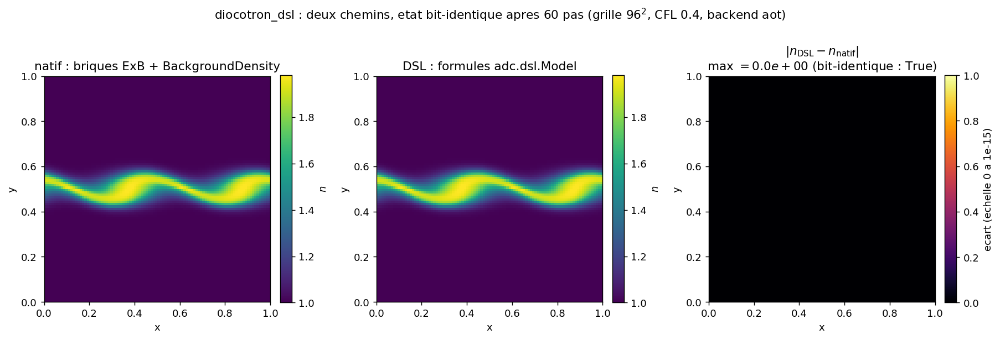

# diocotron_dsl: the diocotron written in formulas, proven bit-identical to the native build

The diocotron model (E x B drift of a scalar density, neutralizing background) written
entirely in symbolic formulas (`adc.dsl.Model`) instead of named C++ bricks, then
proven bit-identical to the native composition `adc_cases.models.diocotron` on the same grid,
the same initial condition, and the same step count. The physics is not re-derived here:
it is derived in [`../diocotron/`](../diocotron/) (instability mechanism, growth rate,
dispersion relation). This case verifies one thing only: that the DSL formulas reproduce
the conventions of the core bricks exactly, to the point where both paths produce the same
state to the bit (`np.array_equal`, no tolerance).

## Contract

| Field | Content |
|---|---|
| Category (manifest) | `validation` (`cases_manifest.toml`, `diocotron_dsl/run.py`, `ci = true`, `needs = ["cxx"]`) |
| Inputs | grid $96^2$, $L=1$, periodic; IC band mode 2 `band_density(amp=1, width=0.05, mode=2, disp=0.02)`; $B_0=1$, $\alpha=1$; ionic background $n_{i0}=\overline{n_e}=1.088623$ (mean of the IC, solvability of the periodic Poisson); 60 steps, CFL 0.4; minmod + Rusanov, SSPRK2, Poisson `geometric_mg` |
| Outputs | final density $n$ of both paths (native, DSL); selected backend; 1 figure (3 panels) in `figures/` + `figures/provenance.json` |
| Guaranteed invariants | the `assert` of `main` (in run.py): `np.array_equal(d_dsl, d_natif)` (bit); `t_dsl == t_natif` (bit); `m_dsl == m_natif` (bit); `mass_drift < 1e-6`; `amp_final > amp_initial` |
| Proves | bit equality of the full path: $\max\lvert n_{\mathrm{DSL}}-n_{\mathrm{natif}}\rvert=0.000\times10^{0}$ after 60 steps, `np.array_equal` True; time and mass identical to the bit ($t=6.213869$, $m=1.0032746734\times10^{4}$, both). The identity holds because the DSL formulas emit the same pointwise expressions as `ExBVelocity` and `BackgroundDensity` (table in section 3), compiled into the same per-cell assembler |
| Does not prove | this is not a published reproduction, nor a validation of the growth rate (that lives in [`../diocotron/`](../diocotron/), category `reproduction`). No number is checked against a paper. The bit equality proves that the DSL path does not deviate from the native path; it says nothing about the physical correctness of either (a bug common to both bricks would stay invisible). The native `production` backend (`add_native_block`) fails on this platform (ABI: `_adc` built against headers != `include/`): the nominal run goes through `aot` (host-marshaled, numerically identical to native, verified). The bit equality of the `production` path is therefore not exercised here |
| Provenance | adc_cpp `01873299`, adc_cases `a9541ba4`, backend `aot` (after `production` failure), $96^2$, ~6 s on 1 CPU core; `figures/provenance.json` |

By the end you will know: which core conventions the DSL must reproduce for the bit equality
to hold, how this equality is verified (`np.array_equal`, no tolerance), and what a non-black
difference map would reveal.

---

## 1. Physics: linked, not copied

The mechanism (charge ring/band, differential rotation, Kelvin-Helmholtz instability
of a vorticity ring, rate $\gamma_l$, dispersion relation) is derived in
[`../diocotron/`](../diocotron/README.md), sections 1, 4, and 5. Here the IC is a horizontal
band (`band_density`, azimuthal mode 2), the minimal periodic variant of the same case (see
[`../diocotron/band_instability.py`](../diocotron/band_instability.py)): no conducting wall,
periodic domain, which makes the system Poisson solvable without staircase Cartesian
geometry. The only role of the physics here is to provide a nontrivial dynamics (the amplitude
grows, asserted in `main`) on which the bit equality is meaningful: two paths that stayed identically
zero would be an empty equality.

---

## 2. The two paths, and who compiles what

The case builds the same `adc.System(n=96, L=1, periodic=True)` (`make_system` in run.py)
twice, with the same Poisson (`set_poisson(rhs="charge_density", solver="geometric_mg")`),
the same initial density, and 60 `step_cfl(0.4)` steps. Only the block differs:

| Path | Block construction | `run.py` function |
|---|---|---|
| native (oracle) | `add_block("ne", model=models.diocotron(B0, alpha, n_i0), spatial=Spatial(minmod=True), time=Explicit())` | `run_native` |
| DSL | `add_equation("ne", model=compiled, spatial=FiniteVolume(limiter="minmod", riemann="rusanov"), time=Explicit())` | `run_dsl` |

`models.diocotron` (`diocotron` in models.py) is `adc.Model(state=Scalar, transport=ExB(B0),
source=NoSource, elliptic=BackgroundDensity(alpha, n0=n_i0))`: four named C++ bricks.
`compiled` is the same model written in expressions (`diocotron_dsl_model` in run.py),
emitted as C++ by `adc.dsl`, compiled into a `.so`, and loaded as a block. For `add_equation` and
`add_block` to take the same per-cell assembler, it is enough that the DSL expressions emit
the same pointwise functions as the bricks (`flux`, `eigenvalues`, elliptic `rhs`).

### 3-layer table (who computes what, DSL path)

| `run.py` call | Layer | What happens |
|---|---|---|
| `sim.add_equation("ne", model=compiled, spatial=FiniteVolume(...), time=Explicit())` (in `run_dsl`) | Python composes | choice of scheme (MUSCL minmod + Rusanov) and integrator (SSPRK2), strictly the same as native (`Spatial(minmod=True)` in `run_native`) |
| `m.flux(...)` / `m.eigenvalues(...)` / `m.elliptic_rhs(...)` (in `diocotron_dsl_model`) compiled by `model.compile(..., backend=cand)` (in `run_dsl`) | the DSL expressions freeze the physics | the DSL emits in C++ the same pointwise expressions as `ExBVelocity` / `BackgroundDensity` (table in section 3); these expressions replace the named brick |
| `assemble_rhs<minmod, Rusanov>` + system Poisson (`GeometricMG`) | per-cell kernel (device) | the same assembler as `add_block`: `add_equation` routes to `add_native_block` (production) or `add_compiled_block` (aot), with no Python callback in the hot path |

This is the whole point of the case: the middle layer changes shape (expressions vs named brick)
without changing the result, because the bottom layer is identical.

---

## 3. The core conventions, reproduced in formulas (justifies Proves)

The bit equality holds only if each DSL expression is the exact twin of the brick's pointwise
function. Here is the correspondence, anchored in the core headers and in `run.py`.

### E x B transport (`include/adc/physics/hyperbolic.hpp`, struct `ExBVelocity`)

The native brick (`ExBVelocity` in hyperbolic.hpp) defines the drift velocity, the flux, and the spectrum:

```cpp
ADC_HD Real velocity(const Aux& a, int dir) const {            // velocity
  return (dir == 0) ? (-a.grad_y / B0) : (a.grad_x / B0);
}
f[0] = u[0] * velocity(a, dir);                                // flux
e[0] = velocity(a, dir);                                       // eigenvalue
```

The DSL formulas (`diocotron_dsl_model` in run.py) reproduce each line:

| Core convention | Brick (`hyperbolic.hpp`) | DSL formula (`run.py`) |
|---|---|---|
| velocity $v=(-\partial_y\phi/B_0,\ \partial_x\phi/B_0)$ | `velocity`: `(-grad_y/B0, grad_x/B0)` | `vx = (-grad_y)/B0`, `vy = grad_x/B0` |
| flux $f = n\,v(\mathrm{dir})$ | `flux`: `u[0]*velocity` | `m.flux(x=[n*vx], y=[n*vy])` |
| eigenvalue (1 wave) $= v(\mathrm{dir})$ | `eigenvalues`: `velocity` | `m.eigenvalues(x=[vx], y=[vy])` |
| single conservative variable $n$ (Density role), prim = cons | `conservative_vars`/`to_primitive`: identity | `m.conservative_vars("n")`, `m.primitive_vars(n=n)`, `m.conservative_from([n])` |

The auxiliary fields `phi`/`grad_x`/`grad_y` read by the flux are declared on the DSL side by
`m.aux("phi")`, `m.aux("grad_x")`, `m.aux("grad_y")` (in `diocotron_dsl_model`): they name the slots
of the `adc::Aux` channel that the core fills with the potential and its gradient, the same members
`a.grad_x`/`a.grad_y` that `velocity` reads (in hyperbolic.hpp). `phi` is declared to complete the
contract, but the flux reads only the gradient (`velocity` uses only `grad_x`/`grad_y`), exactly
like the brick.

### Elliptic right-hand side (`include/adc/physics/elliptic.hpp`, struct `BackgroundDensity`)

```cpp
ADC_HD Real rhs(const State& u) const { return alpha * (u[0] - n0); }   // rhs
```

DSL formula (`m.elliptic_rhs` in `diocotron_dsl_model`): `m.elliptic_rhs(ALPHA * (n - n_i0))`. Same expression
$\alpha\,(n - n_{i0})$, same role (neutralizing background, RHS with zero mean over a periodic
domain thanks to the choice $n_{i0}=\overline{n_e}$, in `main`). The block couples to the system
Poisson via `set_poisson(rhs="charge_density")` (in `run_dsl`), the generic alias for the sum of the
elliptic right-hand sides of each block (here the single `elliptic_rhs`).

### Source

`models.diocotron` uses `adc.NoSource`; on the DSL side, `diocotron_dsl_model` calls no
`m.source(...)`, which `m.check()` (in `diocotron_dsl_model`) accepts (source optional). No source
term on either side. `m.check()` verifies that every variable referenced by
`flux`/`eigenvalues`/`elliptic_rhs` is declared (conservative or aux): this is the safeguard that
prevents emitting C++ referencing a phantom symbol.

---

## 4. How the bit equality is verified, and what a divergence would reveal

`main` (in run.py) runs both paths on the same configuration and compares the final state:

```python
dn, tn, mn = run_native(ne0, n_i0, n_steps)                    # native oracle
dd, td, md, backend = run_dsl(ne0, n_i0, n_steps)              # DSL path
max_abs = float(np.max(np.abs(dd - dn)))
identical = bool(np.array_equal(dd, dn))
assert identical, "...une formule DSL diverge d'une brique du coeur..."
```

- `np.array_equal(dd, dn)` requires element-by-element equality to the bit: no tolerance, no
  `isclose`. This is the right observable for this case: both paths execute the same floating-point
  assembler in the same order of operations, so any nonzero difference would signal that the emitted
  expressions differ (a sign convention, a missing $1/B_0$ factor, a forgotten $n_{i0}$), not
  mere rounding noise.
- `assert td == tn` and `assert md == mn` (both in `main`) also lock time
  and mass to the bit: the DSL must not only finish in the same state, but reach it by the same
  sequence of steps (same `step_cfl`, same `dt` at each step).
- What a divergence would reveal: if a single element of `dd - dn` were nonzero, the cause
  would be a DSL formula deviating from a core brick. Target examples: `vx = grad_y/B0` (sign
  inverted from `velocity`), `vy = grad_x` (omitted $1/B_0$ factor), or `elliptic_rhs(ALPHA*n)`
  (forgotten background $n_{i0}$, which would break the zero mean of the periodic RHS). Each would
  shift the state and make a spot appear on the map in section 5.

The mass is then checked in the absolute for the DSL path only: `mass_drift = relative_drift(
md, mass0)` then `assert mass_drift < 1e-6` (in `main`). The tolerance $10^{-6}$ is loose: the
measured drift is $1.813\times10^{-16}$ (provenance), at machine level, because the E x B flux is
divergence-free (exact conservation up to floating point). It bounds the mass far from the signal
without requiring bit equality (already covered by `md == mn`).

---

## 5. Figures (generated by `make_figures.py`, in `figures/`)

Generated by `python make_figures.py` (same configuration as `run.py`), versioned with
`figures/provenance.json`. Exact command in section 6.

### `equivalence_heatmap.png`: three panels (native, DSL, difference)



We show both fields (panels 1 and 2) then their difference (panel 3), rather than a
lone black square that would look empty or broken.

- Proven / visible: the native and DSL panels are the same wavy band (azimuthal mode 2,
  two troughs), density from $1.0$ to $\approx 1.98$ ($\sigma\approx 0.23$, so a structured field,
  not uniform). The third panel ($\lvert n_{\mathrm{DSL}}-n_{\mathrm{natif}}\rvert$, fixed scale
  $[0,\,10^{-15}]$) is identically black: $\max=0.0\times10^{0}$, `np.array_equal` True
  (asserted in `main`). The machine-level scale guarantees that a single different pixel
  would stand out; there is none. The residual is not "small", it is exactly zero: the same
  array bit for bit.
- Suggested (not asserted): the mode amplitude grew by a factor $1.5212$ ($amp_{0}=6.778\times
  10^{-2}\to amp_{final}=1.031\times10^{-1}$, in `main`); only $amp_{final}>amp_{0}$ is
  asserted (in `main`). The nonlinear rollup phase is not reached in 60 steps.
- Not shown: the bit equality says nothing about physical correctness. A bug present in
  `ExBVelocity` and faithfully reproduced by the DSL formula would also give a black map. It
  proves the DSL/native non-deviation, not the correctness of the model (validated elsewhere,
  [`../diocotron/`](../diocotron/)).

---

## 6. Reproduce (justifies item 14 of the checklist: command + measured cost)

```bash
cd /private/tmp/adc_cases-deeptut/diocotron_dsl
PYTHONPATH=/Users/romaindespoulain/Documents/Stage_Romain/adc_cpp/build-master/python:/private/tmp/adc_cases-deeptut \
  /opt/homebrew/anaconda3/bin/python3.12 run.py            # the case: asserts, ~6 s (compiles the .so on the 1st run)
PYTHONPATH=/Users/romaindespoulain/Documents/Stage_Romain/adc_cpp/build-master/python:/private/tmp/adc_cases-deeptut \
  /opt/homebrew/anaconda3/bin/python3.12 make_figures.py   # 2 figures + provenance.json
```

Prerequisites: `numpy`, a C++20 compiler (`needs = ["cxx"]`: the DSL emits and compiles a `.so`),
and the `adc` module imported with the same interpreter that compiled it (ABI suffix
`cpython-312`). The DSL `.so` is written under `out/diocotron_dsl/` via `case_output_dir`
(in `run_dsl`), a git-ignored directory: no throwaway artifact in the source tree.

Expected output of `run.py` (captured, macOS arm64 dev machine):

```text
backend 'production' indisponible (RuntimeError), essai suivant
backend DSL retenu : 'aot'
natif : t = 6.213869, masse = 1.0032746734e+04
DSL   : t = 6.213869, masse = 1.0032746734e+04
max|DSL - natif| = 0.000e+00   bit-identique = True
amplitude : initiale 6.777566e-02 -> finale 1.031025e-01 (facteur 1.5212)
derive de masse relative (DSL) = 1.813e-16
OK diocotron_dsl (equivalence DSL <-> natif bit-identique, backend 'aot')
```

The native `production` backend fails here on an ABI key: `_adc` was built against headers
different from `include/` (in `run_dsl`), so `model.compile(backend="production")` then
`add_native_block` raise an explicit `RuntimeError` (never silent UB). The `try`/`except` of the
`for cand in ("production", "aot")` loop (in `run_dsl`) then replays everything in `aot`
(`add_compiled_block`, host-marshaled, numerically identical to native): this is the path the
nominal run exercises. Platform caveat: the `OK` verdict, the bit equality ($\max=0$), and the order
of magnitude (time $\approx 6.2$, mass $\approx 10^{4}$) are stable; the selected backend depends on
the ABI compatibility of the loaded `_adc` module (`production` when `_adc` is built against
`include/`, `aot` otherwise), and the last digits of $t$/mass vary with the BLAS and the summation
order (see `figures/provenance.json`). On a `production`-compatible module, the run would take the
native path and the `add_native_block` bit equality would then be exercised.

## File map

| File | Role |
|---|---|
| `run.py` | both paths (native vs DSL), bit equality by `assert` (`np.array_equal`, time, mass) |
| `make_figures.py` | replays the config, writes `equivalence_heatmap.png` (3 panels) + `provenance.json` |
| `figures/equivalence_heatmap.png` | 3 panels: native density, DSL density, difference (black, max 0) |
| `figures/provenance.json` | adc_cpp/adc_cases SHA, backend, resolution, $\max\lvert d\rvert$, time, masses, amplitude |
| [`../diocotron/`](../diocotron/) | parent physics: mechanism, rate $\gamma_l$, dispersion relation (not copied here) |
| `adc_cpp/include/adc/physics/hyperbolic.hpp` | `ExBVelocity` brick reproduced by the DSL formulas |
| `adc_cpp/include/adc/physics/elliptic.hpp` | `BackgroundDensity` brick reproduced by `elliptic_rhs` |
