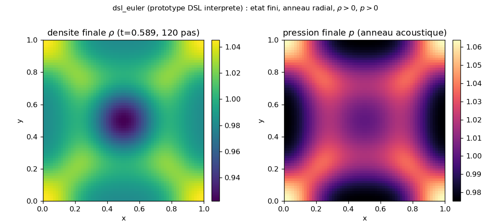
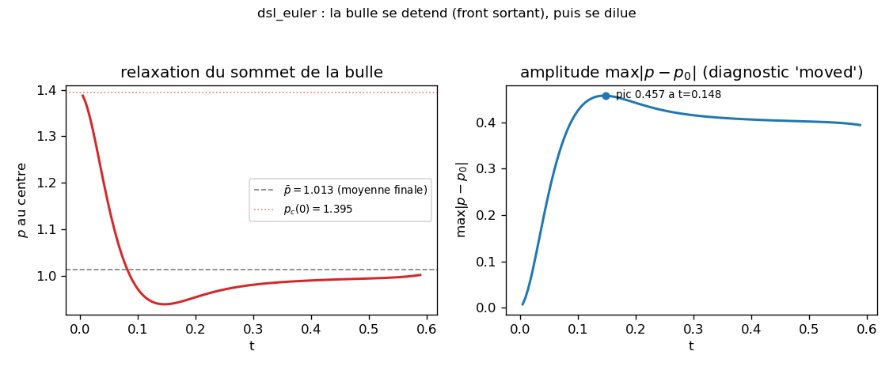

# dsl_euler : Euler 2D ecrit en formules (mini-DSL adc.dsl, backend interprete numpy)

Prototype declaratif : on declare le systeme d'Euler compressible 2D entierement en expressions
symboliques (variables, primitives, flux, valeurs propres), `adc.dsl` interprete l'arbre en numpy, et
le branche sur le backend hote `adc.PythonFlux` qui assemble $-\nabla\cdot F^*$ par volumes finis
(Rusanov ordre 1, periodique). Aucune brique nommee, aucune compilation : ce cas est le seul `*_dsl`
du manifeste qui n'emet pas de C++ et ne se compare pas au natif. Une bulle de surpression centrale
se detend ; le cas verifie un etat fini et coherent, pas un nombre cible.

## Contrat

| Champ | Contenu |
|---|---|
| Categorie (manifeste) | `experimental` (`cases_manifest.toml`, `dsl_euler/run.py`, `ci = false`, `needs = []`). Prototype interprete CPU, hors CI par prudence. |
| Entrees | grille $64^2$, $L=1$, periodique ; CI gaz au repos $\rho=1$, $v=0$, bulle gaussienne $p=1+0.4\,e^{-r^2/0.01}$ centree, $E=p/(\gamma-1)$ ; $\gamma=1.4$ ; schema Rusanov ordre 1 + Euler avant, CFL $0.4$, 120 pas (dt reevalue par pas) |
| Sorties | etat $(4,n,n)=[\rho,\rho u,\rho v,E]$ en memoire numpy ; diagnostics console `drho_max`, `|v|_max`, `drel`, `max|dp|` ; 2 figures dans `figures/` + `figures/provenance.json` (ecrites par `make_figures.py`, pas par `run.py`) |
| Invariants garantis | les 4 `assert` de `run.py:90-93` : `assert_finite(U)` ; `U[0].min()>0 and pressure(U).min()>0` ; `drel < 1e-9` ; `moved > 1e-3` |
| Prouve | l'arbre symbolique declare en formules produit un etat fini, positif ($\rho_{\min}=0.9222>0$, $p_{\min}=0.9752>0$) et non trivial (la bulle se detend : `moved`$=0.3939 \gg 10^{-3}$) ; la masse est conservee exactement (`drel`$=0.0$, bit-machine, flux conservatif + `np.roll` periodique) |
| Ne prouve pas | prototype, pas production : backend numpy interprete (`PythonFlux`), pas de chemin compile, pas de GPU/MPI/AMR. Aucune egalite au natif n'est verifiee ici (`np.array_equal` absent) : c'est le seul `*_dsl` qui ne compile pas et ne se compare pas (voir [`diocotron_dsl`](../diocotron_dsl/)). Schema ordre 1 dissipatif : energie et impulsion non asserees, fronts etales. Aucune cible publiee, aucune tolerance sur une valeur physique. Hors CI |
| Provenance | adc_cpp `01873299`, adc_cases `1affec1d`, backend interprete numpy, $64^2$, ~0.2-0.4 s 1 coeur CPU ; `figures/provenance.json` |

A la fin tu sauras : ce que "ecrire un modele en formules" veut dire concretement (les 7 lignes de
`make_euler`), comment l'arbre est interprete en numpy (pas compile), pourquoi la masse est
conservee bit-machine, ce que la bulle qui se detend prouve et ne prouve pas, et exactement ce qui
manque pour promouvoir ce prototype au statut des autres `*_dsl`.

---

## 1. Ce que ce cas declare (justifie Prouve : etat fini et coherent)

Pas de derivation de l'Euler-Poisson : c'est de l'Euler compressible pur (ni source ni Poisson ;
`set_source`/`set_elliptic_rhs` ne sont jamais appeles, donc `source_value` rend des zeros,
`dsl.py:484-489`). Le contenu du cas est la declaration elle-meme. `make_euler` (`run.py:34-52`)
ecrit le systeme entier en expressions symboliques :

```python
e = dsl.HyperbolicModel("euler")                                       # run.py:36
rho, rhou, rhov, E = e.conservative_vars("rho","rho_u","rho_v","E")     # run.py:37 -> 4 noeuds Var(cons)
u = e.primitive("u", rhou / rho)                                       # run.py:39 primitive = noeud Expr
v = e.primitive("v", rhov / rho)                                       # run.py:40
p = e.primitive("p", (GAMMA-1.0)*(E - 0.5*rho*(u*u+v*v)))              # run.py:41 EOS gaz parfait
H = (E + p) / rho                                                      # run.py:43 enthalpie totale (Expr pur Python)
c = dsl.sqrt(GAMMA * p / rho)                                          # run.py:44 vitesse du son (noeud Sqrt)
e.set_flux(x=[rhou, rhou*u+p, rhou*v, rho*H*u],                        # run.py:46-49 F_x : 4 composantes
           y=[rhov, rhov*u, rhov*v+p, rho*H*v])                       #              F_y : 4 composantes
e.set_eigenvalues(x=[u-c, u, u+c], y=[v-c, v, v+c])                    # run.py:50 vitesses caracteristiques
e.check()                                                             # run.py:51 toute var referencee declaree ?
```

- Chaque `/`, `*`, `-`, `+` construit un noeud d'arbre (`Div`, `Mul`, `Sub`, `Add` ; surcharge
  d'operateurs sur `Expr`). `u`, `v`, `p` sont enregistrees comme primitives (`primitive`,
  `dsl.py:419-422`) : a l'evaluation elles sont derivees depuis `U` dans l'ordre de dependance
  (`_env`, `dsl.py:462-470`). `H` et `c` sont des sous-arbres reutilises, pas des primitives nommees.
- `check()` (`dsl.py:500-517`) verifie que toute variable utilisee dans flux / valeurs propres /
  primitives est declaree comme cons/prim/aux ; sinon `ValueError`. C'est la seule validation
  statique : il n'y a pas de compilateur derriere, l'arbre est la specification.

Les equations correspondantes (forme conservative, $U=(\rho,\rho u,\rho v,E)$, $p=(\gamma-1)(E-\tfrac12\rho|v|^2)$,
$H=(E+p)/\rho$, $c=\sqrt{\gamma p/\rho}$) :

$$F_x=(\rho u,\ \rho u^2+p,\ \rho u v,\ \rho H u),\quad F_y=(\rho v,\ \rho u v,\ \rho v^2+p,\ \rho H v),$$
$$\lambda_x=\{u-c,\ u,\ u+c\},\quad \lambda_y=\{v-c,\ v,\ v+c\}.$$

## 2. Qui calcule quoi : la couche du milieu est l'arbre, pas une brique

Pour un cas DSL, la couche centrale n'est pas une brique C++ nommee : ce sont les expressions que
`adc.dsl` interprete. Ici, troisieme couche = numpy hote (pas un kernel device).

| Ligne `run.py` | Couche | Ce qui se passe |
|---|---|---|
| `for _ in range(120): U = U + pf.cfl_dt(U,h,0.4)*pf.residual(U,h)` (`run.py:79-80`) | Python compose et integre | choix du schema (Rusanov ordre 1), de l'integrateur (Euler avant), du pas (CFL 0.4 reevalue par pas) |
| `e.set_flux(...)` / `e.set_eigenvalues(...)` -> `HyperbolicModel.flux` / `.max_wave_speed` (`dsl.py:472-482`) | arbre interprete | `Expr.eval(env)` evalue $F_x,F_y,\lambda$ en numpy sur tout le tableau ; aucun C++ |
| `adc.PythonFlux.residual` (`__init__.py:1263-1275`) | noyau hote numpy | assemble $-\nabla\cdot F^*$ (Rusanov, `np.roll` periodique) ; pas de device, pas de MPI |

Contraste avec la couche du milieu des autres `*_dsl` : eux appellent `emit_cpp_brick` /
`emit_cpp_source` -> `add_compiled_model` (`dsl.py:560-806`), donc la couche du milieu devient une
brique C++ generee branchee sur `assemble_rhs` device. Ici `to_python_flux` (`run.py:77`,
`dsl.py:491-498`) court-circuite tout cela : l'arbre alimente directement `PythonFlux`.

## 3. Le schema, ligne par ligne (justifie Prouve : masse conservee bit-machine)

`PythonFlux.residual` (`__init__.py:1263-1275`) assemble le flux de Rusanov (Lax-Friedrichs local) :

```python
a = float(self.max_wave_speed(U))                    # une vitesse globale a = max_k max_cell |lambda_k|
for axis, h, d in ((2, dx, 0), (1, dy, 1)):          # x = axe 2, y = axe 1 du tableau numpy
    F  = self.flux(U, d)                             # F_x ou F_y via l'arbre interprete
    UR = np.roll(U, -1, axis=axis)                   # voisin +d (periodicite par decalage circulaire)
    face = 0.5*(F + np.roll(F,-1,axis=axis)) - 0.5*a*(UR - U)   # flux a la face +d
    res -= (face - np.roll(face,1,axis=axis)) / h    # -div : (F_{i+1/2} - F_{i-1/2}) / h
```

- `a` est une seule vitesse globale ($\max$ sur les deux directions, `to_python_flux`,
  `dsl.py:498`), recalculee a chaque appel : diffusion maximale, schema le plus simple. Pas de MUSCL,
  pas de limiteur, ordre 1.
- Masse conservee exactement. La premiere composante du flux est $\rho u$ / $\rho v$ (forme
  conservative), et `np.roll` est une permutation circulaire : la somme telescopique de
  `face - roll(face)` sur un axe periodique est identiquement nulle ligne a ligne. La masse
  totale $\sum\rho$ ne bouge donc qu'a l'arrondi flottant ; mesure : `drel`$=0.0$ (les flux de bord
  s'annulent par construction, aucune erreur d'arrondi residuelle a $64^2$). C'est la raison de
  `TOL_MASS`$=10^{-9}$ (`run.py:92`) : borne haute = un schema conservatif ne doit pas deriver au-dela
  du bruit machine ; mesure $0.0$, soit largement sous la tolerance.
- `assert moved > 1e-3` (`run.py:93`, `moved`$=$`max|p - p_init|`, `run.py:83`) : borne basse a
  $10^{-3}$, trois ordres sous la magnitude attendue ($p$ varie de $\approx 0.4$) ; elle rejette un
  etat fige (rien ne bouge) sans rejeter la dynamique reelle. Mesure : `moved`$=0.3939$.

## 4. Conditions initiales (justifie : la bulle qui se detend)

`run.py:63-72` : grille $64^2$ periodique, gaz au repos, surpression gaussienne centree.

```python
r2 = (gx - 0.5)**2 + (gy - 0.5)**2                   # run.py:66
p0 = 1.0 + 0.4*np.exp(-r2 / 0.01)                    # run.py:69 bulle +40%, ecart-type ~0.07
U[0] = 1.0;  U[3] = p0 / (GAMMA - 1.0)               # run.py:71-72 rho=1, v=0, E = p/(gamma-1) (repos)
```

Densite uniforme, vitesses nulles, pression au sommet $1.4$ (cellule centrale : $p_c(0)=1.395$). La
detente de cette bulle est ce qui met le systeme en mouvement et genere l'onde acoustique radiale.

## 5. Figures (generees par `make_figures.py`, dans `figures/`)

Figures de diagnostic d'un prototype, pas un asset de reproduction versionne (categorie
`experimental`) : elles montrent que l'etat est fini/coherent et que la bulle se detend, pas une
courbe d'article. Commande exacte en section 7.

### `final_state.png` : carte de densite et de pression finales



- **Prouve** (asserte `run.py:90-91`) : l'etat final est fini et positif sur tout le domaine :
  $\rho\in[0.9222,1.0452]$, $p\in[0.9752,1.0638]$, aucun NaN/Inf. Le coeur s'est rarefie
  ($\rho\approx 0.94$ au centre : la bulle s'est videe), entoure d'un anneau radial sortant.
- **Suggéré** (non assere) : la signature acoustique (front radial qui s'eloigne du centre) est
  visible mais aucun assert ne la mesure ; le motif en croix est l'interference de l'onde avec
  ses images periodiques (domaine periodique + bulle alignee sur la grille), pas un artefact de bug.
- **Non montré** : aucune comparaison a une solution de reference (Sedov, onde de souffle
  analytique) ; l'ordre 1 dissipatif etale les fronts, la carte n'est pas calibree quantitativement.

### `bubble_decay.png` : decroissance de la perturbation



- **Prouve / mesure** : la bulle se detend : la pression au sommet chute de $p_c(0)=1.395$, passe
  sous la moyenne ($\bar p=1.013$ : rebond de rarefaction a $t\approx 0.15$), puis remonte vers
  $1.001$ a $t=0.589$. L'amplitude $\max|p-p_0|$ croit, culmine a $0.457$ a $t=0.148$ (le front
  est constitue), puis decroit vers la valeur asseree `moved`$=0.394$. C'est la "decroissance d'une
  perturbation" : le pic localise se dilue en onde etalee.
- **Suggéré** : la relaxation monotone vers $\bar p$ apres le rebond suggere un amortissement
  numerique (diffusion de Rusanov), non quantifie.
- **Non montré** : ni periode acoustique exacte, ni taux d'amortissement physique ; le schema ordre 1
  dissipe, le cas ne separe pas amortissement physique et numerique.

## 6. Ce qui manque pour promouvoir ce prototype (limites)

- **Pas de chemin compile.** Les autres `*_dsl` ([`diocotron_dsl`](../diocotron_dsl/),
  [`two_species_dsl`](../two_species_dsl/), [`magnetic_isothermal_dsl`](../magnetic_isothermal_dsl/))
  appellent `emit_cpp_brick`/`add_compiled_model` et asserent `np.array_equal` contre le natif.
  Ce cas s'arrete a `to_python_flux` : il ne genere pas de C++ et ne se compare a rien. Pour le
  promouvoir, il faudrait emettre la brique (`make_euler().emit_cpp_brick(...)`), la compiler, et
  ajouter l'assert d'egalite au natif (`adc.CompressibleFlux`, dispo via
  [`models.euler`](../adc_cases/models.py) `l.58-66`).
- **Backend numpy hote, pas device.** `PythonFlux` est documente "hors hot path GPU/MPI : chemin
  hote pur" (`__init__.py:1250`). Pas de GPU, pas de MPI, pas de multi-box/AMR ; tableau unique
  $(4,64,64)$.
- **Schema ordre 1 dissipatif.** Rusanov + Euler avant : energie et impulsion non conservees et
  non asserees (seules masse, positivite, finitude, dynamique le sont). Adapte a une demo
  qualitative, pas a une etude acoustique quantitative.
- **Aucune reference publiee, geometrie figee.** $64^2$ periodique en dur, pas d'argument cli, aucune
  cible d'article (d'ou `experimental`, pas `reproduction`). Pour le couplage source/Poisson en DSL,
  voir les cas dedies ci-dessus.

## 7. Reproduire (justifie : commande exacte + cout mesure)

```bash
cd /private/tmp/adc_cases-deeptut/dsl_euler
PYTHONPATH=/Users/romaindespoulain/Documents/Stage_Romain/adc_cpp/build-master/python:/private/tmp/adc_cases-deeptut \
  /opt/homebrew/anaconda3/bin/python3.12 run.py            # le cas : 4 asserts, ~0.2-0.4 s
PYTHONPATH=/Users/romaindespoulain/Documents/Stage_Romain/adc_cpp/build-master/python:/private/tmp/adc_cases-deeptut \
  /opt/homebrew/anaconda3/bin/python3.12 make_figures.py   # 2 figures + provenance.json
```

Prerequis : `numpy` (`matplotlib` pour les figures, hors `needs` du cas) ; module `adc` importe avec
le meme interpreteur que celui qui l'a compile (suffixe ABI `cpython-312`). Le premier chemin du
`PYTHONPATH` fournit `adc` (dont `dsl` et `PythonFlux`) ; le second rend `adc_cases` importable (le
cas a aussi un fallback `sys.path`, `run.py:21-26`). Aucun compilateur C++ requis (`needs = []`),
c'est la difference clef avec les autres `*_dsl` (`needs = ["cxx"]`).

Sortie attendue de `run.py` (capturee, macOS arm64, identique sur 3 executions) :

```
modele declare en formules : 4 variables ['rho', 'rho_u', 'rho_v', 'E']
apres 120 pas : drho_max=0.123  |v|_max=0.027
masse : drel=0.00e+00   dynamique : max|dp|=0.394
OK dsl_euler
```

Cout : ~0.2-0.4 s temps mur (dominee par l'import du package `adc` / chargement du `.so` ; le calcul
pur 120 pas a $64^2$ est negligeable), ~44 Mo de pic memoire, mono-thread numpy. Caveat
plateforme : la masse exactement nulle (`drel`$=0.0$), le verdict `OK`, l'ordre de grandeur de
`moved`$\approx 0.39$ et de $|v|_{\max}\approx 0.03$ sont stables ; les derniers chiffres peuvent
varier avec la version numpy et l'ordre de sommation (cf. `figures/provenance.json`).

## Carte des fichiers

| Fichier | Role |
|---|---|
| `run.py` | le cas : declare Euler en formules (`make_euler`), CI bulle, 120 pas, 4 asserts |
| `make_figures.py` | re-joue la physique en instrumentant ; ecrit les 2 figures + `provenance.json` |
| `figures/final_state.png`, `figures/bubble_decay.png` | diagnostics du prototype (carte finale, relaxation) |
| `figures/provenance.json` | SHA adc_cpp/adc_cases, backend, resolution, nombres mesures |
| `<build>/python/adc/dsl.py` | `HyperbolicModel` (arbre, interprete numpy, `to_python_flux`), `sqrt` ; fourni par le build adc_cpp |
| `<build>/python/adc/__init__.py` | facade `adc` ; `PythonFlux` (Rusanov + periodicite `np.roll` + `residual`/`cfl_dt`) |
| `../adc_cases/models.py` | `euler(gamma)` = brique native `adc.CompressibleFlux` (le pendant compile, `l.58-66`) |
