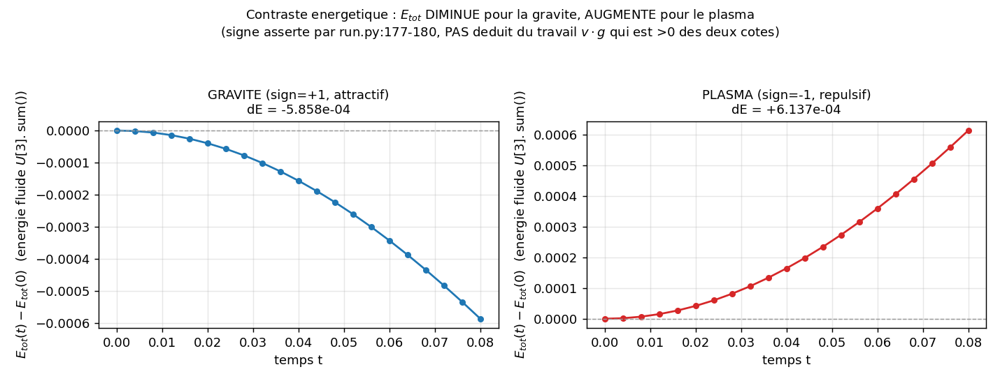
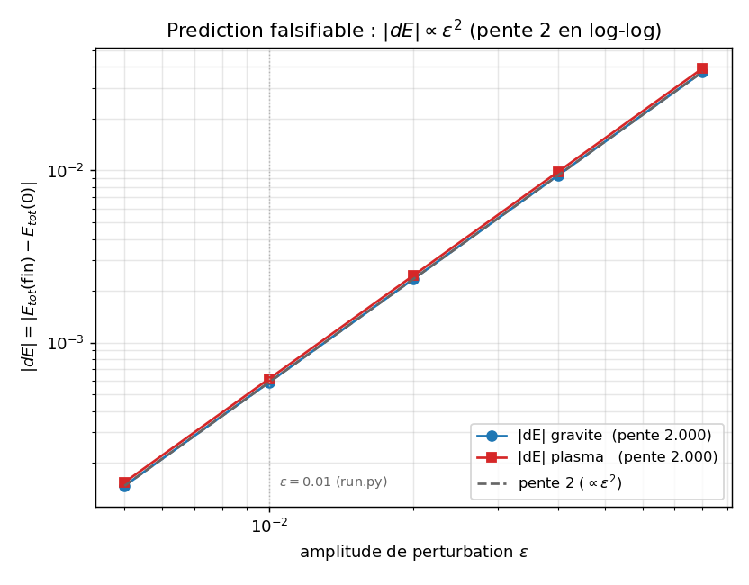
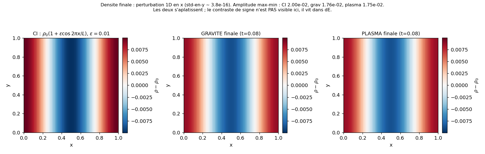

# euler_poisson: compressible Euler coupled to Poisson, attractive vs repulsive

Two 2D Euler-Poisson runs that are identical up to the sign of the coupling: `sign=+1` (self-gravity,
attractive) and `sign=-1` (space charge, repulsive). The case checks with `assert` three structural
invariants (mass conserved, net momentum zero, energy drifts of opposite signs) and exposes a
falsifiable prediction from the linearization: the energy drift follows $|dE|\propto\epsilon^2$.
This is not a reproduction of a published result.

## Contract

| Field | Content |
|---|---|
| Category (manifest) | `validation` (`cases_manifest.toml`, `euler_poisson/run.py`, `ci = true`, `needs = []`) |
| Inputs | grid $64^2$, $L=1$, periodic; IC $\rho=\rho_0(1+\epsilon\cos(2\pi x/L))$, $\epsilon=0.01$, at rest ($v=0$, $E=\rho/(\gamma-1)$); $\gamma=1.4$, $\rho_0=1$, $4\pi G=1$ (dimensionless), $dt=0.004$, 20 steps; van Leer + HLLC + SSPRK2, Poisson `geometric_mg` |
| Outputs | state `(4,n,n)=[\rho,\rho u,\rho v,E]` read by `get_state("gas")`; global diagnostics $E_{tot}=U[3].\mathrm{sum}()$, $p_x=U[1].\mathrm{sum}()$, $p_y=U[2].\mathrm{sum}()$; 3 figures in `figures/` + `figures/provenance.json` |
| Guaranteed invariants | the 3 `assert` in `run.py`: mass `max_rel_mass < TOL_MASS=1e-9`; momentum `max_mom < TOL_MOM=1e-8`; contrast `assert_opposite_sign(dE_grav, dE_plas, min_mag=TOL_DE=1e-5)` then `dE_grav<0` and `dE_plas>0` (`main` in run.py) |
| Proves | mass conserved to $2.6\times10^{-14}$ relative (both runs); net momentum $8.9\times10^{-16}$; $dE_{grav}=-5.857667\times10^{-4}<0$ and $dE_{plas}=+6.137105\times10^{-4}>0$ (opposite signs, magnitude $\gg$ TOL_DE); the $|dE|$ vs $\epsilon$ slope equals 2.000 (figure 2) |
| Does not prove | not a published reproduction: no number is compared against a paper (neither Jeans collapse nor a plasma benchmark). The physical sign of $dE$ is not deducible from the work $\int\rho\,v\cdot g$ (which is positive on both sides, section 4.3): you read it off the assert that passes. $E_{tot}=U[3].\mathrm{sum}()$ is the fluid energy alone (without the field potential), a sign proxy, not a calibrated physical integral. Quasi-linear regime ($\epsilon=0.01$, 20 steps): no nonlinear dynamics |
| Provenance | adc_cpp `01873299`, adc_cases `7c7a3403`, native serial backend, $64^2$, ~0.3 s on 1 CPU core; `figures/provenance.json` |

By the end you will know: why the same code yields two opposite signs of $dE$ (the mechanism), why
the work of the force is not enough to predict that sign (the fluid-energy paradox), what the
testable quantitative prediction is ($|dE|\propto\epsilon^2$), and what each assert actually
establishes.

---

## 1. The physical mechanism (justifies Proves: sign contrast)

A compressible fluid at rest, with density $\rho=\rho_0(1+\epsilon\cos kx)$ where $k=2\pi/L$, creates
its own force field through Poisson. Three chained ingredients:

1. Self-field. The density perturbation solves the system Poisson equation
   $\nabla^2\phi = \mathrm{sign}\cdot 4\pi G\,(\rho-\rho_0)$ (brick `GravityCoupling`). The
   background $\rho_0$ makes the right-hand side zero-mean, the compatibility condition of the
   periodic Laplacian.
2. Force. The fluid feels $g=-\nabla\phi$ (brick `GravityForce`), which pushes the momentum:
   $\partial_t(\rho v)=\dots+\rho g$.
3. Opposite response by sign. For gravity ($\mathrm{sign}=+1$), the overdensity digs a potential
   well and $g$ points toward the crest (attractive). For the plasma ($\mathrm{sign}=-1$), the
   right-hand side flips sign, $\phi$ inverts, and $g$ points away from the crest (repulsive). The
   two runs start from the same state at rest; only the sign of the coupling separates them.

What this mechanism does not tell on its own: which way the fluid energy $E_{tot}$ goes. Section 4
shows that the work of the force is positive on both sides, and that the sign of $dE_{tot}$ comes
from another channel (compression/expansion). That is why the case measures and asserts the sign
instead of deriving it from a textbook formula.

The reduced system here is the unmagnetized electrostatic Euler-Poisson; the full magnetized system
(Lorentz force, Schur stage) is handled by
[`hoffart_euler_poisson_dsl`](../hoffart_euler_poisson_dsl/). This case does not cover the magnetic
coupling.

---

## 2. The equations and who computes them (justifies: the physics is frozen in C++)

Conservative state per cell, 4 components: $U=(\rho,\rho u,\rho v,E)$.

| Block | Equation | `adc` brick |
|---|---|---|
| Transport | $\partial_t\rho+\nabla\cdot(\rho v)=0$, $\partial_t(\rho v)+\nabla\cdot(\rho v\otimes v+pI)=\rho g$, $\partial_t E+\nabla\cdot((E+p)v)=\rho\,v\cdot g$ | `CompressibleFlux` |
| State / EOS | $p=(\gamma-1)(E-\tfrac12\rho|v|^2)$, $\gamma=1.4$ | `FluidState(kind="compressible")` |
| Source | $g=-\nabla\phi$; $s[1]=\rho g_x$, $s[2]=\rho g_y$, $s[3]=\rho_u g_x+\rho_v g_y$ | `GravityForce` |
| Elliptic | $\nabla^2\phi=\mathrm{sign}\cdot 4\pi G\,(\rho-\rho_0)$ | `GravityCoupling(sign, four_pi_G, rho0)` |

It is `adc_cases.models.euler_poisson(sign, gamma, four_pi_G, rho0)` (`euler_poisson` in models.py), a
composition `adc.Model(state, transport, source, elliptic)`. The word "euler_poisson" lives in
`adc_cases`; on the core side these are four generic bricks.

A 3-layer "who computes what" table, each row pinned to a real symbol:

| `run.py` symbol | Layer | What happens |
|---|---|---|
| `sim.add_block("gas", model=..., spatial=adc.Spatial(vanleer=True, flux="hllc"), time=adc.Explicit())` (`run_case` in run.py) | Python composes | choice of model, scheme (MUSCL van Leer + HLLC), integrator (SSPRK2) |
| `models.euler_poisson(sign=...)` -> `GravityForce` (in source.hpp) / `GravityCoupling` (in elliptic.hpp) | C++ brick freezes | the exact formula of the force ($g=-\nabla\phi$, work on the 4-variable energy) and of the right-hand side ($\mathrm{sign}\cdot 4\pi G(\rho-\rho_0)$) |
| `assemble_rhs<VanLeer, HLLC>` + system Poisson (`GeometricMG`) (`set_poisson(...)` in `run_case`, run.py) | per-cell kernel (device) | the actual computation, with no Python callback in the hot path |

The native/electrostatic distinction: `euler_poisson` uses `GravityForce`+`GravityCoupling` (sign
carried by the elliptic brick), not `PotentialForce`+`ChargeDensity` (sign carried by the charge
$q$, used by `electron_euler`/`ion_isothermal` in `models.py`). Both families take the same
numerical path on the core side (generic sum of the elliptic bricks); only the right-hand side
differs.

---

## 3. The effective sign chain, line by line (justifies item 7 of the checklist: sign by behavior)

The guide forbids writing "$-\nabla^2\phi=+4\pi G(\rho-\rho_0)$ therefore attractive" without
checking: the Poisson solver has several sign layers. Here is the effective chain, as coded:

1. Poisson operator: `poisson_operator.hpp` solves $\nabla^2\phi=f$ (the stencil writes
   $\mathrm{lap}=\sum/dx^2$ without a factor, $\varepsilon=1$, see `EllipticProblem::eps` in elliptic_problem.hpp). So
   $f>0$ tends to make $\phi$ convex (a local minimum).
2. Right-hand side: `GravityCoupling::rhs` returns `sign * four_pi_G * (u[0] - rho0)`
   (in elliptic.hpp). For gravity ($\mathrm{sign}=+1$), an overdensity ($\rho>\rho_0$) gives
   $f>0$, so $\phi$ has a well under the crest.
3. Field storage: the coupler stores $aux=(\phi,+\partial_x\phi,+\partial_y\phi)$, convention
   `GradSign::Plus` (in elliptic_problem.hpp). That is, `aux.grad_x = +d\phi/dx`.
4. Force: `GravityForce::apply` sets `gx = -a.grad_x` (in source.hpp), i.e. $g=-\nabla\phi$. Under
   the crest (well of $\phi$), $g$ points toward the crest: attractive.

This chain gives the expected sign, but it stacks 4 conventions; you do not rely on it as proof. The
reference is the assert that passes in `main` (run.py): it requires `dE_grav < 0` and
`dE_plas > 0`, and the run prints `OK` (section 6). That is the physical sign of the case, not the
derivation above, which only serves to show that the code is consistent.

---

## 4. Math: why the sign of $dE$ is not read off the work (justifies Does not prove)

### 4.1 What $E_{tot}$ really is

`energy_and_momentum` in run.py: `E_tot = U[3].sum()`. Component 3 of the state is the total fluid energy
$E=\tfrac12\rho|v|^2+\dfrac{p}{\gamma-1}$ (kinetic + internal). It does not include the field
potential energy $\tfrac12\int\rho\phi$. So $E_{tot}$ is not a conserved quantity of the coupled
system: it is the energy of one of the two reservoirs (the fluid), and the field can give energy to
it or take energy from it. Measured at $t=0$ (at rest): $E_{tot}=1.024\times10^4$, purely internal
(KE=0).

### 4.2 The measured decomposition (the heart of the paradox)

You instrument $E_{tot}=KE+E_{int}$ over the 20 steps, $\epsilon=0.01$ (diagnostic script, same
parameters as `run.py`):

| sign | $dKE$ | $dE_{int}$ | $dE_{tot}=dKE+dE_{int}$ |
|---|---|---|---|
| $+1$ (gravity) | $+2.189\times10^{-2}$ | $-2.247\times10^{-2}$ | $-5.858\times10^{-4}$ |
| $-1$ (plasma) | $+2.412\times10^{-2}$ | $-2.351\times10^{-2}$ | $+6.137\times10^{-4}$ |

Reading: the kinetic energy increases on both sides ($dKE>0$). The force, starting from rest,
accelerates the fluid whatever its sign: this is the work $\int\rho\,v\cdot g\,dt$, and it is
positive for gravity as for plasma. The sign of $dE_{tot}$ is therefore not that of the work: it is
the residual of a near-cancellation between $dKE\sim+2\times10^{-2}$ and $dE_{int}\sim-2\times
10^{-2}$ (the fluid compresses/expands differently depending on the direction of the force). This
residual is $\sim6\times10^{-4}$ and it is its sign that distinguishes gravity from plasma.

### 4.3 Proof that the work is positive on both sides (verified with sympy)

To first order, $\rho\approx\rho_0=1$, $\phi$ solves $\nabla^2\phi=\mathrm{sign}\cdot\epsilon\cos
kx$, i.e. $\phi=-\dfrac{\mathrm{sign}\cdot\epsilon}{k^2}\cos kx$, hence

$$g=-\partial_x\phi=-\frac{\mathrm{sign}\cdot\epsilon}{k}\sin kx,\qquad g^2=\frac{\epsilon^2}{k^2}\sin^2 kx.$$

Starting from rest, $v\approx g\,t$ at short times, and the volumetric power $\rho\,v\cdot g\approx
t\,g^2\ge 0$ is independent of the sign ($g^2$ does not see $\mathrm{sign}$). The cumulative work
$\int_0^T\!\!\int\rho\,v\cdot g\,dt$ is therefore strictly positive for both $\mathrm{sign}=+1$ and
$\mathrm{sign}=-1$. Writing "the work $v\cdot g$ is negative hence $dE<0$" is wrong. The case knows
it: it asserts $dE_{grav}<0$ as a measured fact, not as a consequence of the work.

### 4.4 The falsifiable prediction: $|dE|\propto\epsilon^2$ (justifies Proves: slope 2)

At $\epsilon=0$, the right-hand side $f=\mathrm{sign}\cdot 4\pi G(\rho-\rho_0)$ is identically zero,
the force is zero, and $dE=0$ exactly (measured: $dE_{grav}(\epsilon{=}0)=dE_{plas}(\epsilon{=}0)=
0.0$, bit-exact). Near $\epsilon=0$, the force $g\propto\epsilon$ (4.3), the velocity
$v\propto\epsilon$, so each energy channel in $v\cdot g$ or $v^2$ is in $\epsilon^2$. The
linearization therefore predicts $|dE|\propto\epsilon^2$: doubling $\epsilon$ quadruples $|dE|$. This
is verifiable (figure 2) and turns a boolean assert into a convergence curve.

What a different slope would betray: slope $\approx 1$ = spurious linear term (background $\rho_0$
badly subtracted in the right-hand side); slope $> 2$ at large $\epsilon$ = onset of the nonlinear
dynamics (finite-amplitude compression). You measure 2.000 over $\epsilon\in[0.005,0.08]$: the
regime is purely quadratic over that range.

---

## 5. Code, function by function (justifies: real anchoring)

`run.py` reads top to bottom. The load-bearing lines are glossed; the plumbing (imports, `sys.path`
fallback) is linked, not paraphrased.

Initial condition `initial_density()` (in run.py):

```python
x = (np.arange(N) + 0.5) * L / N                     # centres de cellules
xx, _ = np.meshgrid(x, x, indexing="ij")
return RHO0 * (1.0 + EPS * np.cos(2.0 * np.pi * xx / L))   # rho = rho0 (1 + eps cos kx)
```
- Mode-1 cosine perturbation along $x$, invariant in $y$, amplitude $\epsilon=0.01$ around
  $\rho_0=1$. `set_density("gas", rho)` (`run_case` in run.py) writes $\rho$ onto component 0, sets $v=0$ and
  $E=\rho/(\gamma-1)$ (thermal rest).

Global diagnostics `energy_and_momentum(sim)` (in run.py):

```python
U = sim.get_state("gas")                             # (4, n, n) = [rho, rho u, rho v, E]
return U[3].sum(), U[1].sum(), U[2].sum()            # E_tot, p_x, p_y
```
- Cell-wise sums of the conservative components, without $dx^2$ weight. These are proxies:
  sufficient for a relative invariant (mass conservation) and a sign invariant (contrast),
  insufficient as an absolute physical integral. The case tests only the relative and the sign.

Integration loop `run_case(sign, label)` (in run.py):

```python
sim = adc.System(n=N, L=L, periodic=True)
sim.add_block("gas", model=models.euler_poisson(sign=sign, ...), ...)
sim.set_poisson(rhs="charge_density", solver="geometric_mg")
sim.set_density("gas", initial_density())
mass0 = sim.mass("gas")                               # masse de reference
for step in range(1, NSTEPS + 1):
    sim.advance(DT, 1)                               # 1 pas SSPRK2 + Poisson par etage
    rel_mass = relative_drift(m, mass0)             # |m - mass0| / |mass0|
    max_rel_mass = max(max_rel_mass, rel_mass)      # pire derive sur tous les pas
    max_mom = max(max_mom, abs(px), abs(py))        # pire impulsion
```
- `rhs="charge_density"` is the generic alias of the composed right-hand side (sum of the elliptic
  bricks of each block; here the single `GravityCoupling`). `relative_drift`
  (in checks.py) guards the denominator against zero. `mass("gas")` returns the sum of
  $\rho$: $64\times64\times1=4096$, matching the output.

Verification `main()` (in run.py):

```python
assert res["max_rel_mass"] < TOL_MASS               # masse conservee
assert res["max_mom"] < TOL_MOM                     # impulsion nette nulle
dE_grav = grav["energy_final"] - grav["energy0"]
dE_plas = plas["energy_final"] - plas["energy0"]
assert_opposite_sign(dE_grav, dE_plas, min_mag=TOL_DE, ...)   # signes opposes + magnitude
assert dE_grav < 0.0                                # gravite attractive
assert dE_plas > 0.0                                # plasma repulsif
```
- `assert_opposite_sign` (in checks.py) requires `|a| > min_mag AND |b| > min_mag` then
  `a*b < 0`: you do not trivially validate two near-zeros whose product happens to be negative.

---

## 6. The tolerances, justified by an order of magnitude (justifies item 8 of the checklist)

| Tolerance | Value | Why this value |
|---|---|---|
| `TOL_MASS` | $10^{-9}$ | The finite-volume scheme is conservative: mass is an exact invariant, the only drift is floating-point arithmetic. Measured: $2.6\times10^{-14}$ relative, ~5 orders below the tolerance (`TOL_MASS` in run.py) |
| `TOL_MOM` | $10^{-8}$ | The Poisson force derives from a periodic potential: its spatial sum is zero, it injects no momentum. Measured: $8.9\times10^{-16}$, ~8 orders below the tolerance (`TOL_MOM` in run.py) |
| `TOL_DE` | $10^{-5}$ | Lower bound: $dE=0$ exactly at $\epsilon=0$ (verified). Upper bound: the expected physical magnitude is $\sim6\times10^{-4}$ ($\epsilon=0.01$, 20 steps, `TOL_DE` in run.py). $10^{-5}$ sits between the noise (0) and the signal ($6\times10^{-4}$): it rejects an insignificant sign without rejecting the real signal (`TOL_DE` in run.py) |

---

## 7. Figures (generated by `make_figures.py`, in `figures/`)

Generated by `python make_figures.py` (same parameters as `run.py`), versioned with
`figures/provenance.json`. Exact command in section 9.

### `energy_vs_t.png`: the sign contrast



- Proves (asserted in `main`, run.py): $E_{tot}$ decreases for gravity
  ($dE_{grav}=-5.858\times10^{-4}$) and increases for the plasma ($dE_{plas}=+6.137\times10^{-4}$).
  The two curves start from 0 (same state at rest) and diverge in opposite directions: strictly
  opposite signs, magnitudes $\gg$ TOL_DE.
- Suggested (not asserted): the near mirror symmetry of the two curves (gravity and plasma have
  $|dE|$ close to ~5%) is visible but no assert checks it; it is not exact (the compressible response
  is not linear in $\mathrm{sign}$).
- Not shown: this plot says nothing about the work of the force (positive on both sides, section
  4.3); the title reminds you that the sign is asserted, not deduced from $v\cdot g$.

### `de_vs_eps.png`: the prediction $|dE|\propto\epsilon^2$



- Proves: over $\epsilon\in\{0.005,0.01,0.02,0.04,0.08\}$, the log-log regression gives a slope of
  2.000 (gravity 1.99998, plasma 1.99998), indistinguishable from the reference line $\propto
  \epsilon^2$. Doubling $\epsilon$ quadruples $|dE|$: $1.46\times10^{-4}\to5.86\times10^{-4}\to
  2.34\times10^{-3}$, each step $\times 4$. The linearization (section 4.4) is confirmed.
- Suggested: gravity and plasma have very close $|dE|$ (the two lines overlap); the asymmetry is
  second order and untested.
- Not shown: no slope deviation appears up to $\epsilon=0.08$, so you do not see the onset of the
  nonlinear regime (which would give slope $>2$ at the largest $\epsilon$). The control
  $dE(\epsilon{=}0)=0.0$ (bit-exact) bounds the tolerance from below but is not on the log axis.

### `density_map.png`: the perturbation stays 1D



- Proves / measured: the perturbation stays 1D along $x$ (standard deviation in $y$: $3.8\times
  10^{-16}$, bit-exact); no transverse structure appears. The max-min amplitude goes from
  $2.00\times10^{-2}$ (IC) to $1.76\times10^{-2}$ (gravity) and $1.75\times10^{-2}$ (plasma): both
  flatten slightly over 20 steps.
- Not shown: at $\epsilon=0.01$, the gravity/plasma contrast is not visible to the eye on the
  density (the two panels are nearly identical); the sign contrast lives in the integrated energy
  $dE\sim6\times10^{-4}$, not in the density map. No collapse and no structure formation: the regime
  is quasi-linear and short-horizon.

---

## 8. What the invariant does not capture (honest analysis of the limits)

- Not a published reproduction. Category `validation`: you test structural invariants
  (conservation, sign, $\epsilon^2$ slope), not a paper curve. Do not present it as Jeans collapse,
  structure formation, or a plasma benchmark.
- $E_{tot}$ is a proxy, not the total energy of the coupled system. It is the fluid energy
  (kinetic+internal) without the field potential $\tfrac12\int\rho\phi$; its sign distinguishes the
  regimes, its absolute value is compared to nothing. The diagnostics are cell-wise sums without
  $dx^2$ weight: only the relative (mass) and the sign (energy) are meaningful.
- $4\pi G=1$, $\rho_0=1$, dimensionless. A readability choice, not a gravitational calibration.
- Quasi-linear regime, short horizon ($\epsilon=0.01$, 20 steps, $dt=0.004$, $t_{fin}=0.08$): you
  observe the energy trend (work + compression), not nonlinear dynamics.
- Homogeneous periodic domain: this is what guarantees net momentum zero and Poisson compatibility
  (zero-mean right-hand side thanks to the background $\rho_0$). Walls or a non-centered right-hand
  side would break both invariants.

---

## 9. Reproduce (justifies item 14 of the checklist: command + measured cost)

```bash
cd /private/tmp/adc_cases-deeptut/euler_poisson
PYTHONPATH=/Users/romaindespoulain/Documents/Stage_Romain/adc_cpp/build-master/python:/private/tmp/adc_cases-deeptut \
  /opt/homebrew/anaconda3/bin/python3.12 run.py            # le cas : asserts, ~0.3 s
PYTHONPATH=/Users/romaindespoulain/Documents/Stage_Romain/adc_cpp/build-master/python:/private/tmp/adc_cases-deeptut \
  /opt/homebrew/anaconda3/bin/python3.12 make_figures.py   # 3 figures + provenance.json
```

Prerequisites: `numpy` (and `matplotlib` for the figures, outside the case's own `needs`), the `adc`
module compiled and imported with the same interpreter that compiled it (ABI suffix `cpython-312`).
The first path of the `PYTHONPATH` provides the C++ module; the second makes `adc_cases` importable
without installation (the case also has a `sys.path` fallback in run.py).

Expected output of `run.py` (captured, macOS arm64 dev machine):

```
Contraste energetique (attractif vs repulsif) :
  dE GRAVITE = -5.857667e-04   dE PLASMA = +6.137105e-04
  -> signes opposes (gravite dE<0, plasma dE>0), magnitudes > 1e-05 : OK
OK euler_poisson
```

with `max derive masse relative = 2.598e-14` (gravity) / `2.098e-14` (plasma), `max |p| =
8.882e-16`. Cost: ~0.3 s wall time (numpy import included), 2 runs $\times$ 20 steps $\times$ grid
$64^2$ + one multigrid Poisson per stage. Platform caveat: the signs, the order of magnitude
($\sim6\times10^{-4}$), the slope (2.000), and the `OK` verdict are stable across platforms; the last
digits of $dE$ vary with the BLAS and the summation order (see `figures/provenance.json`).

## File map

| File | Role |
|---|---|
| `run.py` | the case: 2 runs (sign $\pm$), invariants by `assert` (mass, momentum, sign contrast) |
| `make_figures.py` | replays the physics + $\epsilon$ sweep; writes the 3 figures + `provenance.json` |
| `figures/*.png` | `energy_vs_t.png`, `de_vs_eps.png`, `density_map.png` (versioned, regenerated in place) |
| `figures/provenance.json` | adc_cpp/adc_cases SHA, backend, resolution, measured numbers ($dE$, slopes, drifts) |
| `../adc_cases/models.py` | `euler_poisson(sign,...)` = composition of the 4 native bricks |
| `../adc_cases/common/checks.py` | `relative_drift`, `assert_opposite_sign` (used by the case) |
