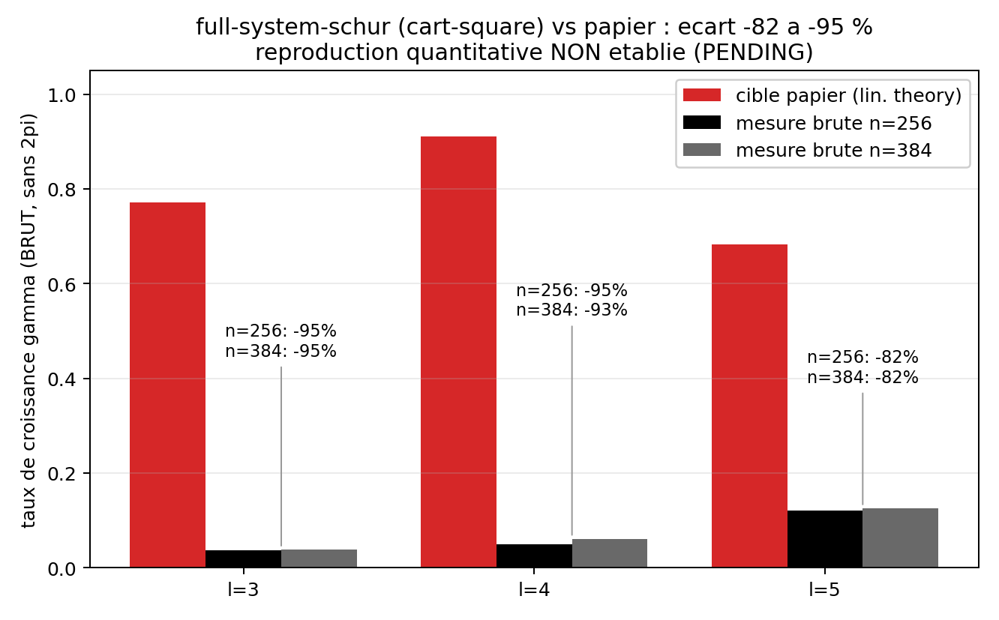
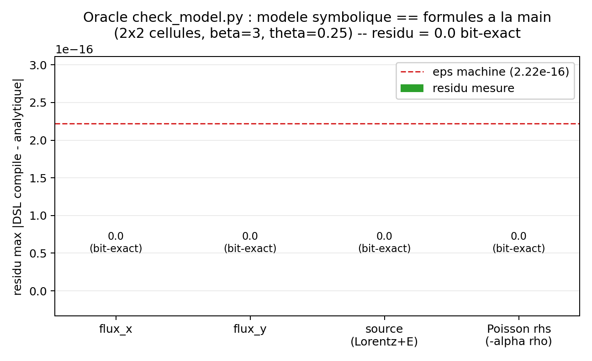

# hoffart_euler_poisson_dsl : Euler-Poisson magnetise complet en formules (DSL), vise arXiv:2510.11808

Le systeme Euler-Poisson MAGNETISE complet (continuite + quantite de mouvement + force de
Lorentz, fermeture barotrope) ecrit entierement en formules symboliques avec `adc.dsl.Model`,
compile en C++ (backend `production`), puis pousse dans les volumes finis WENO5-Z + Rusanov d'ADC.
Le cas vise les taux de croissance diocotron de Hoffart, Maier, Shadid & Tomas
([arXiv:2510.11808](https://arxiv.org/abs/2510.11808), Section 5.3). Categorie manifeste :
`reproduction-candidate`. La reproduction quantitative n'est PAS etablie : sur la baseline
cartesienne, le taux mesure est a $-82$ a $-95\%$ de la cible papier (table section 7), a $n=256$
ET $n=384$. Ce qui EST prouve : un oracle analytique (`check_model.py`) qui verifie par `assert`
que le modele symbolique compile genere le bon flux, la bonne source Lorentz/electrique, les bonnes
valeurs propres et le bon second membre de Poisson.

## Contrat

| Champ | Contenu |
|---|---|
| Categorie (manifeste) | `check_model.py` : `validation` (CI, oracle analytique, `needs=[]`). `run.py` : `reproduction-candidate` (hors CI, `needs=["matplotlib"]`, vise arXiv:2510.11808, table PENDING/MEASURED). `results.py` : self-test pur Python en CI |
| Entrees | grille carree $n^2$ ($n=192$ defaut, $256/384$ mesures), $L=2R=32$, **non periodique**, paroi Poisson Dirichlet cercle $R=16$ ; anneau $r_0{:}r_1=6{:}8$, perturbation $\rho=\rho_{max}(1-\delta+\delta\sin l\theta)$, $\delta=0.1$ ; $\rho_{min}{:}\rho_{max}=10^{-6}{:}1$ ; $\beta=10^6$, $\alpha=\beta^2/\rho_{max}=10^{12}$, $\omega=\beta^2=10^{12}$ ; fermeture $p=\theta\rho$, defaut **limite froide $\theta=0$** ; modes $l\in\{3,4,5\}$, $t_f=10$, $dt=10^{-3}$ |
| Sorties | `check_model.py` : verdict `assert` (EXIT=0). `run.py` : $\gamma_l$ brut fitte par mode, sous `out/hoffart_euler_poisson_dsl_<engine>/` (`amplitude.csv/.png`, `snapshots.png`, GIF, `growth_rates.csv/.png`, `metadata.json`, `measurement_record.csv/.json`). 2 figures honnetes versionnees dans `figures/` + `figures/provenance.json` |
| Invariants garantis | `check_model.py` : `np.testing.assert_allclose` sur flux x/y, source `[0, -rho*gx + omega*my, -rho*gy - omega*mx]`, `elliptic_rhs = -alpha*rho`, `max_wave_speed > 0` (tol par defaut `assert_allclose`, $\mathrm{rtol}=10^{-7}$). `run.py` : `verify_paper_windows` (fenetres de fit verbatim), garde MPI mono-rang, aveu `--acknowledge-amr-approximation`, `FloatingPointError` si phi/amplitude non finis. `results.py` : self-test (fenetres, labels moteur, `err_pct`, PENDING) |
| PROUVE | le modele symbolique compile == les formules analytiques sur 2x2 cellules, **bit-exact** : flux x/y, source Lorentz+electrique, valeurs propres ($>0$), rhs Poisson, residu $=0.0$ exactement (figure 2, `check_model.py:27-41`). Le harnais de mesure ne fabrique aucun nombre : `PENDING` tant qu'un run n'a pas tourne (`results.py:147-153`) |
| NE PROUVE PAS | **reproduction quantitative PENDING.** La table de validation est explicitement non etablie : baseline cartesienne MEASURED a $l{=}3$ $-95\%$, $l{=}4$ $-94/-93\%$, $l{=}5$ $-82\%$ ($n=256$ et $384$ ; l'erreur **n'ameliore pas** avec $n$, donc pas un probleme de resolution). Geometrie cartesienne+paroi cercle **suspecte** (transport sur grille carree, bord d'anneau diffuse). Splitting de **Lie** (Godunov 1er ordre), pas Strang. Poisson **une fois par pas** (cadence Gauss `OncePerStep`), qui rend l'evolution phi couplee a la source **inerte** pour la trajectoire. La variante `amr-imex` (backward-Euler cell-local, AMR/Kokkos/MPI) = ROMEO, **jamais** une reproduction (source IMEX, quantite de mouvement initiale nulle). Le facteur $2\pi/\bar\rho$ de `NORMALIZATION.md` appartient au modele REDUIT ExB scalaire, PAS a ce modele complet |
| Provenance | adc_cpp `dec3f18`, adc_cases `abd4791`, oracle backend natif serie (macOS arm64, python 3.12 anaconda3), `check_model.py` << 1 s. Mesures $\gamma$ : runs hors CI documentes dans `adc_cpp/docs/HOFFART_FIDELITY.md` ; `run.py` complet LONG, non lance ici. `figures/provenance.json` |

A la fin tu sauras : ce que le DSL ecrit reellement (les 4 equations magnetisees et leur traduction
en `m.flux/m.source/m.eigenvalues/m.elliptic_rhs`), pourquoi l'etage source est un Schur condense
(la source est raide), ce que l'oracle analytique etablit, et **pourquoi la reproduction
quantitative n'est pas montree** (geometrie, splitting, cadence Poisson).

---

## 1. Le mecanisme physique (situe le modele complet vs le modele reduit)

Une couche de charge (electrons) en anneau, $\rho(r)$ nulle au centre et au bord, dans un fort champ
magnetique axial uniforme $\mathbf{B}=\omega\,\hat z$ ($\omega=\beta^2=10^{12}$). La charge cree son
potentiel $\phi$ par Poisson ; le gradient $-\nabla\phi$ et le champ magnetique pilotent une derive
$\mathbf{E}\times\mathbf{B}$ azimutale a vitesse angulaire **fonction de $r$**. Bord interne et bord
externe ne tournent pas a la meme vitesse : **cisaillement**. Une ondulation azimutale du bord (mode
$l$) est entrainee differemment par les deux bords, s'enroule, et croit exponentiellement : c'est
l'instabilite diocotron (Kelvin-Helmholtz d'un anneau de vorticite). L'anneau developpe $l$ lobes.

Ce cas resout le **systeme Euler-Poisson magnetise complet** : il evolue la densite ET la quantite
de mouvement $m=(\rho u,\rho v)$ sous la force de Lorentz, pas seulement une derive ExB scalaire. Le
cas-parent [`../diocotron/`](../diocotron/) resout la **limite de derive ExB reduite** (une seule
variable conservee $n_e$ advectee par $\mathbf{v}=\hat z\times\nabla\phi/B_0$), avec un oracle
analytique de relation de dispersion qui colle au papier a 3 chiffres ; il **sous-estime** le taux
mesure de $-22$ a $-27\%$ par diffusion de bord cartesienne. Ce cas-ci porte un modele plus riche
(momentum + Lorentz + fermeture barotrope) mais sur la **meme** geometrie cartesienne suspecte, et
la reproduction quantitative y est encore plus loin (section 7). Le derive du taux analytique
(probleme aux valeurs propres radial) est dans `../diocotron/README.md` section 4 : il n'est PAS
recopie ici.

Simplifications nommees : fermeture barotrope $p=\theta\rho$ (l'equation d'energie de l'Euler complet
n'est PAS evoluee ; l'etat conservatif est exactement $(\rho,\rho u,\rho v)$, `model.py:90-99`) ;
limite froide $\theta=0$ par defaut (vitesse du son nulle, flux de pression nul) car le papier ne
donne pas de valeur numerique pour $\theta$ (`model.py:43`, `run.py:483-484`) ; tout est sans unites
($\alpha,\omega$ portent $\beta^2$).

---

## 2. Les equations resolues et qui les calcule (justifie PROUVE : la physique est figee en C++)

Etat conservatif par cellule, 3 composantes : $U=(\rho,\rho u,\rho v)$, $m=(\rho u,\rho v)$,
$\Omega=\omega\hat z$. Le systeme :

$$\partial_t\rho+\nabla\cdot m=0,$$

$$\partial_t m+\nabla\cdot\!\left(\frac{m\,m^{\mathsf T}}{\rho}+p\,I\right)=-\rho\,\nabla\phi+m\times\Omega,$$

$$-\Delta\phi=\alpha\,\rho,\qquad p=\theta\,\rho.$$

En 2D, le produit vectoriel de Lorentz donne $m\times\Omega=(\omega\,m_y,\,-\omega\,m_x)$ : c'est le
**couplage magnetique** qui distingue ce modele de l'Euler-Poisson electrostatique non magnetise de
[`../euler_poisson/`](../euler_poisson/). Convention de signe Poisson : ADC resout
$\Delta\phi=\text{rhs}$ alors que le papier ecrit $-\Delta\phi=\alpha\rho$, donc le modele pose
$\text{elliptic\_rhs}=-\alpha\rho$ (`model.py:127-129`).

| Bloc | Equation | Expression DSL (`model.py`) |
|---|---|---|
| Transport (continuite) | $\partial_t\rho+\nabla\cdot m=0$ | `m.flux(x=[mx,...], y=[my,...])` ligne 101-104 |
| Transport (momentum) | $\partial_t m+\nabla\cdot(mm^{\mathsf T}/\rho+pI)=\dots$ | `mx*u+pressure`, `my*v+pressure` ligne 102-103 |
| Valeurs propres | $u\mp c,u,u+c$ ; $c=\sqrt\theta$ | `m.eigenvalues(...)` ligne 106-109 |
| Source (Lorentz + E) | $-\rho\nabla\phi+m\times\Omega$ | `m.source([0, -rho*grad_x+omega*my, -rho*grad_y-omega*mx])` ligne 117-121 |
| Elliptique | $-\Delta\phi=\alpha\rho$ -> rhs $=-\alpha\rho$ | `m.elliptic_rhs(-alpha*rho)` ligne 129 |
| Aux | $\phi,\partial_x\phi,\partial_y\phi$ lus par la source | `m.aux("phi"/"grad_x"/"grad_y")` ligne 111-113 |

C'est `magnetic_euler_poisson_model(params, source)` (`model.py:70-131`). La table 3 couches "qui
calcule quoi", chaque ligne pinnee a une ligne reelle (chemin de reference `system-schur`) :

| Ligne `run.py` | Couche | Ce qui se passe |
|---|---|---|
| `sim.add_equation("electrons", model=compiled, spatial=adc.FiniteVolume(weno5,rusanov,conservative), time=adc.Split(Explicit(ssprk3), CondensedSchur(theta=0.5,alpha)))` (`run.py:146-158`) | Python **compose** et DIAGNOSTIQUE | choix du modele compile, du schema (WENO5-Z + Rusanov), de l'integrateur (SSPRK3 transport, Schur condense source) ; lecture de phi/amplitude |
| les EXPRESSIONS `m.flux(...)`, `m.eigenvalues(...)`, `m.source(...)`, `m.elliptic_rhs(...)` que `adc.dsl` compile en `.so` (`model.py:101-129`) | brique C++ **figee** (DSL compile) | la convention exacte du flux, des valeurs propres $(u\mp c,u,u+c)$, de la source $(-\rho\nabla\phi+m\times\Omega)$, du rhs $-\alpha\rho$ |
| `assemble_rhs<weno5,rusanov>` + Poisson de systeme (`geometric_mg`) + `CondensedSchur` BiCGStab/MG (`run.py:137-143,156`) | noyau **par cellule** (device) | le calcul reel, sans callback Python dans le hot path |

Pour un cas DSL, la couche du milieu n'est plus une brique nommee mais les **expressions
symboliques** que `adc.dsl` compile ; c'est ce qui distingue ce cas de la brique native
`models.euler_poisson` (qu'il **n'utilise pas**, `model.py` construit son propre modele magnetise).

---

## 3. Pourquoi un etage source condense par Schur (justifie : la source est raide)

La source $-\rho\nabla\phi+m\times\Omega$ est **raide** : $\alpha=\omega=10^{12}$. Un traitement
explicite de la rotation de Lorentz exigerait $dt\,\omega\ll 1$, soit $dt\ll 10^{-12}$, impraticable.
Le chemin de reference confie donc l'etage source a `adc.CondensedSchur(theta=0.5, alpha)`
(`run.py:154-157`), branche via `adc.Split(hyperbolic=Explicit(ssprk3), source=CondensedSchur)` : le
transport reste explicite (SSPRK3), la source raide est resolue implicitement par une reduction de
Schur du systeme couple potentiel/vitesse. Le modele DSL pose alors une source locale **nulle**
(`source="schur"` -> `m.source([0,0,0])`, `model.py:122-125`) precisement pour que le Schur porte
**tout** l'etage et ne l'avance pas deux fois.

L'operateur condense, son second membre et la reconstruction de $v^{n+\theta}$ correspondent verbatim
aux equations (3.7)-(3.8) du papier (`adc_cpp/.../condensed_schur_source_stepper.hpp:233-280`,
verifie ligne par ligne dans `HOFFART_FIDELITY.md`). C'est pourquoi `set_magnetic_field(omega)` doit
etre appele AVANT l'installation du stage (`run.py:144-145`) : le Schur lit $B_z$ pour assembler
$A=I+c\,\rho\,B^{-1}$.

**Limite documentee (cadence Poisson).** Il y a exactement un `solve_fields()` par pas, en tete,
AVANT le transport (`system_stepper.hpp:110`). Le pas suivant rouvre par un `solve_fields()` qui
RE-resout le Poisson electrostatique nu sur $\rho^{n+1}$ et **ecrase** le $\phi^{n+1}$ produit par le
Schur (`HOFFART_STEP_SEQUENCE.md`, headline finding). Consequence : l'evolution de $\phi$ couplee a la
source (eq. 3.2 du papier, $\partial_t(-\Delta\phi)=-\alpha\nabla\cdot m$) est **fonctionnellement
inerte** pour la trajectoire ; le $\phi$ que lit le transport au pas suivant est le potentiel
electrostatique re-resolu de $\rho^{n+1}$, pas le $\phi$ du Schur. Le $\phi$ du Schur ne survit que
comme amorce (warm-start) du BiCGStab. C'est une divergence architecturale (cadence Gauss
`OncePerStep`) face a l'evolution-source du papier, et l'un des suspects de la clause NE PROUVE PAS.

---

## 4. Maths : ce que le DSL ecrit, ligne par ligne (justifie PROUVE)

On ne re-derive PAS la relation de dispersion (elle vit dans `../diocotron/`). Ce qui est specifique
a ce cas, c'est la traduction du systeme magnetise en formules symboliques compilees. Le bloc
porteur (`model.py:95-129`) :

```python
u = m.primitive("u", mx / rho)                         # u = m_x / rho (model.py:95)
v = m.primitive("v", my / rho)                         # v = m_y / rho (model.py:96)
pressure = m.primitive("p", params.temperature * rho)  # p = theta rho (model.py:97)
m.flux(
    x=[mx, mx * u + pressure, mx * v],                 # (rho u, rho u^2 + p, rho u v) (model.py:102)
    y=[my, my * u, my * v + pressure],                 # (rho v, rho u v, rho v^2 + p) (model.py:103)
)
sound_speed = dsl.sqrt(params.temperature)             # c = sqrt(theta) (model.py:105)
m.eigenvalues(x=[u - sound_speed, u, u + sound_speed], # u-c, u, u+c (model.py:107)
              y=[v - sound_speed, v, v + sound_speed]) # v-c, v, v+c (model.py:108)
m.source([0.0 * rho,
          -rho * grad_x + omega * my,                  # -rho d_x phi + omega m_y (model.py:119)
          -rho * grad_y - omega * mx])                 # -rho d_y phi - omega m_x (model.py:120)
m.elliptic_rhs(-alpha * rho)                           # -Delta phi = alpha rho => rhs = -alpha rho (model.py:129)
```
- `mx*u+pressure` $=\rho u^2+p$ est le flux de momentum-x : la partie convective $\rho u^2$ plus la
  pression barotrope. A $\theta=0$ (defaut), $p=0$ et $c=0$ : flux purement convectif, valeurs
  propres degenerees $u,u,u$ (transport pur). La pression n'entre que si `--temperature > 0`.
- `-rho*grad_x + omega*my` est la composante-x de $-\rho\nabla\phi+m\times\Omega$ : le terme
  electrostatique $-\rho\,\partial_x\phi$ **plus** la composante-x du Lorentz $\omega\,m_y$. La
  composante-y porte le signe oppose $-\omega\,m_x$ : c'est la rotation $m\times(\omega\hat z)$.
- `grad_x`, `grad_y` sont des **aux** (`model.py:112-113`), remplies par le solveur Poisson de
  systeme ($\phi$ et son gradient), pas calculees par le modele : la source les LIT.
- `-alpha*rho` encode la convention de signe (ADC resout $\Delta\phi=\text{rhs}$).

L'oracle `check_model.py` confronte ces expressions compilees aux **memes formules ecrites a la
main** sur une grille 2x2 (`check_model.py:13-41`, parametres test $\beta=3,\theta=0.25$ donc
$\alpha=\omega=9$, $c=0.5$) :

```python
fx = model.flux(U, aux, 0); fy = model.flux(U, aux, 1)   # flux compile (check_model.py:21-22)
src = model.source_value(U, aux)                          # source compilee (check_model.py:23)
np.testing.assert_allclose(fx, np.stack([mx, mx*u + pressure, mx*v]))     # check_model.py:27
np.testing.assert_allclose(src, np.stack([np.zeros_like(rho),
    -rho*gx + p.omega*my, -rho*gy - p.omega*mx]))         # source Lorentz+E (check_model.py:29-36)
np.testing.assert_allclose(model._elliptic.eval(env), -p.alpha * rho)     # rhs Poisson (check_model.py:39)
assert model.max_wave_speed(U, aux, 0) > 0.0             # vitesse d'onde finie (check_model.py:40)
```
C'est l'oracle qui **est** la clause PROUVE. Il utilise `source="local"` (`check_model.py:11`) pour
que la source complete soit emise dans le `.so` et testable directement (le chemin `system-schur`
met cette source a zero et la confie au Schur, donc ne serait pas testable de cette facon).

---

## 5. Conditions initiales (`paper_initial_density`, `drift_velocity_from_potential`)

- **Densite** (`model.py:134-152`) : $\rho=\rho_{min}=10^{-6}$ partout ; dans l'anneau
  $r_0\le r\le r_1$, $\rho=\rho_{max}(1-\delta+\delta\sin(l\theta))$ avec $\delta=0.1$ (eq. 35 du
  papier). La perturbation azimutale du mode $l$ est la graine de l'instabilite.
- **Vitesse** (chemin `system-schur` uniquement, `run.py:160-165`) : derive ExB initiale calculee a
  partir de la **premiere** resolution de Poisson, $u_0=-\partial_y\phi/\omega$,
  $v_0=+\partial_x\phi/\omega$ (`drift_velocity_from_potential`, `model.py:155-168`), annulee hors du
  disque $R=16$. C'est l'etat de drift du papier. L'ordre est strict : poser $\rho$ a vitesse nulle,
  `solve_fields()`, lire $\phi$, calculer $(u_0,v_0)$, re-poser l'etat primitif, `solve_fields()`.
- **Chemin `amr-imex`** (`run.py:196`) : seule la densite est initialisee (`set_density`) ; la facade
  AMR n'expose pas l'etat primitif complet, donc la quantite de mouvement **demarre a zero** et relaxe
  vers la derive. Difference connue, qui exclut ce chemin de toute comparaison quantitative.

---

## 6. Figures (generees par `make_figures.py`, dans `figures/`)

Deux figures, et seulement deux, parce que ce cas est `reproduction-candidate` : une qui MONTRE
l'ecart au papier (le coeur honnete), une qui montre ce qui EST valide (l'oracle). Aucune figure ne
suggere une reproduction. Generation : `python make_figures.py` (memes parametres documentes que les
runs ; les nombres mesures sont VERBATIM de la table section 7, ce script **ne relance pas** `run.py`).

### `gap_to_paper.png` : l'ecart au papier



- **PROUVE** (par la table section 7, runs documentes) : les barres noire/grise (mesure brute
  $n=256/384$) sont des slivers a cote des barres rouges (cible papier). $l{=}3$ : $0.0372/0.0385$ vs
  $0.772$ ($-95\%$) ; $l{=}4$ : $0.0489/0.0613$ vs $0.911$ ($-95/-93\%$) ; $l{=}5$ : $0.1211/0.1257$
  vs $0.683$ ($-82\%$). La figure **montre que le cas NE reproduit PAS** le papier.
- **SUGGERE (non assere)** : $l{=}5$ est le moins eloigne ($-82\%$ vs $-95\%$ a $l{=}3$) ; un effet
  geometrique dependant du mode est plausible (cf. `../diocotron/` ou l'ecart varie aussi avec $l$),
  mais aucun assert ne classe les modes ni ne teste une valeur de $\gamma$.
- **NON MONTRE** : la **reproduction quantitative** elle-meme. Aucune barre mesuree n'approche sa
  cible ; l'ecart **n'ameliore pas** de $n=256$ a $n=384$, ce qui exclut un simple manque de
  resolution et pointe une cause structurelle (section 7).

### `oracle_residual.png` : ce qui EST prouve



- **PROUVE** (asserte `check_model.py:27-41`) : le residu max $|\text{DSL compile}-\text{analytique}|$
  sur les 2x2 cellules est **exactement $0.0$** (bit-exact) pour les quatre blocs : flux x, flux y,
  source Lorentz+electrique, rhs Poisson. Pas seulement sous l'eps machine ($2.22\times10^{-16}$,
  ligne rouge) : exactement nul. Le modele symbolique compile **est** les formules a la main.
- **NON MONTRE** : cet oracle ne teste **aucune** dynamique. Il valide la generation du modele (le
  bon flux, la bonne source, le bon rhs), pas que la simulation reproduit un taux de croissance.
  C'est la frontiere nette PROUVE (le modele genere) / NON PROUVE (la reproduction physique).

---

## 7. Pourquoi la reproduction n'est PAS montree (analyse des ecarts, table de validation)

L'oracle est correct (le modele genere est bit-exact, section 6) ; ce n'est donc pas le modele
symbolique qui est en cause. Les suspects sont dans la **discretisation et l'orchestration** du
chemin de reference `system-schur`, par ordre de gravite :

1. **Geometrie cartesienne + paroi cercle (suspect principal).** Le domaine est une boite carree
   $L=2R=32$ ; l'anneau circulaire n'est impose que par le **mur du Poisson** (Dirichlet sur un cercle
   $R=16$ embarque dans la grille carree). Le transport volumes-finis tourne sur toute la grille
   carree, sans condition de non-penetration fluide sur le cercle (`HOFFART_FIDELITY.md`, ligne
   `BC: fluid/wall` marquee `non_verifie`). Le bord d'anneau diffuse. Le taux analytique ne depend que
   de $l,\omega_d,r_0,r_1,R$, donc l'ecart n'est pas le splitting : c'est la geometrie. C'est le meme
   verrou cartesien que `../diocotron/`, en plus severe ici.
2. **Splitting de Lie, pas Strang.** ADC applique un transport complet puis un etage source complet
   par pas (Godunov, 1er ordre, `system_stepper.hpp:104-121`), alors que le papier utilise Strang
   (1/2 transport, source, 1/2 transport, 2e ordre). `metadata.json` enregistre `"Lie rather than
   Strang"`.
3. **Poisson une fois par pas (cadence `OncePerStep`).** L'evolution-source de $\phi$ est inerte : le
   $\phi$ du Schur est ecrase par le re-solve electrostatique du pas suivant (section 3). Un Strang qui
   reinjecterait le $\phi$ post-source dans un 2e demi-transport serait d'ailleurs **fatal** en l'etat
   (aucun transport ne tourne entre le Schur et l'ecrasement).
4. **$\theta$ non donne par le papier** : limite froide $\theta=0$ par defaut, une hypothese de
   fermeture non verifiee contre une valeur publiee.

Table de validation (verbatim ; `system-schur` = modele complet, pente **BRUTE** sans $2\pi$ ;
`reduced-ExB` = chemin reduit `NORMALIZATION.md`, **autre modele**, NE PAS confondre ; `amr-imex`
reste experimental). Les cellules `gamma_numeric` sont des mesures de runs hors CI
(`adc_cpp/docs/HOFFART_FIDELITY.md`) ou `PENDING` si non joue :

| mode | n | gamma_numeric | gamma_paper | err_pct | engine | dt | splitting | schur |
|---|---|---|---|---|---|---|---|---|
| 3 | 256 | 0.0372 | 0.772 | $-95.2$ | full-system-schur (cart-square) | 1e-3 | Lie | CondensedSchur $\theta{=}0.5$ |
| 4 | 256 | 0.0489 | 0.911 | $-94.6$ | full-system-schur (cart-square) | 1e-3 | Lie | CondensedSchur $\theta{=}0.5$ |
| 5 | 256 | 0.1211 | 0.683 | $-82.3$ | full-system-schur (cart-square) | 1e-3 | Lie | CondensedSchur $\theta{=}0.5$ |
| 3 | 384 | 0.0385 | 0.772 | $-95.0$ | full-system-schur (cart-square) | 1e-3 | Lie | CondensedSchur $\theta{=}0.5$ |
| 4 | 384 | 0.0613 | 0.911 | $-93.3$ | full-system-schur (cart-square) | 1e-3 | Lie | CondensedSchur $\theta{=}0.5$ |
| 5 | 384 | 0.1257 | 0.683 | $-81.6$ | full-system-schur (cart-square) | 1e-3 | Lie | CondensedSchur $\theta{=}0.5$ |
| 3 | 512 | PENDING | 0.772 | PENDING | system-schur | 1e-3 | Lie | CondensedSchur $\theta{=}0.5$ |
| 4 | 512 | PENDING | 0.911 | PENDING | system-schur | 1e-3 | Lie | CondensedSchur $\theta{=}0.5$ |
| 5 | 512 | PENDING | 0.683 | PENDING | system-schur | 1e-3 | Lie | CondensedSchur $\theta{=}0.5$ |
| 3 | 192 | PENDING | 0.772 | PENDING | amr-imex | 1e-3 | Lie (IMEX local) | none (IMEX local) |
| 4 | 192 | PENDING | 0.911 | PENDING | amr-imex | 1e-3 | Lie (IMEX local) | none (IMEX local) |
| 5 | 192 | PENDING | 0.683 | PENDING | amr-imex | 1e-3 | Lie (IMEX local) | none (IMEX local) |

Tant que les cellules `system-schur` $n=512$ ne sont pas remplies et que les $n=256/384$ restent a
$-82$ a $-95\%$, **aucune affirmation que le modele complet reproduit le papier n'est permise**.

**A ne PAS confondre : `NORMALIZATION.md` / `diag/diag_polar_omega.py`.** Cette etude valide un
facteur global $2\pi/\bar\rho$ sur un chemin **polaire ExB scalaire**, un modele **REDUIT et
DIFFERENT** (derive ExB scalaire type Petri, **sans** quantite de mouvement), PAS le systeme complet
ci-dessus. Sur ce modele reduit, seul $l{=}4$ colle exactement ($l{=}3$ $+26\%$, $l{=}5$ oscillant).
Le facteur $2\pi/\bar\rho$ appartient **uniquement** au chemin reduit (`engine=reduced-ExB`) et n'est
**jamais** applique au modele complet (`engine=full-system-schur`, pente BRUTE). Ni contre-exemple ni
reproduction du modele complet. Le code interdit le melange : `engine_label` refuse tout moteur
inconnu et le label reduit ne fuit jamais dans `run.py` (`results.py:62-71`).

---

## 8. La variante `amr-imex` (ROMEO, jamais une reproduction)

Le chemin `--engine amr-imex` (`run.py:169-197`) avance **la meme PDE** mais sur `adc.AmrSystem`
(AMR dynamique, Kokkos, MPI), avec une source **IMEX backward-Euler cell-local** au lieu du Schur
condense, car `CondensedSchur` n'est pas implemente sur AMR. Trois differences qui l'excluent de toute
comparaison quantitative :

1. source IMEX backward-Euler cell-local, pas le Schur condense du papier (`run.py:186`,
   `time=adc.IMEX(substeps)`) ;
2. la facade AMR n'initialise que la densite -> quantite de mouvement initiale **nulle** (pas l'etat
   de drift, `run.py:196`) ; le transport AMR est forward-Euler 1er ordre quel que soit le
   `method=` demande (`HOFFART_STEP_SEQUENCE.md`) ;
3. mur circulaire impose par le Poisson, transport toujours cartesien.

Ce chemin exige `--acknowledge-amr-approximation` (`run.py:504-508`) : sans l'aveu, le runner leve.
Il vise un build Kokkos/MPI (`build-kokkos/python`, `mpirun -np N`), donc **ROMEO** ; il n'est ni
lance ni mesure ici, et `metadata.json` l'etiquette `amr-imex-experimental` avec
`quantitative_paper_claim: False` (`run.py:438-449`).

---

## 9. Reproduire (commande exacte, cout)

Oracle analytique (leger, CI, A LANCER pour valider le modele) :

```bash
cd /private/tmp/adc_cases-deeptut/hoffart_euler_poisson_dsl
PYTHONPATH=/Users/romaindespoulain/Documents/Stage_Romain/adc_cpp/build-master/python:/private/tmp/adc_cases-deeptut \
  /opt/homebrew/anaconda3/bin/python3.12 check_model.py
```
Sortie attendue (capturee, macOS arm64, EXIT=0) :
`OK Hoffart DSL: flux, Lorentz/electric source, eigenvalues and Poisson rhs`. Cout : << 1 s (2x2
cellules analytiques, le modele est compile a la volee). Self-test du harnais de mesure (pur Python,
CI, n'importe meme pas `adc`) :

```bash
PYTHONPATH=/private/tmp/adc_cases-deeptut \
  /opt/homebrew/anaconda3/bin/python3.12 results.py
# OK results.py: fenetres verbatim, labels moteur, err_pct, record brut, PENDING, IO
```

Figures honnetes versionnees :

```bash
cd /private/tmp/adc_cases-deeptut/hoffart_euler_poisson_dsl
PYTHONPATH=/Users/romaindespoulain/Documents/Stage_Romain/adc_cpp/build-master/python:/private/tmp/adc_cases-deeptut \
  /opt/homebrew/anaconda3/bin/python3.12 make_figures.py   # gap_to_paper.png + oracle_residual.png + provenance.json
```

Reproduction-candidate `system-schur` (LONG, hors CI -- NE PAS lancer pour valider) :

```bash
PYTHONPATH=/chemin/vers/adc_cpp/build-master/python \
  python hoffart_euler_poisson_dsl/run.py --engine system-schur --n 384 --t-end 10 --dt 1e-3
# Fumee de compilation seule : --quick (n=48, t_end=0.02, mode 3) ou --compile-only
```
Cout `run.py` complet (3 modes, $n=384$, $t_f=10$, $dt=10^{-3}$) : ~10000 pas de temps par mode plus
un Poisson MG par pas, plus figures/GIF. **LONG**, non mesure ici (consigne : reproduction non
lancee). Chemin `amr-imex` : `mpirun -np N python ... --engine amr-imex
--acknowledge-amr-approximation` sur un build Kokkos -> ROMEO.

Prerequis : module `adc` (binding C++/pybind11) compile et importe **avec le meme interpreteur** que
celui qui l'a compile (suffixe ABI `cpython-312`) ; un compilateur C++20 pour
`Model.compile(backend="production")`. **Caveat plateforme** : le verdict de l'oracle (residu
$=0.0$), les signes et l'ordre de grandeur de l'ecart ($-82$ a $-95\%$) sont stables ; les derniers
chiffres des $\gamma$ mesures varient avec la BLAS et l'ordre de sommation (cf.
`figures/provenance.json`, `adc_cpp/docs/HOFFART_FIDELITY.md`).

## Carte des fichiers

| Fichier | Role |
|---|---|
| `model.py` | modele symbolique `adc.dsl` (flux, eigen, source Lorentz+E, elliptic_rhs) + `PaperParameters`, IC, drift (`l.70-168`) |
| `check_model.py` | oracle analytique CI : `assert` flux/source/eigen/rhs sur 2x2 cellules (clause PROUVE) |
| `run.py` | harnais reproduction-candidate (LONG, hors CI) : `build_uniform`/`build_amr`, fit du taux, sorties |
| `results.py` | emetteur d'enregistrements de mesure pur Python ; `PENDING` pour tout non mesure ; self-test CI |
| `make_figures.py` | 2 figures honnetes (`gap_to_paper.png`, `oracle_residual.png`) + `figures/provenance.json` |
| `figures/*.png`, `figures/provenance.json` | assets versionnes : l'ecart au papier et le residu de l'oracle |
| `NORMALIZATION.md`, `diag/diag_polar_omega.py` | etude du facteur $2\pi/\bar\rho$ du modele REDUIT ExB scalaire (AUTRE modele, hors manifeste) |
| `../diocotron/` | limite de derive ExB reduite (oracle de dispersion + sous-estimation $-22$ a $-27\%$) |
| `../euler_poisson/` | Euler-Poisson electrostatique NON magnetise (pas de Lorentz) |
