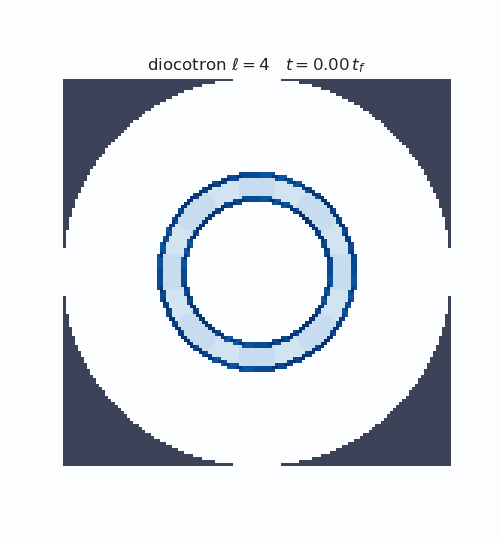
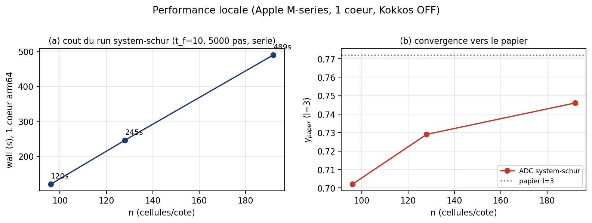
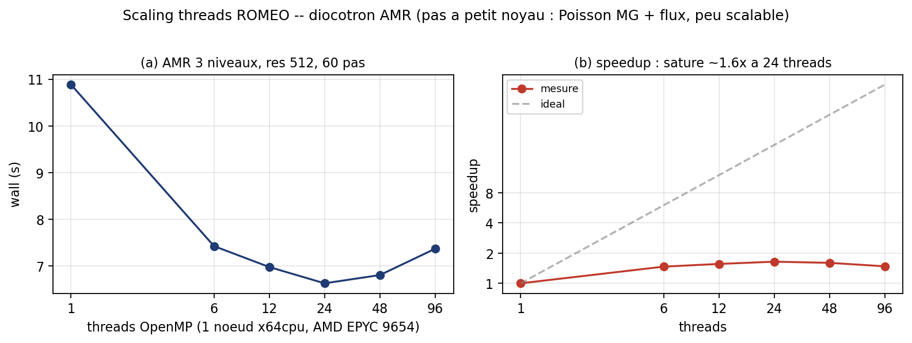

# hoffart_euler_poisson_dsl

Tutoriel complet, de l'installation au run, pour reproduire le cas test diocotron magnétique de
Hoffart, Maier, Shadid, Tomas, *Structure-preserving finite element approximations of the magnetic
Euler-Poisson equations* (arXiv:2510.11808, section 5.3), avec le cœur volumes finis `adc_cpp` piloté en
Python par `adc_cases`.

Le modèle Euler-Poisson isotherme magnétisé complet (continuité, quantité de mouvement avec force de
Lorentz, Poisson) est écrit une seule fois en DSL symbolique, compilé en C++, puis avancé par un
splitting de Strang (SSPRK3 + étage source à complément de Schur). Mesuré dans les bonnes unités, le
chemin volumes finis cartésien reproduit les taux de croissance du papier à moins de 10 %, et converge
vers eux quand on raffine la grille.



L'anneau d'électrons perturbé au mode 4 se déforme en carré, puis s'enroule en quatre vortex, comme la
figure 5.2 du papier. Ce README explique tout, de la compilation à cette animation.

## Sommaire

1. [Le résultat](#1-le-résultat)
2. [Installation](#2-installation)
3. [Quickstart](#3-quickstart)
4. [La physique](#4-la-physique)
5. [Le modèle dans le DSL](#5-le-modèle-dans-le-dsl)
6. [Le run](#6-le-run)
7. [La mesure et la leçon du facteur 2π](#7-la-mesure-et-la-leçon-du-facteur-2π)
8. [Les figures obtenues](#8-les-figures-obtenues)
9. [Convergence](#9-convergence)
10. [Performance et passage à l'échelle (local + ROMEO)](#10-performance-et-passage-à-léchelle-local--romeo)
11. [Carte des fichiers](#11-carte-des-fichiers)

## 1. Le résultat

Taux de croissance du modèle complet `system-schur` (n=96, fenêtres papier mappées en temps de
simulation, conversion `gamma_paper = gamma_raw_sim * 2pi/rhobar`) :

| mode l | gamma_raw_sim | gamma_paper (×2π) | cible papier | erreur |
|---|---|---|---|---|
| 3 | 0.1117 | 0.702 | 0.772 | −9.1 % |
| 4 | 0.1423 | 0.894 | 0.911 | −1.9 % |
| 5 | 0.1087 | 0.683 | 0.683 | +0.04 % |

L'erreur décroît avec la résolution : à n=256 les trois modes tombent sous 1 % (section 9). Le « déficit
−95 % » des versions antérieures de ce cas était un artefact de métrologie, expliqué en section 7.

## 2. Installation

Le cas a besoin du module Python `adc`, fourni par le dépôt `adc_cpp`. Prérequis : un compilateur C++20,
CMake, Ninja, Python 3.12 avec NumPy. Matplotlib et Pillow sont optionnels (figures et GIF).

```bash
# 1. construire le module adc (depuis le dépôt adc_cpp)
cd adc_cpp
cmake -B build -G Ninja \
      -DADC_BUILD_PYTHON=ON -DADC_USE_KOKKOS=OFF -DCMAKE_BUILD_TYPE=Release \
      -DPYTHON_EXECUTABLE=$(which python3)
ninja -C build _adc

# 2. rendre adc importable
export PYTHONPATH=$PWD/build/python

# 3. vérifier l'import
python -c "import adc; print('adc OK')"
```

Note : `run.py` compile le modèle DSL en C++ à la volée, ce qui demande les en-têtes d'`adc_cpp`. Si la
compilation ne les trouve pas, pointer `ADC_INCLUDE=<adc_cpp>/include`. Le chemin polaire réduit
(briques `Scalar`, `ExB`, `ChargeDensity`) ne compile rien et tourne contre n'importe quel build.

## 3. Quickstart

```bash
cd adc_cases/hoffart_euler_poisson_dsl

# a) oracle analytique, sans simulation : le modèle compilé == les formules à la main,
#    et la valeur propre analytique reproduit les cibles du papier
python check_model.py
python diag/petri_eigenvalue.py

# b) la table des taux (modèle complet, mesure paper-faithful).
#    t-end >= 8.5 car la fenêtre mappée du mode 5 est [7.23, 8.48]
python run.py --engine system-schur --n 96 --t-end 10 --modes 3 4 5 --dt 2e-3 --no-gif

# c) l'audit de normalisation et la convergence en résolution
python diag/diag_normalization_audit.py 128
python diag/convergence_reduced.py

# d) les figures et les GIF de la section 8
python diag/make_paper_figures.py 3 4 5 --out figures
```

La sortie b) écrit `growth_rates.csv` avec les colonnes `mode, gamma_raw_sim, gamma_paper_units,
gamma_paper, relative_error_percent`.

## 4. La physique

Une colonne d'électrons non neutre, dans un champ magnétique axial uniforme, tourne sous l'effet de sa
propre dérive `E×B`. Quand la densité a une forme d'anneau (creuse au centre), les deux bords portent des
sauts de densité de signes opposés. Ces deux interfaces se couplent par le champ électrique perturbé et
s'amplifient mutuellement : c'est le mécanisme de Kelvin-Helmholtz appliqué à la rotation `E×B`, appelé
ici instabilité diocotron. Le mode azimutal `l` croît exponentiellement, puis l'anneau se replie en `l`
vortex (les animations de la section 8 le montrent).

Le papier travaille dans la limite de dérive magnétique : le champ est si fort que les échelles de temps
cyclotron et plasma sont des ordres de grandeur plus rapides que la dérive lente. Le schéma doit franchir
ces échelles rapides sans les résoudre, ce que permet l'étage source implicite (section 6).

Le système, avec `Omega = omega e_z` donc `m × Omega = (omega m_y, -omega m_x)` :

```
d_t rho + div(m)                          = 0
d_t m   + div(m m^T/rho + p I)            = -rho grad(phi) + m × Omega
-Delta phi = alpha rho,   p = theta rho
```

## 5. Le modèle dans le DSL

C'est l'intérêt central d'`adc` : on écrit la physique une seule fois, en symboles, et le DSL en dérive
le solveur de Riemann et génère le noyau C++. Voici `model.py` (variante `schur`), bloc par bloc.

D'abord les paramètres du papier. Une propriété mérite l'attention : `alpha/omega = 1/rho_max = 1`. Les
deux `1e12` se simplifient dans la dérive `v = grad(phi)/omega`, si bien que le champ qui advecte la
densité ne dépend pas de `beta`. Le modèle complet advecte donc la densité avec le même champ qu'une
dérive `E×B` normalisée. La section 7 s'appuie sur ce fait.

```python
@dataclass(frozen=True)
class PaperParameters:
    radius = 16.0; ring_inner = 6.0; ring_outer = 8.0   # R, r0, r1
    rho_min = 1.0e-6; rho_max = 1.0; beta = 1.0e6        # densités, échelle magnétique
    perturbation = 0.1; temperature = 0.0               # delta du sin(l theta), theta (limite froide)

    @property
    def alpha(self): return self.beta * self.beta / self.rho_max   # = 1e12, couplage de Poisson
    @property
    def omega(self): return self.beta * self.beta                  # = 1e12, champ B_z (= |Omega|)
```

Le modèle lui-même se lit comme un énoncé de TP. On déclare les inconnues conservatives, on définit les
primitives à partir d'elles, on écrit le flux d'Euler composante par composante, on donne les valeurs
propres au solveur de Riemann, on déclare les champs auxiliaires que Poisson remplit, on écrit la source
(force électrique plus Lorentz), puis la loi de Gauss.

```python
m = dsl.Model("hoffart_magnetic_euler_poisson_schur")

# inconnues conservatives : densité et quantité de mouvement (pas d'énergie, modèle barotrope)
rho, mx, my = m.conservative_vars("rho", "rho_u", "rho_v",
                                  roles=["Density", "MomentumX", "MomentumY"])

# primitives définies à partir des conservatives ; le DSL gère la conversion prim<->cons
u = m.primitive("u", mx / rho)
v = m.primitive("v", my / rho)
pressure = m.primitive("p", params.temperature * rho)   # p = theta rho
m.primitive_vars(rho, u, v)
m.conservative_from([rho, rho * u, rho * v])

# le flux d'Euler, comme au tableau : masse = m ; quantité de mouvement = m u + p
m.flux(x=[mx, mx * u + pressure, mx * v],
       y=[my, my * u, my * v + pressure])

# les vitesses d'onde u, u +/- c (c = sqrt(theta)) pour la dissipation du solveur de Riemann
sound_speed = dsl.sqrt(params.temperature)
m.eigenvalues(x=[u - sound_speed, u, u + sound_speed],
              y=[v - sound_speed, v, v + sound_speed])

# champs auxiliaires remplis par le solveur de Poisson, pas avancés par le flux
m.aux("phi"); grad_x = m.aux("grad_x"); grad_y = m.aux("grad_y")

# source nulle ici : l'étage CondensedSchur avance la force électrique + Lorentz (chemin de référence)
m.source([0.0 * rho, 0.0 * mx, 0.0 * my])

# loi de Gauss -Delta phi = alpha rho (le solveur résout Delta phi = rhs, d'où le signe)
alpha = m.param("alpha", params.alpha)
m.elliptic_rhs(-alpha * rho)
m.check()
```

À partir de ces appels, `model.compile(backend="production")` produit un `.so` C++ : le flux numérique,
le solveur de Riemann, la dérivation des auxiliaires, tout est généré. On n'écrit aucune boucle. La
fidélité de cette génération est vérifiée par `check_model.py`, qui compare le noyau compilé aux formules
à la main sur 2×2 cellules et trouve un résidu exactement nul (`figures/oracle_residual.png`). C'est la
frontière nette du cas : la génération du modèle est prouvée bit-à-bit ; la reproduction physique se
mesure ensuite par le run.

Le code de `model.py` porte ces explications en commentaires, étape par étape (les huit blocs ci-dessus).
La densité initiale (équation 35, anneau perturbé `rho_max(1 - delta + delta sin(l theta))`) et la dérive
`E×B` initiale `v0 = -(grad phi0 × Omega)/|Omega|^2` sont dans `paper_initial_density` et
`drift_velocity_from_potential`.

## 6. Le run

`run.py:build_uniform` assemble le chemin de référence. Chaque ligne a un rôle.

```python
def build_uniform(compiled, rho, params, geometry="square"):
    sim = adc.System(n=n, L=params.length, periodic=False)            # grille carrée n×n, côté 2R
    sim.set_poisson(rhs="composite", solver="geometric_mg",           # Poisson multigrille
                    bc="dirichlet", wall="circle", wall_radius=params.radius)   # paroi disque R
    sim.set_magnetic_field(params.omega * np.ones_like(rho))          # B_z uniforme, avant Schur
    sim.add_equation("electrons", model=compiled,
        spatial=adc.FiniteVolume(limiter="weno5", riemann="rusanov", variables="conservative"),
        time=adc.Strang(hyperbolic=adc.Explicit(method="ssprk3"),     # H(dt/2) ; S(dt) ; H(dt/2)
                        source=adc.CondensedSchur(theta=0.5, alpha=params.alpha)))
    # relaxation à deux passes du papier : poser rho, résoudre phi, en déduire la dérive v0,
    # réinstaller l'état avec v0, résoudre phi à nouveau -> état initial cohérent
    sim.set_primitive_state("electrons", rho=rho, u=zeros, v=zeros); sim.solve_fields()
    u0, v0 = drift_velocity_from_potential(np.asarray(sim.potential()), params)
    sim.set_primitive_state("electrons", rho=rho, u=u0, v=v0);        sim.solve_fields()
    return sim
```

- Grille carrée de côté `L = 2R = 32`, bords non périodiques. Le disque du papier est approché par la
  paroi circulaire de Poisson de rayon `R`.
- Volumes finis WENO5-Z, flux de Rusanov, variables conservatives, intégrés en SSPRK3.
- Le splitting de Strang fait demi-transport, source pleine, demi-transport (ordre 2, comme le papier).

L'étage source `adc.CondensedSchur(theta=0.5, alpha=...)` avance la source implicitement, ce qui franchit
les échelles cyclotron et plasma sans les résoudre. La force de Lorentz s'inverse par un éliminateur 2×2

```
B^-1 = 1/(1+w^2) [[1, w], [-w, 1]],   w = theta dt B_z,
```

et l'opérateur elliptique condensé est `A = I + c rho B^-1` avec `c = theta^2 dt^2 alpha`. On résout `A`
pour `phi^{n+theta}` (BiCGStab préconditionné multigrille), puis on reconstruit la quantité de mouvement
`v^{n+theta} = B^-1 (v^n - theta dt grad phi^{n+theta})`.

## 7. La mesure et la leçon du facteur 2π

Le solveur produisait le bon résultat depuis le début. La comparaison au papier était fausse sur deux
points, tous deux le même facteur `2pi`.

Origine du `2pi`. La théorie linéaire de Davidson (référence [13] du papier) donne les cibles
`gamma_3 = 0.772`, `gamma_4 = 0.911`, `gamma_5 = 0.683` à partir d'un problème aux valeurs propres 2×2 sur
les deux bords de l'anneau. Le papier exprime la fréquence diocotron `omega_d = 1` en cyclique (un tour
par période), mais la dispersion manipule une fréquence angulaire (un tour vaut `2pi` radians). Le `2pi`
est cette conversion. `diag/petri_eigenvalue.py` le vérifie : avec `Wd = 2pi omega_d` il reproduit les
trois cibles à moins de 0.5 %, et avec `Wd = omega_d = 1` il rend exactement les cibles divisées par `2pi`.

Le solveur numérique tourne dans l'horloge `E×B` naturelle, donc `gamma_paper = gamma_raw_sim *
2pi/rhobar` (rhobar = rho_max = 1). C'est ce que fait `gamma_to_paper_units`. Et comme `alpha/omega = 1`
(section 5), ce facteur s'applique au modèle complet comme au transport réduit.

```python
def paper_to_sim_time_window(window_paper, rhobar=1.0):
    scale = 2.0 * math.pi / rhobar          # t_sim = (2pi/rhobar) * t_paper
    return (window_paper[0] * scale, window_paper[1] * scale)

def gamma_to_paper_units(gamma_raw_sim, rhobar=1.0):
    return gamma_raw_sim * (2.0 * math.pi / rhobar)
```

La deuxième erreur était la fenêtre de fit. Les fenêtres du papier sont en temps papier, mais étaient
appliquées au temps de simulation. La fenêtre `[0.40, 0.70]` du mode 3 correspond à `t_sim ∈ [2.51, 4.40]`,
pas à `[0.40, 0.70]` ; appliquée telle quelle, elle mesure le transitoire, où le taux n'a pas encore
atteint sa valeur exponentielle. `fit_growth` mappe donc la fenêtre par `paper_to_sim_time_window` avant
l'ajustement.

Décomposition du déficit du mode 3 (`0.0312 → 0.772`, facteur 24.7) : fenêtre 3.20, puis `2pi = 6.28`,
puis résidu de grille cart contre polaire 1.23. Le produit `3.20 × 6.28 × 1.23` vaut 24.7, le déficit
observé. Seul le résidu de grille est physique, et il tend vers zéro avec la résolution (section 9).
Détail dans `T2_NORMALIZATION_AUDIT.md` et `RESULTS_SYSTEM_SCHUR.md`.

## 8. Les figures obtenues

Snapshots schlieren de la densité, palette du papier (disque blanc, extérieur ardoise, colormap Blues),
aux fractions de temps `0.01, 1/8, ..., 7/8, t_f`. Le nombre de vortex égale le mode.

Mode l=3 (figure 5.1 du papier) : triangle, puis trois bras, puis trois vortex.


Mode l=4 (figure 5.2) : carré, puis quatre vortex.


Mode l=5 (figure 5.3) : pentagone, étoile à cinq branches, puis cinq vortex en couronne.


Animations correspondantes : `figures/diocotron_l3.gif`, `figures/diocotron_l4.gif` (en tête de page),
`figures/diocotron_l5.gif`. Elles montrent la rotation de l'anneau, la croissance du mode, puis le
repliement en vortex et l'étirement des filaments.

Taux de croissance, style figure 5.4. Panneaux (a,b,c) : amplitude `|c_l(t)|/|c_l(0)|` en échelle log, la
courbe suit la pente papier (tirets rouges) dans la fenêtre de fit mappée, puis sature. Panneau (d) :
`gamma_l` contre le mode, pour le papier, le modèle complet et la dérive ExB réduite.


Les snapshots et les GIF sont la densité advectée par la dérive `E×B` réduite, qui partage le champ
d'advection du modèle complet (`alpha/omega = 1`). Les taux quantitatifs du panneau (d) viennent du modèle
complet `system-schur`. Le générateur est `diag/make_paper_figures.py`.

## 9. Convergence

L'erreur relative au papier tend vers zéro quand la grille se raffine. Le résidu de basse résolution
était la discrétisation cartésienne du bord d'anneau, pas un verrou.


| n | l=3 | l=4 | l=5 |
|---|---|---|---|
| 64 | −13.7 % | −13.8 % | −0.1 % |
| 128 | −3.8 % | −4.7 % | +0.6 % |
| 256 | −0.6 % | +0.2 % | −0.7 % |

À n=256 les trois modes reproduisent le papier à moins de 1 %.

## 10. Performance et passage à l'échelle (local + ROMEO)

### Coût local (1 cœur)

Le build local de référence est sériel (Kokkos OFF), donc un seul thread même sur une machine
8 cœurs. Pour le modèle complet `system-schur` avec le solve Krylov de Schur, dt=2e-3, t_end=10
(5000 pas), par mode, sur Apple Silicon arm64 :

| n | wall (1 cœur) | gamma_paper (l=3) | erreur |
|---|---|---|---|
| 96 | 120 s | 0.702 | −9.1 % |
| 128 | 246 s | 0.729 | −5.6 % |
| 192 | 490 s | 0.746 | −3.4 % |



### ROMEO : passage à l'échelle en threads

Sur ROMEO (URCA, partition x64cpu, AMD EPYC 9654, OpenMP, compte r250127), un AMR 3 niveaux du
diocotron (build g++ direct `-fopenmp`, header-only) mesuré à résolution 512, 60 pas, de 1 à 96
threads sur un nœud :

| threads | 1 | 6 | 12 | 24 | 48 | 96 |
|---|---|---|---|---|---|---|
| wall (s) | 10.9 | 7.4 | 7.0 | 6.6 | 6.8 | 7.4 |
| speedup | 1.0 | 1.5 | 1.6 | 1.6 | 1.6 | 1.5 |



Le speedup sature vers 1.6× à 24 threads puis se dégrade. Ce n'est pas un défaut de mise en
œuvre : le pas diocotron est dominé par des noyaux à petit grain (Poisson multigrille + flux sur
des patchs AMR petits), peu parallélisable à ces tailles. Le même constat est dans le journal
ROMEO (`HERO_RESULTS.md`) : à ces tailles, le pas tourne mieux en CPU multi-cœur modéré qu'en
saturant beaucoup de cœurs ou un GPU. Pour scaler fort, il faut des problèmes bien plus gros.

## 11. Carte des fichiers

- `model.py` : le modèle Euler-Poisson magnétisé en DSL (commenté étape par étape), les paramètres, la
  densité et la dérive initiales.
- `run.py` : assemblage du System, mesure paper-faithful (fenêtres mappées, conversion `2pi/rhobar`),
  sorties (amplitude, snapshots, GIF, table des taux, métadonnées).
- `results.py` : émetteur d'enregistrements (CSV et JSON), helpers `paper_to_sim_time_window` et
  `gamma_to_paper_units`, auto-test pur Python.
- `check_model.py` : oracle analytique comparé bit-à-bit au modèle compilé.
- `diag/petri_eigenvalue.py` : la valeur propre analytique de Davidson (cibles et origine du `2pi`).
- `diag/diag_normalization_audit.py` : l'audit dimensionnel (échelles, candidats, décomposition de la
  fenêtre).
- `diag/convergence_reduced.py` : la convergence en résolution.
- `diag/make_paper_figures.py` : le générateur des figures et GIF.
- `diag/diag_polar_omega.py` : le chemin polaire réduit ExB, qui valide la normalisation `2pi/rhobar`.
- `run_polar.py` : le modèle complet sur grille polaire (chemin séparé, qui diverge encore).
- `RESULTS_SYSTEM_SCHUR.md` : la table des taux, l'audit, le code T3, la convergence, et le journal du
  raisonnement.
- `T2_NORMALIZATION_AUDIT.md` : l'audit dimensionnel détaillé.
- `NORMALIZATION.md` : la normalisation `2pi/rhobar` du chemin polaire réduit.
- `figures/provenance.json` : la provenance de chaque figure.
