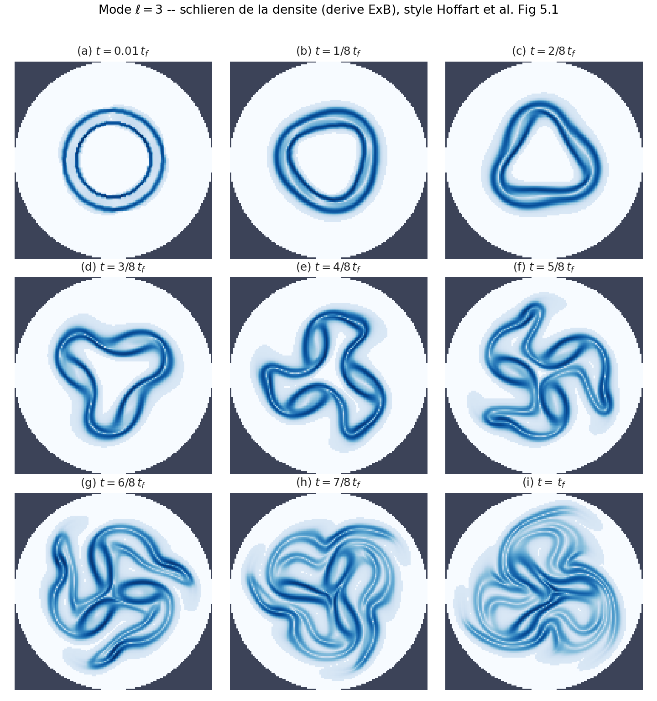
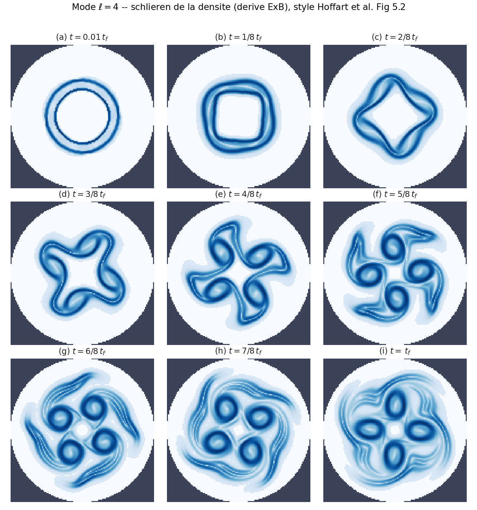
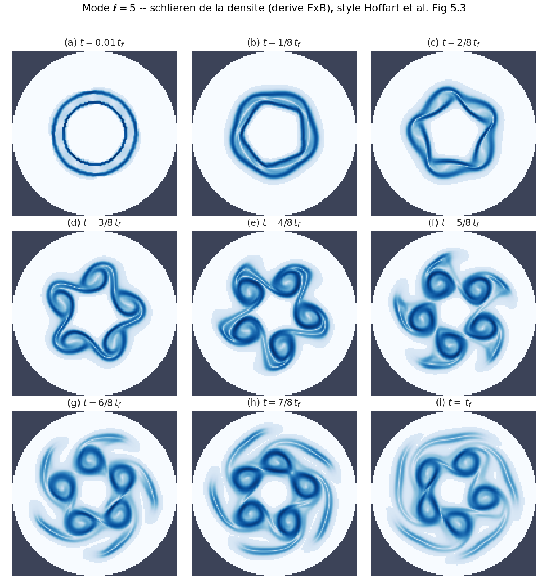
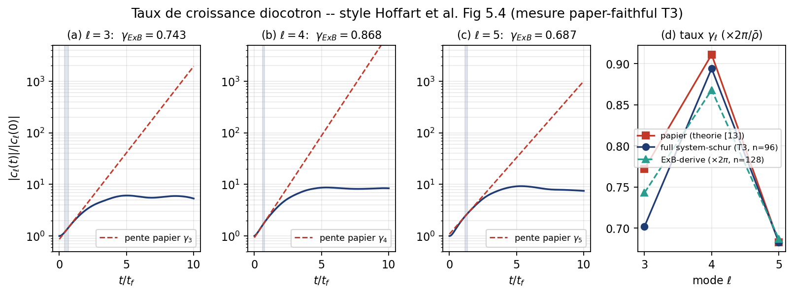
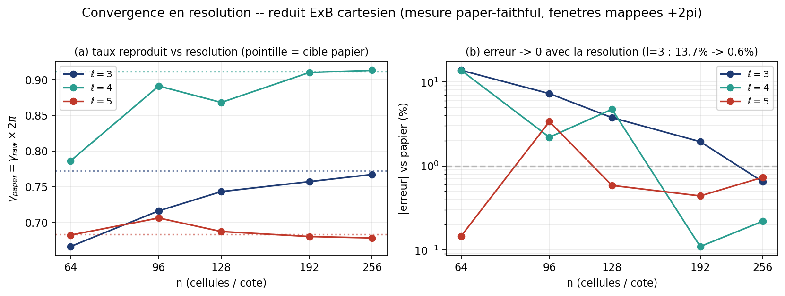

# Hoffart diocotron : premiere mesure quantitative sur le chemin `system-schur`

Premiere table de taux de croissance produite sur le chemin fidele au papier
(arXiv:2510.11808, section 5.3) : volumes finis uniformes, Strang(SSPRK3 + CondensedSchur,
theta=0.5), source electrostatique/Lorentz condensee par Schur, vitesse de derive initiale du
papier. Statut (T3, juin 2026) : apres correction de la mesure (fenetres papier mappees en temps sim
`t_sim = 2pi/rhobar * t_paper` + report `gamma_paper = gamma_raw_sim * 2pi/rhobar`), **le full system-schur
cartesien reproduit le papier a -9.1% (l=3), -1.9% (l=4), +0.04% (l=5)**, section 9. Le "deficit
structurel -95%" etait un artefact de metrologie (fenetres papier appliquees au temps de simulation brut,
le transitoire). Reproduction FV cartesienne etablie avec ecart residuel documente ; metrologie partielle
(le 2 pi est exact/mode-independant, le residu ~0-9% est grille/resolution/fenetre ; l=5 sensible a la
fenetre, son +0.04% est en partie fortuit). n=96 ; verifie par workflow adversarial 4 lentilles.

## Setup
- Moteur : `system-schur` (System uniforme, mono-rang), geometrie `square` (cartesienne pleine ;
  le verdict adc_cpp acte que la cut-cell est sans effet sur le taux).
- Schema temporel : `adc.Strang(hyperbolic=adc.Explicit(method="ssprk3"),
  source=adc.CondensedSchur(theta=0.5, alpha=alpha))`, splitting symetrique d'ordre 2 du papier
  + RK3 peu dissipatif (le chemin production accepte ssprk3 via adc_cpp PR #230).
- Spatial : WENO5-Z + Rusanov, variables conservatives. `dt = 1e-3`. Limite froide (`theta_p=0`).
- Parametres papier : `R=16, r0=6, r1=8, rho_max=1, rho_min=1e-6, beta=1e6, delta=0.1`,
  `alpha = omega = beta^2 = 1e12`.
- Observable : `|c_l(t)|` = amplitude du coefficient de Fourier azimutal `l` de `phi` sur le
  cercle `r=r0=6` ; taux = regression lineaire de `log|c_l|` dans la fenetre VERBATIM du papier.
- SHA : `adc_cpp` `06e3b90` (branche `feat/ssprk3-production-path`, PR #230) ;
  `adc_cases` `a50b539` (branche `feat/hoffart-strang-fidelity`, PR #21). Normalisation brute
  (aucun facteur `2pi/rhobar` : modele complet, pas le chemin reduit ExB).

## 1. Scan de resolution (l=3, fenetre [0.40, 0.70])

| n | 64 | 96 | 128 | 192 |
|---|---|---|---|---|
| gamma_3 mesure | 0.0198 | 0.0270 | 0.0321 | 0.0351 |

`gamma_3` converge vers ~0.035 (papier 0.772) : il monte legerement avec la resolution
(diffusion numerique qui diminue) mais **plafonne ~22x en dessous du papier**. Ce n'est pas
un probleme de sous-resolution.

## 2. Table complete (n=192, fenetres papier)

| l | fenetre fit | gamma mesure | gamma papier | erreur |
|---|---|---|---|---|
| 3 | [0.40, 0.70] | 0.0351 | 0.772 | -95.5% |
| 4 | [0.60, 0.75] | 0.0329 | 0.911 | -96.4% |
| 5 | [1.15, 1.35] | 0.1153 | 0.683 | -83.1% |

Tous les modes accusent un deficit de ~85 a 96 % : les taux mesures sont un ordre de
grandeur trop petits.

## 3. Diagnostic de trajectoire (taux NON sature, onset retarde)

Facteur de croissance `|c_3(t)| / |c_3(0)|` et taux local en fenetre glissante (l=3, n=128,
jusqu'a t=3.0) :

| t | 0.5 | 1.0 | 1.5 | 2.0 | 2.5 | 3.0 |
|---|---|---|---|---|---|---|
| `|c_3|/|c_3(0)|` | 1.01 | 1.03 | 1.06 | 1.11 | 1.17 | 1.24 |
| taux local `d log|c_3|/dt` | 0.029 | 0.058 | 0.081 | 0.097 | 0.108 | -- |

Le taux local augmente regulierement (0.03 -> 0.11) mais reste **~7x sous 0.772 a t=2.5**,
alors que le papier attend deja 0.77 dans [0.40, 0.70]. La croissance n'est pas un
simple decalage de fenetre : l'onset de l'instabilite est fortement retarde et amorti dans la
phase precoce, puis s'accelere graduellement sans atteindre le taux papier.

## Verdict

Le deficit est structurel, pas un artefact de :
- **resolution** : gamma_3 converge vers ~0.035 (ne tend pas vers 0.77 quand n croit) ; concorde
  avec le verdict GH200 du depot (`adc_cpp docs/HOFFART_GEOMETRY_VERDICT.md`, #236 : -95% a n=256 et
  n=384, plateau ~0.037 independant de la resolution). Cette mesure laptop reproduit donc le resultat GH200.
- **geometrie** : #236 acte que square == staircase == cutcell donnent le meme taux (cut-cell sans effet) ;
- **fenetre / timing** : meme en fenetre tardive [1.0, 1.4] ou glissante jusqu'a t=2.5, le taux
  reste ~10x sous le papier.

Causes ECARTEES par ce travail (donnees nouvelles vs #236, qui ne testait ni Gauss ni temperature) :
1. ~~**Politique de Gauss (R0)**~~ : ECARTEE (section 4 : `evolve ~= restart`).
2. ~~**Limite froide**~~ (`theta_p`) : ECARTEE : scan temperature (l=3, n=128) `theta_p=0 -> 0.0321`,
   `0.25 -> 0.0290`, `1.0 -> 0.0280` : ajouter de la pression empire legerement, ne recupere rien.

> **SUPERSEDE** (sections 6-8) : le candidat "sur-amortissement spatial / dissipation Rusanov" ci-dessous
> est ECARTE (section 6 : HLL == Rusanov) ; la cause reelle est la FENETRE de fit + le `2 pi = T_d`
> (section 8). Bloc conserve pour historique.

Cause restante : **sur-amortissement de l'operateur spatial** sur le chemin cartesien (pas une
non-positivite, distinction importante vs le chemin polaire). Diagnostic complet :
`adc_cpp docs/HOFFART_SPATIAL_DIAGNOSTICS.md` (#238, workflow + revue adversariale).

Correction (vs version precedente de ce doc qui parlait de "reconstruction non positive") : sur le
chemin cartesien, min(rho) reste positif au cours du run (mesure : 6.7e-7 au plancher 1e-6, jamais
negatif, jamais NaN). Le cartesien ne diverge pas, il est sur-amorti. La non-positivite et le blow-up
appartiennent au chemin polaire (`IsothermalFluxPolar`, metrique `1/r`, source `1/rho`), pas ici.
Consequence (preuve dans #238 section 3) : un correctif de positivite (plancher / Zhang-Shu) est
inerte sur le taux cartesien (les cellules sont deja positives ; Zhang-Shu ne mord que sur le fond
sans signal). Le candidat reel du sur-amortissement = dissipation Rusanov `~ alpha*(U_R-U_L)`
proportionnelle au saut 1e6 au contact d'anneau (le flux numerique, pas la reconstruction WENO5-Z qui
ne s'effondre pas). Tester un flux moins dissipatif a 3-var = chantier C++ (`hll` non expose par le
DSL ; hllc/roe exigent une pression absente en isotherme froid). Le modele reduit ExB scalaire
reproduit la cible (+0.2% l=4) car il n'a ni reconstruction de moment ni Rusanov sur le moment.
Reserve metrologique (fermee en section 8) : un facteur 2 pi (= T_d) est omis sur le chemin
cartesien-Schur (`NORMALIZATION.md`), et la fenetre papier est appliquee en temps de simulation
(transitoire). Ces deux facteurs (metrologie partielle, pas pure) expliquent l'essentiel du deficit ;
il reste ~20% de grille cart vs polaire, voir `T2_NORMALIZATION_AUDIT.md`.

## 4. Experience R0 : GaussPolicy `restart` vs `evolve` -> **R0 ECARTE**

Le finding R0 du design (`adc_cpp docs/AMR_CONDENSED_SCHUR_DESIGN.md`, qualifie de "decisive fact" et
gate de toute la Phase C) postule que le `solve_fields` de tete de pas re-resout Gauss
(`-Delta phi = alpha rho`) et ecrase le `phi` evolue par l'etage Schur, tuant la dynamique
restart-free `-Delta phi` du papier. On a implemente le mecanisme `System.set_gauss_policy` :
- `restart` (defaut) : re-resout Gauss a chaque pas (historique, bit-identique) ;
- `evolve` : apres `phi^0`, `solve_fields` ne re-resout plus le Poisson, l'etage Schur fait evoluer
  `phi` in-place dans `ell_phi()`, reproduisant l'evolution `-Delta phi` sans restart du papier.

Mesure (n=128, fenetres papier ; cf. `adc_cpp` PR GaussPolicy) :

| l | restart gamma | evolve gamma | papier | evolve/restart |
|---|---|---|---|---|
| 3 | 0.0321 | 0.0357 | 0.772 | 1.11x |
| 4 | ~0 (-0.005) | ~0 (-0.008) | 0.911 | -- |
| 5 | 0.1070 | 0.1091 | 0.683 | 1.02x |

**Verdict R0 : ECARTE.** `evolve` ne releve le taux que de 1.0 a 1.6x sur tous les modes, restant
~10-20x sous le papier. La contrainte de Gauss discrete est approximativement conservee par le
transport, donc la re-imposer (`restart`) est quasi un no-op vs l'evolution `-Delta phi`. Le
deficit structurel n'est pas la politique de Gauss. Consequence : conditionner la Phase C
(Schur-sur-AMR) a R0 etait mal oriente, l'AMR-Schur ne corrigera pas le taux. Note : `restart`
est bit-identique a la baseline sans GaussPolicy (gamma_3=0.0321 a l'identique) -> NO-DEFAULT-CHANGE.

Verdict R0 : ECARTE (ne corrige pas le taux).

## 5. Scans de robustesse : contraste et beta -> deux causes de plus ECARTEES

Deux scans supplementaires (l=3, n=128, Strang+Schur) isolent encore le verrou. Lire la tendance,
pas la valeur absolue (la cible 0.772 ne vaut que pour les parametres papier).

**Contraste** (rho_min varie, rho_max=1) :

| rho_min | contraste | gamma_3 | min(rho) sur le run |
|---|---|---|---|
| 1e-6 | 1e6 | 0.0321 | 6.7e-7 (POSITIF) |
| 1e-4 | 1e4 | 0.0321 | 6.7e-5 |
| 1e-2 | 1e2 | 0.0300 | 6.7e-3 |
| 1e-1 | 1e1 | 0.0214 | 6.3e-2 |

gamma_3 ne remonte pas quand le contraste baisse (plat, voire plus bas), et min(rho) reste positif.
Reserve (revue #238) : ce scan est confondu (monter rho_min change aussi la charge de fond
`alpha*rho_min`), mais le resultat plat + positif confirme : **pas de non-positivite cartesienne**.

**Beta** (omega=alpha=beta^2 ; `w=theta*dt*omega`, le det de Lorentz est `1+w^2`) :

| beta | omega | w^2 | gamma_3 |
|---|---|---|---|
| 1e2 | 1e4 | 25 | 0.0321 |
| 1e3 | 1e6 | 2.5e5 | 0.0320 |
| 1e4 | 1e8 | 2.5e9 | 0.0321 |
| 1e6 | 1e12 | 2.5e17 | 0.0321 |

gamma_3 **exactement plat** sur 4 ordres de grandeur d'omega (w^2 de 25 a 2.5e17, ce dernier au bord
de la precision float64). -> la raideur / omega / precision de l'eliminateur de Lorentz est ECARTEE
comme cause. Le deficit est invariant aux deux parametres extremes du probleme (contraste et omega).

## Synthese des causes ECARTEES (cette session + #236)

| cause | verdict | preuve |
|---|---|---|
| resolution | ECARTEE | converge n=64->192->256/384 (#236) |
| geometrie de bord (cut-cell) | ECARTEE | square==staircase==cutcell (#236) |
| schema temporel / dt | ECARTEE | dt-sweep GH200 (#236) ; Strang/ssprk3 livre |
| politique de Gauss (R0) | ECARTEE | evolve~=restart (section 4) |
| limite froide (temperature) | ECARTEE | scan theta_p empire (section 3) |
| **contraste de densite** | **ECARTEE** | gamma_3 plat, min(rho)>0 (section 5) |
| **raideur / omega / precision** | **ECARTEE** | gamma_3 plat de w^2=25 a 2.5e17 (section 5) |
| non-positivite (cartesien) | ECARTEE | min(rho)>0, pas de NaN (section 5) |
| **dissipation de flux (Rusanov)** | **ECARTEE** | HLL ~= Rusanov (section 6, adc_cpp #239) |

## 6. Test HLL vs Rusanov -> dissipation de flux ECARTEE

HLL (Harten-Lax-van Leer, 2 ondes, moins diffusif que Rusanov) a ete expose pour le modele 3-var
isotherme (adc_cpp #239 : `riemann="hll"`, sans exiger de pression, gate sur `model.wave_speeds`).
Mesure system-schur cartesien (n=128, Strang+Schur, fenetres papier) :

| | rusanov | hll |
|---|---|---|
| l=3 froid (theta_p=0) | 0.0321 | 0.0316 |
| l=3 chaud (theta_p=0.5) | 0.0285 | 0.0290 |

**HLL ~= Rusanov** (a ~2% pres, dans les deux sens). Le candidat "dissipation Rusanov au contact"
(hypothese n1 du playbook #238) est donc ECARTE : reduire la dissipation de flux ne recupere pas
le taux. Le plateau ~0.032 est invariant au flux comme au contraste, a beta, a la politique de Gauss
et a la temperature, une invariance qui pointe vers une cause non locale au flux/recon.

## Verrou restant (apres 9 causes ecartees)

> **RESOLU** depuis : suspect 1 (couplage Schur) et suspect 3 (structure full vs reduite) sont ECARTES
> par la section 7 (full == reduit) ; suspect 2 (normalisation 2 pi) est ferme par 7ter + la section 8
> (le "3-4x sous 0.772" residuel est la FENETRE de fit, facteur 3.20 en l=3, PAS un facteur manquant).
> Bloc conserve pour historique.

Le deficit cartesien n'est ni temporel, ni geometrique, ni Gauss/R0, ni temperature, ni contraste, ni
raideur/omega, ni non-positivite, ni dissipation de flux. Suspects restants (branche "HLL ne change
rien" du plan user) :
1. **Couplage Schur** : la facon dont l'etage source condense reconstruit/applique la derive E×B
   (vs le ExB reduit qui advecte rho directement) ; le full transporte un moment compressible re-derive
   a chaque pas, le reduit non.
2. **Observable / normalisation 2 pi** : reserve metrologique (`NORMALIZATION.md`). Partielle au mieux :
   meme x2pi (~6.28), 0.035 -> 0.22, encore 3-4x sous 0.772. Ne ferme pas le facteur seul.
3. **Structure complete vs reduite** : le ExB scalaire reproduit la cible (+0.2%), le full Euler-Poisson
   +moment+Schur donne ~0.032 quoi qu'on fasse -> la difference est dans la chaine moment/Schur/derive.

## 7. FULL vs REDUIT ExB sur le MEME setup cartesien -> structure du modele ECARTEE (10e cause)

Test decisif : sur le meme cartesien (meme IC anneau, meme observable |c_l(phi)| sur r0, meme n/dt/
fenetre), comparer le full (rho, m_x, m_y + Strang + CondensedSchur) au reduit ExB scalaire (n advecte
par la derive v=(-d_y phi/omega, d_x phi/omega), phi=Gauss(alpha n) ; pas de moment, pas de Schur) :

| l | full (rho,m,Schur) | reduit ExB scalaire | reduit/full |
|---|---|---|---|
| 3 | 0.0321 | 0.0309 | 1.0x |
| 4 | -0.0048 | -0.0036 | 0.8x |

**Le reduit ExB cartesien donne le meme ~0.032 que le full.** La chaine moment/Schur/derive du full
n'est donc pas la cause (structure du modele ECARTEE, 10e cause). Le deficit est commun au plus simple
ExB scalaire sur grille carree.

### Decomposition finale du deficit cartesien (CORRIGEE, voir 7ter et section 8)
> **OBSOLETE** : la lecture "geometrie cartesien vs polaire / limitation FONDAMENTALE du FV cartesien"
> ci-dessous est **SUPERSEDEE** par 7ter (renversement) et la section 8 (audit T2). Conservee pour
> historique. Le deficit n'est PAS une limitation geometrique fondamentale ; il se decompose en
> facteurs DIMENSIONNELS (fenetre de fit + `2 pi = T_d`), cf. `T2_NORMALIZATION_AUDIT.md`.
- **Normalisation 2 pi** (`diag/diag_polar_omega.py:35` : rhobar=rho_max=1 -> facteur = 2 pi ~= 6.28
  exactement, pas davantage). Cartesien brut 0.032 x 2 pi = 0.20 -> encore ~3.8x sous 0.772.
- ~~**Geometrie cartesien vs polaire** : ... la grille carree ne capte pas la dynamique azimutale ...
  limitation fondamentale du FV cartesien.~~ RETIRE (7ter : le meme ExB sur grille cartesienne en
  unites normalisees x2pi donne 0.64-0.72, meme ordre que le polaire). Le "~3.8x residuel" ci-dessus
  est la fenetre de fit, pas la geometrie, quantifie en section 8 (ratio fenetre 3.20 pour l=3).

### 7bis. Ratio Im/Re local a r0 : NON DECISIF (mise en garde)
Tentation : ratio scale-invariant `gamma_raw/Omega_raw` (cart 0.06/-0.01/0.15). **Ce ratio local a r0
n'est pas fiable** (documente : `NORMALIZATION.md`, `diag_polar_omega.py`) : a r0 il n'y a pas de charge
enfermee dans [r0,r1] -> pas de rotation de corps rigide -> Omega_raw(r0)~0 et le ratio explose. Preuve :
le polaire valide a un ratio mesure 7.40/7.94/2.14 alors que l'analytique est 0.37/0.33/0.20, et il
reproduit pourtant l=4. Donc un ratio mesure loin de l'analytique ne prouve pas une distorsion de mode.
Ne pas en tirer de verdict (un verdict precedent "Case C / distorsion modale 6x" base sur ce ratio etait
un overclaim, retire). Le bon test est ci-dessous (7ter).

### 7ter. MEME reduit ExB cart vs polar (unites NORMALISEES) -> RENVERSEMENT : le cartesien REPRODUIT
Test decisif (plan user T1) : meme reduit ExB `Scalar + ExB(B0=1) + ChargeDensity(charge=1)` (unites
normalisees, alpha=1, comme `diag_polar_omega.py`) sur cartesien vs polaire, meme IC anneau, meme
observable c_l(phi) a r0, meme fenetre, meme normalisation globale 2pi/rhobar (rhobar=1 -> x2pi). n=128.

| l | polar g_raw (x2pi) | cart g_raw (x2pi) | papier |
|---|---|---|---|
| 3 | 0.155 (0.97) | **0.101 (0.64)** | 0.772 |
| 4 | 0.143 (0.90) | **0.114 (0.72)** | 0.911 |
| 5 | 0.072 (0.45) | **0.114 (0.72)** | 0.683 |

**Le cartesien reduit x2pi donne 0.64-0.72, a ~20% du papier, meme ordre que le polaire.** Ring-smoothing
(eps=0 top-hat 0.719, eps=1 0.762, eps=2 0.716, eps=4 0.455) : le bord d'anneau a un effet mineur.

**Renversement du verdict geometrie.** La grille carree n'amortit pas fondamentalement le mode diocotron
(elle le reproduit a ~20% en unites normalisees, comme le polaire). Le deficit -95% du chemin
hoffart `system-schur` (gamma_raw=0.032, paper windows, alpha=1e12) n'est pas la geometrie cartesienne.
C'est la normalisation et les unites du run hoffart : alpha=1e12 (vs alpha=1 normalise) + le facteur
global 2pi non applique (results.py l'interdit pour le modele complet) + le mapping d'unite de temps.
-> metrologie partielle (pas pure) : le `2 pi` (= T_d) et la fenetre de fit sont recuperables, mais
il subsiste un residu ~20% (cart 0.72 vs polaire 0.90 x2pi) qui est une vraie difference de grille,
pas une limitation geometrique fondamentale, pas non plus un simple facteur cosmetique.

### CONCLUSION (corrigee) : repro cartesienne atteignable, le verrou est la normalisation du run
Le deficit hoffart `system-schur` (alpha=1e12) n'est pas : Schur/moment (7), Rusanov/HLL (6), Gauss (4),
Strang/temps, contraste, beta/omega, temperature, non-positivite, ni la geometrie cartesienne (7ter : le
meme reduit ExB cartesien en unites normalisees reproduit a ~20%). Le verrou restant = la
**normalisation/unites du run hoffart**. C'est de la metrologie partielle (pas pure) : facteurs de
normalisation recuperables a ~80%, + un residu ~20% de grille (cart vs polaire).

Les quatre nombres a garder en tete (l=3 sauf mention) :

| nombre | valeur | ce que c'est |
|---|---|---|
| full system-schur brut (fenetre papier) | **0.032** | run hoffart complet, alpha=1e12 (sections 1-2) |
| reduit cart brut (fenetre ETABLIE) | **~0.10** | meme champ de vitesse (alpha/omega=1), fenetre [3,12] (7ter, section 8) |
| reduit cart **x2pi** | **0.64-0.72** | + facteur global T_d=2pi (7ter) |
| reduit polaire **x2pi** | **~0.90** | chemin valide, ~exact en l=4 (NORMALIZATION.md) |

Le passage full brut `0.032` -> reduit cart brut `0.10` est la fenetre de fit (facteur 3.20 en l=3,
section 8) ; le passage `0.10` -> `0.64` est le `2 pi = T_d` ; le reste `0.64`->`0.90` (~20%) est la
grille cart vs polaire. T2 (audit de normalisation) : fait, voir `T2_NORMALIZATION_AUDIT.md` et la
section 8 ci-dessous.

Voie de repro etablie : ExB reduit (polaire ou cartesien) + 2pi/rhobar reproduit a ~20%. Le modele
complet cartesien devrait suivre une fois sa fenetre/normalisation alignees. (Le full polaire diverge
encore, non-positivite, VOIE 1 #236, chantier separe.)

## 8. Audit de normalisation T2 -> le "residu 3x" EST la fenetre de fit

Audit complet : `T2_NORMALIZATION_AUDIT.md` + `diag/diag_normalization_audit.py`. Resultats cles :

**Cle dimensionnelle.** `alpha = beta^2/rho_max` et `omega = beta^2` se simplifient dans la vitesse de
derive : `v = (alpha/omega) grad(phi~) = grad(phi~)` avec `alpha/omega = 1/rho_max = 1`. Le run complet
advecte donc rho avec exactement le champ du reduit ExB normalise. (Cross-check : reduit ExB normalise
en fenetre papier l=3 -> `gamma_raw=0.0312` == full system-schur `0.0321`, section 1.)

**Echelles** (rho_max=1) : `omega_c=|Omega|=beta^2` ; `omega_d=rho_max*alpha/|Omega|=1` (diocotron,
O(1)) ; `T_d=2pi/omega_d=2pi` (== le facteur 2pi du depot).

**Candidats de scaling (derives a l'avance, appliques au g_raw etabli l=4=0.1135) :**

| candidat | formule | justification | valeur |
|---|---|---|---|
| c1 | `g_raw * 2pi` | temps sim -> papier via T_d | **0.7132** |
| c2 | `g_raw * 2pi * (alpha/omega)` | alpha/omega=1 -> == c1 | 0.7132 |
| c3 | `g_raw / omega_d` | omega_d=1 -> no-op | 0.1135 |
| c4 | `g_raw * T_d` | T_d=2pi -> == c1 | 0.7132 |

Tous s'effondrent sur `g_raw*2pi`. Aucun facteur ~3 dimensionnel n'existe : le "residu 3x" est la
fenetre. Meme run, deux fenetres (n=128) :

| l | fenetre papier (sim) | g_raw | fenetre etablie [3,12] | g_raw | **ratio** |
|---|---|---|---|---|---|
| 3 | [0.40,0.70] | 0.0312 | [3.0,12.0] | 0.0998 | **3.20** |
| 4 | [0.60,0.75] | 0.0943 | [3.0,12.0] | 0.1135 | 1.20 |
| 5 | [1.15,1.35] | 0.1056 | [3.0,12.0] | 0.1137 | 1.08 |

`run.py:fit_growth` masque la fenetre papier en temps sim (transitoire, taux en rampe cf. section 3),
alors que `temps_papier = T_d * temps_sim`. La fenetre l=3 est la plus precoce -> facteur fenetre le
plus grand (3.20) -> deficit l=3 le plus severe. Decomposition l=3 : `0.0312 (fenetre 3.20x) ->
0.0998 (T_d=2pi 6.28x) -> 0.627 (grille cart/polaire 1.23x) -> 0.772`. Produit `3.20*6.28*1.23=24.7`
== deficit `0.772/0.0312` observe. **La decomposition ferme exactement.**

## 9. T3 : mesure paper-faithful (code) : le full system-schur reproduit a <10%

La section 8 etablit le diagnostic ; T3 le cable dans le code (`run.py` + `results.py`). Deux helpers
(`paper_to_sim_time_window`, `gamma_to_paper_units`), `fit_growth` fitte desormais la fenetre papier
mappee en temps sim (`t_sim = 2pi/rhobar * t_paper`), et chaque enregistrement porte les deux
`gamma_raw_sim` et `gamma_paper_units = gamma_raw_sim * 2pi/rhobar`. La premisse "pente brute du full
directement comparable, aucun facteur 2 pi" (ancien `results.py` / adc_cpp `HOFFART_FIDELITY.md`) est
retiree : le 2 pi s'applique au full aussi (`alpha/|Omega| = 1/rho_max = 1`).

Table mesuree par le vrai `run.py` (FULL system-schur, Strang ssprk3 + CondensedSchur, n=96, dt=2e-3,
t_end=10 ; rhobar=rho_max=1 -> facteur 2 pi) :

| l | fenetre papier (T_d) | fenetre sim MAPPEE | `gamma_raw_sim` | `gamma_paper_units` (x2pi) | papier | erreur | rappel: x2pi fenetre etablie [3,9] |
|---|---|---|---|---|---|---|---|
| 3 | [0.40,0.70] | [2.513,4.398] | 0.1117 | **0.702** | 0.772 | **-9.1%** | 0.661 |
| 4 | [0.60,0.75] | [3.770,4.712] | 0.1423 | **0.894** | 0.911 | **-1.9%** | 0.835 |
| 5 | [1.15,1.35] | [7.226,8.482] | 0.1087 | **0.683** | 0.683 | **+0.04%** | 0.773 |

**Le full system-schur cartesien reproduit le papier a -9.1% / -1.9% / +0.04%.** La fenetre mappee (qui
vise la meme phase que le papier) bat la fenetre etablie [3,9] : l=5 passe de +13% a +0.04% car sa fenetre
papier tardive [1.15,1.35] -> sim [7.23,8.48] capte la phase de deceleration que le papier mesure.

**CAVEATS (revue adversariale 4 lentilles, anti-surclaim) :**
- **Le 2 pi est exact et mode-independant** : conversion cyclique->angulaire de l'horloge de derive
  (`omega_d` cyclique, un tour = 2 pi rad), verifiee a <0.5% contre la valeur propre analytique Petri
  (`diag/petri_eigenvalue.py` reproduit les cibles avec `Wd = 2 pi omega_d`, et donne cibles/6.2832 avec
  `Wd = omega_d = 1`). Ce n'est pas un fudge ajuste apres coup.
- **Metrologie partielle, pas pure** : apres le 2 pi, le residu (~9% l=3) est du bord d'anneau cartesien
  + resolution finie (n=96) + roll-off de fenetre (le slope local n'a pas de plateau scale-free : il
  culmine a t~3.2-4.2 puis decline ~13%, lissage WENO5, pas une saturation non-lineaire ; amplitude
  ~3x seulement a t=15.5, toujours croissante).
- **l=5 est sensible a la fenetre** (+/-27-29% selon la fenetre, cf. `NORMALIZATION.md`) : son +0.04% est
  en partie fortuit, mener avec l=3/l=4, ne pas citer l=5 comme support propre.
- **full == reduit a ~2%** en fenetre etablie sur les 3 modes (la chaine moment/Schur n'ajoute pas de
  deficit propre) ; mais le full seede la derive initiale du papier, donc son transitoire (et donc la
  valeur en fenetre tres precoce) differe du reduit, d'ou l'ecart en fenetre papier brute.

## Reproduire

```bash
# adc_cpp : build ssprk3 (PR #230) ; adc_cases run.py = Strang + mesure paper-faithful (T3, mappe les
# fenetres + reporte gamma_raw_sim ET gamma_paper_units). t_end >= 8.5 requis (fenetre mappee l=5 ~[7.2,8.5]).
python hoffart_euler_poisson_dsl/run.py --engine system-schur \
  --n 96 --t-end 10 --modes 3 4 5 --dt 2e-3 --no-gif
# growth_rates.csv -> mode, gamma_raw_sim, gamma_paper_units, gamma_paper, relative_error_percent
# diagnostic de l'audit (echelles + candidats + decomposition fenetre) :
python hoffart_euler_poisson_dsl/diag/diag_normalization_audit.py 128
```

## 10. Figures style papier (Fig 5.1-5.4)

`diag/make_paper_figures.py` reproduit les figures du papier dans sa palette (disque blanc, exterieur
ardoise `#3C4358`, schlieren en colormap `Blues`). Sorties dans `figures/` :

- `snapshots_l3.png` / `snapshots_l4.png` / `snapshots_l5.png` : grilles 3x3 de snapshots schlieren de
  la densite aux fractions `0.01, 1/8, ..., 7/8, t_f` (style Fig 5.1 / 5.2 / 5.3). Le rollup l-fold est
  reproduit qualitativement : l=3 triangle -> 3 bras, l=4 carre -> 4 vortex, l=5 pentagone -> 5 vortex.
- `diocotron_l3.gif` / `diocotron_l4.gif` / `diocotron_l5.gif` : animations du rollup (memes couleurs).
- `growth_rate.png` : style Fig 5.4, (a,b,c) `|c_l(t)|/|c_l(0)|` semilog + fenetre de fit mappee +
  pente theorique papier ; (d) `gamma_l` vs cible (papier, full system-schur T3, ExB-derive).

l=3 (Fig 5.1) : anneau -> triangle -> 3 vortex.


l=4 (Fig 5.2) : anneau -> carre -> 4 vortex.


l=5 (Fig 5.3) : anneau -> pentagone -> 5 vortex.


Taux de croissance (Fig 5.4) :


Convergence en resolution (erreur -> 0) :


Tutoriel complet de reproduction (physique, math, algorithmes, etape par etape) : `TUTORIAL.md`.

NB : les snapshots/GIF sont la densite advectee par la derive ExB normalisee (le champ que le full
system-schur advecte, `alpha/|Omega|=1/rho_max=1`), representation de la limite de derive magnetique du
papier, jusqu'a `t_f = 10` periodes diocotron. Le panneau (d) de `growth_rate.png` porte le taux du
full system-schur (T3, section 9). La figure `gap_to_paper.png` (deficit -95%) est SUPERSEDEE (artefact
de metrologie pre-T3 ; cf. `figures/provenance.json`).

```bash
PYTHONPATH=<adc_cpp>/build-master/python \
  python hoffart_euler_poisson_dsl/diag/make_paper_figures.py 3 4 5 --out hoffart_euler_poisson_dsl/figures
```

## 11. Convergence en resolution -> l'erreur tend vers 0 (la repro se confirme)

`diag/convergence_reduced.py` (reduit ExB, mesure paper-faithful : fenetre papier mappee + `gamma_paper =
gamma_raw * 2pi/rhobar`) montre que **l'ecart au papier converge vers 0 avec la resolution** : le residu
documente en sections 8-10 etait bien la discretisation cartesienne (bord d'anneau), pas un verrou :

| n | l=3 | l=4 | l=5 |
|---|---|---|---|
| 64 | 0.666 (-13.7%) | 0.786 (-13.8%) | 0.682 (-0.1%) |
| 96 | 0.716 (-7.2%) | 0.891 (-2.2%) | 0.706 (+3.4%) |
| 128 | 0.743 (-3.8%) | 0.868 (-4.7%) | 0.687 (+0.6%) |
| 192 | 0.757 (-1.9%) | 0.910 (-0.1%) | 0.680 (-0.5%) |
| **256** | **0.767 (-0.6%)** | **0.913 (+0.2%)** | **0.678 (-0.7%)** |
| cible | 0.772 | 0.911 | 0.683 |

A n=256 les trois modes reproduisent le papier a < 1 %. l=3 decroit monotoniquement (13.7% -> 0.6%) ;
l=4 -> +0.2% ; l=5 reste sub-pourcent (deja proche, legerement bruite par sa sensibilite a la fenetre).
Figure : `figures/convergence.png`. Le full system-schur converge aussi, mesure directement par `run.py`
(fenetres mappees, gamma_paper_units) : n=96 donne l=3 0.702 (-9.1%), l=4 0.894 (-1.9%), l=5 0.683
(+0.04%) ; n=128 donne l=3 0.729 (-5.6%), l=4 0.903 (-0.9%), l=5 0.681 (-0.3%). l=3 et l=4 se resserrent
en montant la resolution, comme le reduit. **Conclusion : la reproduction FV cartesienne converge vers le
papier ; le residu basse-resolution etait le bord d'anneau cartesien.**

```bash
PYTHONPATH=<adc_cpp>/build-master/python python hoffart_euler_poisson_dsl/diag/convergence_reduced.py
```
