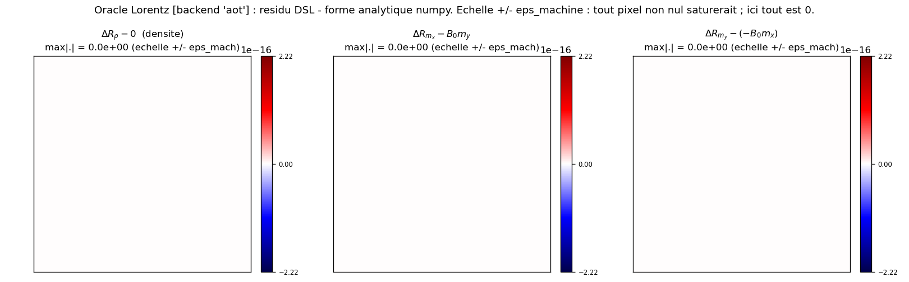
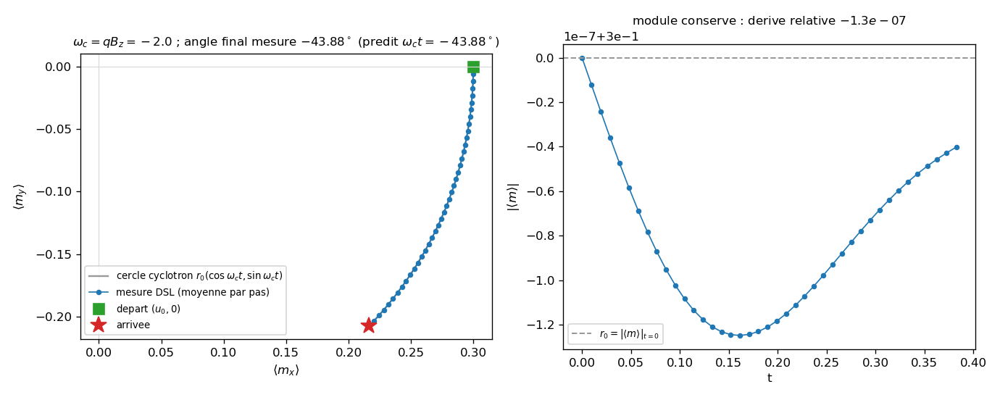

# magnetic_isothermal_dsl: magnetized isothermal fluid written as formulas, validated without a native oracle

An isothermal Euler fluid (closure $p=c_s^2\rho$) coupled to Poisson, with a Lorentz force
driven by a constant $B_z$ field read from the extended auxiliary channel (index 3). All of the physics
is declared as symbolic expressions (`adc.dsl.Model`); the DSL generates the C++, compiles it into a `.so`,
and installs it through `add_equation(...)`. Notable point: no reference native model exists for
this model (there is no core brick named "magnetic_isothermal"). Correctness is therefore not
proven against a native oracle. It is proven by (1) inter-backend parity between the production/aot backends when both
link, and (2) an analytical Lorentz oracle in numpy. On macOS, the `production` backend does not
link (ABI of the prebuilt module headers): only `aot` is exercised, and (2) carries the
proof. The physics of the Lorentz force and the isothermal closure are not re-derived here;
they point back to the core bricks and to the full magnetized case
[`../hoffart_euler_poisson_dsl/`](../hoffart_euler_poisson_dsl/).

## Contract

| Field | Content |
|---|---|
| Category (manifest) | `validation` (`cases_manifest.toml`, `magnetic_isothermal_dsl/run.py`, `ci = true`, `needs = ["cxx"]`) |
| Inputs | grid $32^2$, $L=1$, **periodic**; IC $\rho=1+0.05\cos(2\pi x)$, $m_x=0.3\rho$ ($u=0.3$), $m_y=0$; $c_s^2=1$, $q=-1$, $B_z=2$ (constant); minmod + Rusanov scheme, SSPRK2, 40 steps at CFL$=0.4$ |
| Outputs | state `(3,n,n)=[\rho,m_x,m_y]` via `get_state("plasma")`; `eval_rhs("plasma")` (local residual); 2 figures in `figures/` + `figures/provenance.json`; the DSL `.so` files under `out/magnetic_isothermal_dsl/` |
| Guaranteed invariants | the `assert` statements in `run.py`: Lorentz oracle `err_x == 0 and err_y == 0` (`run.py:217`) and density channel `max\|dR[0]\| == 0` (`run.py:221`); `lor_contrib > 0` (`run.py:222`); inter-backend parity `np.array_equal` IF $\geq 2$ backends (`run.py:196`); mass `drift < 1e-9` (`run.py:240`); rotation `\|\langle m_y\rangle\| > 1e-6` (`run.py:242`) |
| Proves | the compiled magnetic term equals exactly $(B_z m_y,\,-B_z m_x)$: `err_x = err_y = 0.000e+00` (bit equality, numpy); $B_z$ never touches the density (`dR[0]==0`); it is nonzero ($\max\|dR\|=6.299\times10^{-1}$); the mass drifts by $2.887\times10^{-15}$; the mean momentum rotates from $\langle m\rangle=(0.3,0)\to(0.2162,-0.2080)$, angle $-43.88^\circ$, to be compared with $\omega_c t=-43.88^\circ$ |
| Does not prove | not a published reproduction, and no DSL-vs-native parity here (no native "magnetic_isothermal" brick exists; the core `MagneticLorentzForce` is not wired into Python in this case). On macOS the `production` backend does not link (header ABI): inter-backend parity is skipped, a single path (`aot`) is verified. The oracle tests only the magnetic term (the $B_z\!=\!B_0$ minus $B_z\!=\!0$ difference), not the flux nor the electrostatics. Explicit regime (not the stiff condensed Schur); uniform $B_z$ |
| Provenance | adc_cpp `01873299`, adc_cases `a9541ba4`, DSL backend `aot` (production not linked), $32^2$, ~19 s wall time (2 figures, recompiles the `.so` twice), macOS arm64; `figures/provenance.json` |

By the end you will know: which core conventions the DSL formulas reproduce (table anchored to
`physics/*.hpp`), how correctness is established without a native oracle (analytical oracle + inter-backend
parity), why `production` fails on this platform, and what a divergence of the
oracle would reveal.

---

## 1. Pointer: the physics is not re-derived here

This is a DSL-equivalence case. The derivation of the magnetized isothermal-Euler system (flux, closure,
Lorentz force, source stage) belongs to the full magnetized case
[`../hoffart_euler_poisson_dsl/`](../hoffart_euler_poisson_dsl/) (targets arXiv:2510.11808, condensed
Schur). The cyclotron-rotation mechanism is that of any $q\,v\times B$ force: $v\times B$
is perpendicular to $v$, so the force does no work ($F\cdot v=0$) and the momentum
rotates at the cyclotron frequency without changing magnitude. This case does not re-derive that: it
verifies that the term compiled from the formulas has the right form. The heart of the tutorial is therefore the
table of conventions (section 2) and the proof protocol without a native oracle (sections 3-4).

Equations solved (conservative variables $U=(\rho, m_x, m_y)$, $m=\rho v$):

$$\partial_t\rho+\nabla\cdot(\rho v)=0,\qquad
\partial_t m+\nabla\cdot(\rho v\otimes v + p\,I)=q\rho\,E + q\,v\times B_z\hat z,\qquad p=c_s^2\rho,$$

with $E=-\nabla\phi$, $-\nabla^2\phi=\text{(charge density)}=q\rho$ coupled to the system Poisson.
Projected to 2D, $v\times B_z\hat z$ gives $(+B_z m_y,\,-B_z m_x)$ on the momentum, and $0$
on the energy (absent here: isothermal model, 3 variables).

---

## 2. The reproduced core conventions, anchored to `include/adc/physics/*.hpp`

The DSL names no brick: it re-declares their formulas. The bit equality (when 2 backends
link) and the analytical oracle hold only because each formula reproduces exactly the
corresponding C++ convention. The middle layer of a DSL case is not a named brick but the
expressions that `adc.dsl` compiles:

| `run.py` line (DSL expression) | Reproduced core convention | Formula |
|---|---|---|
| `m.flux(x=[mx, mx*u + cs2*rho, mx*v], y=[my, my*u, my*v + cs2*rho])` (`run.py:102-103`) | `IsothermalFlux::flux` (`hyperbolic.hpp:132-141`) | $F_x=(m_x,\,m_x u + c_s^2\rho,\,m_x v)$, $F_y=(m_y,\,m_y u,\,m_y v + c_s^2\rho)$ |
| `m.eigenvalues(x=[u-cs,u,u+cs], y=[v-cs,v,v+cs])` (`run.py:105`) | `IsothermalFlux::eigenvalues` (`hyperbolic.hpp:165-174`) | $(v_n-c_s,\,v_n,\,v_n+c_s)$, $c_s=\sqrt{c_s^2}$ |
| `q*rho*(-gx)` / `q*rho*(-gy)` (`run.py:110-111`) | `PotentialForce::apply` (`source.hpp:36-43`) | $s_1=q\rho E_x$, $E_x=-\,$`grad_x`; same for $s_2$ |
| `+ bz*my` / `- bz*mx` (`run.py:110-111`) | `MagneticLorentzForce::apply` (`source.hpp:84-93`) | $s_1=q_{om}B_z m_y$, $s_2=-q_{om}B_z m_x$, $s_3=0$ (no work) |
| `m.elliptic_rhs(q*rho)` (`run.py:118`) | `ChargeDensity::rhs` (`elliptic.hpp:19-25`) | $f=q\rho$ (right-hand side of the system Poisson) |

Three convention subtleties, verified against the code, not assumed:

- Sign of the electrostatic force. `PotentialForce` (`source.hpp:37`) sets `Ex = -a.grad_x` then
  `s[1] = qom*u[0]*Ex`. The DSL formula writes `q*rho*(-gx)`: same sign, $q\rho(-\partial_x\phi)$. Here
  `q = -1` (electron charge, as in the brick).
- The extended aux channel. `B_z` is canonical component 3 of `adc::Aux`; `MagneticLorentzForce`
  declares `n_aux = 4` (`source.hpp:82`) so that `load_aux` fills it. On the DSL side, `m.aux("B_z")`
  (`run.py:96`) declares the 4th component; `add_equation` widens the shared channel and
  `sim.set_magnetic_field(B0*ones)` (`run.py:146`) populates it. This is what the two other
  DSL demonstrators (single-species, multi-species) did not cover: a source that reads beyond the
  base contract $\phi/\nabla\phi$ (indices 0/1/2).
- No work from the magnetic term. `MagneticLorentzForce` leaves `s[3]` at $0$ even at 4 variables
  (`source.hpp:91`) because $v\times B\perp v$. The isothermal model has only 3 variables (no energy):
  the question does not arise here, but the magnitude-preserving rotation (figure 2) is the direct
  consequence.

$q_{om}=q/m$ in the brick; the case sets $q_{om}=q=-1$ (mass absorbed). So the effective cyclotron
frequency is $\omega_c=q_{om}B_z=q B_z=(-1)(2)=-2$, negative sign (clockwise gyration).

---

## 3. The falsifiable prediction: bit equality + analytical oracle (justifies Proves / Does not prove)

The case computes the prediction by two independent paths, because it has no native oracle:

**(A) Inter-backend parity** (`run.py:188-200`). If `production` and `aot` link, their `eval_rhs`
results are compared by `np.array_equal`: `assert np.array_equal(r_b, r_ref)` (`run.py:196`), without
tolerance. Both backends inline the same production path on the same generated model; any
divergence would reveal nondeterminism in the codegen or a difference in host marshaling. On macOS,
`production` does not link (section 5): this path is skipped and `run.py` prints it explicitly
(`run.py:199-200`).

**(B) Analytical Lorentz oracle** (`run.py:202-222`). The model is linked twice: $B_z=B_0=2$ and
$B_z=0$. Flux and electrostatics are identical between the two runs; the only difference is the
magnetic term. So the residual

$$\Delta R=\texttt{eval\_rhs}(B_z{=}B_0)-\texttt{eval\_rhs}(B_z{=}0)$$

must equal exactly, channel by channel, the analytical form computed in numpy:

```python
lorentz_x = B0 * my0     # +B_z m_y on momentum x (run.py:206)
lorentz_y = -B0 * mx0    # -B_z m_x on momentum y (run.py:207)
dR = eval_rhs(B0) - eval_rhs(0)
err_x = max|dR[1] - lorentz_x|   # expected 0 (run.py:211)
err_y = max|dR[2] - lorentz_y|   # expected 0 (run.py:212)
assert err_x == 0.0 and err_y == 0.0          # bit equality (run.py:217)
assert max|dR[0]| == 0.0                        # density never touched (run.py:221)
assert lor_contrib > 0.0                        # B_z read, nonzero term (run.py:222)
```

Measurement (backend `aot`): `err_x = 0.000e+00`, `err_y = 0.000e+00`, `max|dR| = 6.299e-01`. Since
$m_y(0)=0$ everywhere (IC), $\texttt{lorentz\_x}=B_0 m_y(0)\equiv 0$ and the $m_x$ channel of $\Delta R$ is
identically zero; the whole magnetic term lives in $\Delta R[2]=-B_0 m_x(0)$, in
$[-0.6299,-0.5701]$ (because $m_x(0)=0.3\rho_0$, $\rho_0=1\pm0.05$). The equality is tolerance-free: the
codegen reads `B_z` at the right index and applies the right form.

Why $== 0.0$ exactly and not $\sim10^{-16}$: $\Delta R$ subtracts two `eval_rhs` results that
differ only by the magnetic term; the flux and electrostatic contributions, identical between
the two runs, cancel bit-for-bit, and the remaining magnetic term is the same expression
`bz*my - ...` as the analytical form (same order of floating-point operations). No residual rounding.

The two other tolerances are not bit equalities but bounds justified by an order of
magnitude. `drift < 1e-9` (`run.py:240`): the finite-volume scheme is conservative, the mass is an
exact invariant and the only drift is floating-point arithmetic; measured $2.887\times10^{-15}$, ~6
orders below the bound. `|<m_y>| > 1e-6` (`run.py:242`): a lower bound separating machine noise from the
physical signal; $m_y(0)=0$ exactly, so any value above $10^{-6}$ can only come from
the Lorentz term; measured $|\langle m_y\rangle|=0.208$, ~5 orders above the bound.

---

## 4. What a divergence would reveal

The oracle is a non-regression test of the DSL codegen on the extended aux channel. A nonzero value
of each assert points to a precise fault:

- `err_x != 0` or `err_y != 0`: the compiled term is not $(B_z m_y, -B_z m_x)$. Causes: wrong
  aux index read (`B_z` confused with `phi`/`grad`), reversed sign ($+B_z m_x$ instead of $-B_z m_x$),
  or $q_{om}$ applied twice.
- `max|dR[0]| != 0`: the magnetic term has contaminated the density, which is physically impossible
  (Lorentz acts only on momentum). It would reveal a mixing of components in the codegen.
- `lor_contrib == 0`: `B_z` is not read (aux channel not widened, `set_magnetic_field` with no effect, or
  `m.aux("B_z")` forgotten); the term is zero everywhere and the model has no Lorentz force.
- parity `np.array_equal` False (when 2 backends): nondeterminism between `production` (native
  zero-copy) and `aot` (host-marshaled) on the same model: faulty marshaling or divergent summation
  order. Not tested here (a single backend).

---

## 5. Why `production` does not link on macOS

`bind_backends` (`run.py:151-169`) tries `production` then `aot` and keeps only those actually
linked. The actual output:

```
backend 'production' indisponible (RuntimeError), essai suivant
backends DSL lies : 'aot'
parite inter-backend SAUTEE (un seul backend lie ... 'aot') ; correction prouvee par l'oracle ...
```

The cause is not the two-level namespace of dlopen: it is a header ABI
incompatibility. The native loader (`add_native_block`) checks that the signature of the headers
the `.so` was compiled against matches that of the already loaded `_adc` module. Exact message captured:

```
add_native_block : ABI incompatible -- cle du loader 'compiler=Apple LLVM 21.0.0;std=202302L;
headers=079c02c0...' != cle du module 'compiler=Apple LLVM 21.0.0;std=202302L;headers=f8273719...'.
```

The `build-master` module is prebuilt: its header signature (`f8273719...`) differs from the
current `include/` tree (`079c02c0...`) that the DSL `.so` embeds. The `production` compilation
succeeds; it is the wiring that the loader rejects. The `aot` backend does not have this guard (no ABI
key checked) and stays functional. With an `_adc` module rebuilt against the same headers as
`include/`, `production` would link and inter-backend parity would then be exercised. Behavior
identical to the one documented for [`../diocotron_dsl/`](../diocotron_dsl/).

Honest consequence: on this platform the proof rests entirely on path (B) (analytical
oracle) plus the mass/rotation invariants (section 6). That is enough for what is claimed (the
magnetic term has the right form and is exercised), not for a parity of paths.

---

## 6. Figures (generated by `make_figures.py`, in `figures/`)

Generated by `python make_figures.py` (same parameters and same DSL model as `run.py`),
versioned with `figures/provenance.json`. Exact command in section 8.

### `lorentz_oracle.png`: the DSL residual compared to the analytical form



- **Proves** (asserted `run.py:217,221`): the three residual maps ($\Delta R_\rho-0$,
  $\Delta R_{m_x}-B_0 m_y$, $\Delta R_{m_y}-(-B_0 m_x)$) are identically at the neutral center (white),
  `max|.| = 0.0e+00` everywhere. The color scale is anchored to $\pm\epsilon_{\text{mach}}=2.22\times
  10^{-16}$: any nonzero pixel (beyond the last bit) would saturate to blue or red. None
  saturates: the compiled magnetic term equals the numpy form to the bit, and the density (left
  panel) is never touched.
- **Suggested (not asserted)**: nothing. The equality is exact, not approximate; there is no structure to
  read beyond zero.
- **Not shown**: the figure covers only the $B_z\!=\!B_0$ minus $B_z\!=\!0$ difference, hence only the
  magnetic term. It tests neither the isothermal flux, nor the electrostatics, nor the inter-backend
  parity (a single backend linked). A residual on the flux would go unnoticed here.

### `cyclotron_trajectory.png`: the Lorentz rotation at $\omega_c t$



- **Proved / measured** (asserted `run.py:240,242`): starting from $\langle m\rangle=(0.3,0)$ (purely
  longitudinal, $m_y=0$), the mean momentum rotates toward $(0.2162,-0.2080)$ after 40
  steps ($t=0.3829$). The measured final angle $-43.88^\circ$ matches the cyclotron prediction
  $\omega_c t=(-2)(0.3829)=-43.88^\circ$ (ratio $1.00006$). The magnitude $|\langle m\rangle|$ (right
  panel) is conserved: relative drift $-1.3\times10^{-7}$ over the horizon. The mass drifts by
  $2.887\times10^{-15}$. Since $m_y(0)=0$, any transverse component that appears ($\langle m_y\rangle=
  -0.2080$) comes exclusively from the Lorentz term: the magnetic physics is exercised.
- **Suggested (not asserted)**: the very slight departure from the analytical circle (ratio $1.00006$) and the
  slight variation of the magnitude ($\sim10^{-7}$) are the signature of the finite time
  discretization (SSPRK2, $\omega_c\,dt$ not infinitesimal) and of the pressure/Poisson dynamics superimposed on the
  rotation; no assert quantifies this departure.
- **Not shown**: no stiff regime (the condensed Schur of
  [`../schur_magnetized_cartesian/`](../schur_magnetized_cartesian/) is not tested); short horizon
  (40 steps, less than a quarter turn); no comparison to a published trajectory.

---

## 7. Limits (what this case does not capture)

- No DSL-vs-native parity. Unlike [`../diocotron_dsl/`](../diocotron_dsl/) which
  compares the DSL to `models.diocotron` (native bricks), there is no assembled native model
  "magnetic_isothermal" wired on the Python side here. The `MagneticLorentzForce` brick exists
  (`source.hpp`) but is not composed into an oracle in this case: the reference is analytical, not
  native.
- Conditional inter-backend parity. It is exercised only if $\geq 2$ backends link; on
  macOS (prebuilt module) a single one (`aot`) links, the path is skipped.
- The oracle tests only one term. By construction (difference of two runs), it isolates the
  magnetic term; the isothermal flux and the electrostatics are identical between the two and cancel.
  Their correctness rests on the fidelity of the formulas to the core conventions (table section 2),
  not on this oracle.
- Explicit regime, uniform $B_z$, short horizon. No cyclotron stiffness (Schur), constant magnetic
  field, 40 steps. You observe the rotation and the exactness of the term, not a long dynamic
  nor a published benchmark.

---

## 8. Reproduce (justifies item 14 of the checklist: command + measured cost)

```bash
cd /private/tmp/adc_cases-deeptut/magnetic_isothermal_dsl
PYTHONPATH=/Users/romaindespoulain/Documents/Stage_Romain/adc_cpp/build-master/python:/private/tmp/adc_cases-deeptut \
  /opt/homebrew/anaconda3/bin/python3.12 run.py            # the case: asserts, ~2 s
PYTHONPATH=/Users/romaindespoulain/Documents/Stage_Romain/adc_cpp/build-master/python:/private/tmp/adc_cases-deeptut \
  /opt/homebrew/anaconda3/bin/python3.12 make_figures.py   # 2 figures + provenance.json, ~19 s
```

Prerequisites: `numpy`, a C++20 compiler (`needs = ["cxx"]`: the DSL compiles a `.so` on the fly),
the adc_cpp core headers reachable (`$ADC_INCLUDE` otherwise default), and `matplotlib` for the
figures. The `adc` module must be imported with the same interpreter that compiled it (ABI
suffix `cpython-312`). The first path of `PYTHONPATH` provides the C++ module, the second makes
`adc_cases` importable (the case also has a `sys.path` fallback, `run.py:63-67`).

Expected output of `run.py` (captured, macOS arm64):

```
backend 'production' indisponible (RuntimeError), essai suivant
backends DSL lies : 'aot'
parite inter-backend SAUTEE (un seul backend lie sur cette plateforme : 'aot') ; ...
oracle Lorentz ['aot'] : err_x = 0.000e+00, err_y = 0.000e+00, max|dR| = 6.299e-01
apres 40 pas (backend 'aot') : t = 0.382939, derive de masse = 2.887e-15
qte de mvt transverse moyenne : initiale 0.000e+00 -> finale -2.080e-01 (rotation de Lorentz)
OK magnetic_isothermal_dsl (Lorentz exerce, B_z = 2.0 pilote depuis Python, backends 'aot')
```

Cost: `run.py` ~2 s (compiles 4 `.so`: production+aot for $B_z\!=\!B_0$ and $B_z\!=\!0$, then 40 steps
$32^2$); `make_figures.py` ~19 s (recompiles the `.so` and advances the trajectory). Platform
caveat: the exact equalities (`err_x = err_y = 0`, `dR[0]=0`), the signs and the order of
magnitude ($\max|dR|\sim0.63$, angle $\sim-44^\circ$) are stable; which backend actually links depends
on the ABI consistency of the module headers (`aot` if prebuilt, `production`+parity if rebuilt);
the last digits of $t$ and of the mass vary with the BLAS and the summation order (cf.
`figures/provenance.json`).

## File map

| File | Role |
|---|---|
| `run.py` | the case: magnetized DSL model, analytical Lorentz oracle, inter-backend parity (if 2), mass/rotation invariants |
| `make_figures.py` | replays the physics; writes `lorentz_oracle.png`, `cyclotron_trajectory.png` + `provenance.json` |
| `figures/*.png` | versioned assets, regenerated in place |
| `figures/provenance.json` | adc_cpp/adc_cases SHA, linked backend, resolution, measured numbers (err, $\max|dR|$, angle, drifts) |
| `../adc_cpp/include/adc/physics/source.hpp` | `PotentialForce` + `MagneticLorentzForce` bricks (conventions reproduced by the DSL) |
| `../adc_cpp/include/adc/physics/hyperbolic.hpp` | `IsothermalFlux` brick (flux + eigenvalues reproduced) |
| `../adc_cpp/include/adc/physics/elliptic.hpp` | `ChargeDensity` brick ($f=q\rho$) |
| `../hoffart_euler_poisson_dsl/` | full magnetized Euler-Poisson system (reference physics, not re-derived here) |
| `../diocotron_dsl/` | DSL demonstrator with DSL-vs-native parity (which this case lacks) |
