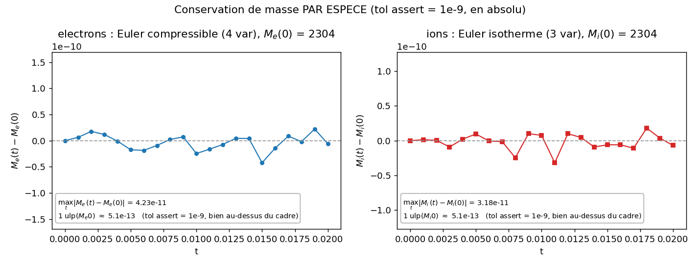
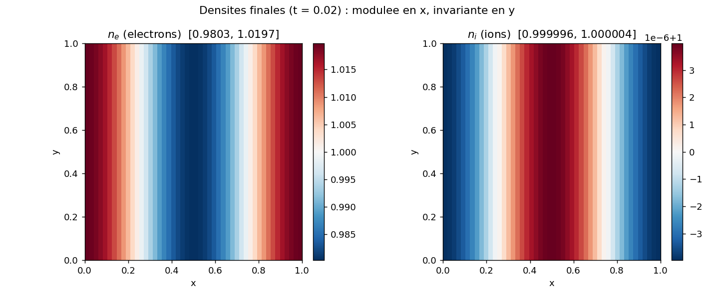
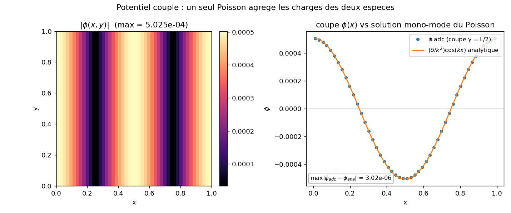

# multispecies : deux fluides heterogenes couples par un Poisson de systeme

Un `adc.System` periodique avance simultanement deux especes decrites par des modeles physiques
differents (electrons en Euler compressible a 4 variables, ions en Euler isotherme a 3
variables), couplees par un seul probleme elliptique dont le second membre agrege les charges des
deux especes. L'invariant teste est la conservation de masse par espece : meme en partageant le
meme champ electrique, chaque fluide conserve independamment sa masse, a la precision de
l'arithmetique flottante.

## Contrat

| Champ | Contenu |
|---|---|
| Categorie (manifeste) | `validation` (`ci = true`, `needs = []`, [`cases_manifest.toml:38-43`](../cases_manifest.toml)). Ce n'est pas une reproduction publiee : on verifie un invariant structurel, pas une courbe d'un papier. |
| Entrees | grille $48^2$, $L=1$, periodique ; electrons $n_e=1+\delta\cos(2\pi x/L)$ ($\delta=0.02$), ions $n_i=1$ ; charges $q_e=-1$, $q_i=+1$ ; $\gamma_e=5/3$, $c_{s,i}^2=1$ ; Poisson $\nabla^2\phi=q_e n_e+q_i n_i$, $\varepsilon=1$ ; $dt=0.001$, 20 pas |
| Sorties | `print` des masses, de $\max\lvert f\rvert$ et des bornes de densite ; 3 figures de diagnostic dans `figures/` + `figures/provenance.json` (regenerees par `make_figures.py`, hors CI) |
| Invariants garantis | les 4 `assert` de `run.py` : (1) $\max\lvert f\rvert>10^{-6}$ ; (2) $\lvert M_e-M_{e0}\rvert<10^{-9}$ et $\lvert M_i-M_{i0}\rvert<10^{-9}$ (ABSOLU) ; (3) densites finies ; (4) densites $>0$ |
| PROUVE | masse de chaque espece conservee a $10^{-9}$ alors qu'un meme Poisson les couple : derives mesurees $\max_t\lvert\Delta M_e\rvert=4.23\times10^{-11}$, $\max_t\lvert\Delta M_i\rvert=3.18\times10^{-11}$ ; densites finies et positives ($n_e\in[0.980,1.020]$, $n_i\in[1{-}4{\times}10^{-6},\,1{+}4{\times}10^{-6}]$) ; separation de charge initiale non triviale $\max\lvert f\rvert=1.9957\times10^{-2}$ |
| NE PROUVE PAS | aucun resultat physique : CI cosinus jouet, 20 pas ($t_f=0.02$), pas de longueur de Debye ni de frequence plasma, pas de taux mesure. La modulation ionique ($\sim4\times10^{-6}$) est qualitative. Aucun `assert` ne teste la quantite de mouvement, l'energie, la symetrie des especes, ni le potentiel. Mono-rang, pas de GPU/MPI/AMR. Le couplage teste n'est que le partage du Poisson : il ne valide ni la fermeture isotherme ni l'EOS compressible au-dela de "l'etat reste fini et positif" |
| Provenance | adc_cpp `01873299`, adc_cases `7c7a3403`, backend natif serie (deux blocs heterogenes + Poisson de systeme `charge_density`), $48^2$, ~0.24 s temps mur 1 lancement (macOS arm64, Python 3.12.2) ; nombres dans `figures/provenance.json` |

A la fin tu sauras : pourquoi deux fluides qui partagent un champ conservent quand meme chacun
leur masse (derivation par flux telescopiques sur le tore), comment le couplage par un unique
Poisson est cable cote API, et ce que les figures prouvent vs suggerent vs ne montrent pas.

---

## 1. Pourquoi cet invariant : masse conservee par espece sous couplage

Justifie la clause PROUVE (masse de chaque espece conservee a $10^{-9}$).

Le cas existe pour repondre a une question de structure : quand deux especes partagent le meme
champ electrique $\mathbf{E}=-\nabla\phi$, leurs bilans de masse restent-ils decouples ? La
reponse est oui, et la raison est que le champ n'entre que dans la source de quantite de
mouvement, jamais dans l'equation de continuite. Chaque espece $s$ obeit a

$$\partial_t n_s+\nabla\cdot(n_s\mathbf{v}_s)=0,\qquad \partial_t(n_s\mathbf{v}_s)+\nabla\cdot(\dots)=\frac{q_s}{m}n_s\mathbf{E}.$$

La force $\frac{q_s}{m}n_s\mathbf{E}$ apparait au second membre de la quantite de mouvement, pas
de la continuite : elle redistribue l'impulsion (et, pour les electrons a 4 variables, le travail
$\frac{q_s}{m}n_s\mathbf{v}_s\cdot\mathbf{E}$ dans l'energie), mais le membre de droite de
$\partial_t n_s+\nabla\cdot(n_s\mathbf{v}_s)=0$ reste exactement nul. La masse de chaque espece est
donc conservee independamment, et le couplage $\phi$ commun ne peut pas transferer de la masse
de l'une a l'autre. La derivation discrete de cette conservation (section 4) montre pourquoi le
schema volumes-finis herite exactement cette propriete, a l'arrondi pres.

Ce n'est pas une instabilite reproduite : la dynamique sur 20 pas est minuscule (voir section 6).
Le seul objet falsifiable est l'invariant. La separation de charge initiale (electrons modules,
ions uniformes) sert uniquement a rendre le Poisson couple non trivial : si $f\equiv 0$, le
champ serait nul et la demo ne testerait rien, d'ou l'`assert qmax0 > 1e-6` (`run.py:104`).

---

## 2. Les equations et qui les calcule

Justifie la clause Entrees (les deux modeles d'espece + le Poisson de systeme).

| Bloc | Equation resolue | Brique (`models.py`) |
|---|---|---|
| electrons (4 var $\rho,\rho u,\rho v,E$) | $\partial_t\rho+\nabla\cdot(\rho\mathbf{v})=0$ ; $\partial_t(\rho\mathbf{v})+\nabla\cdot(\rho\mathbf{v}\mathbf{v}+p\mathbf{I})=q_e\rho\mathbf{E}$ ; $\partial_t E+\nabla\cdot((E+p)\mathbf{v})=q_e\rho\mathbf{v}\cdot\mathbf{E}$ ; $p=(\gamma-1)(E-\tfrac12\rho\lvert\mathbf{v}\rvert^2)$ | `electron_euler(charge=-1, gamma=5/3)` |
| ions (3 var $\rho,\rho u,\rho v$) | $\partial_t\rho+\nabla\cdot(\rho\mathbf{v})=0$ ; $\partial_t(\rho\mathbf{v})+\nabla\cdot(\rho\mathbf{v}\mathbf{v}+c_s^2\rho\mathbf{I})=q_i\rho\mathbf{E}$ (pas d'equation d'energie : fermeture par $c_s^2$) | `ion_isothermal(charge=+1, cs2=1.0)` |
| elliptique (systeme) | $\nabla^2\phi=f=q_e n_e+q_i n_i$, $\mathbf{E}=-\nabla\phi$ ; periodique | `set_poisson(rhs="charge_density")` |

Un modele d'espece est une composition de quatre briques generiques par
`adc.Model(state, transport, source, elliptic)` (`python/adc/__init__.py:182-235`, module `adc` fourni par adc_cpp) :

| Modele | `state` | `transport` | `source` | `elliptic` |
|---|---|---|---|---|
| `electron_euler` ([`models.py:28-35`](../adc_cases/models.py)) | `FluidState(kind="compressible", gamma=5/3)` | `CompressibleFlux()` | `PotentialForce(charge=-1)` | `ChargeDensity(charge=-1)` |
| `ion_isothermal` ([`models.py:38-45`](../adc_cases/models.py)) | `FluidState(kind="isothermal", cs2=1.0)` | `IsothermalFlux()` | `PotentialForce(charge=+1)` | `ChargeDensity(charge=+1)` |

Le meme $q$ pilote `PotentialForce(charge=q)` (force $\frac{q}{m}\rho\mathbf{E}$,
`python/adc/__init__.py:146-150`) et
`ChargeDensity(charge=q)` (contribution $q\,n$ au second membre du Poisson,
`python/adc/__init__.py:158-162`) : c'est ce qui rend le
couplage physiquement coherent. Qui calcule quoi :

| Ligne `run.py` | Couche | Ce qui se passe |
|---|---|---|
| `add_block("electrons", model=models.electron_euler(...), spatial=Spatial(minmod), time=Explicit())` (`run.py:57-62`) ; idem ions (`run.py:64-69`) | Python compose | choix du modele par bloc, du schema (MUSCL minmod + Rusanov), de l'integrateur (SSPRK2) ; les deux blocs sont heterogenes (4 var vs 3 var) |
| `models.electron_euler` / `ion_isothermal` -> `CompressibleFlux` / `IsothermalFlux` / `PotentialForce` / `ChargeDensity` (`models.py`, briques du module `adc`) | brique C++ fige la physique | convention exacte du flux, de la fermeture ($\gamma$ ou $c_s^2$), de la force $\frac{q}{m}\rho\mathbf{E}$, du terme $q\,n$ injecte au Poisson |
| `assemble_rhs<minmod, rusanov>` + Poisson de systeme `geometric_mg` ($f=\sum_b q_b n_b$) | noyau par cellule (device) | le calcul reel : residu $-\nabla\cdot F+S$ par cellule et solve multigrille, sans callback Python dans le hot path |

`set_poisson(rhs="charge_density", solver="geometric_mg")` (`run.py:72`) configure un Poisson
de systeme dont le second membre est la somme des briques elliptiques de chaque bloc. Le token
`"charge_density"` est l'alias bit-identique du second membre composite generique
($\texttt{ChargeDensitySource}$ herite de $\texttt{CompositeRhs}$,
`python/adc/__init__.py:1020-1024`) quand tous les blocs
portent une densite de charge : les deux empruntent le meme chemin numerique cote C++.

---

## 3. Le code, fonction par fonction

Tout vit dans `main()` de [`run.py`](run.py). La plomberie d'import (`run.py:32-44` : `try/except`
`import adc_cases`, fallback `sys.path`) n'est pas glosee. Les lignes porteuses :

Composition du systeme (`run.py:49-72`) :

```python
sim = adc.System(n=48, L=1.0, periodic=True)                       # run.py:49-53 : maillage seul
sim.add_block("electrons", model=models.electron_euler(charge=-1.0, gamma=5.0/3.0),
              spatial=adc.Spatial(minmod=True), time=adc.Explicit())   # run.py:57-62
sim.add_block("ions", model=models.ion_isothermal(charge=+1.0, cs2=1.0),
              spatial=adc.Spatial(minmod=True), time=adc.Explicit())   # run.py:64-69
sim.set_poisson(rhs="charge_density", solver="geometric_mg")       # run.py:72 : un Poisson de systeme
```
- `adc.System(n, L, periodic)` ne porte que le maillage ($48^2$, carre $[0,1]^2$, periodique).
  La parametrisation physique ($\gamma$, $c_s^2$, charge) vit dans les briques, pas dans la config
  du systeme.
- les deux `add_block` produisent deux fermetures d'avancee compilees heterogenes : 4
  variables conservatives pour les electrons, 3 pour les ions. Le systeme les avance cote a cote
  sans les homogeneiser.
- `set_poisson(rhs="charge_density")` cable le second membre $f=\sum_b q_b n_b$ : c'est l'unique
  point ou les deux especes se rencontrent.

Condition initiale, separation de charge (`run.py:78-85`) :

```python
n = sim.nx()
x = (np.arange(n) + 0.5) / n * 1.0           # run.py:79 : centres de cellules le long de axis=1
ne = 1.0 + 0.02 * np.cos(2.0 * np.pi * x / 1.0)   # run.py:80 : electrons modules, delta = 0.02
ne2d = np.broadcast_to(ne, (n, n)).copy()    # run.py:81 : x varie le long des colonnes
ni2d = np.ones((n, n))                       # run.py:82 : ions uniformes
sim.set_density("electrons", ne2d); sim.set_density("ions", ni2d)   # run.py:84-85
```
- `set_density(name, array)` pose uniquement la densite ; le fluide reste au repos (quantite
  de mouvement nulle, energie a la valeur de fermeture du modele). C'est pourquoi la dynamique
  ulterieure reste de petite amplitude.
- la perturbation electronique $\cos(2\pi x)$ avec ions uniformes cree
  $f=q_e n_e+q_i n_i=(-1)(1+\delta\cos)+(+1)(1)=-\delta\cos(2\pi x)$, donc un second membre non nul
  qui pilote le Poisson couple.

Diagnostic et verification (`run.py:87-139`) :

```python
mass_e0 = sim.mass("electrons"); mass_i0 = sim.mass("ions")        # run.py:87-88 : masses initiales
...
sim.advance(dt, nsteps)                                            # run.py:109 : 20 pas, boucle compilee C++
...
drift_e = assert_mass_conserved(mass_e1, mass_e0, tol=1e-9, label="electrons", relative=False)  # run.py:125
drift_i = assert_mass_conserved(mass_i1, mass_i0, tol=1e-9, label="ions", relative=False)        # run.py:127
assert_finite(de, ...); assert_positive(de, ...)                  # run.py:133-136
```
- `sim.mass(name)` est la somme cellulaire $\sum_{ij}\rho_{ij}$ (pas l'integrale
  $\sum\rho\,dx\,dy$) : verifie, `mass("electrons") == np.sum(density("electrons")) == 2304.0`
  exactement (= $48\times48$, le cosinus s'integrant a 0 sur la periode). C'est l'echelle sur
  laquelle porte la tolerance absolue (section 4.2).
- `assert_mass_conserved(..., relative=False)`
  ([`checks.py:16-26`](../adc_cases/common/checks.py)) compare $\lvert M-M_0\rvert$ a `tol=1e-9` et
  renvoie la derive ; `relative=False` garde le comportement absolu historique.
- `assert_finite` / `assert_positive` ([`checks.py:29-40`](../adc_cases/common/checks.py)) : pas de
  NaN/Inf, densites strictement $>0$.

---

## 4. Maths : pourquoi chaque masse est conservee a l'arrondi pres

Justifie la clause PROUVE et la tolerance $10^{-9}$ (clause Invariants garantis).

### 4.1 Telescopage des flux sur le tore

Le schema volumes-finis met a jour la densite de chaque cellule $(i,j)$ par un bilan de flux aux
quatre faces :

$$\rho_{ij}^{n+1}=\rho_{ij}^{n}-\frac{dt}{h}\Big(F^x_{i+\frac12,j}-F^x_{i-\frac12,j}+F^y_{i,j+\frac12}-F^y_{i,j-\frac12}\Big),$$

ou $F^x_{i+\frac12,j}$ est le flux numerique (Rusanov, reconstruit en MUSCL minmod) traversant la
face entre $(i,j)$ et $(i{+}1,j)$. La masse totale d'une espece est la somme cellulaire
$M=\sum_{ij}\rho_{ij}$ (c'est exactement ce que rend `sim.mass`). En sommant la mise a jour sur
toutes les cellules, chaque flux interne apparait deux fois avec des signes opposes :
$F^x_{i+\frac12,j}$ sort de $(i,j)$ et entre dans $(i{+}1,j)$. La somme telescope :

$$M^{n+1}-M^{n}=-\frac{dt}{h}\sum_{ij}\big(\text{flux sortants}-\text{flux entrants}\big)=-\frac{dt}{h}\big(\text{flux au bord du domaine}\big).$$

Sur un domaine periodique, le bord du domaine n'existe pas : la face droite de la derniere
colonne est identifiee a la face gauche de la premiere, et le terme de bord s'annule exactement
par construction (le flux qui sort a droite rentre a gauche, meme valeur, signes opposes). Donc
$M^{n+1}=M^{n}$ a l'arithmetique exacte. C'est une propriete de conservation a la maille
(face-flux unique partage entre deux cellules voisines), independante du limiteur, du flux de
Riemann et de l'integrateur temporel.

### 4.2 Ce que le couplage change, et ce qu'il ne change pas

La source $S_s=\frac{q_s}{m}n_s\mathbf{E}$ (et le travail pour l'energie) modifie uniquement les
composantes de quantite de mouvement (et d'energie) du vecteur d'etat, pas la composante de
densite : `PotentialForce` agit sur $\rho\mathbf{v}$ (et $E$), jamais sur $\rho$. Le telescopage de
4.1 porte sur l'equation de continuite seule, dont le second membre est nul. Le champ $\phi$
commun ne peut donc pas transferer de masse : chaque espece conserve la sienne, et les deux
bilans sont decouples. C'est exactement l'invariant teste, et c'est pourquoi il tient meme avec un
Poisson partage.

La derive residuelle n'est pas nulle a cause de l'arithmetique flottante : la somme
telescopique de $\sim 2300$ termes ne s'annule pas au dernier bit (l'addition flottante n'est pas
associative, l'ordre de reduction introduit un residu). La tolerance $10^{-9}$ se place entre :
- le grain du flottant a cette echelle : $1\,\text{ulp}(M_0)=\varepsilon_{\text{mach}}\cdot 2304\approx5.1\times10^{-13}$ ;
- la magnitude qu'aurait une vraie fuite de masse (de l'ordre de la dynamique, $\sim10^{-2}$).

La derive mesuree ($\max_t\lvert\Delta M_e\rvert=4.23\times10^{-11}\approx 80\,\text{ulp}$,
$\max_t\lvert\Delta M_i\rvert=3.18\times10^{-11}\approx 62\,\text{ulp}$) vit dans cette fenetre :
20 a 80 fois le grain machine (accumulation sur 20 pas et un solve MG par pas), et 23 fois sous la
tolerance $10^{-9}$. En relatif, $4.23\times10^{-11}/2304\approx1.8\times10^{-14}$, soit $\sim80\,\varepsilon_{\text{mach}}$ :
c'est du bruit d'arrondi, pas une fuite physique. Une derive qui depasserait $10^{-9}$ trahirait un
bug de conservation (face-flux non partage, terme de bord periodique mal recolle, source ecrivant
dans $\rho$).

### 4.3 Le Poisson couple, verifie analytiquement

Le second membre est $f=-\delta\cos(kx)$ avec $k=2\pi/L$. Sur le tore, $\nabla^2\phi=f$ se resout
mode par mode : $-k^2\hat\phi=-\delta$, donc $\phi(x)=(\delta/k^2)\cos(kx)$, de pic continu
$\delta/k^2=0.02/(2\pi)^2=5.066\times10^{-4}$ (echantillonne aux centres de cellules, le max
discret vaut $5.055\times10^{-4}$, l'extremum tombant entre deux mailles). La convention de signe
est $\varepsilon\nabla^2\phi=f$ avec $\varepsilon=1$ (`python/adc/__init__.py:1008`), pas
$-\nabla^2\phi=f$ : verifie par le comportement (section 6, figure 3) ou la coupe $\phi(x)$ mesuree
suit $+(\delta/k^2)\cos(kx)$, pas son oppose. Le potentiel mesure a une amplitude
$\lvert\phi\rvert_{\max}=5.025\times10^{-4}$ contre l'analytique discret $5.055\times10^{-4}$ :
ecart $3.0\times10^{-6}$ ($\sim0.6\%$), du a la discretisation multigrille sur $48^2$ (ce n'est pas
une egalite bit, juste une coherence de signe et d'ordre de grandeur).

> Solvabilite : sur grille periodique, $\nabla^2\phi=f$ n'admet de solution que si
> $\int f=0$. Ici $f=-\delta\cos(kx)$ s'integre a 0 sur la periode (charge nette moyenne nulle,
> car $n_e$ et $n_i$ ont la meme moyenne 1) : le Poisson periodique est bien pose.

---

## 5. Methode numerique

Justifie la clause Entrees (schema) et la robustesse de l'invariant.

Le choix numerique est fait par bloc, independamment du modele. Ici les deux blocs partagent le
meme schema, mais l'API permettrait de differer (cf. recette `two_fluid` de
[`recipes.py`](../adc_cases/recipes.py) : VanLeer+HLLC sur les electrons, minmod sur les ions).

- Reconstruction : MUSCL limite par minmod (`adc.Spatial(minmod=True)`) sur les variables
  conservatives, pour les deux blocs.
- Flux de Riemann : Rusanov (defaut de `adc.Spatial`), robuste sur tout transport.
- Temporel : `adc.Explicit()` = SSPRK2 (Shu-Osher, 2 etages, ordre 2), `substeps=1`,
  `stride=1`. Pas de multirate.
- Poisson : operateur $\nabla^2$ ($\varepsilon=1$), second membre `charge_density`
  ($\sum_b q_b n_b$), solveur multigrille geometrique `geometric_mg`. L'alternative `fft`
  (periodique, $n=2^k$) est inapplicable ici ($n=48$ n'est pas une puissance de 2).
- Avancee : `sim.advance(dt=0.001, nsteps=20)`, boucle en temps compilee C++ (pas
  d'integrateur Python ici, contrairement a `composition` ou `custom_scheme`).

Aucune de ces briques ne casse le telescopage de 4.1 : minmod, Rusanov et SSPRK2 operent tous sur
des flux de face partages, donc la conservation a la maille est preservee a l'arrondi pres,
quel que soit le choix.

---

## 6. Figures (regenerees par `make_figures.py`, dans `figures/`)

`make_figures.py` re-joue la physique de `run.py` (memes briques, meme CI, memes 20 pas) en
relevant la masse par espece **a chaque pas**, puis trace trois diagnostics. Commande exacte en
section 7. Les nombres cites viennent de `figures/provenance.json`.

### `masse.png` : conservation par espece, echelle absolue



On trace $M_s(t)-M_s(0)$ (l'offset $M_0=2304$ est dans le titre), gradue en $10^{-10}$ pour rendre
visible une derive qui serait invisible a l'echelle de $2304$.

- **PROUVE** : les deux courbes oscillent au niveau $\sim4\times10^{-11}$ (electrons) et
  $\sim3\times10^{-11}$ (ions) autour de zero, soit une marche d'arrondi de quelques dizaines
  d'ulp, 23 fois sous la tolerance $10^{-9}$. C'est la preuve numerique que chaque espece
  conserve sa masse independamment malgre le Poisson partage (l'`assert` de `run.py:125-128`).
- **SUGGERE** (non assere) : l'allure en marche aleatoire (pas de derive monotone) est coherente
  avec une accumulation d'arrondi plutot qu'avec une fuite systematique ; aucun `assert` ne teste
  l'absence de tendance, seulement le maximum.
- **NON MONTRE** : la masse au-dela de 20 pas (le cas s'arrete a $t=0.02$) ; rien ne garantit que
  la derive resterait $<10^{-9}$ sur $10^5$ pas (l'accumulation d'arrondi croit lentement).

### `densite.png` : cartes finales $n_e$ et $n_i$



- **PROUVE** : $n_e\in[0.980,1.020]$ (le cosinus initial d'amplitude $0.02$, invariant en $y$) et
  $n_i\in[1{-}4\times10^{-6},\,1{+}4\times10^{-6}]$ restent finis et strictement positifs
  (`assert_finite` + `assert_positive`, `run.py:133-136`).
- **SUGGERE** : $n_i$, initialement uniforme, a developpe une modulation $\sim4\times10^{-6}$ (un
  million de fois plus petite que celle des electrons) en opposition de phase, signe que les
  ions repondent au champ $\phi$ cree par les electrons. C'est la signature visuelle du couplage
  inter-especes, mais aucun `assert` ne mesure cette amplitude ni sa phase.
- **NON MONTRE** : la quantite de mouvement et l'energie (non tracees) ; la dynamique non lineaire
  (20 pas, amplitude minuscule) ; aucune comparaison a une solution de reference.

### `potentiel.png` : un seul Poisson agrege les deux charges



- **PROUVE** : la coupe $\phi(x)$ (points) suit la solution analytique $(\delta/k^2)\cos(kx)$
  (trait) avec un residu $3.0\times10^{-6}$ ($\sim0.6\%$), et la carte $\lvert\phi\rvert$ montre les
  deux noeuds ($\phi=0$ en $x=0.25$ et $x=0.75$) du mode $\cos(2\pi x)$. Cela confirme la
  convention de signe $\nabla^2\phi=f$ (section 4.3) et que le Poisson de systeme resout bien le
  second membre agrege.
- **SUGGERE** : l'amplitude mesuree $5.025\times10^{-4}$ proche de l'analytique
  $5.055\times10^{-4}$ suggere que le multigrille a converge ; le residu $0.6\%$ est de l'erreur de
  troncature $48^2$, pas une egalite bit.
- **NON MONTRE** : aucun `assert` du `run.py` ne teste $\phi$ (le potentiel n'est verifie que par
  cette figure, hors CI) ; pas de comparaison a un solveur FFT de reference ; pas d'etude de
  convergence en $h$.

---

## 7. Reproduire

```bash
# 1. construire le module adc (si absent), depuis adc_cpp :
cmake -B build-py -DADC_BUILD_PYTHON=ON && cmake --build build-py --target _adc -j
# 2. le cas (CI, sans figure) : imprime les masses et OK multispecies
cd multispecies
PYTHONPATH=<adc_cpp>/build-py/python:<repo> python3 run.py
# 3. les figures de diagnostic (hors CI) :
PYTHONPATH=<adc_cpp>/build-py/python:<repo> python3 make_figures.py   # ecrit figures/*.png + provenance.json
```

Commande reellement executee pour ce README (build local) :

```bash
cd /private/tmp/adc_cases-deeptut/multispecies
PYTHONPATH=/Users/romaindespoulain/Documents/Stage_Romain/adc_cpp/build-master/python:/private/tmp/adc_cases-deeptut \
  /opt/homebrew/anaconda3/bin/python3.12 run.py        # ~0.24 s temps mur
```

Prerequis : Python 3.12 + numpy (matplotlib seulement pour `make_figures.py`) ; module `adc`
compile et importe avec le meme interpreteur que celui qui l'a construit (suffixe ABI
`cpython-312`). Aucun compilateur C++ requis pour `run.py` (`needs = []`) : ce cas ne compile
rien a la volee, tout passe par des briques natives deja dans le module `adc`. Sortie attendue de
`run.py` :

```
[init] masse electrons mass_e0 = 2.304000000000e+03
[init] separation de charge max|f| = 1.995718e-02
[t=0.0200] separation de charge max|f| = 1.974902e-02
[diag] derive masse electrons |dM_e| = 5.912e-12
[diag] derive masse ions      |dM_i| = 6.821e-12
[diag] n_e dans [0.980255, 1.019745]
[diag] n_i dans [0.999996, 1.000004]
OK multispecies
```

Note de lecture : la separation de charge passe de $1.9957\times10^{-2}$ a $1.9749\times10^{-2}$
(legere relaxation, couplage actif). Le `|dM|` final imprime par `run.py` ($5.9\times10^{-12}$,
$6.8\times10^{-12}$) est la derive au pas 20 ; `make_figures.py` rapporte le maximum sur les
20 pas ($4.23\times10^{-11}$, $3.18\times10^{-11}$), plus grand car il echantillonne toute la
trajectoire. Les signes et l'ordre de grandeur sont stables ; les derniers chiffres varient avec la
BLAS et l'ordre de sommation du multigrille (cf. `figures/provenance.json`).

`band_instability.py` n'a pas d'equivalent ici : ce cas est son propre test (chaque invariant est
un `assert`, un echec fait sortir en `AssertionError` et rend la CI rouge).

## Carte des fichiers

| Fichier | Role |
|---|---|
| [`run.py`](run.py) | le cas (CI) : compose 2 blocs heterogenes + Poisson de systeme, pose la CI, avance 20 pas, `print` + `assert` |
| [`make_figures.py`](make_figures.py) | rejoue la physique, releve la masse par pas, trace `masse/densite/potentiel.png` + `provenance.json` (hors CI) |
| `figures/*.png`, `figures/provenance.json` | diagnostics versionnes, SHA adc_cpp/adc_cases, backend, resolution, nombres mesures |
| [`adc_cases/models.py`](../adc_cases/models.py) | `electron_euler()`, `ion_isothermal()` (compositions de briques d'espece) |
| [`adc_cases/common/checks.py`](../adc_cases/common/checks.py) | `assert_mass_conserved`, `assert_finite`, `assert_positive` |
| [`cases_manifest.toml`](../cases_manifest.toml) | declare le cas : `validation`, `ci = true`, `needs = []` |
| [`../two_species_dsl/`](../two_species_dsl/) | la meme physique ecrite entierement en formules (`adc.dsl.Model`, `needs = ["cxx"]`), equivalence au natif par espece |
