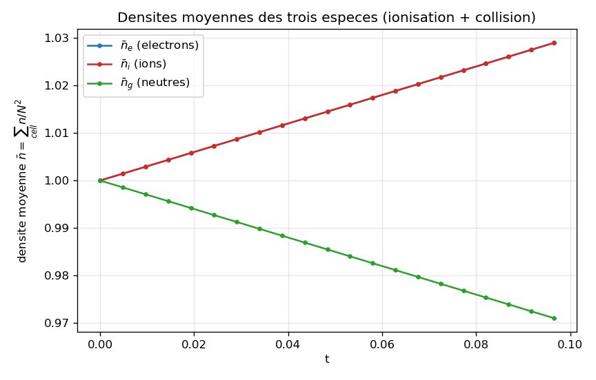
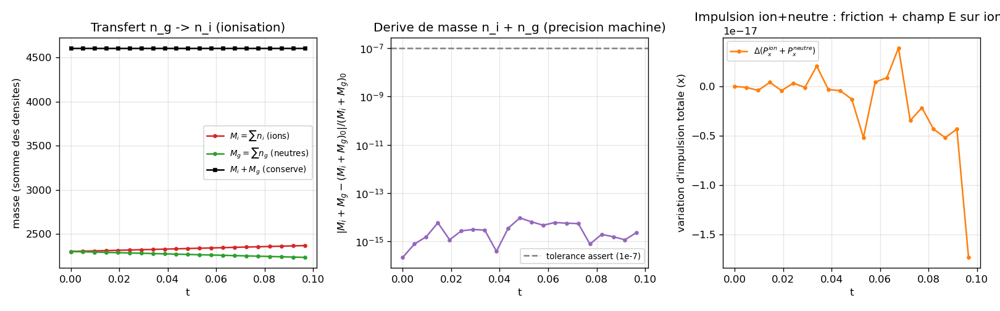
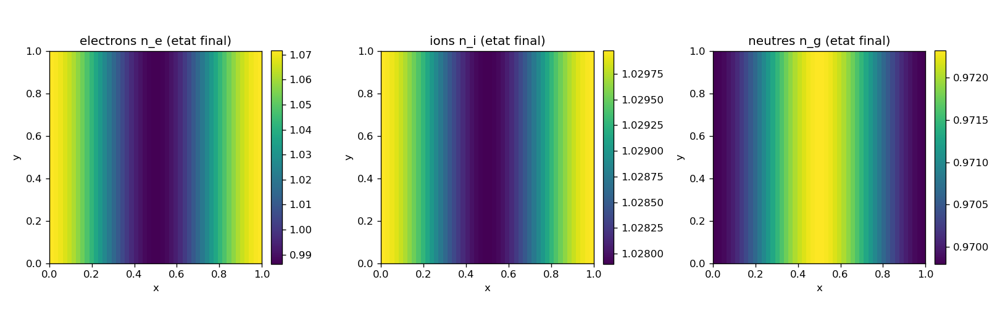

# plasma: three species (e + i + n) coupled by Poisson, ionization, and collision

Validation of the multi-species coupling plumbing in `adc.System`: three fluids (compressible
Euler electrons, isothermal ions and neutrals) share one system Poisson solve and exchange mass
through ionization ($n_g \to n_i + n_e$) and momentum through ion-neutral friction. The case does
not reproduce any published plasma: it measures three structural invariants (nonzero field, mass
$n_i + n_g$ conserved under transfer, finite and positive densities) and asserts them. The
falsifiable prediction is an exact invariant, not a target physical number.

## Contract

| Field | Content |
|---|---|
| Category (manifest) | `validation` (`cases_manifest.toml`, `ci = true`, `needs = []`). This is not a published reproduction: you verify invariants, not a curve from a paper. |
| Inputs | grid $48^2$, $L=1$, periodic; IC: $n_e = 1 + 0.05\cos(2\pi x)$ (weak charge separation), $n_i = n_g = 1$, all at rest; $q_e=-1$, $q_i=+1$, $q_g=0$; $\gamma_e=5/3$, $c_s^2=1$; $k_{ion}=0.3$, $k_{col}=0.5$; 20 macro-steps at CFL $0.3$ |
| Outputs | initial $\lvert\phi\rvert_{max}$; masses $M_i, M_g$ before/after; min of the three densities; 3 diagnostic figures in `figures/` + `figures/provenance.json` |
| Guaranteed invariants | the 4 `assert`s in `main` (run.py): (1) $\lvert\phi\rvert_{max}>10^{-8}$; (2) $M_g$ drops and $M_i$ rises (each $>10^{-6}$); (3) relative drift of $M_i+M_g$ below $10^{-7}$; (4) finite densities $>0$ |
| Proves | (1) the system Poisson solve is active: $\lvert\phi\rvert_{max}=1.266\times10^{-3}$; (2) ionization transfers mass from neutral to ion: $M_g\!:2304\to2237.32$, $M_i\!:2304\to2370.68$; (3) this transfer conserves $M_i+M_g$ to $2.37\times10^{-15}$ (machine precision); (4) the three densities stay finite and $>0$ (min $e=0.986$, $i=1.028$, $n=0.970$) |
| Does not prove | ionization only acts on density (comp 0): the momentum and energy transfer of the created particles is a core simplification (`add_ionization` in system.cpp), no assert tests it. Friction neglects heating (`add_collision` in system.cpp). No total energy, no growth rate, no physical cross-section: $k_{ion}, k_{col}$ are demonstration constants. No magnetization, no ExB drift (see [`../diocotron/`](../diocotron/)). $48^2$/20 steps: no convergence |
| Provenance | adc_cpp `01873299`, adc_cases `7c7a3403`, native serial backend, $48^2$, ~0.2 s on 1 CPU core; `figures/provenance.json` |

By the end you will know: why a system Poisson solve couples three charged fluids differently, why
ionization conserves $n_i+n_g$ exactly (the source term is antisymmetric to machine precision), how
friction conserves the momentum of the ion-neutral pair, and what the model does not capture
(momentum/energy of the ionized particles, friction heating).

---

## 1. The physical mechanism

Three fluids occupy the same periodic square. What links them is not transport (each species
advects its own density), but three couplings applied after transport:

1. **Self-consistent field.** Electrons ($q_e=-1$) and ions ($q_i=+1$) are sources of the potential
   through $-\nabla^2\phi = f = q_e n_e + q_i n_i$. Neutrals ($q_g=0$) do not enter it. At the
   initial instant, $n_e$ is modulated ($1+0.05\cos 2\pi x$) and $n_i$ is uniform:
   $f=-n_e+n_i=-0.05\cos 2\pi x$ is nonzero, so $\phi$ is nonzero too. The charge separation is what
   turns on the Poisson solve.

2. **Ionization $n_g \to n_i + n_e$.** A neutral hits an electron, loses an electron, and becomes an
   ion; there is now one more ion and one more electron, one fewer neutral. The local rate is
   $r = k_{ion}\,n_e\,n_g$ (proportional to the density of both reactants). Mass moves from the
   neutral reservoir to the ionized reservoir: $n_g$ drops, $n_i$ and $n_e$ rise by the same amount.

3. **Ion-neutral friction.** Ions and neutrals exchange momentum through collisions: a force
   $\mathbf{F}=k_{col}(\mathbf{u}_i-\mathbf{u}_g)$ slows the fast species and accelerates the slow
   one, opposite on each fluid. This is an internal transfer: the total momentum of the ion-neutral
   pair is conserved by friction alone.

The core of this case is coupling 2: its invariant ($n_i+n_g$ conserved) is exact because the
source term is written antisymmetric (what leaves $n_g$ enters $n_i$, see section 4). It is this
invariant that the figures in section 6 confront. Coupling 3 is wired and active but its momentum
invariant is not asserted here (justified in section 7).

---

## 2. The equations and who computes them

Three fluids on periodic $[0,L]^2$. Transport (each species) then couplings (operator-split):

| Species | Transport | Field source | Couplings applied |
|---|---|---|---|
| electrons (Euler, $\gamma=5/3$) | $\partial_t U_e + \nabla\cdot F(U_e) = 0$, $U_e=(\rho_e,\rho_e\mathbf{u}_e,E_e)$ | $\tfrac{q_e}{m}\rho_e\mathbf{E}$ (+ work) | ionization (density gain) |
| ions (isothermal, $c_s^2=1$) | $\partial_t U_i + \nabla\cdot F(U_i) = 0$, $U_i=(\rho_i,\rho_i\mathbf{u}_i)$ | $\tfrac{q_i}{m}\rho_i\mathbf{E}$ | ionization (gain), friction |
| neutrals (isothermal, $c_s^2=1$) | $\partial_t U_g + \nabla\cdot F(U_g) = 0$, $U_g=(\rho_g,\rho_g\mathbf{u}_g)$ | none ($q_g=0$) | ionization (loss), friction |

Shared elliptic coupling: $-\nabla^2\phi = q_e n_e + q_i n_i$, $\mathbf{E}=-\nabla\phi$, periodic.
Each species is a named model on the application side (`adc_cases.models`), composed of generic
bricks by `adc.Model(state, transport, source, elliptic)`:

| Species | `models.*` (`models.py`) | State | Transport | Source | Elliptic |
|---|---|---|---|---|---|
| electrons | `electron_euler` (in models.py) | `FluidState(compressible, gamma=5/3)` | `CompressibleFlux` | `PotentialForce(q=-1)` | `ChargeDensity(q=-1)` |
| ions | `ion_isothermal` (in models.py) | `FluidState(isothermal, cs2=1)` | `IsothermalFlux` | `PotentialForce(q=+1)` | `ChargeDensity(q=+1)` |
| neutrals | `neutral_isothermal` (in models.py) | `FluidState(isothermal, cs2=1)` | `IsothermalFlux` | `NoSource` | `ChargeDensity(q=0)` |

`ChargeDensity(q=0)` is present but null on the neutrals: they are declared to the Poisson solve
with a zero weight, so they do not contribute to it. Who computes what (3-layer table, anchored on
the actual lines of `recipes.plasma` (`plasma` in recipes.py), triggered by `main` in run.py):

| Symbol | Layer | What happens |
|---|---|---|
| `recipes.plasma(sim, ne, ni, ng, ...)` (`main` in run.py) -> `add_block` x3 + `set_poisson` + `add_ionization` + `add_collision` (`plasma` in recipes.py) | Python composes | choice of the 3 models, of the schemes (electrons HLLC+vanleer+primitive; ions/neutrals minmod), of the system Poisson solve, of the 2 couplings |
| `models.electron_euler/ion_isothermal/neutral_isothermal` -> bricks `CompressibleFlux` / `IsothermalFlux` / `PotentialForce` / `ChargeDensity` (`include/adc/physics/*.hpp`) | C++ brick fixes | the exact convention of the flux, of the force $q\rho\mathbf{E}$, of the Poisson right-hand side $\sum_b q_b n_b$ |
| `assemble_rhs<Limiter,Flux>` per block + `GeometricMG` (Poisson) + ionization/collision functors (`add_ionization` / `add_collision` in system.cpp) | per-cell kernel (device) | the actual transport and the two couplings, with no Python callback in the hot path |

The word "plasma" lives in `recipes.py`, never on the core side: it is a composition of generic
bricks, not a hard-coded scenario.

---

## 3. The falsifiable prediction: the invariant $n_i + n_g = \text{const}$

Since this case is `validation`, its prediction is not a rate but an exact invariant: every ionized
neutral becomes exactly one ion, so

$$\frac{d}{dt}\big(M_i + M_g\big) = 0, \qquad M_s \equiv \sum_{\text{cell}} n_s .$$

The derivation (section 4) shows why: the source term is antisymmetric between $n_i$ and $n_g$ to
machine precision. The artifact that confronts this prediction is `ionization.png` (section 6): the
black curve $M_i+M_g$ must be flat, and the relative drift must stay below the assert tolerance
$10^{-7}$. This is the Proves (3) clause. The Proves (2) clause (direction of transfer) and Proves
(1) (Poisson active) are confronted by the same figures. The Does not prove clause (momentum/energy
ignored) is justified in section 4 (what the functor does not write) and in section 7.

---

## 4. Math: why ionization conserves $n_i+n_g$ and not energy

### 4.1 The ionization source term is antisymmetric by construction

Ionization is applied operator-split after transport. The C++ functor (`add_ionization` in system.cpp)
computes, per cell, a single scalar $\delta n = \Delta t\,k_{ion}\,n_e\,n_g$ then distributes it:

```cpp
const Real dn = dt * k * ue(i, j, de) * ug(i, j, dg);   // delta_n = dt k n_e n_g
ug(i, j, dg) -= dn;                                      // neutre : -delta_n
ui(i, j, di) += dn;                                      // ion    : +delta_n
ue(i, j, de) += dn;                                      // electron: +delta_n
```

- `de`, `di`, `dg` are the density component indices of each block, resolved by role
  (`role_index(..., Density, 0)` in system.cpp): a block that stores its density somewhere
  other than index 0 stays correctly coupled.
- $n_g$ loses exactly what $n_i$ gains: the same $\delta n$ is subtracted from one and added to the
  other. The cell-by-cell sum $n_i+n_g$ is therefore invariant up to floating-point arithmetic;
  summing over all cells, $M_i+M_g$ is conserved. This is the origin of the measured
  $2.37\times10^{-15}$ (sum of $48^2$ floating-point cancellations, not an exact zero).
- $n_e$ also gains $\delta n$ (the freed electron is not destroyed): $n_e$ and $n_i$ grow by the
  same amount. This is checkable: the final electron and ion masses are identical to $10^{-13}$
  ($2370.677033292462$ vs $2370.677033292496$, `provenance.json`). $M_e$ is therefore not conserved
  (electrons are created, not just advected); only the pair $M_i+M_g$ is.

### 4.2 What the functor does not write (the simplification, Does-not-prove clause)

The three lines above touch only the density component (comp 0). They write neither the momentum
(comp 1, 2) nor the energy (comp 3 of the electrons). Physically, a created ion should be born with
the momentum of the neutral it came from, and the freed electron carries away an energy; here none
of that is transferred. The core comment says so: "the momentum / energy transfer (fluid species) is
a later refinement" (`add_ionization` in system.cpp). Concrete consequence: the total energy is neither
defined nor controlled, and no assert bears on it. The conservation we assert (`drel < 1e-7`) is
only a mass conservation of $n_i+n_g$, not of momentum or energy.

### 4.3 Friction conserves the pair's momentum, not the energy

The collision functor (`add_collision` in system.cpp) computes the friction force per cell and opposes it on
each species:

```cpp
const Real fx = dt * k * (ua(i,j,mxa)/ua(i,j,da) - ub(i,j,mxb)/ub(i,j,db));  // dt k (u_a - u_b)
ua(i, j, mxa) -= fx;  ub(i, j, mxb) += fx;                                   // opposee
```

- `mxa`, `mxb` (and `mya`, `myb`) are the momentum components $\rho u$ resolved by role
  (`add_collision` in system.cpp); `da`, `db` are the densities (to reconstruct $u=\rho u/\rho$).
- The force is $\mathbf{F}=k_{col}(\mathbf{u}_a-\mathbf{u}_b)$, removed from $a$, added to $b$: the
  sum $\rho_a\mathbf{u}_a + \rho_b\mathbf{u}_b$ changes by $-fx + fx = 0$. The total momentum of the
  ion-neutral pair is conserved by friction. Measured: final
  $\Delta(P_x^{ion}+P_x^{neutre})=-1.7\times10^{-17}$, the machine zero (figure `ionization.png`,
  panel 3).
- The friction heating (the dissipated heat, $\propto k_{col}|\mathbf{u}_a-\mathbf{u}_b|^2$) is not
  returned to the energy: "friction heating (energy) is a later refinement" (`add_collision` in system.cpp).
  This is consistent for isothermal species (without an energy equation), but it is a simplification
  to name.

### 4.4 Why the tolerance $10^{-7}$

`assert drel < 1e-7` (in run.py) sits between two scales: the noise of the floating-point
antisymmetry (measured $2.37\times10^{-15}$, i.e. the sum of $48^2$ cancellations) and any
structural violation that would betray a distribution bug (if the functor subtracted from $n_g$
something other than what it adds to $n_i$, the drift would be of the order of the ionized fraction,
$\sim 3\times10^{-2}$ here). $10^{-7}$ is well above the noise and far below a real mass leak: seven
orders of magnitude of margin. The tolerance is not posited, it separates two measured regimes.

---

## 5. Initial conditions (`main` in run.py)

Set in numpy (the scenario physics lives on the application side, never in C++ per case):

```python
n, L = 48, 1.0
x  = (np.arange(n) + 0.5) / n                                     # centres de cellules le long de x
ne = 1.0 + 0.05 * np.cos(2 * PI * x)[None, :] * np.ones((n, n))   # electrons modules le long de x
recipes.plasma(sim, ne=ne, ni=np.ones((n, n)), ng=np.ones((n, n)),
               ionization_rate=0.3, collision_rate=0.5)           # ions/neutres uniformes
```

- **Electrons**: $1+0.05\cos(2\pi x)$, 5% modulation along $x$, constant in $y$. This is the only
  source of nontriviality for the Poisson solve: $f=-n_e+n_i=-0.05\cos 2\pi x$.
- **Ions, neutrals**: uniform at $1$. All fluids start at rest: `set_density` only sets the density,
  the rest of the conservative state is completed at rest by the block's model.
- Grid convention (`adc_cases.common.grid`): `field[j, i]`, center $x=(i+0.5)/n\,L$. The modulation
  depends only on column $i$ (the $x$ axis), hence final maps **striped in $x$** (section 6).

The time advance: `sim.step_cfl(0.3)` x20 (in run.py), $dt$ chosen at CFL $0.3$ at each
macro-step. The measured final time is $t=0.0965$ (`provenance.json`). Schemes: electrons
`Spatial(vanleer, hllc, primitive)` (primitive reconstruction = positivity of $\rho,p$ for Euler);
ions/neutrals `Spatial(minmod)` (rusanov flux by default). SSPRK2 integrator by default.

---

## 6. Figures (diagnostic, `figures/`, generated by `make_figures.py`)

`make_figures.py` replays the same IC, recipe, number of steps, and CFL as `run.py`, but
instruments the loop to record the history. Command in section 8.

### `densities.png`: mean densities of the three species vs t



- **Proves** (clause 2): the mean ion density rises ($\bar n_i\!:1\to1.0289$) and that of the
  neutrals falls ($\bar n_g\!:1\to0.9711$) in exactly opposite fashion: ionization empties the
  neutral reservoir into the ionized reservoir. Equal and opposite-sign initial slopes (asserted by
  $M_g<M_{g,0}$ and $M_i>M_{i,0}$, in run.py).
- **Suggested (not asserted)**: the electron curve (blue) is invisible, hidden under the ion curve
  (red): $\bar n_e=\bar n_i$ to $10^{-13}$ (section 4.1, $n_e$ and $n_i$ gain the same $\delta n$).
  Visible to the eye, but no assert compares $M_e$ with $M_i$.
- **Not shown**: the very slight curvature (the rate $k n_e n_g$ depends on $n_e n_g$, which
  evolves); over $t<0.1$ and a 3% ionized fraction, the evolution stays nearly linear. No saturation
  (the neutral is not depleted).

### `ionization.png`: ionization balance, conservation, and momentum



- **Proves** (clause 3), left panel: $M_i$ (red) and $M_g$ (green) diverge mirror-wise, but their
  sum $M_i+M_g$ (black) is rigorously flat at $4608=2\times2304$. The transfer neither creates nor
  destroys $i\!+\!g$ mass.
- **Proves** (clause 3), center panel: the relative drift of $M_i+M_g$ stays around $10^{-15}$
  (machine precision), eight orders of magnitude below the assert tolerance $10^{-7}$ (gray line):
  the functor antisymmetry (section 4.1) holds to the bit. This is the observable that proves the
  invariant, not just makes it plausible.
- **Suggested / Not shown**, right panel: the change in total momentum of the ion-neutral pair stays
  at the machine zero ($\sim10^{-17}$). Friction conserves this momentum (section 4.3); here it is
  nearly null anyway because the velocities start from zero and stay small. The panel suggests
  conservation but does not prove it (no assert on momentum in this case; see section 7): at zero
  velocity, it is an undemanding test.

### `density_map.png`: density maps at the final state



- **Proves** (clause 4): the three maps are finite and everywhere positive (min $e=0.986$,
  $i=1.028$, $n=0.970$; asserted in run.py). No negative trough, the electron primitive and the
  isothermal minmod hold positivity.
- **Suggested (not asserted)**: ions and neutrals, started uniform, have developed an $x$ modulation
  that copies the electron pattern (ion: maximum where $n_e$ is dense; neutral: negative
  photograph). Cause: the local rate $k\,n_e\,n_g$ is proportional to $n_e$, so you ionize more
  where electrons are dense. This is a direct (and correct) consequence of the coupling, but no
  assert verifies it: a signature, not a guarantee.
- **Not shown**: no dynamics in $y$ (IC invariant in $y$, advection at rest); no nonlinear structure
  (run too short, gradients too weak).

---

## 7. What the invariants do not capture

The oracle of this case is the plumbing, not a reference physics. The departures from the "true"
plasma are structural and assumed:

1. **Ionization without momentum or energy** (section 4.2). The functor only writes the density. A
   created ion should inherit the source neutral's momentum and the electron an energy; here the
   created particles appear at the thermodynamic rest of the receiving fluid. The asserted
   conservation therefore bears only on $n_i+n_g$.

2. **Friction without heating** (section 4.3). The friction heat is not returned to the energy.
   Consistent for isothermal species, but it would be wrong if you activated the ion energy.

3. **Collision momentum not asserted here.** The right panel of `ionization.png` shows a momentum at
   the machine zero, but (a) the velocities start from zero, so the test is undemanding, and (b) the
   field $\mathbf{E}$ also acts on the ions ($q_i\rho_i\mathbf{E}$), so that the momentum of the ions
   alone is not conserved: only friction, in isolation, conserves the pair. The momentum
   conservation of pure friction is verified separately in the `adc_cpp` bindings test, not in this
   assembled case.

4. **Non-physical rates.** $k_{ion}=0.3$, $k_{col}=0.5$ are demonstration constants, with no cross
   section and no temperature dependence. The 3% ionized fraction at $t=0.0965$ has no calibrated
   meaning.

5. **No magnetization, Cartesian geometry, short run.** No $B$ field, no ExB drift (for that see
   [`../diocotron/`](../diocotron/), the drift limit of a scalar density); $48^2$/20 steps exercises
   the coupling, measures no convergence.

---

## 8. Reproduce

The case (asserts, ~0.2 s):

```bash
cd /private/tmp/adc_cases-deeptut/plasma
PYTHONPATH=/Users/romaindespoulain/Documents/Stage_Romain/adc_cpp/build-master/python:/private/tmp/adc_cases-deeptut \
  /opt/homebrew/anaconda3/bin/python3.12 run.py
```

Expected output (deterministic, re-runs identically; the last digits vary with the BLAS and the
floating-point summation order, but signs and orders of magnitude are stable):

```
== plasma : electrons + ions + neutres (Poisson + ionisation + collision) ==
  |phi|_max = 1.266e-03  (Poisson de systeme actif)
  ionisation : n_i 2304.0000 -> 2370.6770,  n_g 2304.0000 -> 2237.3230,  (n_i+n_g) drel = 2.37e-15
  densites   : min e=9.862e-01 i=1.028e+00 n=9.698e-01 (toutes finies et positives : True)
OK plasma
```

The diagnostic figures (replays the physics, ~0.5 s, writes `figures/*.png` + `provenance.json`):

```bash
PYTHONPATH=/Users/romaindespoulain/Documents/Stage_Romain/adc_cpp/build-master/python:/private/tmp/adc_cases-deeptut \
  /opt/homebrew/anaconda3/bin/python3.12 make_figures.py
```

Prerequisites: `numpy`, `matplotlib` (figures only; the `run.py` case needs only `numpy`), and the
`adc` module compiled, imported **with the same interpreter** that compiled it (ABI suffix
`cpython-3XY`). In CI, only `run.py` runs (`category="validation"`, `ci=true`, `needs=[]`); the
figures are out of CI.

## File map

| File | Role |
|---|---|
| `run.py` | the case: sets the IC, wires `recipes.plasma`, 20 steps, 4 asserts (sec. 4, 6) |
| `make_figures.py` | replays the instrumented physics, plots the 3 figures + `provenance.json` |
| `figures/*.png`, `figures/provenance.json` | tutorial diagnostics (out of CI) + measured numbers |
| `../adc_cases/recipes.py` (`plasma`) | system recipe: 3 blocks + Poisson + ionization + collision |
| `../adc_cases/models.py` | species models: `electron_euler`, `ion_isothermal`, `neutral_isothermal` |
| `../adc_cases/common/checks.py` (`relative_drift`) | protected relative drift, mass invariant |
