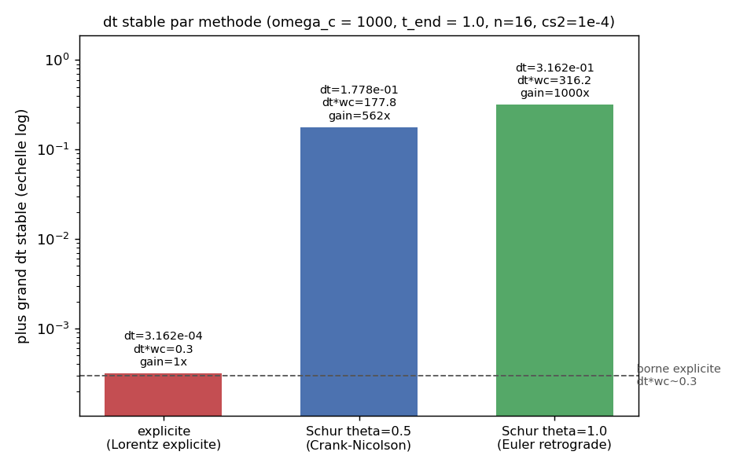
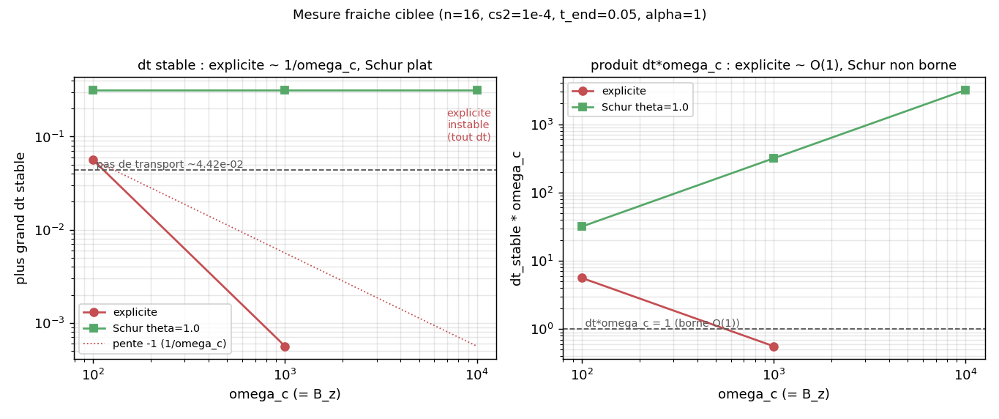

# schur_magnetized_cartesian : le complement de Schur leve la borne cyclotronique explicite

Etude de timing. Un fluide isotherme magnetise cartesien raide est integre de deux facons : la force
de Lorentz $m\times\Omega$ avancee explicitement (apres le transport), ou condensee dans un etage
source implicite par complement de Schur (`CondensedSchurSourceStepper`). On mesure pour chacune le
plus grand pas de temps stable et on confronte la prediction falsifiable : l'explicite plafonne a
$dt\,\omega_c=O(1)$ (borne de la rotation cyclotronique), le Schur retire cette borne et le pas
n'est plus limite que par le transport. La physique du modele isotherme magnetise n'est pas
re-derivee ici : elle renvoie a [`../magnetic_isothermal_dsl/`](../magnetic_isothermal_dsl/).

## Contrat

| Champ | Contenu |
|---|---|
| Categorie (manifeste) | `experimental` (`cases_manifest.toml`, `schur_magnetized_cartesian/run.py`, `ci = false`, `needs = ["cxx"]`). Prototype de mesure : chemin non finalise (etage Schur branche par un hook prive, backend AOT), pas une reproduction publiee. |
| Entrees | grille $16^2$, $L=1$, **periodique** ($h=0.0625$) ; CI $\rho=1+0.05\cos(2\pi x)$, vitesse oblique $u=v=0.5$ ; $c_s^2=10^{-4}$ (transport lent, non limitant), $q=-1$, $\alpha=1$, $B_z=\omega_c$ constant ; minmod + Rusanov, transport SSPRK2 (AOT) ; etage Schur $\theta\in\{0.5,1.0\}$ |
| Sorties | `dt_stable` par methode (explicite / Schur $\theta{=}0.5$ / Schur $\theta{=}1.0$), produit $dt\,\omega_c$, gain ; console + `out/<cas>/dt_stable.csv` (option `--csv`) ; 2 figures dans `figures/` + `figures/provenance.json` |
| Invariants garantis | aucun `assert` : c'est une mesure, pas une validation. Le critere de stabilite est `is_stable` (`run.py:152-161`) : a un $dt$ donne, la densite reste finie, $\lvert\rho\rvert_{\max}\le 10^3$ et $\rho_{\min}\ge -10^{-2}$ a chaque pas jusqu'a $t_{end}$ |
| PROUVE (mesure, non assere) | explicite : $dt_{stable}\propto 1/\omega_c$ (mesure $5.62\times10^{-2}\to5.62\times10^{-4}$ de $\omega_c{=}10^2$ a $10^3$, facteur exactement 100), produit borne $dt\,\omega_c\le O(1)$ ; a $\omega_c{=}10^4$ aucun $dt$ teste n'est stable ($dt_{stable}=0$). Schur : $dt_{stable}=3.16\times10^{-1}$ independant de $\omega_c$, cale sur le transport ; gain mesure 562x ($\omega_c{=}10^3$, run complet) jusqu'a non borne ($\omega_c{=}10^4$) |
| NE PROUVE PAS | pas une reproduction publiee ; aucune fidelite a un papier (la cible Hoffart [arXiv:2510.11808](https://arxiv.org/abs/2510.11808) est le cas separe [`../hoffart_euler_poisson_dsl/`](../hoffart_euler_poisson_dsl/), lui-meme `reproduction-candidate` PENDING). L'etage Schur est branche par le hook prive `sim._s.set_source_stage(...)`, pas par `adc.Split(Explicit, CondensedSchur)` (non cable sur AOT). `dt_stable` est une borne discrete (balayage geometrique au quart de decade), pas un seuil fin ; le critere de stabilite est heuristique (finitude+bornes+positivite), pas spectral. Cas raide fabrique ($c_s^2$ minuscule) : le gain est propre a ce point de fonctionnement |
| Provenance | adc_cpp `01873299`, adc_cases `a9541ba4`, backend DSL `aot`, $16^2$, macOS arm64 ; figure (1) lue du run complet documente `out/dt_stable.csv` ($\omega_c{=}10^3$, $t_{end}{=}1$), figure (2) d'une mesure fraiche ciblee (3 $\omega_c$, $t_{end}{=}0.05$, ~231 s les trois balayages) ; `figures/provenance.json` |

A la fin tu sauras : pourquoi la rotation cyclotronique impose $dt\,\omega_c<O(1)$ a l'explicite,
quel operateur implicite le Schur condense resout pour lever cette borne (ancre
`lorentz_eliminator.hpp` / `condensed_schur_source_stepper.hpp`), comment `largest_stable_dt` mesure
le seuil, et pourquoi cette mesure passe par un hook prive et un backend AOT.

---

## 1. Renvoi : la physique du fluide n'est pas re-derivee ici

Le modele isotherme magnetise (flux, valeurs propres, fermeture $p=c_s^2\rho$, force de Lorentz,
Poisson de systeme) appartient au cas [`../magnetic_isothermal_dsl/`](../magnetic_isothermal_dsl/),
qui le valide (oracle analytique du terme de Lorentz, rotation cyclotron a module conserve). Le
present cas reutilise ces equations sans les rejouer et mesure une propriete de l'integrateur. Les
equations resolues (variables conservatives $U=(\rho,m_x,m_y)$, $m=\rho v$, $\Omega=\omega_c\hat z$,
$\omega_c=B_z$) :

$$\partial_t\rho+\nabla\cdot(\rho v)=0,\qquad
\partial_t m+\nabla\cdot\!\Big(\tfrac{m\,m^{\mathsf T}}{\rho}+c_s^2\rho\,I\Big)=q\rho(-\nabla\phi)+m\times\Omega,\qquad
\Delta\phi=q\rho.$$

Projetee en 2D, la rotation $m\times\Omega$ donne $(+B_z m_y,\,-B_z m_x)$ sur la quantite de
mouvement et $0$ sur l'energie ($v\times B\perp v$) : c'est exactement la convention
`MagneticLorentzForce` (`source.hpp:84-93`), $s_1=+q_{om}B_z m_y$, $s_2=-q_{om}B_z m_x$. Cette
rotation est le terme raide : elle fait tourner $m$ a la pulsation $\omega_c$ sans la dissiper. Plus
$\omega_c$ est grand, plus la rotation est rapide, plus l'avancee explicite doit prendre un pas fin
pour la suivre. Justifie la clause PROUVE (la borne explicite) et son contraire (le Schur la leve).

---

## 2. La prediction falsifiable : la borne $dt\,\omega_c$ et le gain du Schur

Integrer une rotation pure $\dot m = \Omega\times m$ par un schema explicite est conditionnellement
stable : le pas doit verifier $dt\,\omega_c<C$ avec $C=O(1)$ (la valeur exacte depend du schema RK).
A $\omega_c$ grand, $dt$ s'effondre comme $1/\omega_c$. La prediction testable a deux volets, tous
deux confrontes en section 6 :

1. explicite : $dt_{stable}\,\omega_c$ est borne (plateau $O(1)$) ; equivalent, $dt_{stable}$
   decroit comme $1/\omega_c$. Une borne qui croit avec $\omega_c$ trahirait que la source n'est pas
   le facteur limitant (le transport dominerait), une borne qui chute plus vite que $1/\omega_c$
   trahirait un couplage source-transport non capture par ce modele jouet.
2. Schur : $dt_{stable}$ est independant de $\omega_c$ (la borne cyclotronique disparait), cale
   sur le pas de transport $\sim h/c_s$. Le gain $dt_{stable}^{Schur}/dt_{stable}^{expl}$ croit donc
   lineairement avec $\omega_c$ : c'est le facteur de gain annonce.

---

## 3. L'operateur implicite que le Schur condense resout (ancre coeur)

Pourquoi le Schur leve-t-il la borne ? Il avance la source non par un increment explicite mais en
resolvant l'avancee implicite de la rotation. L'eliminateur de Lorentz encode la matrice de rotation
implicite $B=\begin{pmatrix}1&-w\\w&1\end{pmatrix}$, $w=\theta\,dt\,B_z$, $\det B=1+w^2>0$ pour tout
$w$ reel (`lorentz_eliminator.hpp:64-74`) : $B$ est inversible quel que soit $dt\,B_z$, donc la
reconstruction $v^{n+\theta}=B^{-1}(v^n-\theta\,dt\,\nabla\phi^{n+\theta})$ (`SchurReconstructKernel`,
`condensed_schur_source_stepper.hpp:84-107`) reste bornee meme a $\omega_c$ arbitrairement grand.
C'est la racine algebrique de l'absence de borne : $\det B=1+w^2$ ne s'annule jamais.

L'etage assemble l'operateur condense $A_{op}=I+c\,\rho\,B^{-1}$ avec $c=\theta^2 dt^2\alpha$ et
resout $L_{schur}(\phi)=-\nabla\!\cdot(A_{op}\nabla\phi)=\text{rhs}$ par BiCGStab matrice-libre
preconditionne multigrille (`condensed_schur_source_stepper.hpp:30-37, 251-266`). Deux $\theta$
mesures : $\theta=0.5$ (Crank-Nicolson, marginalement stable pour une rotation pure) et $\theta=1.0$
(Euler retrograde, inconditionnellement stable). Le passage $\theta$-stage $\to n+1$ est une
extrapolation lineaire de facteur $1/\theta$ (`SchurExtrapolateVelocityKernel`, `...:122-137`) ;
l'energie n'est touchee que si le role Energy existe (absent ici, modele isotherme 3 variables).

---

## 4. Les trois couches : qui calcule quoi (cas DSL : la couche du milieu est des expressions)

Le modele est ecrit une fois en `adc.dsl.Model` (`magnetized_model`, `run.py:88-121`), instancie en
deux variantes qui partagent flux/valeurs propres/Poisson et ne different que par leur source.

| Ligne `run.py` | Couche | Ce qui se passe |
|---|---|---|
| `sim.add_equation("plasma", model=compiled, spatial=adc.FiniteVolume(minmod, rusanov, conservative), time=adc.Explicit())` (`run.py:136-140`) ; `sim._s.set_source_stage("plasma", "electrostatic_lorentz", theta, alpha)` (`run.py:145`) | Python compose et mesure | choix du schema de transport, branchement de l'etage source condense ; le balayage `largest_stable_dt` (`run.py:164-174`) lit la densite pour juger la stabilite |
| `m.flux(...)`, `m.eigenvalues(...)`, `m.source([0, q*rho*(-gx)+bz*my, q*rho*(-gy)-bz*mx])` (local) ou `m.source([0*rho,0*mx,0*my])` (schur), `m.elliptic_rhs(q*rho)` (`run.py:103-119`) | expressions que `adc.dsl` compile et fige | la convention exacte du flux isotherme, des valeurs propres $v_n\pm c_s$, du terme de Lorentz $(+B_z m_y,-B_z m_x)$, du second membre $q\rho$ |
| `CondensedSchurSourceStepper::step` (assemble $A_{op}=I+c\rho B^{-1}$, BiCGStab+MG, reconstruit $B^{-1}$) | noyau par cellule (device) | le solve implicite reel de la source, sans callback Python ; foncteurs nommes device-clean |

La variante `schur` met sa source locale a zero (`run.py:115`) : l'etage condense porte la source
complete, la laisser localement l'avancerait deux fois. Le DSL ne nomme aucun scenario : il redeclare
les formules des briques `IsothermalFlux` / `MagneticLorentzForce` / `ChargeDensity`, table de
conventions ancree dans [`../magnetic_isothermal_dsl/`](../magnetic_isothermal_dsl/) (section 2).

---

## 5. La mesure : `largest_stable_dt` et le critere de stabilite (`run.py:124-174`)

Conditions initiales `initial_state` (`run.py:124-130`) : densite cosinus + vitesse oblique
constante. La vitesse $u=v=0.5$ rend les deux composantes de quantite de mouvement non nulles, donc
la rotation de Lorentz $(+B_z m_y,-B_z m_x)$ est active des le premier pas (sinon $m_x=m_y=0$ : rien
a faire tourner, raideur invisible).

```python
sim.set_magnetic_field(omega_c * np.ones((n, n)))     # B_z = omega_c partout (run.py:141)
if schur:
    sim._s.set_source_stage("plasma", "electrostatic_lorentz", theta, alpha)  # run.py:145
```
- `set_magnetic_field` peuple le canal aux etendu (indice canonique 3, lu par le terme de Lorentz et
  par l'etage Schur) avec un champ constant $\omega_c$ : ainsi $\omega_c=B_z$ est le seul parametre
  de raideur balaye.

```python
def is_stable(...):                                    # run.py:152-161
    sim = build(...); nst = max(2, ceil(t_end / dt))
    for _ in range(nst):
        sim.step(dt)
        d = np.asarray(sim.density("plasma"))
        if not np.isfinite(d).all() or abs(d).max() > 1e3 or d.min() < -1e-2:
            return False
    return True
```
- Stabilite = densite finie, bornee ($\le 10^3$), quasi-positive ($\ge -10^{-2}$) a chaque pas
  jusqu'a $t_{end}$. C'est un proxy heuristique : une instabilite numerique fait diverger ou changer
  de signe la densite avant tout le reste. Le seuil $-10^{-2}$ tolere un petit undershoot du
  limiteur sans accepter une densite franchement negative ; $10^3$ capte l'explosion exponentielle.

```python
def largest_stable_dt(...):                            # run.py:164-174
    best = 0.0
    for e in range(-16, 5):
        dt = 10.0 ** (e / 4.0)
        if dt > dt_max: continue
        if is_stable(..., dt, ...): best = dt
    return best
```
- Balayage geometrique au quart de decade ($dt=10^{e/4}$), du plus petit au plus grand : `best`
  retient le plus grand $dt$ stable. C'est une borne discrete (resolution un quart de decade,
  facteur $10^{1/4}\approx1.78$ entre paliers), pas un seuil continu : deux methodes capees au meme
  palier rendront le meme $dt_{stable}$ (cf. section 6, $\theta=0.5$ vs $\theta=1.0$ a $t_{end}$ court).

---

## 6. Figures (generees par `make_figures.py`, dans `figures/`)

Pas de figure physique : un cas de timing montre des $dt_{stable}$, pas un champ. Les nombres sont
lus, pas inventes : panneau (1) du run complet documente `out/dt_stable.csv`, panneau (2) d'une mesure
fraiche ciblee `/tmp/schur_measure.json` (champs dans `figures/provenance.json`).

### `timing_dt_stable.png` : dt stable par methode (point de reference)



- PROUVE (mesure) : a $\omega_c=10^3$, $t_{end}=1$, l'explicite plafonne a
  $dt_{stable}=3.162\times10^{-4}$, soit $dt\,\omega_c=0.316$ : la borne cyclotronique $O(1)$, ligne
  tiretee. Le Schur tient a $dt_{stable}=0.178$ ($\theta{=}0.5$, $dt\,\omega_c=178$, gain 562x) et
  $0.316$ ($\theta{=}1.0$, $dt\,\omega_c=316$, gain 1000x) : deux a trois ordres de grandeur
  au-dessus de la borne explicite.
- SUGGERE (non assere) : $\theta=1.0$ (Euler retrograde, inconditionnellement stable) gagne plus
  que $\theta=0.5$ (Crank-Nicolson, marginalement stable), conforme a la theorie de la rotation ; mais
  aucun assert ne classe les deux $\theta$, et l'ecart (un seul palier du balayage) est a la
  resolution de la mesure, pas une marge fine.
- NON MONTRE : ces $dt_{stable}$ sont des bornes au quart de decade, pas des seuils continus ; le
  Schur a $0.316$ approche le pas de transport ($\sim h/c_s$), preuve que c'est desormais le
  transport et non la source qui limite (lu sur le panneau suivant).

### `timing_vs_omega.png` : explicite en 1/omega_c, Schur plat



- PROUVE (mesure fraiche, $t_{end}=0.05$) : l'explicite suit la pente $-1$ ($dt_{stable}$ passe de
  $5.62\times10^{-2}$ a $\omega_c{=}10^2$ a $5.62\times10^{-4}$ a $\omega_c{=}10^3$, facteur exactement
  100 pour un facteur 10 sur $\omega_c$), puis a $\omega_c{=}10^4$ aucun $dt$ teste n'est stable
  ($dt_{stable}=0$, annote). Le Schur est plat a $3.16\times10^{-1}$ pour tout $\omega_c$ : la borne
  cyclotronique a disparu, le pas est cale au-dessus du transport ($4.42\times10^{-2}$, tiret).
- SUGGERE : le panneau de droite montre $dt\,\omega_c$ explicite passant sous la ligne $1$ a
  $\omega_c{=}10^3$ ($0.562$) : c'est la signature de la borne $O(1)$. A $\omega_c{=}10^2$ le produit
  vaut $5.62$, au-dessus de $1$ : la, l'explicite est limite par le transport ($5.62\times10^{-2}>$
  transport $4.42\times10^{-2}$ au palier voisin), pas par le cyclotron. Le croisement borne/transport
  est plausible a l'oeil mais non assere.
- NON MONTRE : $\theta=0.5$ et $\theta=1.0$ rendent ici le meme $dt_{stable}$ (les deux capees au
  palier de transport, que le balayage ne distingue pas a $t_{end}$ court) ; leur ecart n'apparait
  qu'au run complet ($t_{end}=1$, panneau 1). Le gain a $\omega_c{=}10^4$ est non borne (explicite
  nul) : un ratio fini n'a pas de sens, on rapporte "explicite instable a tout dt teste".

---

## 7. Pourquoi cette mesure passe par des chemins non standards (caveats plateforme)

Categorie `experimental` : le chemin est un prototype, et trois choix doivent etre nommes.

- **Hook prive au lieu de `adc.Split`.** Le splitting Schur de haut niveau
  `adc.Split(adc.Explicit, adc.CondensedSchur)` n'est cable que par le chemin natif `production` :
  l'ABI du `.so` AOT ne transporte pas le sous-pas SSPRK3 qu'attend `adc.Split`. Le cas branche donc
  l'etage condense directement via `sim._s.set_source_stage("plasma", "electrostatic_lorentz",
  theta, alpha)` (`run.py:145`), qui execute le meme C++ (`CondensedSchurSourceStepper`) que
  produirait `adc.Split` cote production. C'est un acces bas niveau, sujet a renommage : le
  promouvoir demande de cabler `adc.Split` sur AOT.
- **Backend AOT (host-marshale).** Le backend DSL `production` (natif zero-copie) ne se lie pas sur
  macOS arm64 (echec `dlopen`, ABI des en-tetes du module pre-construit) : seul `aot` est exerce. Le
  chemin AOT n'expose que SSPRK2 pour le transport (pas SSPRK3). Sans incidence sur la conclusion : le
  facteur mesure vient de la source (etage Schur), pas du schema RK du transport, que les deux
  variantes partagent.
- **Raideur fabriquee.** $c_s^2=10^{-4}$ est choisi minuscule a dessein pour que le pas de transport
  $\sim h/c_s$ ($\approx4.4\times10^{-2}$) reste large devant $1/\omega_c$, isolant la raideur de la
  source. Les gains (562x a $\omega_c{=}10^3$, non borne a $10^4$) sont propres a ce point de
  fonctionnement ; un cas ou le transport limiterait deja le pas ne verrait pas un tel facteur.

---

## 8. Reproduire (commande exacte, cout mesure)

Ne pas lancer en CI (long, experimental). Le balayage complet ($\omega_c=10^3$, $t_{end}=1$) ecrit le
CSV de reference du panneau (1) :

```bash
cd /private/tmp/adc_cases-deeptut/schur_magnetized_cartesian
PYTHONPATH=/Users/romaindespoulain/Documents/Stage_Romain/adc_cpp/build-master/python:/private/tmp/adc_cases-deeptut \
  /opt/homebrew/anaconda3/bin/python3.12 run.py --csv     # ecrit out/dt_stable.csv
PYTHONPATH=/Users/romaindespoulain/Documents/Stage_Romain/adc_cpp/build-master/python:/private/tmp/adc_cases-deeptut \
  /opt/homebrew/anaconda3/bin/python3.12 make_figures.py  # 2 figures + provenance.json
```

Prerequis : module C++ `adc` (bindings pybind11) sur le `PYTHONPATH`, `adc_cases` importable, un
compilateur C++20 (`needs = ["cxx"]` : le DSL compile les deux `.so` a la volee en `aot`, ~12 s),
`numpy`, et `matplotlib` pour les figures. Les en-tetes du coeur sont localises par `adc_include()`.

Cout mesure (macOS arm64, mono-coeur) : la mesure fraiche ciblee du panneau (2), trois balayages
`largest_stable_dt` a $\omega_c\in\{10^2,10^3,10^4\}$ et $t_{end}=0.05$, a pris 112 s + 81 s + 37 s
= ~231 s (les essais a petit $dt$ font le plus de pas et dominent). Le run complet par defaut
($t_{end}=1$, $\omega_c=10^3$) est ~20x plus long sur les paliers a petit $dt$ : il n'a pas ete
relance ici, ses chiffres viennent de `out/dt_stable.csv` (run anterieur, meme configuration).
Caveat plateforme : les signes, l'ordre de grandeur (gain $\sim10^2$-$10^3$x), la pente $-1$
explicite et le plateau Schur sont stables ; le $dt_{stable}$ exact est une borne au quart de decade,
il peut sauter d'un palier ($\times10^{1/4}$) avec la plateforme, le compilateur ou $t_{end}$.

## Carte des fichiers

| Fichier | Role |
|---|---|
| `run.py` | modele DSL `local`/`schur`, build, mesure `largest_stable_dt`, console + CSV |
| `make_figures.py` | 2 figures de timing (barres + vs omega_c) + `provenance.json` ; lit le CSV et le JSON de mesure, ne recalcule rien |
| `figures/timing_dt_stable.png` | barres log $dt_{stable}$ par methode (point de reference documente) |
| `figures/timing_vs_omega.png` | $dt_{stable}$ et $dt\,\omega_c$ vs $\omega_c$ (mesure fraiche) |
| `figures/provenance.json` | SHA, backend, sources des deux panneaux, nombres mesures |
| `out/dt_stable.csv` | table du run complet ($\omega_c{=}10^3$, $t_{end}{=}1$), source du panneau (1) |
| `../magnetic_isothermal_dsl/` | valide le modele isotherme magnetise partage (oracle Lorentz, rotation) |
| `../hoffart_euler_poisson_dsl/` | cible le papier complet (Schur), `reproduction-candidate` PENDING |
