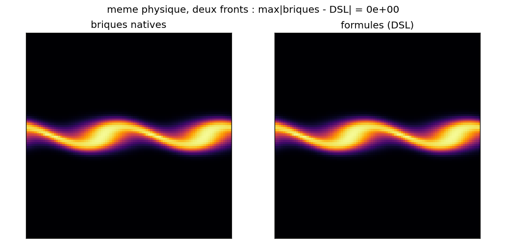
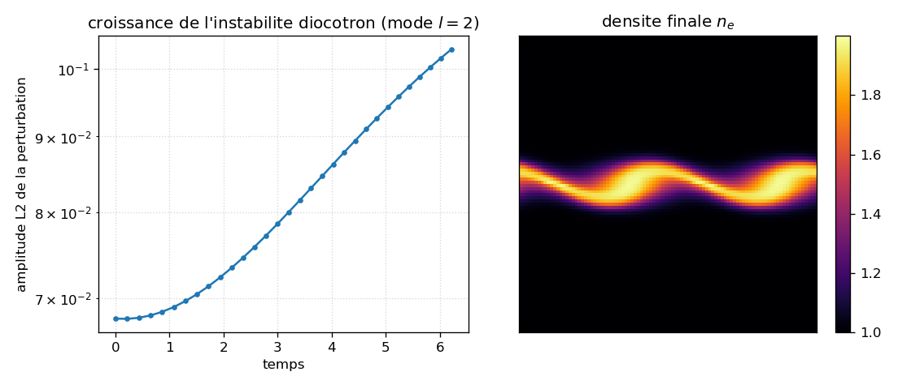
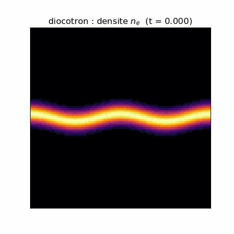

# tutorial: the diocotron written three equivalent ways (helper, bricks, formulas)

This case is an **executable tutorial**. It takes a single physics (the diocotron: a scalar
electron density transported by E x B drift, with a neutralizing ionic background) and builds it
**three ways** with the general `adc` API, never relying on a "specialized class" that would hide
the composition:

1. **specialized helper**: `adc_cases.models.diocotron(...)`, the "ready-made" oracle;
2. **native bricks**: `adc.Model(state, transport, source, elliptic)` rebuilt by hand;
3. **formulas (DSL)**: `adc.dsl.Model(...)`, where the physics is written as symbolic expressions.

The lesson fits in one sentence: *a "named model" is just a composition of generic bricks; you can
write it as bricks or as formulas, and it is interchangeable and numerically identical*. The case
**proves** it (`np.array_equal` over the three outputs), then plots the growth of the instability.
It is the `adc_cases`-side mirror of the adc_cpp Sphinx tutorial
(`docs/sphinx/getting_started/tutorial.md`).

## Contract

| Field | Value |
|---|---|
| **Category** (manifest) | `tutoriel` (the CI variant `tutorial/equivalence.py` is `validation`) |
| **Inputs** | none; everything is code (grid $96^2$, mode band $l=2$, 60 steps at CFL 0.4) |
| **Outputs** | `figures/tutorial_growth.png`, `figures/tutorial.gif`, `figures/tutorial_bricks_vs_dsl.png`, `figures/provenance.json`; stdout `OK tutorial` |
| **Invariants** | mass conserved (advective transport, periodic domain); final amplitude > initial |
| **Proves** | the three constructions (helper / bricks / DSL formulas) give a bit-identical final state (`np.array_equal`, so `max|gap| = 0`, no tolerance); the mass drift is $< 10^{-6}$ (relative); the L2 amplitude of the perturbation grows (factor ~1.5 over 60 steps) |
| **Does not prove** | this is not a reproduction of a published growth rate (see the `diocotron` case for the comparison against arXiv:2510.11808); the scheme (NoSlope + Rusanov, order 1) is deliberately dissipative and would underestimate a measured rate; 60 steps do not drive the instability to saturated vortices (you see the start of the roll-up, not the final nonlinear state) |
| **Provenance** | `figures/provenance.json` (adc_cpp + adc_cases SHA, selected DSL backend, resolution, command) |

Each section below names the clause it justifies.

---

## 1. Physics: the diocotron in two equations (justifies Proves, Invariants)

The diocotron is the instability of a column (here a band) of non-neutral charge in a uniform
magnetic field $B_0 \hat{z}$. The electrons drift at the E x B velocity:

$$ \mathbf{v} = \frac{\mathbf{E} \times \mathbf{B}}{B_0^2}
            = \frac{1}{B_0}\left(-\partial_y \phi,\; \partial_x \phi\right), $$

where $\mathbf{E} = -\nabla \phi$. This velocity is divergence-free
($\partial_x v_x + \partial_y v_y = (-\partial_x \partial_y \phi + \partial_y \partial_x \phi)/B_0 = 0$):
the transport is an incompressible advection, so the density is simply convected (its maximum and
its mass are conserved up to discretization). The density obeys a conservation law, and the
potential a Poisson equation whose right-hand side is the neutralized charge density:

$$ \partial_t n + \nabla\cdot(n\,\mathbf{v}) = 0, \qquad
   \nabla^2 \phi = \alpha\,(n - n_{i0}). $$

$n_{i0}$ is the uniform (immobile) ionic background that neutralizes the mean charge: on a periodic
domain, the right-hand side must have zero mean for Poisson to be solvable, hence the choice
$n_{i0} = \langle n \rangle$ (the mean of the initial density, `run.py` `main`).

**Instability mechanism.** The band carries a density jump; the shear of the drift velocity on either
side of the band is a Kelvin-Helmholtz instability of the vorticity field (here $n$ plays the role of
the vorticity, $\phi$ that of the stream function). A perturbation at mode $l=2$ (two wavelengths
along $x$) is amplified and rolls the band into a cat's-eye. The initial condition is set by
`band_density(n, L, amp=1, width=0.05, mode=2, disp=0.02)`
(`adc_cases/common/initial_conditions.py`):

$$ n(x,y) = 1 + \exp\!\left(-\frac{(y - y_0(x))^2}{w^2}\right), \qquad
   y_0(x) = \tfrac{L}{2} + \mathrm{disp}\cdot\cos\!\left(\frac{2\pi\,l\,x}{L}\right). $$

The floor of 1 is neutralized by $n_{i0}$; the gaussian of amplitude 1 is the band; the `disp` on
$y_0$ is the seed of the $l=2$ mode.

---

## 2. The three fronts (the heart of the tutorial; justifies Proves)

The three constructions differ only in how they describe the model; the grid, the Poisson solve, the
initial condition, the scheme (minmod + Rusanov), and the integrator (SSPRK2) are identical (the
shared `make_system` + `set_poisson` + `set_density` functions).

### Front 1: the specialized helper (the oracle)

```python
models.diocotron(B0=B0, alpha=ALPHA, n_i0=n_i0)
```

`adc_cases.models.diocotron` (`adc_cases/models.py`) is a one-line function that returns an
`adc.Model`. It is not a dedicated C++ class: its body is the brick composition of front 2. You use
it as a reference and prove below that the three coincide.

### Front 2: the native bricks, rebuilt by hand

`diocotron_from_bricks` (`run.py`) composes the four role bricks that the core knows how to assemble.
Each line picks a brick for a role:

```python
adc.Model(
    state=adc.Scalar(),                                   # 1 conservative variable: the density n
    transport=adc.ExB(B0=B0),                             # advection flux f = n v, v = (-dy phi, dx phi)/B0
    source=adc.NoSource(),                                # no per-cell source (pure scalar)
    elliptic=adc.BackgroundDensity(alpha=ALPHA, n0=n_i0), # Poisson rhs = alpha (n - n0)
)
```

- `adc.Scalar()` declares the state: one conservative variable (the density). The core requires it to
  be consistent with a scalar transport (`ExB`); a state/transport mismatch raises an error.
- `adc.ExB(B0=B0)` is the transport: it sets the flux $f = n\,\mathbf{v}$ with the E x B velocity
  above. This is the exact convention of the C++ struct `ExBVelocity`
  (`adc_cpp/include/adc/physics/hyperbolic.hpp`).
- `adc.NoSource()`: no cell-local source term (an advected scalar has neither force nor work).
- `adc.BackgroundDensity(alpha, n0)` is the elliptic right-hand side: it sets
  $\text{rhs} = \alpha\,(n - n_0)$, the convention of the C++ struct `BackgroundDensity`
  (`adc_cpp/include/adc/physics/elliptic.hpp`).

The block is attached by `add_block` (`add_bricks_block`), which takes a **native** `ModelSpec`:

```python
sim.add_block("ne", model=model, spatial=adc.Spatial(minmod=True), time=adc.Explicit())
```

`adc.Spatial(minmod=True)` = finite volumes, minmod limiter, Rusanov flux (default), conservative
reconstruction. `adc.Explicit()` = SSPRK2, one substep.

### Front 3: the same physics as formulas (DSL)

`diocotron_from_dsl` (`run.py`) writes the same physics with no named brick: you declare variables
and fields, then write the formulas as symbolic expressions. `adc.dsl` generates C++ from them,
compiles it to a `.so`, and installs it via `add_equation`.

```python
m = dsl.Model("tutorial_diocotron")
(n,) = m.conservative_vars("n")      # 1 conservative variable, canonical role Density
m.aux("phi")                         # potential (aux contract; not read by the flux)
grad_x = m.aux("grad_x")             # components of grad phi, provided by the elliptic solver
grad_y = m.aux("grad_y")
vx = (-grad_y) / B0                  # E x B drift: v = (-dy phi, dx phi)/B0 (div v = 0)
vy = grad_x / B0
m.flux(x=[n * vx], y=[n * vy])       # physical advection flux f = n v(dir)
m.eigenvalues(x=[vx], y=[vy])        # 1 wave: the drift velocity (Rusanov / CFL bound)
m.primitive_vars(n=n)                # scalar: primitive = conservative (layout [n])
m.conservative_from([n])             # trivial prim -> cons inversion
m.elliptic_rhs(ALPHA * (n - n_i0))   # Poisson coupling: alpha (n - n_i0)
m.check()                            # is every referenced variable declared?
```

Line by line, this is the symbolic translation of the two bricks `ExBVelocity` and
`BackgroundDensity`: `m.flux` reproduces $f = n\,\mathbf{v}$, `m.eigenvalues` gives the wave bound
for Rusanov/CFL, `m.elliptic_rhs` reproduces $\alpha(n - n_{i0})$. `conservative_vars`/`aux`/`flux`/
`eigenvalues`/`elliptic_rhs` are detailed in the
[DSL reference](https://github.com/wolf75222/adc_cpp/blob/master/docs/sphinx/reference/dsl_reference.md).

The model is compiled and then wired by `add_equation` (`add_dsl_block`), which routes the
`CompiledModel` according to its backend:

```python
compiled, backend = compile_dsl(diocotron_from_dsl(n_i0))   # production -> aot as fallback
sim.add_equation("ne", model=compiled,
                 spatial=adc.FiniteVolume(limiter="minmod", riemann="rusanov"),
                 time=adc.Explicit())
```

`compile_dsl` prefers the `production` backend (native zero-copy path, same engine as `add_block`)
and falls back to `aot` (numerically identical) if the module's ABI key does not match the local
headers. The selected backend is printed and recorded in `provenance.json` (on this platform:
`production`).

---

## 3. Why the three coincide, and what a divergence would reveal (justifies Proves)

```python
assert np.array_equal(final_helper, final_bricks)   # helper == bricks
assert np.array_equal(final_bricks, final_dsl)       # bricks == DSL
```

- **helper == bricks** is expected by construction: `models.diocotron` *is* the `adc.Model(...)` of
  front 2 (same arguments). The assert checks it anyway: if the helper ever drifted (another brick,
  another default), the test would break. This is the demonstration that "a named model = a
  composition of bricks".
- **bricks == DSL** is the non-trivial result: two different generation paths (pre-compiled bricks
  vs C++ generated from formulas) produce the same numerical kernel. The equality is bit for bit
  (`np.array_equal`, not `allclose`) because the DSL formulas reproduce the core conventions exactly:
  same E x B velocity, same Rusanov flux, same wave bound, same right-hand side. A divergence (even
  $10^{-15}$) would reveal a wrong formula: a flipped sign in $\mathbf{v}$, a different wave bound
  (Rusanov depends on `eigenvalues`), or a different $n_{i0}$.

The observed output: `max|bricks - DSL| = 0.000e+00`, backend `production`. This is what the figure
`tutorial_bricks_vs_dsl.png` shows (section 5).

---

## 4. The integration loop and the amplitude measurement (justifies Invariants)

`run_capture` (`run.py`) advances by CFL steps and samples:

```python
for k in range(n_steps + 1):
    d = np.asarray(sim.density("ne")).copy()
    if k % every == 0:
        frames.append(d); times.append(sim.time()); amps.append(perturbation_amplitude(d))
    if k < n_steps:
        sim.step_cfl(0.4)
```

`sim.step_cfl(0.4)` picks the stable step $\mathrm{d}t = 0.4\,h / \max|\mathbf{v}|$ (the factor 0.4
is the Courant number). `perturbation_amplitude` measures the standard deviation of the density
relative to its mean along $x$:

```python
base = density.mean(axis=1, keepdims=True)    # mean in x (the unperturbed band is uniform in x)
delta = density - base
return float(np.sqrt(np.mean(delta * delta)))  # L2 norm of the perturbation
```

The initial band is uniform along $x$ at fixed $y$; whatever departs from it carries the
instability. The amplitude grows (assert `ampf > amp0`). The mass, in turn, is conserved to machine
precision (`relative_drift(m_b, ne0.sum()) < 1e-6`; observed ~$10^{-16}$) because the E x B
advection is incompressible and the finite-volume scheme is conservative.

---

## 5. Figures (generated by `run.py`, in `figures/`)

### `tutorial_bricks_vs_dsl.png`: the visual proof of equivalence (justifies Proves)



The two panels are the final state, on the left from the native bricks, on the right from the DSL
formulas.

- **Proves**: the title shows `max|bricks - DSL| = 0e+00`, the section-3 `np.array_equal` made
  visible. The two maps are pixel for pixel identical.
- **Suggested** (not asserted): by eye, the $l=2$ mode band starts to thicken at the crests and thin
  at the nodes: the start of the Kelvin-Helmholtz roll-up. No assert measures this shape.
- **Not shown**: the figure says nothing about a third reference code or a growth rate; it proves the
  bricks/DSL identity, not absolute physical correctness (see the `diocotron` case).

### `tutorial_growth.png`: growth of the instability + final map (justifies Invariants)



On the left, the L2 amplitude of the perturbation versus time (semilog scale); on the right, the
final density $n_e$.

- **Proves**: the curve is monotonically increasing after a short transient ($t \lesssim 1$), from
  $6.8\times10^{-2}$ to $1.0\times10^{-1}$ over 60 steps (factor ~1.5); this is the assert
  `ampf > amp0`.
- **Suggested** (not asserted): the nearly straight portion in semilog ($t \in [2, 6]$) suggests
  exponential growth $\sim e^{\gamma t}$, the expected signature of a linear instability; but
  $\gamma$ is not measured here (the `diocotron` case does it and compares it to the paper).
- **Not shown**: the right-hand map shows the start of the roll-up (thickened $l=2$ band), not the
  saturated vortices of the nonlinear state; 60 steps at $96^2$ stop before saturation.

### `tutorial.gif`: the density evolution



- **Proves / visible**: the animation is the solver output (front 2); the $l=2$ band deforms
  continuously. It is the same field as the final map, animated.
- **Not shown**: no uniform/AMR side-by-side comparison here (see the `diocotron_amr` case), no
  saturated state.

---

## 6. Reproducing (justifies the checklist: command + cost)

```bash
# from the root of the adc_cases repo, with the adc module on the PYTHONPATH
PYTHONPATH=<build>/python python3 tutorial/run.py          # full tutorial + figures
PYTHONPATH=<build>/python python3 tutorial/equivalence.py  # CI smoke (equivalence only, no figures)
```

`run.py` compiles a DSL `.so` (backend `production`; ~a few seconds on the first call, cached
afterward), runs three runs of 60 steps at $96^2$, and writes three figures + `provenance.json`.
Cost: a few seconds (excluding the first compilation). `equivalence.py` does fewer steps ($64^2$, 30
steps), without figures: it is the CI variant (`needs = ["cxx"]`) that locks the equivalence of the
three fronts at every commit.

---

## File map

| File | Role |
|---|---|
| `run.py` | full tutorial: 3 constructions of the diocotron, equivalence assert, figures + provenance |
| `equivalence.py` | CI smoke: reuses the constructors from `run.py`, equivalence assert only (no figures) |
| `figures/tutorial_growth.png` | L2 amplitude vs time (semilog) + final density |
| `figures/tutorial.gif` | density evolution (roll-up) |
| `figures/tutorial_bricks_vs_dsl.png` | final states bricks vs DSL, `max\|gap\| = 0` |
| `figures/provenance.json` | SHA, selected DSL backend, resolution, command |

See also: the `diocotron_dsl` case (DSL/native equivalence in 3 panels + gap heatmap), the
`diocotron` case (growth-rate reproduction, comparison against arXiv:2510.11808), the
`diocotron_amr` case (the same diocotron on AMR), and the adc_cpp Sphinx tutorial
(`docs/sphinx/getting_started/tutorial.md`), of which this case is the application-side mirror.
