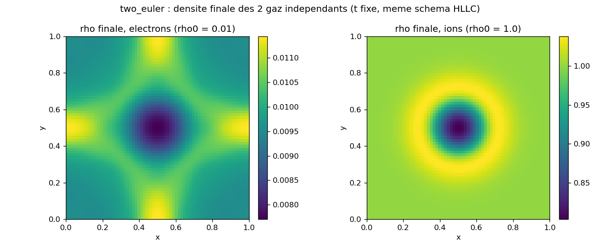
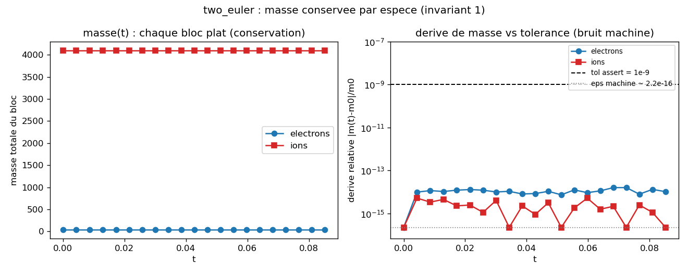
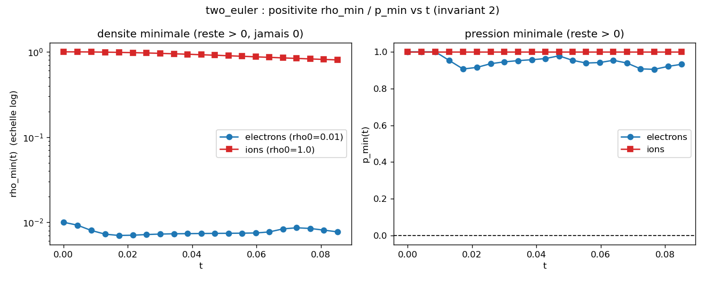
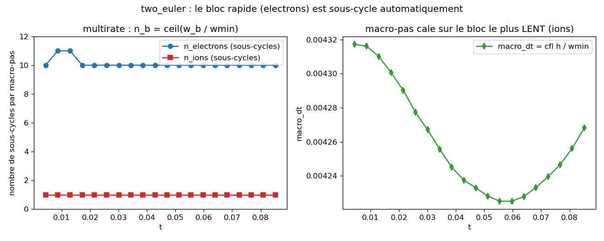

# two_euler : deux gaz d'Euler independants, meme code

Deux blocs d'Euler compressible (`electrons`, `ions`) portes par le MEME modele natif et le MEME
schema, sans aucun couplage entre eux. Seules les conditions initiales different : les electrons
sont 100x moins denses, donc leur vitesse du son est ~10x plus grande. On verifie par `assert` que
chaque bloc conserve sa masse, reste positif (`rho > 0`, `p > 0`), et que le bloc rapide s'etend
plus vite ; on montre par figure que l'integrateur multirate `step_adaptive` sous-cycle
automatiquement le bloc rapide 10x par macro-pas. Ce cas ne reproduit aucun resultat publie : il
verifie des invariants structurels et exerce l'API multi-blocs.

## Contrat

| Champ | Contenu |
|---|---|
| Categorie (manifeste) | `validation` (`cases_manifest.toml` : `two_euler/run.py`, `ci = true`, `needs = []`) |
| Entrees | grille $64^2$, $L=1$, **periodique** ; 2 blocs Euler `gamma=1.4` ; bulle de surpression gaussienne centrale $p=p_0+dp\,e^{-r^2/(\sigma^2 L^2)}$ ($p_0=1$, $dp=0.5$, $\sigma^2=0.02$), gaz au repos $u=v=0$ ; electrons $\rho_0=0.01$, ions $\rho_0=1.0$ ; Poisson de systeme avec $f=0$ (charge nulle) ; 20 macro-pas `step_adaptive(0.4)` |
| Sorties | etats finaux $(4,64,64)$ des 2 blocs ; 4 diagnostics imprimes (masse, positivite, front) ; figures dans `figures/` + `figures/provenance.json` (ce tutoriel, hors `run.py`) |
| Invariants garantis | masse relative conservee `< 1e-9` par bloc ; `rho > 0` et `p > 0` (positivite) ; `fe > fi` (front electrons plus etendu) ; etats finis (ni NaN ni Inf) |
| PROUVE | (1) chaque bloc conserve sa masse a la derive relative mesuree $\le 1.6\times10^{-14}$ (electrons) et $\le 5.1\times10^{-15}$ (ions), bruit machine ; (2) positivite tenue : `rho_min` e=$7.71\times10^{-3}$, i=$0.803$ ; `p_min` e=$0.932$, i=$1.000$ ; (3) le front electronique couvre $86\%$ des cellules contre $29\%$ pour les ions ; (4) les 2 blocs sont strictement independants (aucune source, $f=0$) |
| NE PROUVE PAS | **ce n'est pas une reproduction publiee** ni une physique de plasma : les noms "electrons"/"ions" sont une analogie, les 2 gaz ne sont **pas couples** (un vrai couplage Poisson est [`multispecies`](../multispecies/) / [`plasma`](../plasma/)). Aucun `assert` ne teste le sous-cyclage multirate ni le facteur 10 sur la vitesse du son : ils sont **mesures et traces**, pas asseres. Aucune validation device / MPI / AMR (CPU mono-rang). |
| Provenance | adc_cpp `01873299`, adc_cases `7c7a3403`, backend natif serie, $64^2$, ~0.45 s 1 coeur CPU ; `figures/provenance.json` |

A la fin tu sauras : pourquoi deux blocs Euler tournent sous le meme code (composition de briques),
pourquoi chaque masse est conservee a la precision machine (loi de conservation periodique), pourquoi
les electrons sont 10x plus rapides (vitesse du son), et comment le pas multirate sous-cycle le bloc
rapide sans configuration explicite.

---

## 1. Le mecanisme (allege : pas de physique couplee)

Chaque bloc est une bulle de gaz au repos avec une surpression gaussienne au centre. Le gradient de
pression pousse le gaz vers l'exterieur : une **detente radiale** part du centre a la vitesse du son
locale. Rien d'autre n'agit (pas de force, pas de champ). La seule difference physique entre les deux
blocs est la densite de fond : a pression egale, la vitesse du son
$c=\sqrt{\gamma\,p/\rho}$ scale en $1/\sqrt{\rho}$, donc les electrons ($\rho_0=0.01$) ont
$c_e/c_i=\sqrt{\rho_i/\rho_e}=\sqrt{1/0.01}=10$ : leur detente est 10x plus rapide et couvre plus de
terrain dans le meme temps. C'est l'unique asymetrie ; tout le reste (modele, schema, integrateur)
est identique.

Les deux blocs ne communiquent par AUCUN canal : la source est `NoSource`, et le second membre du
Poisson de systeme est $f=\sum_b q_b n_b=0$ car les deux charges valent zero (section 3). Le potentiel
resolu reste nul et ne retroagit sur personne. "two_euler" est donc deux lois de conservation
hyperboliques **independantes** qui partagent le meme code.

Justifie la clause PROUVE (4) du contrat (blocs strictement independants) et la clause NE PROUVE PAS
(pas de physique de plasma : ce cas ne couple rien).

---

## 2. Les equations et qui les calcule

Chaque bloc resout Euler compressible 2D sous forme conservative :

$$\partial_t U+\partial_x F(U)+\partial_y G(U)=0,\qquad U=(\rho,\ \rho u,\ \rho v,\ E),\qquad p=(\gamma-1)\Big(E-\tfrac12\rho|u|^2\Big).$$

Le flux $F$ transporte $(\rho u,\ \rho u^2+p,\ \rho uv,\ (E+p)u)$ (et $G$ par symetrie $x\leftrightarrow y$).
Avec $\gamma=1.4$ (`GAMMA`, `run.py:33`). Le terme source est **identiquement nul** ; le Poisson de
systeme est present mais a second membre nul. Les deux blocs partagent ces equations a l'identique.

Le modele d'espece est `adc_cases.models.euler(GAMMA)` (`adc_cases/models.py:58-66`), la composition
de briques natives :

| Bloc du modele | Equation | Brique (`models.euler`) |
|---|---|---|
| Etat | $(\rho,\rho u,\rho v,E)$ | `adc.FluidState(kind="compressible", gamma=gamma)` |
| Transport | flux d'Euler $F,G$ | `adc.CompressibleFlux()` |
| Source | aucune | `adc.NoSource()` |
| Elliptique | $f=q\,n$ avec $q=0$ | `adc.ChargeDensity(charge=0.0)` |

`adc.ChargeDensity(charge=0.0)` declare une densite de charge nulle : la contribution du bloc au
Poisson de systeme ($f=\sum_b q_b n_b$) est zero. `set_poisson()` est appele quand meme car
`step_adaptive` ouvre chaque macro-pas par `solve_fields()` (section 4) ; avec $f=0$ le potentiel
reste nul. C'est la justification exacte du commentaire `run.py:56` : "Poisson f=0 (charge nulle) :
blocs independants, juste pour solve_fields".

### Table 3 couches : qui calcule quoi

| Ligne `run.py` | Couche | Ce qui se passe |
|---|---|---|
| `add_block("electrons", model=models.euler(GAMMA), spatial=spatial, time=adc.Explicit())` (`run.py:54-55`) | Python **compose** | choix du modele Euler, du schema (van Leer + HLLC + recon primitive), de l'integrateur (SSPRK2) ; deux appels distincts, un par bloc |
| `models.euler(GAMMA)` -> `CompressibleFlux` / `NoSource` / `ChargeDensity(0)` (`include/adc/physics/euler.hpp`, `.../source.hpp`) | brique C++ **fige** la physique | la convention exacte du flux $F(U)$, de la vitesse d'onde $|v_n|+c$, du second membre nul |
| `assemble_rhs<Limiter,Flux>` (HLLC) + Poisson de systeme (`solve_fields`, $f=0$) | noyau **par cellule** | le calcul reel par cellule, sans callback Python dans le hot path |

`models.euler` ne nomme aucune espece cote coeur : le mot "electrons"/"ions" vit dans `adc_cases`,
la physique est une composition de briques generiques. C'est ce qui rend "2 Euler, meme code"
litteral : les deux blocs sont le **meme** objet modele compose, instancie deux fois, distingue
uniquement par `set_state` (section 5).

---

## 3. Pourquoi les invariants tiennent (la derivation)

C'est un cas de **validation d'invariant** : la prediction n'est pas un nombre physique d'un papier,
c'est une propriete structurelle que le schema DOIT respecter. Trois invariants, trois raisons.

### 3.1 Conservation de la masse (justifie PROUVE 1)

La premiere composante d'Euler est $\partial_t\rho+\nabla\cdot(\rho\mathbf{u})=0$. Un schema **volumes
finis** met a jour chaque cellule par le bilan des flux a ses faces :
$\rho_{ij}^{n+1}=\rho_{ij}^n-\frac{\Delta t}{h}\big(F^x_{i+1/2,j}-F^x_{i-1/2,j}+F^y_{i,j+1/2}-F^y_{i,j-1/2}\big)$.
La masse totale $M=\sum_{ij}\rho_{ij}\,h^2$ se somme sur toutes les cellules : chaque flux interieur
apparait **deux fois avec des signes opposes** (face partagee entre cellules voisines) et s'annule par
**telescopage**. Sur un domaine **periodique** (`periodic=True`, `run.py:52`), les flux de bord se
referment aussi (la face droite du domaine = la face gauche). Il ne reste rien : $M^{n+1}=M^n$
**exactement en arithmetique reelle**. La seule derive observee vient de l'arithmetique flottante
(ordre de sommation, arrondi), donc au niveau du **bruit machine** $\sim 10^{-16}\,M$. C'est pourquoi
la tolerance `tol=1e-9` (`run.py:72-73`) est honnete : elle est posee **7 ordres de grandeur
au-dessus** du bruit machine attendu ($\sim 10^{-16}$) et bien en dessous de toute violation physique
($M$ change de $O(1)$ relatif si un flux fuit), donc elle separe proprement "conserve au bit pres" de
"bug de conservation". La derive mesuree ($\le 1.6\times10^{-14}$, section 6) confirme : on est au
bruit machine, $10^5$ fois sous la tolerance.

### 3.2 Positivite (justifie PROUVE 2)

Euler n'a de sens que pour $\rho>0$ et $p>0$ ($c=\sqrt{\gamma p/\rho}$ devient imaginaire sinon, le
schema explose). Rien ne **garantit** mathematiquement la positivite d'un MUSCL+HLLC generique a
travers une detente forte ; deux choix la favorisent ici, tous deux dans `run.py:53` :

- **Reconstruction primitive** (`recon="primitive"`) : on reconstruit $(\rho,u,v,p)$ aux faces plutot
  que les variables conservatives $(\rho,\rho u,\rho v,E)$. Reconstruire $\rho$ et $p$ directement
  evite de soustraire l'energie cinetique $\frac12\rho|u|^2$ d'une energie totale reconstruite (source
  classique de pression negative dans les detentes).
- **Flux HLLC** : restitue l'onde de contact, moins dissipatif que Rusanov mais robuste pour Euler.

La positivite n'est donc pas un theoreme mais un **invariant empirique** que le cas verifie par
`assert` (`run.py:81-82`). La detente electronique est la plus severe (vitesse du son 10x, donc
expansion la plus forte), et c'est elle qui descend le plus bas : `rho_min` electrons atteint
$6.99\times10^{-3}$ au creux (section 6), toujours $>0$.

### 3.3 Ordre des fronts (justifie PROUVE 3)

A pression egale $p_0=1$, la vitesse du son d'Euler est $c=\sqrt{\gamma p_0/\rho_0}$. Le rapport
des deux blocs est $c_e/c_i=\sqrt{\rho_{0,i}/\rho_{0,e}}=\sqrt{1.0/0.01}=10$, le nombre affiche par
`run.py:65` (`np.sqrt(1.0/0.01)`). Le front de detente avance a la vitesse du son : sur la duree
fixe ($t_{\text{final}}=0.085$, 20 macro-pas), le front electronique parcourt 10x plus de distance,
donc couvre une fraction de cellules plus grande. L'`assert fe > fi` (`run.py:83`) teste exactement
cet ordre, ou `fe`, `fi` sont les fractions de cellules ou $|p-p_0|>0.02$ (fonction `disturbed`,
`run.py:45-47`). Mesure : `fe = 0.861`, `fi = 0.287`.

---

## 4. Le code, ancre

Lecture de `main` (`run.py:50-86`), les lignes porteuses uniquement.

### 4.1 Composition (`run.py:52-56`)

```python
sim = adc.System(n=n, L=L, periodic=True)                                      # run.py:52
spatial = adc.Spatial(vanleer=True, flux="hllc", recon="primitive")            # run.py:53
sim.add_block("electrons", model=models.euler(GAMMA), spatial=spatial, time=adc.Explicit())  # run.py:54
sim.add_block("ions",      model=models.euler(GAMMA), spatial=spatial, time=adc.Explicit())  # run.py:55
sim.set_poisson()  # f = 0 (charge nulle) : blocs independants, juste pour solve_fields        # run.py:56
```

- `adc.System(n=64, L=1, periodic=True)` : grille cartesienne $64\times64$, domaine $[0,1]^2$
  periodique (la periodicite ferme le bilan de masse, section 3.1).
- `adc.Spatial(vanleer=True, flux="hllc", recon="primitive")` : un SEUL objet de schema, **partage**
  par les deux blocs. `vanleer=True` -> limiteur van Leer (MUSCL ordre 2, 2 cellules fantomes,
  `adc/__init__.py:442-443`) ; `flux="hllc"` -> solveur de Riemann HLLC (exige un transport
  compressible, verifie cote facade) ; `recon="primitive"` -> reconstruction des variables primitives
  (section 3.2).
- les deux `add_block` : meme `model=models.euler(GAMMA)` (deux instances), meme `spatial`, meme
  `time=adc.Explicit()` (SSPRK2, `substeps=1`, `stride=1` par defaut, `adc/__init__.py:490-503`).
  C'est le coeur du message "2 Euler, meme code".
- `set_poisson()` configure le Poisson de systeme (defaut `rhs="charge_density"`). Avec $q=0$ partout
  le second membre est nul ; l'appel sert uniquement a ce que `step_adaptive -> solve_fields()` ait un
  solveur valide.

### 4.2 Conditions initiales (`run.py:58-61`)

```python
Ue0 = blob(n, L, rho0=0.01, p0=1.0, dp=0.5)  # electrons : legers -> c ~ 10x, rapides   # run.py:58
Ui0 = blob(n, L, rho0=1.0,  p0=1.0, dp=0.5)  # ions : lourds, lents                     # run.py:59
sim.set_state("electrons", Ue0.reshape(-1).tolist())                                    # run.py:60
sim.set_state("ions",      Ui0.reshape(-1).tolist())                                    # run.py:61
```

`blob` (`run.py:36-38`) delegue a `euler_pressure_blob` (`adc_cases/common/initial_conditions.py:44-57`) :
gaz au repos $u=v=0$, densite uniforme $\rho_0$, surpression gaussienne
$p(x,y)=p_0+dp\,e^{-r^2/(\sigma^2 L^2)}$ avec $\sigma^2=0.02$ (defaut, NON passe par `run.py`),
$r^2=(x-L/2)^2+(y-L/2)^2$, et $E=p/(\gamma-1)$ (energie interne pure, pas de cinetique). Les deux CI
sont identiques en forme : seule $\rho_0$ change ($0.01$ vs $1.0$), source de tout le contraste de
vitesse. `set_state` aplatit l'etat $(4,64,64)$ en liste plate.

### 4.3 Boucle multirate (`run.py:67-68`)

```python
for _ in range(20):
    sim.step_adaptive(0.4)   # run.py:67-68
```

`step_adaptive(cfl)` est l'integrateur multirate. Sa semantique exacte, lue dans
`adc_cpp/include/adc/runtime/system_stepper.hpp:311-349` (methode `step_adaptive`) :

1. `solve_fields()` resout le Poisson de systeme (ici $f=0$, potentiel nul).
2. Pour chaque bloc evolutif, la vitesse d'onde max $w_b=\max_{\text{grille}}(|v_n|+c)$ est calculee
   (`s.max_speed(s.U)`, `system_stepper.hpp:322`) ; `wmin` = la plus PETITE (bloc le plus lent).
3. Le **macro-pas** est $\text{macro\_dt}=\text{cfl}\cdot h/w_{\min}$ (`system_stepper.hpp:330`), cale
   sur le bloc le plus lent (les ions).
4. Chaque bloc est sous-cycle $n_b=\lceil\text{stride}_b\cdot w_b/w_{\min}\rceil$ fois sur le pas
   effectif (`system_stepper.hpp:338-342`, `advance_transport_n(s, eff_dt, n)`). Avec `stride=1` et
   $w_e/w_i=10$, le bloc `electrons` fait $n_e=\lceil10\rceil=10$ sous-pas, les `ions` $n_i=1$.
5. `apply_couplings(macro_dt)` (aucun couplage ici), puis `t += macro_dt`.

C'est cela "le multirate sous-cycle automatiquement les electrons" : le facteur 10 decoule du rapport
des vitesses d'onde, sans configuration explicite. La figure `multirate.png` (section 6) le trace
directement.

### 4.4 Diagnostics et asserts (`run.py:70-86`)

```python
Ue = np.array(sim.get_state("electrons")).reshape(4, n, n)                       # run.py:70
dme = assert_mass_conserved(sim.mass("electrons"), me0, tol=1e-9, label="electrons")  # run.py:72
pe, pi = pressure(Ue), pressure(Ui)                                             # run.py:74
fe, fi = disturbed(Ue, Ue0, 0.02), disturbed(Ui, Ui0, 0.02)                     # run.py:75
assert Ue[0].min() > 0 and Ui[0].min() > 0, "densite negative"                  # run.py:81
assert pe.min() > 0 and pi.min() > 0, "pression negative"                       # run.py:82
assert fe > fi, "les electrons ... devraient s'etendre plus vite que les ions"  # run.py:83
```

- `sim.mass(name)` integre $\rho$ du bloc (diagnostic de conservation), compare a la masse initiale
  `me0`/`mi0` (`run.py:63`) par `assert_mass_conserved` (`adc_cases/common/checks.py:16-26`), qui
  renvoie la derive RELATIVE et leve `AssertionError` si $\ge$ `tol`.
- `pressure(U)` = `euler_pressure(U, gamma=GAMMA)` (`initial_conditions.py:60-62`) :
  $p=(\gamma-1)(E-\frac12\rho|u|^2)$.
- `disturbed(U, U0, thr)` (`run.py:45-47`) = `mean(|p(U)-p(U0)| > thr)`, la fraction de cellules ou la
  pression a change de plus de `thr=0.02` : l'etendue du front.
- `assert_finite(Ue, ...)` (`run.py:84-85`, `checks.py:29-32`) : ni NaN ni Inf.

Le multirate n'a **pas** d'assert dedie : il est exerce par la boucle et indirectement valide par la
stabilite (positivite tenue, front electrons > ions).

---

## 5. Conditions initiales

| Bloc | $\rho_0$ | $p_0$ | $dp$ | $c=\sqrt{\gamma p_0/\rho_0}$ au repos | $w$ initial mesure |
|---|---|---|---|---|---|
| electrons | 0.01 | 1.0 | 0.5 | $\sqrt{1.4/0.01}=11.83$ | 14.48 (avec la surpression centrale) |
| ions | 1.0 | 1.0 | 0.5 | $\sqrt{1.4/1.0}=1.18$ | 1.45 |

Les deux gaz partent au repos ($u=v=0$) avec une bulle de surpression gaussienne identique en forme.
La seule difference est $\rho_0$. La vitesse du son au pic de pression (centre) est legerement plus
elevee qu'au repos (la surpression locale monte $p$), d'ou la vitesse d'onde mesuree $w=14.48$ pour les
electrons (vs $11.83$ au fond) ; le **rapport** $w_e/w_i$ reste exactement $10.0$ car la surpression
multiplie les deux par le meme facteur (`figures/provenance.json` : `wave_speed_ratio_init = 10.0`).

`sigma2=0.02` n'est pas passe par `run.py` : valeur par defaut de `euler_pressure_blob`.

---

## 6. Figures (generees par `make_figures.py`, dans `figures/`)

`make_figures.py` re-joue la boucle de `run.py` a l'identique (memes CI, meme schema, meme
`step_adaptive(0.4)` x 20) mais instrumente chaque macro-pas pour produire les series temporelles que
`run.py` ne garde pas (il ne lit que l'etat final). Commande :

```bash
cd /private/tmp/adc_cases-deeptut/two_euler && \
PYTHONPATH=/Users/romaindespoulain/Documents/Stage_Romain/adc_cpp/build-master/python:/private/tmp/adc_cases-deeptut \
/opt/homebrew/anaconda3/bin/python3.12 make_figures.py
```

### `density_maps.png` : densite finale des 2 gaz



- **PROUVE** : les deux cartes sont des etats **finis et coherents** (`assert_finite`), produits par le
  **meme schema**. La detente radiale a creuse le centre des deux gaz (densite minimale au point de
  surpression, evacuee vers l'exterieur) : echelle electrons $[0.008,\,0.011]$ autour de $\rho_0=0.01$,
  echelle ions $[0.80,\,1.02]$ autour de $\rho_0=1.0$, contraste $\sim 100$ entre les deux blocs.
- **SUGGERE (non assere)** : la carte electronique montre une croix diagonale et des lobes qui touchent
  les bords : son front (10x plus rapide) a deja atteint les **images periodiques** et interfere avec
  lui-meme, alors que la carte ionique reste un anneau propre, centre, loin des bords. C'est la
  signature visuelle de "electrons plus etendus" (`fe=0.861` vs `fi=0.287`), mais aucun assert ne teste
  la forme.
- **NON MONTRE** : la carte est a $t$ fixe ; pas de dynamique transitoire ici (voir les figures
  temporelles ci-dessous).

### `masses.png` : masse conservee par espece (invariant 1)



- **PROUVE** : panneau gauche, les deux masses sont **plates** sur tout le run (electrons $\sim 41$,
  ions $\sim 4096$, le rapport 100 des densites). Panneau droit (derive relative log), les deux blocs
  restent entre le bruit machine ($\sim 2\times10^{-16}$, pointilles gris) et $\sim 4\times10^{-14}$,
  soit $\ge 4$ ordres de grandeur SOUS la tolerance `1e-9` (tiret noir). L'invariant 3.1 tient :
  conservation au bit pres. Certains pas ions touchent exactement le plancher eps (derive
  rigoureusement nulle ce pas-la).
- **NON MONTRE** : la figure ne distingue pas la part d'erreur due au sous-cyclage electronique (10
  sous-pas) de celle du pas ionique unique ; les deux derivent au meme niveau machine.

### `positivity.png` : positivite rho_min / p_min vs t (invariant 2)



- **PROUVE** : panneau gauche (echelle log), `rho_min` electrons reste autour de $7\times10^{-3}$ (creux
  a $6.99\times10^{-3}$), `rho_min` ions decroit de $1.0$ vers $0.80$ : aucun ne passe par zero.
  Panneau droit (echelle lineaire), `p_min` ions reste a $1.000$, `p_min` electrons dip a $0.905$ au
  plus bas puis remonte : tous deux $\gg 0$. L'invariant 3.2 tient ; la reconstruction primitive +
  HLLC preserve la positivite a travers la detente la plus severe (electrons).
- **SUGGERE** : le creux de `p_min` electrons vers $t\approx0.02$ suivi d'une remontee est la signature
  de la detente qui passe puis se relaxe ; non asseree, seul le minimum global $>0$ l'est.
- **NON MONTRE** : aucune borne de positivite garantie (HLLC generique n'a pas de limiteur de
  positivite) ; c'est un invariant empirique de CE run, pas un theoreme.

### `multirate.png` : le bloc rapide est sous-cycle automatiquement



- **PROUVE / mesure** : panneau gauche, le bloc `electrons` est sous-cycle $n_e=10$ a chaque macro-pas
  (touchant $11$ dans le transitoire precoce ou la detente electronique fait monter brievement
  $w_e/w_i$ au-dessus de 10), les `ions` restent a $n_i=1$. Panneau droit, `macro_dt` $\approx 4.3\times
  10^{-3}$ est cale sur le bloc le plus LENT (ions) et varie de $\pm 1.5\%$ au fil de l'evolution de la
  vitesse du son ionique. C'est le multirate `step_adaptive` : $n_b=\lceil w_b/w_{\min}\rceil$
  (section 4.3), sans configuration explicite.
- **NON MONTRE** : aucun assert ne teste $n_e=10$ ni la valeur de `macro_dt` ; ils sont mesures (cette
  figure), pas valides contre une tolerance. Le multirate est exerce, pas asseré.

---

## 7. Ce que l'invariant ne capture pas

- **Pas une physique de plasma, pas une reproduction.** Les blocs "electrons"/"ions" ne sont PAS
  couples : source nulle, Poisson a second membre nul ($q=0$). Aucun champ ne les relie. Un vrai
  modele electrons+ions couples par Poisson est [`multispecies`](../multispecies/) (Euler + isotherme
  couples) ou [`plasma`](../plasma/) (3 especes + ionisation) ; ce cas-ci ne couple rien.
- **Asymetrie purement par les CI.** Le seul ingredient distinguant les deux blocs est $\rho_0$
  ($0.01$ vs $1.0$). Le facteur 10 sur la vitesse du son et le sous-cyclage 10x en decoulent ; ce n'est
  pas une difference de modele.
- **Domaine periodique fini, duree courte.** 20 macro-pas ($t_{\text{final}}=0.085$). Le front
  electronique touche deja ses images periodiques (carte de densite) ; le cas s'arrete avant que cette
  interaction ne domine, pour rester un test propre d'invariants. La conservation de la masse, elle,
  tiendrait indefiniment (loi de conservation periodique).
- **Positivite non garantie.** HLLC+primitif favorise $\rho>0$, $p>0$ mais ne les borne pas
  mathematiquement. Une detente plus violente (plus grand $dp$, plus faible $\rho_0$) pourrait sortir de
  la positivite ; l'invariant verifie tient pour CE jeu de parametres.
- **CPU mono-rang.** Aucune validation device / MPI / AMR ici : chemin natif compose sur une seule
  grille, pas de backend `.so`.

---

## 8. Reproduire

```bash
cd /private/tmp/adc_cases-deeptut/two_euler && \
PYTHONPATH=/Users/romaindespoulain/Documents/Stage_Romain/adc_cpp/build-master/python:/private/tmp/adc_cases-deeptut \
/opt/homebrew/anaconda3/bin/python3.12 run.py
```

Prerequis : `numpy` (seule dependance Python du cas, `needs=[]`), le module `adc` (bindings pybind11
d'adc_cpp) construit et importe **avec le meme interpreteur** que celui qui l'a compile (suffixe ABI
`cpython-3XY`), et le paquet `adc_cases` sur le `PYTHONPATH`. **Aucun compilateur C++ requis a
l'execution** : le modele est compose de briques natives deja compilees dans `adc`.

Sortie REELLE capturee (run du 2026-06-08, deterministe sur executions consecutives) :

```
== two_euler : deux Euler independants (meme schema HLLC + recon primitive) ==
  c_electrons/c_ions ~ 10.0 (electrons 100x plus legers)
  masse      : electrons drel=1.02e-14  ions drel=2.22e-16
  positivite : rho_min e=7.707e-03 i=8.033e-01 ; p_min e=9.324e-01 i=1.000e+00
  front (frac cellules perturbees) : electrons=0.861 ions=0.287
OK two_euler
```

`OK two_euler` n'est imprime que si TOUS les asserts passent, code de retour 0. Cout mesure ~0.45 s de
temps mur (import `adc` + numpy compris ; le calcul $64^2$ x 2 blocs x 20 macro-pas est negligeable
devant l'import). Les signes et l'ordre de grandeur sont stables ; les derniers chiffres des derives
de masse varient avec la bibliotheque BLAS et l'ordre de sommation. La valeur `drel` imprimee par
`run.py` (lecture finale unique) et le `mass_drift_rel_*_max` de `figures/provenance.json` (max sur les
20 pas) different legerement par construction (instant vs max), pas par non-determinisme.

`make_figures.py` regenere les 4 figures + `figures/provenance.json` (memes CI, ~0.6 s).

## Carte des fichiers

| Fichier | Role |
|---|---|
| `run.py` | le cas : compose 2 blocs Euler, pose les CI, avance multirate, asserts |
| `make_figures.py` | re-joue la boucle instrumentee, ecrit `figures/*.png` + `provenance.json` |
| `figures/*.png` | density_maps, masses, positivity, multirate |
| `figures/provenance.json` | SHA adc_cpp/adc_cases, backend, resolution, nombres mesures |
| `adc_cases/models.py` (`euler`) | modele Euler pur (compose de briques natives) |
| `adc_cases/common/initial_conditions.py` | `euler_pressure_blob` (CI), `euler_pressure` (diagnostic) |
| `adc_cases/common/checks.py` | `assert_mass_conserved`, `assert_finite` (invariants) |
