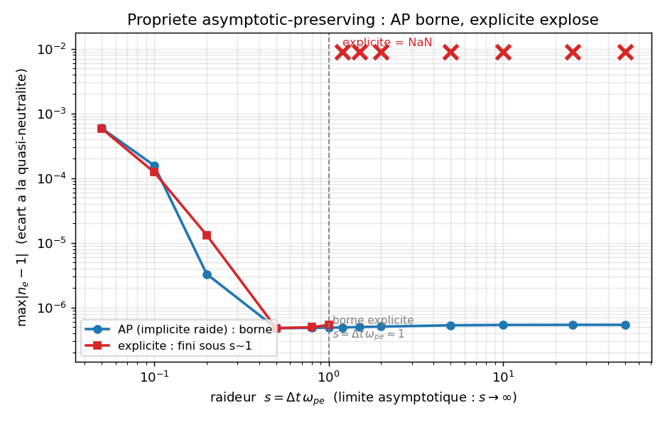
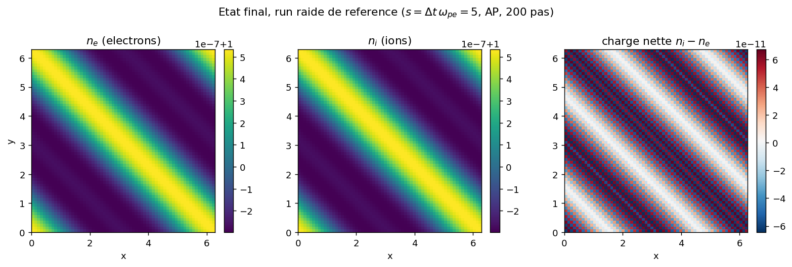

# two_fluid_ap: stiff isothermal two-fluid, asymptotic-preserving

A two-fluid plasma (electrons + ions) coupled to the electric field of Poisson is integrated
by an IMEX scheme whose stiff term (the relaxation to quasi-neutrality, set by the plasma
frequency $\omega_{pe}$) is treated implicitly. The property under test is asymptotic-preserving
(AP): the stable step does not collapse as the stiffness $s=\Delta t\,\omega_{pe}$ grows, whereas an
explicit scheme is limited to $s\lesssim 1$ and blows up beyond. The AP integrator has left the
`adc_cpp` core (it is not a composable `adc.System` block): it is a bespoke C++ scenario
(`two_fluid_ap.hpp` + `_two_fluid_ap.cpp`), compiled on the fly via `ctypes`. It is not a
reproduction of a published result.

## Contract

| Field | Content |
|---|---|
| Category (manifest) | `validation` (`cases_manifest.toml`, `two_fluid_ap/run.py`, `ci = true`, `needs = ["cxx"]`) |
| Inputs | $64^2$ grid, $L=2\pi$, periodic; IC $n_e=1+\epsilon\cos(kx+ky)$, $k=2\pi/L$, $\epsilon=10^{-3}$, $n_i=1$, $m_s=0$; isothermal $c_e^2=1$, $c_i^2=0.04$; $z_e=-1$, $z_i=+1$, $n_0=1$. Run 1 stiff: $\omega_{pe}=10^3$, $\omega_{pi}=20$, $\Delta t=5\times10^{-3}$, 200 steps, $s=\Delta t\,\omega_{pe}=5$. Run 2 magnetized: $\omega_{ce}=4$, $\omega_{ci}=0.2$, $\Delta t=10^{-2}$, 100 steps |
| Outputs | printed diagnostics (`max_dev`, `max_charge`, `mass_e`), final line `OK two_fluid_ap`; 2 figures + `figures/provenance.json` (via `make_figures.py`); JIT lib in `out/two_fluid_ap/build/` |
| Guaranteed invariants | the `assert`s in `run.py`: finiteness (`np.isfinite`, run 1+2); `max_dev < 0.1` and `max_charge < 0.1` (run 1, `run_stiff` in run.py); `mass_rel < 1e-7` (run 1+2, `run_stiff`/`run_magnetized` in run.py) |
| Proves | at $s=5$ (run 1), the AP scheme is finite and bounded: $\max\lvert n_e-1\rvert=5.325\times10^{-7}$, $\max\lvert n_i-n_e\rvert=6.698\times10^{-11}$, electron mass conserved to $2.276\times10^{-14}$ relative; magnetized run 2 electron mass to $1.665\times10^{-14}$. Falsifiable AP prediction (figure 1): the AP deviation plateaus at $5.41\times10^{-7}$ for $s\in[1,50]$, while the explicit scheme is finite for $s\le1.0$ and NaN from $s\ge1.2$ |
| Does not prove | not a published reproduction: no number is confronted with a paper. The `assert`s in `run.py` test bounds ($<0.1$, $<10^{-7}$), not the AP order: the AP/explicit contrast is measured by `make_figures.py`, not asserted. `mass_e=4096` is a sum without the $dx^2$ weight (a proxy for relative conservation, not a physical mass). The C++ diagnostic `tfap_max_dev` is unreliable on a blown-up field (`fmax` over NaN returns $0.0$, section 6): the explicit blow-up is detected on the Python side by `np.isfinite`. Quasi-linear regime ($\epsilon=10^{-3}$, low-order spatial scheme, constant $n_0=1$ background); validated backend = serial CPU only (GPU portability not exercised here) |
| Provenance | adc_cpp `01873299`, adc_cases `a9541ba4`, JIT C++ scenario `TwoFluidAP2D<GeometricMG>` (Apple clang 21, C++20), serial CPU, $64^2$; run.py ~3.6 s (cache up to date) / ~5.5 s (first compilation); `figures/provenance.json` |

By the end you will know: what plasma stiffness is and why an explicit scheme is limited to
$\Delta t\,\omega_{pe}\lesssim1$ (mechanism), how the AP reformulation of the elliptic lifts this
bound (the derivation $\beta_0=\Delta t^2(\omega_{pe}^2+\omega_{pi}^2)$), what the falsifiable
prediction is (bounded deviation as $s\to\infty$, explicit NaN), and why the solver lives in
`adc_cases` instead of the `adc_cpp` core.

---

## 1. The physical mechanism: plasma stiffness (justifies Proves: AP bounded)

Two charged isothermal fluids, electrons (density $n_e$, charge $z_e=-1$) and ions ($n_i$,
$z_i=+1$), share a self-consistent electric field. Three chained ingredients, the last being the
source of stiffness:

1. **Isothermal transport.** Each species advects its density and momentum
   $m_s=(m_{s,x},m_{s,y})$ with a pressure $p_s=c_s^2 n_s$ (no energy equation):
   $\partial_t n_s+\nabla\cdot m_s=0$, $\partial_t m_s+\nabla\cdot(m_s\otimes m_s/n_s+c_s^2 n_s I)=z_s n_s E$.
2. **Self-field.** The density gap creates $\phi$ through Poisson, $\nabla^2\phi=n_e-n_i$, and
   $E=-\nabla\phi$. A charge separation $n_e\ne n_i$ generates a field that pulls the species
   back toward each other.
3. **Stiff relaxation to quasi-neutrality.** This pull oscillates at the plasma frequency
   $\omega_{pe}=\sqrt{4\pi n_0 e^2/m_e}$ (here $\omega_{pe}$ is a direct parameter). The denser
   the plasma, the larger $\omega_{pe}$, the faster the relaxation relative to the scale of
   interest (the transport, of scale $c_s/L$). It is a stiff time scale: an explicit scheme must
   resolve it, hence $\Delta t\,\omega_{pe}\lesssim1$, even though the slow physics does not
   require it.

The AP property consists of treating the stiff channel (2)-(3) implicitly, so that the step
$\Delta t$ is set by the slow transport (1) and not by $\omega_{pe}$. In the asymptotic limit
$s=\Delta t\,\omega_{pe}\to\infty$ (infinitely stiff plasma, or large time step), the scheme must
stay stable and converge to the quasi-neutral solution $n_e\approx n_i$. This is what figure 1
measures.

This model is the electrostatic isothermal two-fluid. The magnetic coupling (cyclotron rotation,
run 2) is added as an option; the non-stiff magnetized version assembled by composition lives in
[`magnetic_isothermal_dsl`](../magnetic_isothermal_dsl/). This case does not cover a self-consistent
$B$ field: $B_z$ is uniform and imposed.

---

## 2. The equations and who computes them (justifies: the physics is frozen in C++, out of the core)

Conservative state per species, 3 components: $U_s=(n_s,m_{s,x},m_{s,y})$.

| Block | Equation | C++ kernel (`two_fluid_ap.hpp`) |
|---|---|---|
| Transport (momentum) | $\partial_t m_s+\nabla\cdot(m_s\otimes m_s/n_s+c_s^2 n_s I)=0$ (predictor) | `tfap_mstar` (split Rusanov) |
| Transport (continuity) | $\partial_t n_s+\nabla\cdot m_s=0$ | `tfap_div_update` centered |
| AP elliptic | $\nabla^2\phi=(n_e^*-n_i^*)/(1+\beta_0)$, $\beta_0=\Delta t^2(\omega_{pe}^2+\omega_{pi}^2)$ | RHS in `step` + `ell.solve()` |
| Force (stiff term) | $m_s^{n+1}=m_s^*+\Delta t\,z_s\,\omega_{ps}^2\,E$ (implicit) | `tfap_lorentz` |
| Magnetized force | Boris push (half-E, $B$ rotation, half-E) | `tfap_boris` |

This case calls no core scenario: the AP two-fluid physics is written here, and borrows from the
core only generic bricks (mesh, elliptic, parallel). A 3-layer "who computes what" table, each row
pinned to a real line:

| Line | Layer | What happens |
|---|---|---|
| `TwoFluidAP(lib, n=.., omega_pe=.., stabilize=True)` (`run_stiff`/`run_magnetized` in run.py) | Python driver | choice of physical parameters + AP flag; reads the state via `ctypes` |
| `TwoFluidAP2D<GeometricMG>` instantiated by `Solver` (in _two_fluid_ap.cpp) | frozen C++ scenario | the full AP integrator: IMEX split, reformulated Poisson, Boris. This is the JIT-compiled `.cpp` |
| `for_each_cell(dom, [=] ADC_HD(i,j){...})` (`two_fluid_ap.hpp`, each kernel) | per-cell kernel (device-clean) | the real computation: Rusanov flux, divergence, push, with no Python callback in the hot path |

The middle layer is not a brick named `models.two_fluid_ap`: the solver left the core because its
stabilization couples $\Delta t$ into the elliptic (section 4), which block-by-block
`adc.System` composition cannot express. The justification is at the top of two_fluid_ap.hpp
and in the run.py module docstring (`TwoFluidAP` "replaces the old internal escape hatch `adc._adc._TwoFluidAP`
removed from the core").

---

## 3. Why the solver is compiled on the fly (justifies: real anchoring, out of the core)

`run.py` loads no C++ binding for the case: it compiles `_two_fluid_ap.cpp` to a `.dylib`/`.so` and
loads it via `ctypes`, exactly like the DSL JIT.

Build and load, `_build_lib` (in run.py):

```python
sources = [os.path.join(HERE, "_two_fluid_ap.cpp"), os.path.join(HERE, "two_fluid_ap.hpp")]
lib_path = native.build_shared("two_fluid_ap", sources)        # cache hors source, cle d'ABI
return native.load_symbols(lib_path, TFAP_SYMBOLS)             # 12 symboles tfap_* verifies
```

- `native.build_shared` (`build_shared` in common/native.py) compiles with `-shared -fPIC -std=c++20 -O2 -I
  <adc_cpp/include>` and places the lib in `out/two_fluid_ap/build/` (never next to the `.cpp`,
  matching the manifest note). The lib is indexed by an ABI key = hash of the compiler, the flags,
  the sources, and the signature of the core header tree: if a core `.hpp` changes, the key changes
  and the lib is recompiled. A stale lib is never reloaded.
- `native.load_symbols` (`load_symbols` in common/native.py) checks that the 12 `tfap_*` symbols
  (`TFAP_SYMBOLS` in run.py) exist: a missing symbol raises an explicit `RuntimeError` at load time, not an
  opaque `AttributeError` on the first call.

The C ABI is minimal: `tfap_create(n, L, cse2, csi2, omega_pe, omega_pi, stabilize, eps,
upwind_continuity, omega_ce, omega_ci)` -> opaque handle, then `tfap_step`/`tfap_advance` and the
diagnostics (the `extern "C"` block in _two_fluid_ap.cpp). The `stabilize` flag (4th argument of the
`Solver` constructor in _two_fluid_ap.cpp) is the AP switch: `true`=$\beta_0$ active, `false`=explicit. It is the
one `make_figures.py` toggles for the contrast in section 7.

---

## 4. Math: the AP reformulation of the elliptic (justifies Proves: stable step does not collapse)

### 4.1 Where the explicit bound comes from

The stiff channel is the force-charge loop: the force $z_s n_s E$ with $E=-\nabla\phi$ and
$\nabla^2\phi=n_e-n_i$. Linearized around $n_0=1$, a charge separation
$\delta n=n_e-n_i$ oscillates like a harmonic oscillator of angular frequency
$\omega_p^2=\omega_{pe}^2+\omega_{pi}^2$ (the two species pull back in parallel). An explicit
scheme on an oscillator of angular frequency $\omega_p$ is stable if $\Delta t\,\omega_p\lesssim1$:
beyond that, the amplitude grows at each step and diverges. Since $\omega_{pe}\gg\omega_{pi}$ here
($10^3$ vs $20$), the bound is essentially $s=\Delta t\,\omega_{pe}\lesssim1$. Figure 1 measures it:
the explicit scheme is finite up to $s=1.0$ and NaN from $s=1.2$.

### 4.2 The AP trick: absorb the stiff term into Poisson

Instead of solving $\nabla^2\phi=n_e^*-n_i^*$ then applying the force explicitly (which
re-introduces the bound), you make the force implicit. Schematically, for the density predictor
after the implicit push,

$$n_s^{n+1}=n_s^*-\Delta t\,\nabla\cdot m_s^{n+1},\qquad m_s^{n+1}=m_s^*+\Delta t\,z_s\,\omega_{ps}^2\,E,\qquad E=-\nabla\phi.$$

Carrying the push into the divergence and using $\nabla\cdot(n_s\nabla\phi)\approx n_0\nabla^2\phi$
($n_0=1$), the constraint $\nabla^2\phi=n_e^{n+1}-n_i^{n+1}$ becomes, after grouping the terms in
$\nabla^2\phi$:

$$\big(1+\Delta t^2(\omega_{pe}^2+\omega_{pi}^2)\big)\,\nabla^2\phi=n_e^*-n_i^*\quad\Longrightarrow\quad\boxed{\nabla^2\phi=\dfrac{n_e^*-n_i^*}{1+\beta_0}},\quad\beta_0=\Delta t^2(\omega_{pe}^2+\omega_{pi}^2).$$

The time step $\Delta t$ appears in the right-hand side of the elliptic: this is exactly
what `adc.System` composition cannot express (a block does not know $\Delta t$ when the
Poisson is assembled), hence the bespoke solver. Each symbol points to its line:

```cpp
const Real beta0 = stabilize ? dt * dt * (ce + ci) : Real(0);   // ce=wpe^2, ci=wpi^2
const Real inv = Real(1) / (Real(1) + beta0);                   // facteur AP
r(i, j, 0) = (ne(i, j, 0) - ni(i, j, 0)) * inv;                 // RHS Poisson reformule
```

- `ce`, `ci` are $\omega_{pe}^2$, $\omega_{pi}^2$, cached in the solver (`TwoFluidAP2D` in
  two_fluid_ap.hpp). At $s=5$: $\beta_0=\Delta t^2\omega_{pe}^2\approx(5\times10^{-3}\cdot10^3)^2=25$, so
  $1/(1+\beta_0)\approx 0.038$: the charge RHS is divided by 26, which bounds the response.
- `stabilize` selects $\beta_0$ vs $0$. At $\beta_0=0$ you fall back on the bare Poisson + explicit
  force: this is the explicit scheme of figure 1.

### 4.3 What the AP preserves, and what the figure tests

In the limit $s\to\infty$, $\beta_0\to\infty$ and $1/(1+\beta_0)\to0$: the Poisson RHS is
crushed, the field no longer over-reacts, and the system relaxes toward the quasi-neutral solution
$n_e\approx n_i\approx n_0$ instead of oscillating. The falsifiable prediction is therefore: the
deviation $\max\lvert n_e-1\rvert$ must stay bounded (and even plateau) as $s\to\infty$, whereas an
explicit scheme diverges from $s\gtrsim1$. What a different measurement would betray: an AP
deviation that grows with $s$ would signal an incorrect stabilization ($\beta_0$ ill-formed, or the
push not actually implicit); an explicit scheme that survives $s\gg1$ would signal that the stiff
channel is not active ($\omega_{ps}^2$ coupling zero). We measure (section 7) an AP plateau at
$5.41\times10^{-7}$ and an explicit NaN from $s=1.2$: the AP property holds.

---

## 5. Scenario code, kernel by kernel (justifies: real anchoring)

One `TwoFluidAP2D::step(dt, stabilize)` step (in two_fluid_ap.hpp) is an IMEX split. Real order:

1. **Periodic ghosts**: `fill_boundary(e/ion, dom, per)`.
2. **Momentum predictor** `m*` (`tfap_mstar`): dimensionally split isothermal Euler flux
   by Rusanov (local Lax-Friedrichs), wave speed $a=\lvert u\rvert+c_s$,
   $F_{xx}=m_x^2/n+c^2 n$, $F_{yy}=m_y^2/n+c^2 n$. Reads $n,m_x,m_y$ with 1 ghost.
3. **Density predictor** `n*` (`tfap_div_update`): $n-\Delta t\,\nabla\cdot m^*$,
   centered order-2 divergence (default `upwind_continuity=false`, the only one used by `run.py`).
4. **AP Poisson**: RHS $(n_e^*-n_i^*)/(1+\beta_0)$ then `ell.solve()`.
5. **Field** $E=-\nabla\phi$ (`tfap_efield`).
6. **Implicit push (stiff term)**: non-magnetized `tfap_lorentz` $m^{n+1}=m^*+\Delta t\,z\,\omega_{ps}^2 E$;
   magnetized symmetric Boris push `tfap_boris`.
7. **Density corrector** $n^{n+1}=n-\Delta t\,\nabla\cdot m^{n+1}$ + copy of
   $(m_x,m_y)$ into the state (`copy_mom`).

The Boris push (`tfap_boris`) is exact for rotation: half electric impulse, full $B$
rotation of angle $\theta=z\,\omega_c\,\Delta t$, second half impulse. It reproduces the $E\times B$
drift exactly and conserves $\lvert m\rvert$ under $B$ alone, with no secular growth; when
$\omega_c=0$ it reduces to `tfap_lorentz`. This is what makes run 2 stable
without an $\omega_c\,\Delta t$ limit.

Device-clean: all kernels go through `for_each_cell` with `ADC_HD` lambdas, $\lvert
x\rvert$/max/minmod via ternaries (`tfap::ab/mx2/mm2`: `std::fabs`/`std::fmax` are not
device-safe), $\cos$/$\sin$/$\sqrt$ computed on the host for the uniform fields. The compile facade
therefore builds as-is for GPU if you pass the right flags; this case sets no backend flag (serial
CPU here).

**Initial conditions** `TwoFluidAP2D::init(eps)` (in two_fluid_ap.hpp), host loop:

```cpp
const Real k = 2 * pi / L;                                          // mode 1 diagonal
ae(i, j, 0) = Real(1) + eps * std::cos(k * x_cell(i) + k * y_cell(j));  // n_e = 1 + eps cos(kx+ky)
ai(i, j, 0) = Real(1);                                              // n_i = 1 (fond uniforme)
```

- The perturbation acts only on $n_e$; the initial net charge $n_i-n_e=-\epsilon\cos(\cdot)$
  is of order $\epsilon=10^{-3}$. It is this charge separation that the stiff dynamics relaxes.
  $m_s=0$ (at rest). The `TwoFluidAP` driver passes the default `eps=1e-3` (in run.py).

---

## 6. Diagnostics and their reliability (justifies Does not prove: proxies)

The C++ diagnostics (`_two_fluid_ap.cpp`):

- `tfap_mass_e/i` = `adc::sum(.., 0)`: sum of $n$ over the cells, without the $dx^2$ weight. Equals
  $4096=64\times64\times1$ (background 1, $\cos$ perturbation of zero mean). It is a proxy for
  relative conservation, not a calibrated physical mass.
- `tfap_max_charge` = $\max\lvert n_i-n_e\rvert$, `tfap_max_dev` = $\max\lvert n_e-1\rvert$
  (`Solver::max_charge`/`Solver::max_dev` in _two_fluid_ap.cpp), preceded by `device_fence()` (host/device barrier, GPU unified memory).

Important pitfall (justifies the Does not prove clause): `tfap_max_dev` does `std::fmax` over the
field and propagates NaN poorly. Verified: for the explicit scheme at $s=5$ (field entirely NaN,
4096 cells), `tfap_max_dev()` returns `0.0` and `tfap_max_charge()` returns `0.0`. A `0.0` from the
C++ diagnostic therefore does not prove the scheme is stable. `make_figures.py` does not rely on it:
it reads the field via `density_e()`/`density_i()` on the Python side and tests `np.isfinite`
(`make_figures.py`, `_field_diag`). It is this field-side read, immune to NaN, that distinguishes
"bounded" from "blown up".

The `assert`s in `run.py` are not caught out because they test only the AP scheme
(`stabilize=True`, never NaN): `np.isfinite(...)`, `max_dev<0.1` and
`max_charge<0.1`, `mass_rel<1e-7` (the asserts in `run_stiff`, run.py). These are loose bounds, not
a test of the AP order.

---

## 7. Figures (generated by `make_figures.py`, in `figures/`)

Generated by `python make_figures.py` (same JIT solver as `run.py`), versioned with
`figures/provenance.json`. Exact command in section 9.

### `ap_vs_explicit.png`: the AP property



At $\Delta t=5\times10^{-3}$ and a fixed 200-step horizon, you sweep $s=\Delta t\,\omega_{pe}$ by
varying $\omega_{pe}$ (with $\omega_{pi}=0.02\,\omega_{pe}$, the run 1 ratio), for the AP scheme
(`stabilize=True`) and the explicit scheme (`stabilize=False`).

- **Proves** (measured field-side, `np.isfinite`): the AP deviation (blue) stays bounded over the
  whole sweep and plateaus at $5.41\times10^{-7}$ for $s\in[1,50]$ (values: $s=5\to5.325\times10^{-7}$,
  $s=10\to5.390\times10^{-7}$, $s=50\to5.414\times10^{-7}$). The explicit scheme (red) follows the AP
  as long as $s\le1.0$ ($s=1.0\to5.416\times10^{-7}$) then becomes NaN from $s=1.2$ (red crosses):
  the explicit bound $s=\Delta t\,\omega_{pe}\approx1$ (gray line) is exactly the one predicted in
  4.1. This is the asymptotic-preserving property: the stable step does not collapse as $s\to\infty$.
- **Suggested (not asserted)**: the AP deviation decreases then plateaus as $s$ grows (from
  $5.9\times10^{-4}$ at $s=0.05$ to $5.4\times10^{-7}$): the quasi-neutral limit is better and
  better approached at strong stiffness. This is consistent with the AP (the stabilization crushes
  the charge RHS), but no assert tests the monotonicity nor the plateau value.
- **Not shown**: no `assert` in `run.py` tests this contrast (the asserts touch only the
  AP scheme). The figure does not show why the explicit scheme diverges (step-by-step growth of
  the charge oscillation): you observe the final NaN state, not the trajectory of the instability.

### `final_state.png`: the quasi-neutral state of the two fluids



Final state of the reference stiff run ($s=5$, AP, 200 steps).

- **Proves / measured**: $n_e$ and $n_i$ both equal $1+5.3\times10^{-7}\cos(kx+ky)$ (diagonal
  bands, following the IC): the plasma is quasi-neutral, both species have relaxed to the
  same profile despite $s=5$ (an explicit scheme would already be NaN). The net charge $n_i-n_e$ is
  of order $6.7\times10^{-11}$: three orders below the deviation, and well below the initial charge
  separation $\epsilon=10^{-3}$. Quasi-neutrality is enforced, not assumed.
- **Suggested**: the net charge carries a grid-scale checkerboard texture (at the level
  $\sim6\times10^{-11}$): this is the dispersive noise of the centered continuity (zero dissipation)
  at residual amplitude, plausible by eye but not quantified by an assert.
- **Not shown**: at $\epsilon=10^{-3}$ and a low-order scheme, no nonlinear dynamics nor
  macroscopic charge separation. The map says nothing about the explicit scheme (which has no
  finite final state at $s=5$).

---

## 8. The tolerances, justified by an order of magnitude (justifies item 8 of the checklist)

| Tolerance | Value | Why this value |
|---|---|---|
| `max_dev < 0.1`, `max_charge < 0.1` (`run_stiff` in run.py) | $0.1$ | Loose quasi-neutrality bound: the initial perturbation is $\epsilon=10^{-3}$ and the measured AP deviation is $5.3\times10^{-7}$, about 5 orders below $0.1$. The tolerance rejects a blow-up (deviation $O(1)$ or NaN) without rejecting the physical signal; it is not a test of the AP order |
| `mass_rel < 1e-7` (`run_stiff`/`run_magnetized` in run.py) | $10^{-7}$ | The scheme is mass-conservative (continuity in divergence form): the only drift is floating-point arithmetic. Measured: $2.276\times10^{-14}$ (run 1) / $1.665\times10^{-14}$ (run 2), about 7 orders below the tolerance, at the IEEE754 noise level on a sum of 4096 terms |
| `np.isfinite(...)` (`run_stiff`/`run_magnetized` in run.py) | (boolean) | Minimal guard: a large step that blows up gives NaN/Inf. It is the only `run.py`-side test that would directly detect a loss of AP stability (but only the AP scheme is exercised here, never the explicit one) |

---

## 9. Reproduce (justifies item 14 of the checklist: command + measured cost)

```bash
cd /private/tmp/adc_cases-deeptut/two_fluid_ap
PYTHONPATH=/Users/romaindespoulain/Documents/Stage_Romain/adc_cpp/build-master/python:/private/tmp/adc_cases-deeptut \
  /opt/homebrew/anaconda3/bin/python3.12 run.py            # le cas : asserts, ~3.6 s (cache a jour)
PYTHONPATH=/Users/romaindespoulain/Documents/Stage_Romain/adc_cpp/build-master/python:/private/tmp/adc_cases-deeptut \
  /opt/homebrew/anaconda3/bin/python3.12 make_figures.py   # 2 figures + provenance.json
```

Prerequisites: `numpy` (and `matplotlib` for the figures, outside the case's `needs`), a C++20
compiler (`needs=["cxx"]`: the `EllipticSolver` concept and `static_assert` require it), and the
core headers `adc_cpp/include/` located by `native.adc_include()` (via `$ADC_INCLUDE`, otherwise
from the `adc` package, otherwise `../adc_cpp/include`). The `adc` module is used only to locate
the headers; the AP computation does not go through the pybind11 bindings.

Expected output of `run.py` (captured, macOS arm64, Apple clang 21):

```
[run 1 - raide, non magnetise]
  dt=5.000e-03  nsteps=200  dt*omega_pe=5.0  (explicite EXPLOSERAIT)
  max_dev()    = 5.325451e-07   (ecart a la quasi-neutralite)
  max_charge() = 6.697598e-11   (charge nette locale)
  mass_e: 4.096000e+03 -> 4.096000e+03   (err. relative 2.276e-14)
[run 2 - raide magnetise]
  max_dev()    = 9.447867e-04   max_charge() = 7.732753e-04
  mass_e: 4.096000e+03 -> 4.096000e+03   (err. relative 1.665e-14)
OK two_fluid_ap
```

Cost: ~3.6 s wall time (build cache up to date), ~5.5 s on the first call (compilation of the
`.dylib` included). Recompilation is triggered only if the ABI key changes (compiler, flags,
sources, or core headers). Out-of-source artifact (gitignored):
`out/two_fluid_ap/build/_two_fluid_ap.dylib` (+ `.abikey`). Platform caveat: the signs,
the order of magnitude of the deviations ($\sim5\times10^{-7}$), the explicit bound ($s\approx1$) and
the `OK` verdict are stable; the last digits vary with the summation order and the multigrid
solver (cf. `figures/provenance.json`).

## File map

| File | Role |
|---|---|
| `run.py` | Python driver: JIT build (`_build_lib`), `ctypes` (`_bind`), `TwoFluidAP` class, 2 runs, asserts |
| `two_fluid_ap.hpp` | AP physics: Rusanov/MUSCL/Boris kernels, reformulated Poisson, `TwoFluidAP2D<Elliptic>` |
| `_two_fluid_ap.cpp` | `extern "C"` ABI (`tfap_create`/`step`/`advance`/diagnostics) + instantiates `<GeometricMG>` |
| `make_figures.py` | sweeps the stiffness (AP vs explicit) + final state; writes the 2 figures + `provenance.json` |
| `figures/ap_vs_explicit.png`, `final_state.png` | versioned assets, regenerated in place |
| `figures/provenance.json` | adc_cpp/adc_cases SHA, compiler, stiffness sweep, measured AP plateau |
| `../adc_cases/common/native.py` | `build_shared` (out-of-source cache + ABI key), `load_symbols` |
