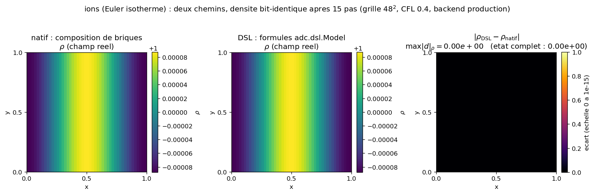
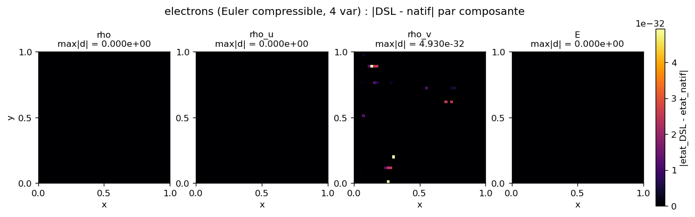

# two_species_dsl : electrons + ions ecrits en formules, equivalence au natif par espece

Deux especes (electrons en Euler compressible 4 variables, ions en Euler isotherme 3 variables),
chacune force electrostatique + densite de charge, couplees par un seul Poisson de systeme,
ecrites entierement en formules symboliques (`adc.dsl.Model`) au lieu de briques C++ nommees. Le
cas PROUVE que l'etat de chaque espece reproduit la composition native a la precision attendue : les
ions sont bit-identiques (`np.array_equal == True`), les electrons divergent d'un epsilon
en-dessous de la tolerance machine ($4.93\times10^{-32} < 10^{-24}$), unique signature de la
reassociation flottante de l'accumulation du second membre de Poisson partage.

La physique des deux especes (continuite + quantite de mouvement forcee par $\mathbf{E}=-\nabla\phi$,
fermetures $\gamma$ et $c_s^2$, Poisson couple, conservation de masse par espece) est derivee dans le
cas-parent natif [`../multispecies/`](../multispecies/). Ce README ne la re-derive pas : il se
concentre sur (a) la table des conventions du coeur reproduites en formules, ancree
`include/adc/physics/*.hpp`, et (b) comment l'egalite bit est verifiee et ce qu'une divergence
trahirait.

## Contrat

| Champ | Contenu |
|---|---|
| Categorie (manifeste) | `validation` (`ci = true`, `needs = ["cxx"]`, [`cases_manifest.toml:94-99`](../cases_manifest.toml)). Pas une reproduction publiee : on verifie une equivalence de chemins, pas une courbe d'article. |
| Entrees | grille $48^2$, $L=1$, periodique ; electrons $n_e=1+0.02\cos(2\pi x)$, ions $n_i=1$ (separation de charge, donc Poisson non trivial) ; charges $q_e=-1$, $q_i=+1$ ; $\gamma_e=5/3$, $c_{s,i}^2=1$ ; 15 pas, CFL = 0.4 (`step_cfl(0.4)`), SSPRK2 + minmod + Rusanov pour les deux blocs, Poisson `geometric_mg`, RHS `charge_density` |
| Sorties | etats `get_state("electrons")` $(4,n,n)$ et `get_state("ions")` $(3,n,n)$ des deux chemins (natif et DSL) ; `print` des $\max\lvert\text{DSL}-\text{natif}\rvert$ par espece + verdict `np.array_equal` ; 2 figures `figures/equivalence_{electrons,ions}.png` (3 panneaux par espece : $\rho$ natif, $\rho$ DSL, ecart) + `figures/provenance.json` |
| Invariants garantis | les `assert` de `run.py` : (1) electrons $\max\lvert\text{DSL}-\text{natif}\rvert<10^{-24}$ (`run.py:227`) ; (2) ions `np.array_equal` ou $<10^{-24}$ (`run.py:229`) ; (3) masse par espece `relative_drift < 1e-9` (`run.py:242-243`) ; (4) etats finis et densites $>0$ (`run.py:238-241`) |
| PROUVE | ions bit-identiques : $\max\lvert\text{DSL}-\text{natif}\rvert=0.000\times10^{0}$ exactement, sur les 3 composantes (`np.array_equal == True`) ; electrons sous tolerance machine : $\max\lvert\text{DSL}-\text{natif}\rvert=4.930\times10^{-32}$, confine a la seule composante $\rho v$ ($\rho$, $\rho u$, $E$ a $0.0$ exactement) ; masse conservee par espece (derive relative $1.20\times10^{-14}$ electrons, $1.16\times10^{-14}$ ions) |
| NE PROUVE PAS | aucun resultat physique : meme CI cosinus jouet que `multispecies`, 15 pas, pas de longueur de Debye ni de frequence plasma, pas de taux. L'egalite electron n'est pas bit-exacte ($4.93\times10^{-32}\ne0$) : c'est une reassociation FP du RHS de Poisson partage, pas une egalite stricte ; on l'asserte sous $10^{-24}$, pas a `array_equal`. Le $4.93\times10^{-32}$ est plateforme-dependant (BLAS, ordre de reduction MG) ; seuls le confinement a $\rho v$ et l'ordre $\ll10^{-24}$ sont stables. Backend reel = `aot` (la garde d'ABI rejette `production` sur module pre-construit) |
| Provenance | adc_cpp `01873299`, adc_cases `a9541ba4`, backend DSL `aot` (fallback ; `production` rejete par l'ABI), backend natif serie, $48^2$, Apple clang 21.0.0, Python 3.12.2, macOS arm64 ; nombres dans `figures/provenance.json` |

A la fin tu sauras : quelles conventions exactes du coeur les formules DSL reproduisent (table
ancree headers), pourquoi les ions sortent bit-identiques alors que les electrons non, et ce qu'une
heatmap non noire (ou une egalite electron au-dela de $10^{-24}$) trahirait.

---

## 1. La physique : voir le cas-parent natif

Les deux especes, leurs equations (continuite, quantite de mouvement forcee par
$\mathbf{E}=-\nabla\phi$, fermetures $\gamma=5/3$ et $c_s^2=1$), le Poisson de systeme
$\nabla^2\phi=q_e n_e+q_i n_i$ couple, la separation de charge initiale et la conservation de masse
par espece (telescopage des flux sur le tore) sont derives dans [`../multispecies/README.md`](../multispecies/)
(sections 1, 2, 4). `two_species_dsl` resout la meme physique avec les memes parametres ; la
seule difference est le chemin de construction du modele : formules DSL au lieu de briques natives
nommees. On ne re-derive donc rien ici.

Une difference de calibrage avec `multispecies` : ici on avance par `step_cfl(0.4)` (pas adaptatif
CFL) pendant 15 pas, la ou `multispecies` fait `advance(dt=0.001, nsteps=20)` (pas fixe). C'est sans
incidence sur l'equivalence (natif et DSL prennent exactement le meme chemin temporel, donc le meme
$dt$ a chaque pas) ; ca change seulement les valeurs absolues de l'etat final, pas la comparaison.

---

## 2. Les conventions du coeur, reproduites en formules

Le coeur des cas DSL : chaque formule symbolique doit reproduire a l'identique la convention de
la brique native correspondante, sinon l'egalite casse. Table des conventions reproduites, ancree
dans les headers `include/adc/physics/*.hpp` (gauche = brique native, droite = formule DSL `run.py`) :

### Electrons (`electron_dsl_model`, `run.py:76-108`) reproduit `models.electron_euler`

| Quantite | Brique native (header) | Formule DSL (`run.py`) |
|---|---|---|
| Pression / EOS | `Euler::pressure` $p=(\gamma-1)(E-\tfrac12\rho\lvert v\rvert^2)$ ([`euler.hpp:42-47`](../../adc_cpp/include/adc/physics/euler.hpp)) | `p = (g-1)*(E - 0.5*rho*(u*u+v*v))` (`run.py:87`) |
| Flux convectif $x$ | `Euler::flux` $(\rho u,\ \rho u^2+p,\ \rho u v,\ (E+p)u)$ ([`euler.hpp:94-104`](../../adc_cpp/include/adc/physics/euler.hpp)) | `x=[rhou, rhou*u+p, rhou*v, (E+p)*u]` (`run.py:91`) |
| Spectre $x$ | `Euler::eigenvalues` $(u-c,\ u,\ u,\ u+c)$, $c=\sqrt{\gamma p/\rho}$ ([`euler.hpp:108-118`](../../adc_cpp/include/adc/physics/euler.hpp)) | `x=[u-c, u, u, u+c]`, `c=sqrt(g*p/rho)` (`run.py:88,93`) |
| Force electrostatique | `PotentialForce::apply` $s[1{:}3]=q\rho\mathbf{E}$, $s[3]=q(\rho_u E_x+\rho_v E_y)$, $\mathbf{E}=-(\text{grad\_x},\text{grad\_y})$ ([`source.hpp:33-44`](../../adc_cpp/include/adc/physics/source.hpp)) | `source([0, Q_E*rho*e_x, Q_E*rho*e_y, Q_E*(rhou*e_x+rhov*e_y)])`, `e_x=-grad_x`, `e_y=-grad_y` (`run.py:101-103`) |
| Densite de charge | `ChargeDensity::rhs` $f=q\,u[0]=q n$ ([`elliptic.hpp:19-25`](../../adc_cpp/include/adc/physics/elliptic.hpp)) | `elliptic_rhs(Q_E * rho)` (`run.py:105`) |

### Ions (`ion_dsl_model`, `run.py:111-137`) reproduit `models.ion_isothermal`

| Quantite | Brique native (header) | Formule DSL (`run.py`) |
|---|---|---|
| Pression / fermeture | `IsothermalFlux` $p=c_s^2\rho$ ([`hyperbolic.hpp:132-140`](../../adc_cpp/include/adc/physics/hyperbolic.hpp)) | `p = cs2 * rho` (`run.py:122`) |
| Flux convectif $x$ | `IsothermalFlux::flux` $(\rho u,\ \rho u^2+p,\ \rho u v)$ ([`hyperbolic.hpp:132-141`](../../adc_cpp/include/adc/physics/hyperbolic.hpp)) | `x=[rhou, rhou*u+p, rhou*v]` (`run.py:125`) |
| Spectre $x$ | `IsothermalFlux::eigenvalues` $(u-c,\ u,\ u+c)$, $c=\sqrt{c_s^2}$ ([`hyperbolic.hpp:165-174`](../../adc_cpp/include/adc/physics/hyperbolic.hpp)) | `x=[u-c, u, u+c]`, `c=sqrt(cs2)` (`run.py:123,126`) |
| Force electrostatique | `PotentialForce::apply` (3 var : pas de terme energie, le `if constexpr (size()==4)` de [`source.hpp:41`](../../adc_cpp/include/adc/physics/source.hpp) est faux) | `source([0, Q_I*rho*e_x, Q_I*rho*e_y])` (3 composantes, `run.py:133`) |
| Densite de charge | `ChargeDensity::rhs` $f=q n$ ([`elliptic.hpp:19-25`](../../adc_cpp/include/adc/physics/elliptic.hpp)) | `elliptic_rhs(Q_I * rho)` (`run.py:134`) |

Deux finesses de convention que les formules doivent honorer pour que l'egalite tienne :

- **Le signe est porte par la charge, pas par l'elliptique.** Cote coeur, `PotentialForce.qom=q` et
  `ChargeDensity.q=q` portent le signe ($q_e=-1$, $q_i=+1$) ; l'operateur Poisson resout
  $\varepsilon\nabla^2\phi=f$ avec $\varepsilon=1$ (cf. `../multispecies/` sec. 4.3). Le DSL recopie
  ce choix : `Q_E*rho*e_x` (force) et `Q_E*rho` (RHS), jamais un signe additionnel sur $\nabla^2$.
  C'est la famille `PotentialForce`+`ChargeDensity`, distincte de `GravityForce`+`GravityCoupling`
  (signe porte par l'elliptique) qu'utilise [`../euler_poisson/`](../euler_poisson/) (sec. 2 de ce cas).
- **La composante energie n'existe que pour les electrons.** Le travail $q(\rho_u E_x+\rho_v E_y)$
  est la 4e composante de la source electron ; les ions, a 3 variables, n'ont pas d'equation
  d'energie (fermeture isotherme), donc pas de terme travail. Le `if constexpr (State::size()==4)`
  du coeur ([`source.hpp:41`](../../adc_cpp/include/adc/physics/source.hpp)) est reproduit cote DSL
  par la longueur de la liste passee a `m.source(...)` : 4 termes electrons, 3 termes ions.

Table 3 couches "qui calcule quoi" (la couche du milieu n'est plus une brique nommee mais les
expressions que `adc.dsl` compile) :

| Ligne `run.py` | Couche | Ce qui se passe |
|---|---|---|
| `add_equation("electrons", model=ce, spatial=FiniteVolume(limiter="minmod", riemann="rusanov"), time=Explicit())` (`run.py:187-189`) ; idem ions (`run.py:190-192`) | Python compose et diagnostique | choix du schema (MUSCL minmod + Rusanov, SSPRK2) ; lecture des etats pour comparer au natif |
| `m.flux(...)`, `m.eigenvalues(...)`, `m.source(...)`, `m.elliptic_rhs(...)` (`run.py:91-105`, `125-134`) que `m.compile(..., backend)` traduit en C++ | expressions DSL figees | la convention exacte (flux, spectre, force $q\rho\mathbf{E}$, RHS $q n$) compilee en `.so`, CSE au codegen |
| `assemble_rhs<minmod, rusanov>` + Poisson de systeme `geometric_mg` (RHS $\sum_b q_b n_b$), inline par le backend `aot`/`production` | noyau par cellule (device) | le calcul reel, sans callback Python dans le hot path : le meme chemin que le natif, ce qui rend l'egalite bit possible |

Justifie la clause PROUVE : c'est parce que ces expressions reproduisent exactement les briques
et que le backend inline le meme chemin numerique que l'egalite est attendue, pas approximative.

---

## 3. Comment l'egalite bit est verifiee (`main`, `run.py:207-245`)

Le cas joue deux runs sur la meme grille, meme CI, meme Poisson, meme schema, meme nombre de pas :
`run_native` (composition native `models.electron_euler`/`ion_isothermal`, `run.py:150-163`) puis
`run_dsl` (modeles DSL compiles, `run.py:175-204`). La comparaison :

```python
de = float(np.max(np.abs(ed - en)))                       # electrons : max|DSL - natif| (run.py:219)
di = float(np.max(np.abs(idd - inn)))                     # ions      : idem (run.py:220)
assert de < 1e-24, "..."                                  # electrons sous tolerance machine (run.py:227)
assert np.array_equal(idd, inn) or di < 1e-24, "..."      # ions bit-identiques (run.py:229)
```

- `np.array_equal(a, b)` est `True` uniquement si tous les bits coincident : aucune tolerance.
  C'est l'observable la plus dure pour les ions.
- La tolerance electron $10^{-24}$ est une clause justifiee par un ordre de grandeur, pas une
  constante posee. Borne basse : la divergence mesuree est $4.93\times10^{-32}$, soit $\sim10^{8}$
  fois sous la tolerance. Borne haute : la magnitude de l'etat est $O(1)$ (densites $\approx1$,
  energie $O(1)$) ; une vraie divergence de physique (mauvaise convention de signe, terme
  manquant) serait $O(10^{-2})$ ou plus, comme la dynamique. $10^{-24}$ se place entre le bruit de
  reassociation FP ($\sim10^{-32}$, $\sim10^{8}\,\varepsilon_{\text{mach}}$ relatif a $O(1)$) et toute
  divergence de physique : il accepte la reassociation, rejette un ecart de modele.

**Pourquoi les electrons divergent et les ions non** (la clause NE PROUVE PAS). A 1 pas, le residu et
le flux de chaque espece sont bit-identiques au natif (les formules reproduisent les briques a
l'identique). Sur plusieurs pas couples, la seule difference vient de l'accumulation du second
membre de Poisson partage $f=q_e n_e+q_i n_i$ : deux blocs y contribuent, et l'ordre dans lequel
le code somme les contributions DSL vs natives n'est pas garanti identique. L'addition flottante
n'etant pas associative, ce changement d'ordre produit un $\phi$ qui differe au dernier bit, donc un
$\mathbf{E}=-\nabla\phi$ qui differe au dernier bit, donc une force electron qui differe, d'ou un
etat electron a $\sim10^{-32}$ du natif. Les ions, eux, sortent bit-identiques sur cette
trajectoire : leur densite reste quasi uniforme ($n_i=1$ partout au depart, modulation induite
$\sim4\times10^{-6}$ comme dans `multispecies`), si bien que la reassociation ne mord pas a la
precision mesurable sur leur etat. Ce n'est pas un ecart de physique ; c'est du bruit d'arrondi
de l'accumulation partagee, et c'est exactement ce que la tolerance serree distingue d'un bug.

Ce qu'une divergence au-dela de $10^{-24}$ trahirait : une formule DSL qui ne reproduit plus une
brique du coeur, mauvais signe dans `source` (force repulsive au lieu d'attractive), terme energie
oublie ou ajoute a tort, spectre $c=\sqrt{\gamma p/\rho}$ remplace par $\sqrt{c_s^2}$, ou RHS
$q n$ avec le mauvais $q$. L'assert serait alors $O(10^{-2})$, pas $O(10^{-32})$.

---

## 4. Figures (regenerees par `make_figures.py`, dans `figures/`)

`make_figures.py` re-joue exactement `run.py` (importe ses fonctions `run_native`/`run_dsl`/`initial_conditions`,
memes parametres, meme backend) et trace, par espece, une figure a 3 panneaux sur la composante
densite $\rho$ (index 0 de l'etat conservatif des deux modeles) :

$$[\,\rho\ \text{natif}\,]\ \mid\ [\,\rho\ \text{DSL}\,]\ \mid\ [\,\lvert\rho_{\text{DSL}}-\rho_{\text{natif}}\rvert\,]$$

Les deux premiers panneaux (viridis, meme echelle de couleur) montrent le champ de densite
structure produit par chaque chemin : on y voit le cosinus module advecte, et on constate a l'oeil
que natif et DSL sont le meme champ (pas un carre noir vide). Le troisieme panneau (inferno,
echelle fixe) montre l'ecart $\lvert\rho_{\text{DSL}}-\rho_{\text{natif}}\rvert$ : noir = match. On
prouve l'egalite en montrant d'abord deux champs identiques, puis la carte d'ecart noire (max annote),
au lieu d'un seul diff noir qui aurait l'air casse. Nombres cites : `figures/provenance.json`.
Commande exacte en section 5.

> **Note sur l'observable.** La figure se concentre sur $\rho$, ou les deux especes sont
> bit-identiques ($\max\lvert d\rvert_\rho = 0$ exactement). L'epsilon machine de l'etat electron
> ($4.93\times10^{-32}$) ne vit pas dans $\rho$ mais dans la composante $\rho v$ (cf. sec. 3 et
> `provenance.json`, `max_abs_diff_per_var_electrons`). Le panneau d'ecart electron annote donc deux
> nombres : `max|d|` sur $\rho$ (= 0) et `etat complet` (= $4.93\times10^{-32}$, max sur les 4
> composantes), pour que la signature FP reste documentee meme si la densite, elle, est exacte.

### `equivalence_ions.png` : densite visible, ecart noir (bit-identique)



- **PROUVE** (asserte `run.py:229`) : panneaux 1 et 2 = la densite ionique (modulation induite
  $\sim10^{-4}$ autour de $n_i=1$, advectee), identique a l'oeil entre natif et DSL ; panneau 3 =
  ecart uniformement noir, $\max\lvert\rho_{\text{DSL}}-\rho_{\text{natif}}\rvert=0.000\times10^{0}$,
  et tout l'etat ionique est `np.array_equal == True`. Un seul pixel non noir dans le panneau d'ecart
  signalerait que la formule isotherme DSL diverge d'`IsothermalFlux` ou que
  `PotentialForce`/`ChargeDensity` est mal reproduit.
- **NON MONTRE** : la figure montre la densite et son ecart, pas les composantes de quantite de
  mouvement ($\rho u$, $\rho v$) ni la dynamique fine (modulation $\sim4\times10^{-6}$ du couplage,
  cf. `../multispecies/` sec. 6). Les ecarts par composante restent dans `provenance.json`
  (`max_abs_diff_per_var_ions`), tous a $0$.

### `equivalence_electrons.png` : densite visible, ecart $\rho$ noir, epsilon FP en $\rho v$



- **PROUVE** (asserte `run.py:227`) : panneaux 1 et 2 = la densite electronique (cosinus
  $1\pm1.6\,\%$ en $x$, $\approx0.984$ a $1.016$, advectee), identique a l'oeil entre natif et DSL ;
  panneau 3 = ecart sur $\rho$ uniformement noir, $\max\lvert\rho_{\text{DSL}}-\rho_{\text{natif}}\rvert=0.000\times10^{0}$
  exactement. La densite electronique est donc bit-identique entre les deux chemins.
- **SUGGERE (non assere)** : l'epsilon machine de l'etat electron ($4.930\times10^{-32}$, annote
  `etat complet` sur le panneau d'ecart) est confine a la composante $\rho v$ (y-quantite de
  mouvement) ; $\rho$, $\rho u$ et $E$ sont a $0$ exact. Ce confinement est coherent avec le mecanisme
  du couplage (reassociation FP du RHS de Poisson partage, cf. sec. 3) : la CI electron est modulee en
  $x$, le champ $\mathbf{E}=-\nabla\phi$ reagit, et c'est sur $\rho v$ que la reassociation se
  manifeste a la precision mesurable en premier. Aucun `assert` ne teste ce confinement, il est lu
  sur `provenance.json` (`max_abs_diff_per_var_electrons`), pas verifie.
- **NON MONTRE** : la figure ne trace pas $\rho v$ (ou vit l'epsilon) ; pour le voir, lire
  `provenance.json`. La valeur exacte $4.93\times10^{-32}$ et le motif des cellules concernees sont
  plateforme-dependants (ordre de reduction du multigrille, BLAS) ; seuls l'ordre $\ll10^{-24}$, la
  densite bit-exacte, et le fait que $\rho$/$\rho u$/$E$ restent a $0$ exact sont stables. La carte ne
  couvre pas la stabilite sur $>15$ pas (l'accumulation d'arrondi croit lentement).

---

## 5. Reproduire

```bash
cd /private/tmp/adc_cases-deeptut/two_species_dsl
PYTHONPATH=/Users/romaindespoulain/Documents/Stage_Romain/adc_cpp/build-master/python:/private/tmp/adc_cases-deeptut \
  /opt/homebrew/anaconda3/bin/python3.12 run.py            # le cas : asserts d'equivalence + invariants
PYTHONPATH=/Users/romaindespoulain/Documents/Stage_Romain/adc_cpp/build-master/python:/private/tmp/adc_cases-deeptut \
  /opt/homebrew/anaconda3/bin/python3.12 make_figures.py   # 2 heatmaps + provenance.json
```

Prerequis : Python 3.12 + numpy (matplotlib seulement pour `make_figures.py`), module `adc`
compile et importe avec le meme interpreteur (suffixe ABI `cpython-312`), et un compilateur C++20
(`needs = ["cxx"]`) : le DSL compile une `.so` a la volee sous `out/two_species_dsl/`. Le premier
chemin du `PYTHONPATH` fournit le module C++ ; le second rend `adc_cases` importable (le cas a un
fallback `sys.path`, `run.py:59-64`).

Sortie de `run.py` (macOS arm64, Apple clang 21.0.0) :

```
=== two_species_dsl : electrons + ions ecrits en formules vs briques natives ===
grille 48 x 48, 15 pas, CFL = 0.4 ; q_e = -1, q_i = 1
backend 'production' indisponible (RuntimeError: add_native_block : ABI incompatible ...), essai suivant
backend DSL retenu : 'aot'
electrons : max|DSL - natif| = 4.930e-32 (bit-identique = False)
ions      : max|DSL - natif| = 0.000e+00 (bit-identique = True)
masse electrons : derive relative 1.204e-14 ; ions : 1.165e-14
OK two_species_dsl (equivalence DSL <-> natif par espece, backend 'aot')
```

**Backend reel = `aot`.** Le cas prefere `production` (loader natif zero-copie,
`add_native_block`, parite stricte avec `add_block`), mais la garde d'ABI le rejette ici : le module
`build-master` pre-construit a une signature d'en-tetes/compilateur differente de celle attendue au
branchement, donc `run_dsl` retombe sur `aot` (chemin de production host-marshale, numerique
identique). Avec un module `_adc` rebati contre les memes en-tetes, `production` serait selectionne ;
dans les deux cas l'egalite par espece tient (meme chemin numerique inline). **Caveat plateforme** :
le verdict ions bit-identiques, le confinement de l'ecart electron a $\rho v$ et son ordre
$\ll10^{-24}$ sont stables ; la valeur exacte $4.930\times10^{-32}$ varie avec la BLAS et l'ordre de
reduction du multigrille (cf. `figures/provenance.json`).

## Carte des fichiers

| Fichier | Role |
|---|---|
| [`run.py`](run.py) | le cas (CI) : 2 modeles DSL (electrons 4 var, ions 3 var), compile, branche, compare au natif par espece, `assert` d'equivalence + invariants |
| [`make_figures.py`](make_figures.py) | rejoue `run.py`, trace `equivalence_{electrons,ions}.png` (3 panneaux par espece : $\rho$ natif, $\rho$ DSL, ecart) + `provenance.json` (hors CI) |
| `figures/*.png`, `figures/provenance.json` | diagnostics versionnes : SHA adc_cpp/adc_cases, backend, $\max\lvert d\rvert$ par composante, derives de masse |
| [`../multispecies/`](../multispecies/) | la meme physique en briques natives : derivation des equations, du couplage Poisson et de la conservation de masse |
| [`adc_cases/models.py`](../adc_cases/models.py) | `electron_euler()`, `ion_isothermal()` = oracle natif de reference (`l.28-45`) |
| [`include/adc/physics/`](../../adc_cpp/include/adc/physics/) | `euler.hpp`, `hyperbolic.hpp`, `source.hpp`, `elliptic.hpp` : les briques dont les formules DSL reproduisent les conventions (sec. 2) |
| [`cases_manifest.toml`](../cases_manifest.toml) | declare le cas : `validation`, `ci = true`, `needs = ["cxx"]` |
